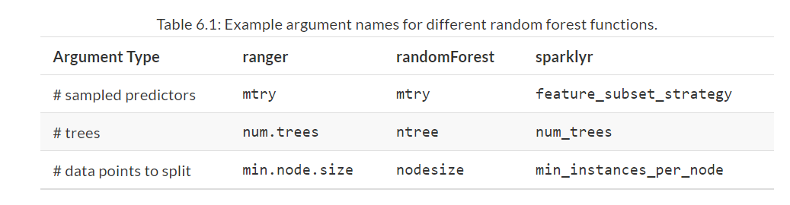
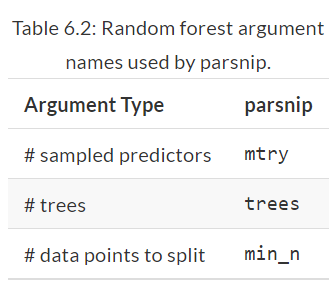
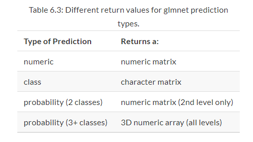
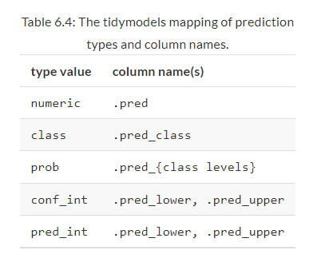
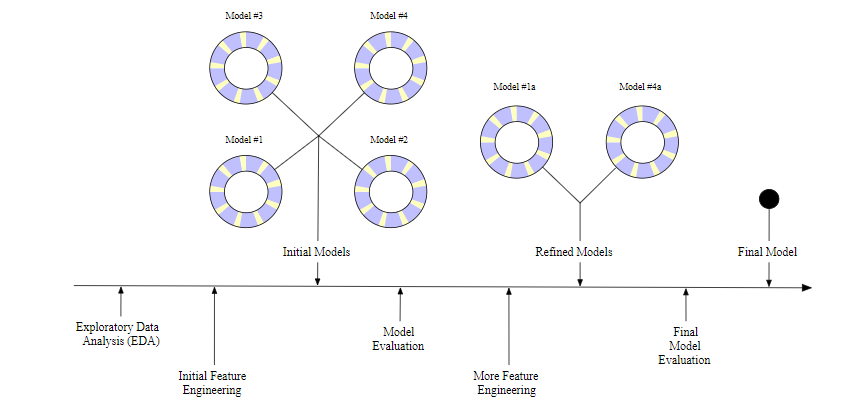

```{r setup, include = FALSE}
library(learnr)
library(tutorial.helpers)
library(tidymodels)
library(tidyverse)
library(knitr)

knitr::opts_chunk$set(echo = FALSE)
options(tutorial.exercise.timelimit = 60, 
        tutorial.storage = "local") 

ames_update <- ames |>
  mutate(Sale_Price = log10(Sale_Price))

set.seed(502)
ames_split <- initial_split(ames_update, prop = 0.80, strata = Sale_Price)
ames_train <- training(ames_split)
ames_test <- testing(ames_split)

lm_model <- linear_reg() |>
  set_engine("lm")

lm_form_fit <- lm_model |>
  fit(formula = Sale_Price ~ Longitude + Latitude, data = ames_train)

ames_test_small <- ames_test |>
  slice(1:5)

tree_model <- decision_tree(min_n = 2) |>
  set_engine("rpart") |>
    set_mode("regression")

tree_fit <- tree_model |> 
  fit(Sale_Price ~ Longitude + Latitude, data = ames_train)

```

```{r copy-code-chunk, child = system.file("child_documents/copy_button.Rmd", package = "tutorial.helpers")}
```

```{r info-section, child = system.file("child_documents/info_section.Rmd", package = "tutorial.helpers")}
```

<!-- DK: Pipe things like coef(). Don't wrap them around a multi-step pipeline. Done. -->

## Introduction
### 

This tutorial covers [Chapter 6: Fitting Models with parsnip](https://www.tmwr.org/models.html) from [*Tidy Modeling with R*](https://www.tmwr.org/) by Max Kuhn and Julia Silge. This chapter will cover the usage of the [**parsnip**](https://parsnip.tidymodels.org/) package for a fluent and standardized interface of a variety of different models. You will learn how to use various functions, such as `fit()` and `predict()`, on a **parsnip** object.


## Model Creation
### 

Suppose that a linear regression model was the initial choice. This is equivalent to specifying that the outcome data is numeric and that the predictors are related to the outcome in terms of simple slopes and intercepts:


$$y_i = \beta_0 + \beta_1 x_{1i} + \ldots + \beta_p x_{pi}$$

### Exercise 1

Load the **tidymodels** package using `library()`.

```{r model-creation-1, exercise = TRUE}

```

```{r model-creation-1-hint-1, eval = FALSE}
library(...)
```

```{r include = FALSE}
library(tidymodels)
```

### 

A variety of methods can be used to estimate the model parameters:

- *Ordinary linear regression* uses the traditional method of least squares to solve for the model parameters.

- *Regularized linear regression* adds a penalty to the least squares method to encourage simplicity by removing predictors and/or shrinking their coefficients towards zero. This can be executed using Bayesian or non-Bayesian techniques.

### Exercise 2

Next, type in `tidymodels_prefer()` to get rid of the naming conflicts.

```{r model-creation-2, exercise = TRUE}

```

```{r model-creation-2-hint-1, eval = FALSE}
...()
```

```{r include = FALSE}
tidymodels_prefer()
```

### 

In R, there are many different function that can be used for various models, such as `stan_glm()`, `lm()`, and `glmnet()`.

### Exercise 3

In order to estimate with *ordinary linear regression*, the `lm()` function from the **stats** package can be used. Click on this [link](https://stat.ethz.ch/R-manual/R-devel/library/stats/html/lm.html) and copy/paste the code under the *Usage* section.

```{r model-creation-3}
question_text(NULL,
	answer(NULL, correct = TRUE),
	allow_retry = TRUE,
	try_again_button = "Edit Answer",
	incorrect = NULL,
	rows = 3)
```

### 

Going back to [Chapter 3](https://www.tmwr.org/base-r.html) of the [*Tidy Modeling with R*](https://www.tmwr.org/), you have used the `lm()` function before, specifically using the `formula`, `data`, and `na.action` parameters.

### Exercise 4

In order to estimate with regularization, a Bayesian model can be fit using the **rstanarm** package. Click this [link](https://search.r-project.org/CRAN/refmans/rstanarm/html/stan_glm.html) and copy/paste the code for (*only*) the `stan_glm()` function under the *Usage* section.

```{r model-creation-4}
question_text(NULL,
	answer(NULL, correct = TRUE),
	allow_retry = TRUE,
	try_again_button = "Edit Answer",
	incorrect = NULL,
	rows = 3)
```

### 

[*Preceptor’s Primer for Bayesian Data Science: Using the Cardinal Virtues for Inference*](https://ppbds.github.io/primer/) is a textbook that heavily uses Bayesian models.

### 

The difference between the `lm()` and `stan_glm()` functions is that the `lm()` function doesn't have a `family` argument. With the `family` argument in `stan_glm()`, you can fit more complex models, such as Logistic and Poisson regression. 


### Exercise 5

A popular non-Bayesian approach to regularized regression is the **glmnet** model. Click this [link](https://www.tmwr.org/models.html) and look for the 3rd set of code (should say `model <- glmnet(...)`). Copy/paste this code below.

```{r model-creation-5}
question_text(NULL,
	answer(NULL, correct = TRUE),
	allow_retry = TRUE,
	try_again_button = "Edit Answer",
	incorrect = NULL,
	rows = 3)
```

### 

Note that these interfaces are heterogeneous in either how the data are passed to the model function or in terms of their arguments. The first issue is that, to fit models across different packages, the data must be formatted in different ways. `lm()` and `stan_glm()` only have formula interfaces while `glmnet()` does not. For other types of models, the interfaces may be even more disparate. For a person trying to do data analysis, these differences require the memorization of each package’s syntax and can be very frustrating.

### Exercise 6

In order to unify the approach to specifying a model, you need to:

1. Specify the type of model based on its mathematical structure
2. Specify the engine for fitting the model
3. Declare the mode of the model (when required)


To showcase this, pipe `linear_reg()` to `set_engine()` (Note: This will throw an error).

```{r model-creation-6, exercise = TRUE}

```

```{r model-creation-6-hint-1, eval = FALSE}
...() |>
  set_engine()
```

```{r include = FALSE}
# linear_reg() |> 
#  set_engine()
```

### 

`set_engine()` allows you to specify the package/system that will be used to fit your model. This code throws an error because the engine hasn't been specified inside the `set_engine()` function.  

### Exercise 7

Copy the previous code. Inside `set_engine()`, type in `"lm"`.

```{r model-creation-7, exercise = TRUE}

```

<button onclick = "transfer_code(this)">Copy previous code</button>

```{r model-creation-7-hint-1, eval = FALSE}
linear_reg() |>
  set_engine("...")
```

```{r include = FALSE}
linear_reg() |>
  set_engine("lm")
```

### 

Once the details of the model have been specified, the model estimation can be done with either the `fit()` function (to use a formula) or the `fit_xy()` function (when your data are already pre-processed). The **parsnip** package allows the user to be indifferent to the interface of the underlying model; you can always use a formula even if the modeling package’s function only has the `x`/`y` interface.

### Exercise 8

We can use the `translate()` function can provide details on how **parsnip** converts the user’s code to the package’s syntax. Copy the prevoius code and pipe it to `translate()`.

```{r model-creation-8, exercise = TRUE}

```

<button onclick = "transfer_code(this)">Copy previous code</button>

```{r model-creation-8-hint-1, eval = FALSE}
linear_reg() |>
  set_engine("lm") |>
    ...()
```

```{r include = FALSE}
linear_reg() |>
  set_engine("lm") |>
    translate()
```

### 

The `missing_arg()` function is just a placeholder for the data that has yet to be provided.

### Exercise 9

Let’s use a linear model to predict the sale price of houses in the `ames` data set as a function of only longitude and latitude. In the code below, type in `ames_train`.

```{r model-creation-9, exercise = TRUE}

```

```{r model-creation-9-hint-1, eval = FALSE}
...
```

```{r include = FALSE}
ames_update
```

### 

As a reminder, the `ames` dataset has been edited in [Chapter 4](https://www.tmwr.org/ames.html) of *Tidy Modeling with R* so that the `Sale_Price` column was logged (meaning the `log10()` function has been applied to it). 

Here is the code for this:

````

ames_update <- ames |>
  mutate(Sale_Price = log10(Sale_Price))
  
````

Also, in the "Spending our Data" tutorial, the `ames_train` variable was created, which contains the training data from the `ames` data set. As a reminder, here is the code that was used to create this variable:

````
set.seed(502)
ames_split <- initial_split(ames_update, prop = 0.80, strata = Sale_Price)
ames_train <- training(ames_split)

````


### Exercise 10

Lets start creating this model. In the code chunk below, pipe (`|>`) `linear_reg()` to `set_engine()`. Inside `set_engine()`, type in `"lm"`. 


```{r model-creation-10, exercise = TRUE}

```

```{r model-creation-10-hint-1, eval = FALSE}
linear_reg() |>
  ...("lm")
```

```{r include = FALSE}
linear_reg() |>
  set_engine("lm")
```

### 

The **parsnip** package itself contains interfaces to a number of models. However, for ease of package installation and maintenance, there are other **tidymodels** packages that have **parsnip** model definitions for other sets of models. The **discrim** package has model definitions for the set of classification techniques called discriminant analysis methods (such as linear or quadratic discriminant analysis). 

### Exercise 11

Copy the previous code and save it to the variable `lm_model`, using the `<-` operator.

```{r model-creation-11, exercise = TRUE}

```

<button onclick = "transfer_code(this)">Copy previous code</button>

```{r model-creation-11-hint-1, eval = FALSE}
... <- linear_reg() |>
  set_engine("lm")
```

```{r include = FALSE}
lm_model <- linear_reg() |>
  set_engine("lm")
```

### 

A list of all of the models that can be used with parsnip (across different packages that are on CRAN) can be found [here](https://www.tidymodels.org/find/).

### Exercise 12

Now, lets create the fitted object. Pipe `lm_model` to `fit()` and set `data` to `ames_train`. (Note: This will throw an error).

```{r model-creation-12, exercise = TRUE}

```

```{r model-creation-12-hint-1, eval = FALSE}
lm_model |>
  ...(data = ...)
```

```{r include = FALSE}
#lm_model |>
#  fit(data = ames_train)
```

### 

The reason this code throws an error is because the `fit()` function has a required `formula` argument, which hasn't been passed in yet. 

### Exercise 13

Since the sales prices of homes in the `ames` data as a function of only *longitude* and *latitude* is being predicted, it is necessary to include that in the `fit()` function. Copy the previous code. Inside `fit()`, set `formula` to `Sale_Price ~ Longitude + Latitude`. 

```{r model-creation-13, exercise = TRUE}

```

<button onclick = "transfer_code(this)">Copy previous code</button>

```{r model-creation-13-hint-1, eval = FALSE}
lm_model |>
  fit(... = Sale_Price ~ Longitude + ..., data = ames_train)
```

```{r include = FALSE}
lm_model |>
  fit(formula = Sale_Price ~ Longitude + Latitude, data = ames_train) 
```

### 

The fitted values suggest that houses are more expensive in the northern and western parts of Ames. The positive coefficient for *Latitude* means that, as latitude (which is a measure of how far north you are from the equator) increases, the price of homes increase. Similar, the negative coefficient of *Longitude* means that, as Longitude becomes more negative (meaning you are moving further, in a westerly direction from Greenwich, England), the more expensive houses become.

### Exercise 14

Copy the previous code and then assign its value to a new variable, `lm_form_fit`. 


```{r model-creation-14, exercise = TRUE}

```

<button onclick = "transfer_code(this)">Copy previous code</button>

```{r model-creation-14-hint-1, eval = FALSE}
... <- lm_model |>
  fit(formula = Sale_Price ~ Longitude + Latitude, data = ames_train)
```

```{r include = FALSE}
lm_form_fit <- lm_model |>
  fit(formula = Sale_Price ~ Longitude + Latitude, data = ames_train)
```

### 

Not only does **parsnip** enable a consistent model interface for different packages, it also provides consistency in the model arguments. It is common for different functions that fit the same model to have different argument names. 

### Exercise 15

Different functions, all of which fit random forest models, are a good examples of incompatible argument names. Three commonly used arguments are the number of trees in the ensemble, the number of predictors to randomly sample with each split within a tree, and the number of data points required to make a split. For three different R packages implementing this algorithm, those arguments are shown in the table below:

```{r}

```

### 

Some of the original argument names can be fairly jargon-y. For example, to specify the amount of regularization to use in a glmnet model, the Greek letter `lambda` is used. While this mathematical notation is commonly used in the statistics literature, it is not obvious to many people what lambda represents (especially those who consume the model results).

### Exercise 16

In an effort to make argument specification less painful, **parsnip** uses common argument names within and between packages. The table below shows, for random forests, what **parsnip** models use:


```{r}

```

### 

Admittedly, this is one more set of arguments to memorize. However, when other types of models have the same argument types, these names still apply. For example, boosted tree ensembles also create a large number of tree-based models, so `trees` is also used there, as is `min_n`, and so on.

### Exercise 17

To understand how the **parsnip** argument names map to the original names, lets look at the `rand_forest()` function. In the Console, type in `?rand_forest()` and look at the *Description* section. CP/CR.


```{r model-creation-17}
question_text(NULL,
	answer(NULL, correct = TRUE),
	allow_retry = TRUE,
	try_again_button = "Edit Answer",
	incorrect = NULL,
	rows = 3)
```

### 

The rule of thumb when standardizing argument names is:

If a practitioner were to include these names in a plot or table, would the people viewing those results understand the name?

### Exercise 18

The `translate()` function can also be used to see this. Press "Run Code". 

```{r model-creation-18, exercise = TRUE}
rand_forest(trees = 1000, min_n = 5) |> 
  set_engine("ranger") |>
  set_mode("regression") |> 
  translate()
```

```{r include = FALSE}
rand_forest(trees = 1000, min_n = 5) |>
  set_engine("ranger") |>
  set_mode("regression") |> 
  translate()
```

### 

Modeling functions in **parsnip** separate model arguments into two categories:

- *Main arguments* are more commonly used and tend to be available across engines.

- *Engine arguments* are either specific to a particular engine or used more rarely.

### Exercise 19

Copy the previous code and inside `set_engine()`, set `verbose` to `TRUE`. Then, delete the `translate()` function and press "Run Code".

```{r model-creation-19, exercise = TRUE}

```

<button onclick = "transfer_code(this)">Copy previous code</button>

```{r model-creation-19-hint-1, eval = FALSE}
rand_forest(trees = 1000, min_n = 5) |> 
  set_engine("ranger", ... = ...) |>
  set_mode("regression")
```

```{r include = FALSE}
rand_forest(trees = 1000, min_n = 5) |> 
  set_engine("ranger", verbose = TRUE) |>
  set_mode("regression")
```

### 

In the previous exercise, the arguments `num.threads`, `verbose`, and `seed` were added by default. These arguments are specific to the **ranger** implementation of random forest models and wouldn’t make sense as main arguments. Engine-specific arguments can be specified in `set_engine()`.


## Using Model Results
### 

Once the model is created and fit, the results can be used in various ways; you might want to plot, print, or otherwise examine the model output. Several quantities are stored in a **parsnip** model object, including the fitted model. This can be found in an element called `fit`, which can be returned using the `extract_fit_engine()` function.

### Exercise 1

Pipe `lm_form_fit` to `extract_fit_engine()` using the `|>` operator.

```{r using-model-results-1, exercise = TRUE}

```

```{r using-model-results-1-hint-1, eval = FALSE}
lm_form_fit |>
  ...()
```

```{r include = FALSE}
lm_form_fit |>
  extract_fit_engine()
```

### 

As you can see, the code extracts the `fit` argument in `lm_form_fit`, which represented the fitted model. Also, in the `call` section, you can see the `lm()` function, which is the engine used to create the model. 

As mentioned previously, the positive coefficient for *Latitude* means that, as latitude increases, the price of homes increase. Similar, the negative coefficient of *Longitude* means that, as Longitude becomes more negative, the more expensive houses become.

### Exercise 2

Normal methods can be applied to this object, such as `vcov()`. `vcov()` returns the variance-covariance matrix of the main parameters of a fitted model object.

Copy the previous code and pipe it to `vcov()`

```{r using-model-results-2, exercise = TRUE}

```

<button onclick = "transfer_code(this)">Copy previous code</button>

```{r using-model-results-2-hint-1, eval = FALSE}
lm_form_fit |>
  extract_fit_engine() |>
    ...()
```

```{r include = FALSE}
lm_form_fit |>
  extract_fit_engine() |>
    vcov()
```

### 

Never pass the `fit` element of a parsnip model to a model prediction function. For example, use `predict(lm_form_fit)` but *do not* use `predict(lm_form_fit$fit)`. If the data were preprocessed in any way, incorrect predictions will be generated (sometimes, without errors). The underlying model’s prediction function has no idea if any transformations have been made to the data prior to running the model. 


### Exercise 3

One issue with some existing methods in base R is that the results are stored in a manner that may not be the most useful. This can be fixed with the `summary()` method; the `summary()` method for `lm` objects can be used to print the results of the model fit, including a table with parameter values, their uncertainty estimates, and p-values. 

Copy the previous code. Replace `vcov()` with `summary()`.

```{r using-model-results-3, exercise = TRUE}

```

<button onclick = "transfer_code(this)">Copy previous code</button>

```{r using-model-results-3-hint-1, eval = FALSE}
lm_form_fit |>
  extract_fit_engine() |>
    ...()
```

```{r include = FALSE}
lm_form_fit |>
  extract_fit_engine() |>
    summary()
```

### 

As you can see, by using `summary()`, the results of the model fit were printed out. 

### Exercise 4

The `coef()` function can be used to display a more accurate coefficient table of the model. `coef()` is a generic function which extracts model coefficients from objects returned by modeling functions.

Copy the previous code and pipe it to `coef()`.

```{r using-model-results-4, exercise = TRUE}

```

<button onclick = "transfer_code(this)">Copy previous code</button>

```{r using-model-results-4-hint-1, eval = FALSE}
lm_form_fit |>
  extract_fit_engine() |>
    summary() |>
      ...()
```

```{r include = FALSE}
lm_form_fit |>
  extract_fit_engine() |>
    summary() |>
      coef()
```

### 

As you can see, the values in the table are more accurate. For example, looking at the `Pr(>|t|)` column, you can see actual numbers being displayed, instead of `<2e-16 ***`.

### Exercise 5

The `class()` function can be used to determine the type of object at hand. Copy the previous code and pipe it to `class()`.

```{r using-model-results-5, exercise = TRUE}

```

<button onclick = "transfer_code(this)">Copy previous code</button>

```{r using-model-results-5-hint-1, eval = FALSE}
lm_form_fit |>
  extract_fit_engine() |>
    summary() |>
      coef() |>
        ...()
```

```{r include = FALSE}
lm_form_fit |>
  extract_fit_engine() |>
    summary() |>
      coef() |>
        class()
```

### 

As you can see, the output is `matrix`. In this scenario, this data structure was mostly likely chosen since all of the calculated results are numeric and a matrix object is stored more efficiently than a data frame. This choice was probably made in the late 1970s when computational efficiency was extremely critical.

### Exercise 6

A reasonable next step would be to create a visualization of this data. However, this is not possible. One reason is because several of the existing matrix column names would not be valid R column names for ordinary data frames (e.g., `"Pr(>|t|)"`).

Click on this [link](https://broom.tidymodels.org/reference/tidy.lm.html) and copy/paste the first paragraph.

```{r using-model-results-6}
question_text(NULL,
	answer(NULL, correct = TRUE),
	allow_retry = TRUE,
	try_again_button = "Edit Answer",
	incorrect = NULL,
	rows = 3)
```

### 

Another reason a visualization cannot be created is due to the consistency of the column names. For `lm` objects, the column for the p-value is `"Pr(>|t|)"`, but for other models, a different test might be used and, as a result, the column name would be different (e.g., `"Pr(>|z|)"`) and the type of test would be encoded in the column name.

### Exercise 7

As a solution, the **broom** package can convert many types of model objects to a tidy structure. Type in `tidy()` and pass in `lm_form_fit`.

```{r using-model-results-7, exercise = TRUE}

```

```{r using-model-results-7-hint-1, eval = FALSE}
tidy(...)
```

```{r include = FALSE}
tidy(lm_form_fit)

```

### 

The column names are standardized across models and do not contain any additional data (such as the type of statistical test). The data previously contained in the row names are now in a column called `term.` One important principle in the tidymodels ecosystem is that a function should return values that are *predictable*, *consistent*, and *unsurprising*.


## Making Predictions 
### 

Another area where **parsnip** diverges from conventional R modeling functions is the format of values returned from `predict()`. For predictions, **parsnip** always conforms to the following rules:

- The results are always a tibble.
- The column names of the tibble are always predictable.
- There are always as many rows in the tibble as there are in the input data set.

### Exercise 1

Before predicting values, lets extract a small sample of data from `ames_test`. As a reminder, `ames_test` was created in [Chapter 4](https://www.tmwr.org/ames.html) of *Tidy Modeling with R*, which holds the testing data.

Pipe `ames_test` to `slice()`. Inside `slice()`, type in `1:5`.

```{r making-predictions-1, exercise = TRUE}

```

```{r making-predictions-1-hint-1, eval = FALSE}
ames_test |>
  slice(...)
```

```{r include = FALSE}
ames_test |>
  slice(1:5)
```

### 

`slice()` allows you to select, remove, and duplicate rows. In this scenario, `slice()` is selecting the first 5 rows inside `ames_test`.

### Exercise 2

Copy the previous code and assign it to the variable `ames_test_small`.

```{r making-predictions-2, exercise = TRUE}

```

<button onclick = "transfer_code(this)">Copy previous code</button>

```{r making-predictions-2-hint-1, eval = FALSE}
... <- ames_test |>
  slice(1:5)
```

```{r include = FALSE}
ames_test_small <- ames_test |>
  slice(1:5)
```

### 

`predict()` is a function that predicts values based on previous data behaviors. 

### Exercise 3

Now, lets generate some predicted values using `predict()`. In the code chunk below, type in `predict()`. Pass in `lm_form_fit` and set `new_data` to `ames_test_small`.

```{r making-predictions-3, exercise = TRUE}

```

```{r making-predictions-3-hint-1, eval = FALSE}
predict(..., new_data = ...)
```

```{r include = FALSE}
predict(lm_form_fit, new_data = ames_test_small)
```

### 

The code outputs a tibble, containing 5 rows and 1 column. The data in each of these rows is a predicted sale price. 

### 

Why is there a dot in `.pred`? Some **tidyverse** and **tidymodels** arguments and return values contain periods. This is to protect against merging data with duplicate names. There are some data sets that contain predictors named `pred`!

### Exercise 4

The three rules **parsnip** conforms to (see the beginning of this section) makes it easy to merge predictions with the original data. 

In order to do this, the `bind_cols()` function will be used. Type `?bind_cols()` in the Console and look at the *Description* section. CP/CR.  

```{r making-predictions-4}
question_text(NULL,
	answer(NULL, correct = TRUE),
	allow_retry = TRUE,
	try_again_button = "Edit Answer",
	incorrect = NULL,
	rows = 3)
```

### 

By using `bind_cols()`, you are able to combine data frames together into 1 big data frame.

### Exercise 5

Now, lets start the merging process. Pipe `ames_test_small` to `select()`. Inside `select()`, type in `Sale_Price`.

```{r making-predictions-5, exercise = TRUE}

```

```{r making-predictions-5-hint-1, eval = FALSE}
ames_test_small |>
  ...(Sale_Price) 
```

```{r include = FALSE}
ames_test_small |>
  select(Sale_Price) 
```

### 

In this scenario, these values represent the original data.


### Exercise 6

Copy the previous code and pipe it to `bind_cols()`

```{r making-predictions-6, exercise = TRUE}

```

<button onclick = "transfer_code(this)">Copy previous code</button>

```{r making-predictions-6-hint-1, eval = FALSE}
ames_test_small |>
  select(Sale_Price) |>
    ...()
```

```{r include = FALSE}
ames_test_small |>
  select(Sale_Price) |>
    bind_cols()
```

### 

The reason this code outputs the same results as the previous code is because the binding (or merging) columns haven't been placed inside `bind_cols()`

### Exercise 7

Copy the previous code. Inside `bind_col()`, type in `predict()`, Inside `predict()`, type in `lm_form_fit` and set `new_data` to `ames_test_small`.

```{r making-predictions-7, exercise = TRUE}

```

<button onclick = "transfer_code(this)">Copy previous code</button>

```{r making-predictions-7-hint-1, eval = FALSE}
ames_test_small |>
  select(Sale_Price) |>
    bind_cols(...(lm_form_fit, new_data = ...))
```

```{r include = FALSE}
ames_test_small |>
  select(Sale_Price) |>
    bind_cols(predict(lm_form_fit, new_data = ames_test_small))
```

### 

This code produced the predicted sale prices, as represented by the `.pred` column, and bound them to the original data frame. Now, there are 2 columns.

### Exercise 8

Lets add 95% prediction intervals to the results. Copy the previous code and pipe it to `bind_cols(predict(lm_form_fit, new_data = ames_test_small))`. Inside `predict()`, set `type` to `"pred_int"`. 

```{r making-predictions-8, exercise = TRUE}

```

<button onclick = "transfer_code(this)">Copy previous code</button>

```{r making-predictions-8-hint-1, eval = FALSE}
ames_test_small |>
  select(Sale_Price) |>
    bind_cols(predict(lm_form_fit, new_data = ames_test_small)) |>
      bind_cols(predict(lm_form_fit, new_data = ames_test_small, ... = "pred_int"))
```

```{r include = FALSE}
ames_test_small |>
  select(Sale_Price) |>
    bind_cols(predict(lm_form_fit, new_data = ames_test_small)) |>
      bind_cols(predict(lm_form_fit, new_data = ames_test_small, type = "pred_int"))
```

### 

The `.pred_lower` column represents the lower value of the 95% interval for each predicted value and `.pred_upper` column represents the highest value of the 95% interval for each predicted value.

### Exercise 9

The motivation for the first rule comes from some R packages producing dissimilar data types from prediction functions. For example, the native **glmnet** model can return at least four different output types for predictions, depending on the model specifics and characteristics of the data:

```{r}

```

Additionally, the column names of the results contain coded values that map to a vector called `lambda` within the **glmnet** model object. This excellent statistical method can be discouraging to use in practice because of all of the special cases an analyst might encounter that require additional code to be useful.

### Exercise 10

For the second tidymodels prediction rule, the predictable column names for different types of predictions are shown in the table below:

```{r}

```

### 

The third rule regarding the number of rows in the output is critical. For example, if any rows of the new data contain missing values, the output will be padded with missing results for those rows. A main advantage of standardizing the model interface and prediction types in **parsnip** is that, when different models are used, the syntax is identical.

### Exercise 11

To showcase this, lets use a decision tree to model the `ames` data set. Type `?decision_tree()` in the Console and look at the *Description* section. CP/CR.


```{r making-predictions-11}
question_text(NULL,
	answer(NULL, correct = TRUE),
	allow_retry = TRUE,
	try_again_button = "Edit Answer",
	incorrect = NULL,
	rows = 3)
```

### 

It may become tedious to write many model specifications, or to remember how to write the code to generate them. The **parsnip** package includes an RStudio addin that can help. By running `parsnip_addin()`, a window will open up in the Viewer panel of the RStudio IDE with a list of possible models for each model mode. These can be written to the source code panel.

### Exercise 12

Lets start creating the decision tree. Type in `decision_tree()`. Inside this function, set `min_n` to `2`. 

```{r making-predictions-12, exercise = TRUE}

```

```{r making-predictions-12-hint-1, eval = FALSE}
decision_tree(... = 2)
```

```{r include = FALSE}
decision_tree(min_n = 2)
```

### 

`min_n` is an integer for the minimum number of data points in a node that are required for the node to be split further.


### Exercise 13

Copy the previous code and pipe it to `set_engine()`. Inside this function, type in `"rpart"`.


```{r making-predictions-13, exercise = TRUE}

```

<button onclick = "transfer_code(this)">Copy previous code</button>

```{r making-predictions-13-hint-1, eval = FALSE}
decision_tree(min_n = 2) |>
  set_engine(...)
```

```{r include = FALSE}
decision_tree(min_n = 2) |>
  set_engine("rpart")
```

### 

`rpart` is used for building classification and regression decision trees.

### Exercise 14

Copy the previous code and pipe it to `set_mode()`. Inside this function, type in `"regression"`.

```{r making-predictions-14, exercise = TRUE}

```

<button onclick = "transfer_code(this)">Copy previous code</button>

```{r making-predictions-14-hint-1, eval = FALSE}
decision_tree(min_n = 2) |>
  set_engine("rpart") |>
    set_mode(...)
```

```{r include = FALSE}
decision_tree(min_n = 2) |>
  set_engine("rpart") |>
    set_mode("regression")
```

### 

There are two reasons that models permeate our lives today:

1. An abundance of software exists to create models, and
2. It has become easier to capture and store data, as well as make it accessible.

### Exercise 15

Copy the previous code and assingn it to the variable `tree_model`.

```{r making-predictions-15, exercise = TRUE}

```

<button onclick = "transfer_code(this)">Copy previous code</button>

```{r making-predictions-15-hint-1, eval = FALSE}
... <- decision_tree(min_n = 2) |>
  set_engine("rpart") |>
    set_mode("regression")
```

```{r include = FALSE}
tree_model <- decision_tree(min_n = 2) |>
  set_engine("rpart") |>
    set_mode("regression")
```

### 

Since the beginning of the 21st century, mathematical models have become ubiquitous in our daily lives, in both obvious and subtle ways. A typical day for many people might involve checking the weather to see when might be a good time to walk the dog, ordering a product from a website, typing a text message to a friend and having it autocorrected, and checking email. In each of these instances, there is a good chance that some type of model was involved.

### Exercise 16

Next, pipe `tree_model` to `fit()`. Inside `fit()`, set `formula` to `Sale_Price ~ Longitude + Latitude` and `data` to `ames_train`

```{r making-predictions-16, exercise = TRUE}

```

```{r making-predictions-16-hint-1, eval = FALSE}
... |> 
  ...(Sale_Price ~ Longitude + Latitude, data = ...)
```

```{r include = FALSE}
tree_model |> 
  fit(Sale_Price ~ Longitude + Latitude, data = ames_train)
```

### 

The data science process includes:

- Exploratory data analysis, in which there is a back and forth between numerical analysis and data visualization

- Feature engineering, in which the understanding gained from EDA results in the creation of specific model terms makes it easier to accurately model the observed data

- Model tuning and selection, in which a variety of models are generated and their performance is compared

- Model evaluation, in which the model’s performance metrics are assessed 

### Exercise 17

Copy the previous code and assign it to the variable `tree_fit`.

```{r making-predictions-17, exercise = TRUE}

```

<button onclick = "transfer_code(this)">Copy previous code</button>

```{r making-predictions-17-hint-1, eval = FALSE}
... <- tree_model |> 
  fit(Sale_Price ~ Longitude + Latitude, data = ames_train)
```

```{r include = FALSE}
tree_fit <- tree_model |> 
  fit(Sale_Price ~ Longitude + Latitude, data = ames_train)
```

### 

Here is a schematic for the typical modeling process:

```{r}


```

### Exercise 18

Next, pipe `ames_test_small` to `select()`. Inside this function, type in `Sale_Price`.

```{r making-predictions-18, exercise = TRUE}

```

```{r making-predictions-18-hint-1, eval = FALSE}
ames_test_small |> 
  select(...)
```

```{r include = FALSE}
ames_test_small |> 
  select(Sale_Price)
```

### 

After an initial sequence of these data science process, more understanding is gained regarding which models are superior as well as which data subpopulations are not being effectively estimated. This leads to additional EDA and feature engineering, another round of modeling, and so on.

### Exercise 19

Copy the previous code and pipe it to `bind_cols()`.

```{r making-predictions-19, exercise = TRUE}

```

<button onclick = "transfer_code(this)">Copy previous code</button>

```{r making-predictions-19-hint-1, eval = FALSE}
ames_test_small |> 
  select(Sale_Price) |>
    ...()
```

```{r include = FALSE}
ames_test_small |> 
  select(Sale_Price) |>
    bind_cols()
```

### 

Once the data analysis goals are achieved, typically the last steps are to finalize, document, and communicate the model. For predictive models, it is common at the end to validate the model on an additional set of data reserved for this specific purpose.

### Exercise 20

Copy the previous code. Inside `bind_cols()`, type `predict()`. Inside `predict()`, type `tree_fit, ames_test_small`.

```{r making-predictions-20, exercise = TRUE}

```

<button onclick = "transfer_code(this)">Copy previous code</button>

```{r making-predictions-20-hint-1, eval = FALSE}
ames_test_small |> 
  select(Sale_Price) |>
    bind_cols(predict(..., ...)) 
```

```{r include = FALSE}
ames_test_small |> 
  select(Sale_Price) |>
    bind_cols(predict(tree_fit, ames_test_small))
```

### 

This demonstrates the benefit of homogenizing the data analysis process and syntax across different models. It enables users to spend their time on the results and interpretation rather than having to focus on the syntactical differences between R packages.


## Summary
### 

In this tutorial you have learned:

- How to create a linear regression model with `linear_reg()` and `set_engine()`

- How to fit a model with `fit()`

- How **parsnip** argument names map to the original names with `rand_forest()`

- How to use the results of a model with `extract_fit_engine()` and `coef()`

- How to predict values with `predict()`

- How to merge predictions with `bind_cols()`


```{r download-answers, child = system.file("child_documents/download_answers.Rmd", package = "tutorial.helpers")}
```
