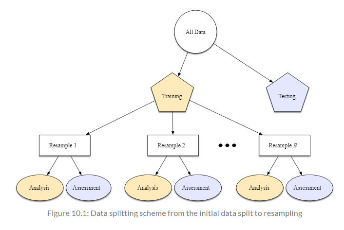
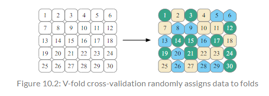
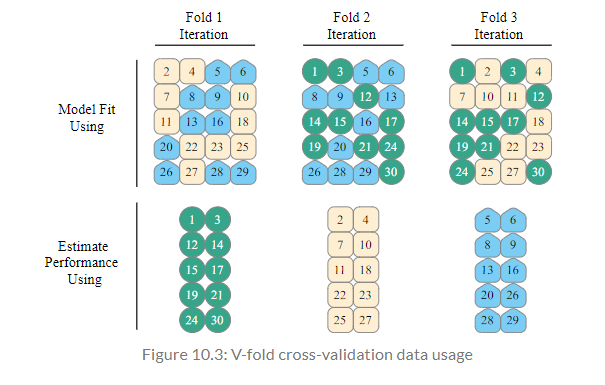

```{r setup, include = FALSE}
library(learnr)
library(tutorial.helpers)
library(tidymodels)
library(ranger)
tidymodels_prefer()
knitr::opts_chunk$set(echo = FALSE)
options(tutorial.exercise.timelimit = 60, 
        tutorial.storage = "local") 


ames_update <- ames |>
  mutate(Sale_Price = log10(Sale_Price))

set.seed(502)
ames_strata_split <- initial_split(ames_update, prop = 0.80, strata = Sale_Price)
ames_train <- training(ames_strata_split)
ames_test  <-  testing(ames_strata_split)

ames_rec <- recipe(Sale_Price ~ Neighborhood + Gr_Liv_Area + Year_Built + Bldg_Type + Latitude + Longitude, data = ames_train) |>
  step_log(Gr_Liv_Area, base = 10) |>
  step_other(Neighborhood, threshold = 0.01, id = "my_id") |>
  step_dummy(all_nominal_predictors()) |>
  step_interact( ~ Gr_Liv_Area:starts_with("Bldg_Type_")) |>
  step_ns(Latitude, Longitude, deg_free = 20)
  
lm_model <- linear_reg() |> set_engine("lm")

lm_wflow <- 
  workflow() |>
  add_model(lm_model) |> 
  add_recipe(ames_rec)

lm_fit <- fit(lm_wflow, ames_train)

rf_model <- rand_forest(trees = 1000) |>
  set_engine("ranger") |>
  set_mode("regression")

rf_wflow <- workflow() |>
  add_formula(Sale_Price ~ Neighborhood + Gr_Liv_Area + Year_Built + Bldg_Type + Latitude + Longitude) |>
  add_model(rf_model)

rf_fit <- rf_wflow |>
  fit(data = ames_train)

estimated_perf <- function(model, dat) {
  cl <- match.call()
  obj_name <- as.character(cl$model)
  data_name <- as.character(cl$dat)
  data_name <- gsub("ames_", "", data_name)
}

estimate_perf <- function(model, dat) {
  cl <- match.call()
  obj_name <- as.character(cl$model)
  data_name <- as.character(cl$dat)
  data_name <- gsub("ames_", "", data_name)
  
  reg_metrics <- metric_set(rmse, rsq)
  
  model |>
    predict(dat) |>
    bind_cols(dat |> select(Sale_Price)) |>
    reg_metrics(Sale_Price, .pred) |>
    select(-.estimator) |>
    mutate(object = obj_name, data = data_name)
}

```

```{r copy-code-chunk, child = system.file("child_documents/copy_button.Rmd", package = "tutorial.helpers")}
```

```{r info-section, child = system.file("child_documents/info_section.Rmd", package = "tutorial.helpers")}
```

## Introduction
### 

This tutorial covers [Chapter 10: Resampling for Evaluating Performance](https://www.tmwr.org/resampling.html) from [*Tidy Modeling with R*](https://www.tmwr.org/) by Max Kuhn and Julia Silge. 

## The Resubstitution Approach
### 

Typically it isn't possible to decide on which final model to use with the test set before first assessing model performance. There is a gap between the need to measure performance reliably and the data splits (training and testing) that are available. However, resampling can fill this gap. *Resampling* estimates of performance can generalize to new data in a similar way as estimates from a test set.


### Exercise 1

Load the **tidymodels** library using `library()`

```{r the-resubstitution-a-1, exercise = TRUE}

```

```{r the-resubstitution-a-1-hint-1, eval = FALSE}
library(...)
```

```{r include = FALSE}
library(tidymodels)
```

### 

Note that before using the test set, you need to understand the performance of a model or even multiple model.

### Exercise 2

Type in `tidymodels_prefer()` to get rid of the naming conflicts.

```{r the-resubstitution-a-2, exercise = TRUE}

```

```{r the-resubstitution-a-2-hint-1, eval = FALSE}
...()
```

```{r include = FALSE}
tidymodels_prefer()
```

### 

As a reminder, several pieces that must be put together to evaluate the performance of a model have already been covered. The "Judging Model Effectiveness" tutorial described statistics for measuring model performance and the "Spending our Data" tutorial introduced the idea of data spending (the test set is recommended for obtaining an unbiased estimate of performance).

### Exercise 3

When the performance was measured on the same data that was used for training (as opposed to new data or testing data), that means the data has been *resubstituted*. Lets use the Ames housing data.

Press "Run Code".

```{r the-resubstitution-a-3, exercise = TRUE}
ames_update <- ames |>
  mutate(Sale_Price = log10(Sale_Price))

set.seed(502)
ames_strata_split <- initial_split(ames_update, prop = 0.80, strata = Sale_Price)
ames_train <- training(ames_strata_split)
ames_test  <-  testing(ames_strata_split)
```

```{r include = FALSE}
ames_update <- ames |>
  mutate(Sale_Price = log10(Sale_Price))

set.seed(502)
ames_strata_split <- initial_split(ames_update, prop = 0.80, strata = Sale_Price)
ames_train <- training(ames_strata_split)
ames_test  <-  testing(ames_strata_split)
```

### 

In the past tutorials, you have created and modified these variables. You first logged the `ames` data base, put it into `initial_split()` with the `strata` argument, and passed it into the `training()` and `testing()` functions.

### Exercise 4

Press "Run Code".

```{r the-resubstitution-a-4, exercise = TRUE}
ames_rec <- recipe(Sale_Price ~ Neighborhood + Gr_Liv_Area + Year_Built + Bldg_Type + Latitude + Longitude, data = ames_train) |>
  step_log(Gr_Liv_Area, base = 10) |>
  step_other(Neighborhood, threshold = 0.01, id = "my_id") |>
  step_dummy(all_nominal_predictors()) |>
  step_interact( ~ Gr_Liv_Area:starts_with("Bldg_Type_")) |>
  step_ns(Latitude, Longitude, deg_free = 20)
  
lm_model <- linear_reg() |> set_engine("lm")

lm_wflow <- 
  workflow() |>
  add_model(lm_model) |> 
  add_recipe(ames_rec)

lm_fit <- fit(lm_wflow, ames_train)
```

```{r include = FALSE}
ames_rec <- recipe(Sale_Price ~ Neighborhood + Gr_Liv_Area + Year_Built + Bldg_Type + Latitude + Longitude, data = ames_train) |>
  step_log(Gr_Liv_Area, base = 10) |>
  step_other(Neighborhood, threshold = 0.01, id = "my_id") |>
  step_dummy(all_nominal_predictors()) |>
  step_interact( ~ Gr_Liv_Area:starts_with("Bldg_Type_")) |>
  step_ns(Latitude, Longitude, deg_free = 20)
  
lm_model <- linear_reg() |> set_engine("lm")

lm_wflow <- 
  workflow() |>
  add_model(lm_model) |> 
  add_recipe(ames_rec)

lm_fit <- fit(lm_wflow, ames_train)
```

### 

In the "Feature Engineering with `recipes`" tutorial, you have created `ames_rec`, a linear model and a workflow using that recipe and model called `lm_wflow`. This workflow was fit on the training set, resulting in `lm_fit`.

### Exercise 5

For a comparison to this linear model, a different type of model can be used. *Random forests` are a tree ensemble method that operates by creating a large number of decision trees from slightly different versions of the training set.

Type `?rand_forest()` in the Console and look at the *Description* section. CP/CR.

```{r the-resubstitution-a-5}
question_text(NULL,
	answer(NULL, correct = TRUE),
	allow_retry = TRUE,
	try_again_button = "Edit Answer",
	incorrect = NULL,
	rows = 3)
```

### 

This collection of trees makes up the ensemble. When predicting a new sample, each ensemble member makes a separate prediction. These are averaged to create the final ensemble prediction for the new data point.

### Exercise 6

Using the same predictor set as the linear model (without the extra preprocessing steps), lets fit a random forest model to the training set via the `"ranger"` engine (which uses the ranger R package for computation). This model requires no preprocessing, so a simple formula can be used.

Type in `rand_forest()` and set `trees` to `1000`. 

```{r the-resubstitution-a-6, exercise = TRUE}

```

```{r the-resubstitution-a-6-hint-1, eval = FALSE}
rand_forest(... = ...)
```

```{r include = FALSE}
rand_forest(trees = 1000)
```

### 

 
Random forest models are very powerful, and they can emulate the underlying data patterns very closely. While this model can be computationally intensive, it is very low maintenance; very little preprocessing is required.

### Exercise 7

Copy the previous code and pipe it to `set_engine()`. Inside this function, type in `"ranger"`

```{r the-resubstitution-a-7, exercise = TRUE}

```

<button onclick = "transfer_code(this)">Copy previous code</button>

```{r the-resubstitution-a-7-hint-1, eval = FALSE}
rand_forest(trees = 1000) |>
  set_engine("...")
```

```{r include = FALSE}
rand_forest(trees = 1000) |>
  set_engine("ranger")
```

### 

As a reminder, this [table](https://www.tmwr.org/pre-proc-table.html#pre-proc-table) provides information on preprocessing methods for different models.

### Exercise 8

Copy the previous code and pipe it to `set_mode()`. In this function, pass in `"regression"`. 

```{r the-resubstitution-a-8, exercise = TRUE}

```

<button onclick = "transfer_code(this)">Copy previous code</button>

```{r the-resubstitution-a-8-hint-1, eval = FALSE}
rand_forest(trees = 1000) |>
  set_engine("ranger") |>
  set_mode("...")
```

```{r include = FALSE}
rand_forest(trees = 1000) |>
  set_engine("ranger") |>
  set_mode("regression")
```

### 

The next tutorial complements this one by demonstrating statistical methods that compare resampling results.

### Exercise 9

Copy the previous code and assign it to a new variable called `rf_model`.

```{r the-resubstitution-a-9, exercise = TRUE}

```

<button onclick = "transfer_code(this)">Copy previous code</button>

```{r the-resubstitution-a-9-hint-1, eval = FALSE}
... <- rand_forest(trees = 1000) |>
  set_engine("ranger") |>
  set_mode("regression")
```

```{r include = FALSE}
rf_model <- rand_forest(trees = 1000) |>
  set_engine("ranger") |>
  set_mode("regression")
```

### 

The predictive capacity of a model can be used to evaluate relationships in data, even when its main goal is not prediction. Modeling itself sits within the broader data analysis process, and exploratory data analysis is a key part of building high-quality models.

### Exercise 10

Next, lets create a workflow for this model. Type in `workflow()` and pipe it to `add_formula()` (Note: this will throw an error).

```{r the-resubstitution-a-10, exercise = TRUE}

```

```{r the-resubstitution-a-10-hint-1, eval = FALSE}
workflow() |>
  ...()
```

```{r include = FALSE}
#workflow() |>
#  add_formula()
```

### 

`add_formula()` specifies the terms of the model through the usage of a formula. This code throws an error because the formula hasn't been passed in.

### Exercise 11

Copy the previous code. Inside `add_formula()`, type in `Sale_Price ~ Neighborhood + Gr_Liv_Area + Year_Built + Bldg_Type + Latitude + Longitude`.

```{r the-resubstitution-a-11, exercise = TRUE}

```

<button onclick = "transfer_code(this)">Copy previous code</button>

```{r the-resubstitution-a-11-hint-1, eval = FALSE}
workflow() |>
  add_formula(Sale_Price ~ Neighborhood + ... + ... + ... + ... + ...)
```

```{r include = FALSE}
workflow() |>
  add_formula(Sale_Price ~ Neighborhood + Gr_Liv_Area + Year_Built + Bldg_Type + Latitude + Longitude)
```

### 

As you can see, this code produces the preprocessor section, which contains all of the terms that have been passed in the `add_formula()` function. However, the *Model* section displays "None".

### Exercise 12

Lets fix that. Copy the previous code and pipe it to `add_model()`. Inside this function, pass in `rf_model`.

```{r the-resubstitution-a-12, exercise = TRUE}

```

<button onclick = "transfer_code(this)">Copy previous code</button>

```{r the-resubstitution-a-12-hint-1, eval = FALSE}
workflow() |>
  add_formula(Sale_Price ~ Neighborhood + Gr_Liv_Area + Year_Built + Bldg_Type + Latitude + Longitude) |>
  add_model(...)
```

```{r include = FALSE}
workflow() |>
  add_formula(Sale_Price ~ Neighborhood + Gr_Liv_Area + Year_Built + Bldg_Type + Latitude + Longitude) |>
  add_model(rf_model)
```

### 

As described in the name, `add_model()` adds a parsnip model to a workflow. In this case, the `rf_model` that was created earlier is being passed into the workflow. 

### Exercise 13

Copy the previous code and assign it to a new variable called `rf_wflow`.

```{r the-resubstitution-a-13, exercise = TRUE}

```

<button onclick = "transfer_code(this)">Copy previous code</button>

```{r the-resubstitution-a-13-hint-1, eval = FALSE}
... <- workflow() |>
  add_formula(Sale_Price ~ Neighborhood + Gr_Liv_Area + Year_Built + Bldg_Type + Latitude + Longitude) |>
  add_model(rf_model)
```

```{r include = FALSE}
rf_wflow <- workflow() |>
  add_formula(Sale_Price ~ Neighborhood + Gr_Liv_Area + Year_Built + Bldg_Type + Latitude + Longitude) |>
  add_model(rf_model)
```

### 

Random forests are an example of an ensemble method, meaning they combines the predictions of multiple base models (decision trees) to make final predictions. The ensemble approach typically improves prediction accuracy and generalization.

### Exercise 14

Now, lets fit the model. Pipe `rf_wflow` to `fit()`. Inside this function, set `data` to `ames_train`

```{r the-resubstitution-a-14, exercise = TRUE}

```

```{r the-resubstitution-a-14-hint-1, eval = FALSE}
rf_wflow |>
  fit(... = ...)
```

```{r include = FALSE}
rf_wflow |>
  fit(data = ames_train)
```

### 

Model fitting involves finding a mathematical representation that best describes the relationship between the input variables (features) and the output variable (target) in the data. In this case, a linear regression is the mathematical representation.

### Exercise 15

Copy the previous code and assign it to a new variable called `rf_fit`

```{r the-resubstitution-a-15, exercise = TRUE}

```

<button onclick = "transfer_code(this)">Copy previous code</button>

```{r the-resubstitution-a-15-hint-1, eval = FALSE}
... <- rf_wflow |>
  fit(data = ames_train)
```

```{r include = FALSE}
rf_fit <- rf_wflow |>
  fit(data = ames_train)
```

### 

<!-- AK: Add knowledge drop -->

### Exercise 16

How should the linear and random forest models be compared? In this scenario, the training set to produce what is known as an *apparent metric* or *resubstitution metric* will be predicted. 

Lets create a function that will create predictions and format the results. In the code chunk below, type in `function() {}`. Inside the parenthesis, pass in `model` and `dat`.

```{r the-resubstitution-a-16, exercise = TRUE}

```

```{r the-resubstitution-a-16-hint-1, eval = FALSE}
function(..., ...) {
  
}
```

```{r include = FALSE}
function(model, dat) {
  
}
```

### 

The "A Tidyverse Primer" tutorial teaches the structure and functionality of `function()`. 

### Exercise 17

Copy the previous code. Inside the function, create a new variable called `cl` and assign it to `match.call()`

```{r the-resubstitution-a-17, exercise = TRUE}

```

<button onclick = "transfer_code(this)">Copy previous code</button>

```{r the-resubstitution-a-17-hint-1, eval = FALSE}
function(model, dat) {
  cl <- ...()
}
```

```{r include = FALSE}
function(model, dat) {
  cl <- match.call()
}
```

### 

`match.call()` returns a call in which all of the specified arguments are specified by their full names.

### Exercise 18

Copy the previous code. Create a new variable called `obj_name` and assign it to `as.character()`. Inside `as.character()`, type in `cl$model`.

```{r the-resubstitution-a-18, exercise = TRUE}

```

<button onclick = "transfer_code(this)">Copy previous code</button>

```{r the-resubstitution-a-18-hint-1, eval = FALSE}
function(model, dat) {
  cl <- match.call()
  obj_name <- ...(cl$...)
}
```

```{r include = FALSE}
function(model, dat) {
  cl <- match.call()
  obj_name <- as.character(cl$model)
}
```

### 

`as.character()` is used to explicitly convert an object of any data type into a character (string).

### Exercise 19

Copy the previous code. Create a new variable called `data_name` and assign it to `as.character()`. Inside `as.character()`, type in `cl$dat`.

```{r the-resubstitution-a-19, exercise = TRUE}

```

<button onclick = "transfer_code(this)">Copy previous code</button>

```{r the-resubstitution-a-19-hint-1, eval = FALSE}
function(model, dat) {
  cl <- match.call()
  obj_name <- as.character(cl$model)
  data_name <- ...(cl$...)
}
```

```{r include = FALSE}
function(model, dat) {
  cl <- match.call()
  obj_name <- as.character(cl$model)
  data_name <- as.character(cl$dat)
}
```

### 

As of now, this code extracts all of the arguments that are specified by their full names, extracts the `model` and `dat` columns, and turns their names into characters/strings.

### Exercise 20

Copy the previous code. Create a variable also called `data_name` and assign it to `gsub()`. Inside `gsub()`, type in `"ames_", "", data_name`.

```{r the-resubstitution-a-20, exercise = TRUE}

```

<button onclick = "transfer_code(this)">Copy previous code</button>

```{r the-resubstitution-a-20-hint-1, eval = FALSE}
function(model, dat) {
  cl <- match.call()
  obj_name <- as.character(cl$model)
  data_name <- as.character(cl$dat)
  data_name <- ...("ames_", "", ...)
}
```

```{r include = FALSE}
function(model, dat) {
  cl <- match.call()
  obj_name <- as.character(cl$model)
  data_name <- as.character(cl$dat)
  data_name <- gsub("ames_", "", data_name)
}
```

### 

`gsub()`, which stands for "Global Substitution", is used to replace occurrences of a pattern (substring) with a specified replacement string in a character vector.

### Exercise 21

Copy the previous code. Type in `metric_set()`, passing in `rmse` and `rsq`. Then, save it to a new variable named `reg_metrics`.

```{r the-resubstitution-a-21, exercise = TRUE}

```

<button onclick = "transfer_code(this)">Copy previous code</button>

```{r the-resubstitution-a-21-hint-1, eval = FALSE}
function(model, dat) {
  cl <- match.call()
  obj_name <- as.character(cl$model)
  data_name <- as.character(cl$dat)
  data_name <- gsub("ames_", "", data_name)
  
  reg_metrics <- metric_set(..., ...)
}
```

```{r include = FALSE}
function(model, dat) {
  cl <- match.call()
  obj_name <- as.character(cl$model)
  data_name <- as.character(cl$dat)
  data_name <- gsub("ames_", "", data_name)
  
  reg_metrics <- metric_set(rmse, rsq)
}
```

### 

Repredicting the training set will result in an artificially optimistic estimate of performance. It is a bad idea for most models.

### Exercise 22

Copy the previous code. Inside the function itself, pipe `model` to `predict()`. Inside `predict()`, type in `dat`.

```{r the-resubstitution-a-22, exercise = TRUE}

```

<button onclick = "transfer_code(this)">Copy previous code</button>

```{r the-resubstitution-a-22-hint-1, eval = FALSE}
function(model, dat) {
  cl <- match.call()
  obj_name <- as.character(cl$model)
  data_name <- as.character(cl$dat)
  data_name <- gsub("ames_", "", data_name)
  
  reg_metrics <- metric_set(rmse, rsq)
  
  model |>
    ...(dat)
}
```

```{r include = FALSE}
function(model, dat) {
  cl <- match.call()
  obj_name <- as.character(cl$model)
  data_name <- as.character(cl$dat)
  data_name <- gsub("ames_", "", data_name)
  
  reg_metrics <- metric_set(rmse, rsq)
  
  model |>
    predict(dat)
}
```

### 

*Bias* is the difference between the true pattern or relationships in data and the types of patterns that the model can emulate. Many black-box machine learning models have low bias, meaning they can reproduce complex relationships. Other models (such as linear/logistic regression, discriminant analysis, and others) are not as adaptable and are considered high bias models.

### Exercise 23

Copy the previous code. Continue the pipe to `bind_cols()`. Inside `bind_cols()`, type in `dat |> select(Sale_Price)`.

```{r the-resubstitution-a-23, exercise = TRUE}

```

<button onclick = "transfer_code(this)">Copy previous code</button>

```{r the-resubstitution-a-23-hint-1, eval = FALSE}
function(model, dat) {
  cl <- match.call()
  obj_name <- as.character(cl$model)
  data_name <- as.character(cl$dat)
  data_name <- gsub("ames_", "", data_name)
  
  reg_metrics <- metric_set(rmse, rsq)
  
  model |>
    predict(dat) |>
    bind_cols(... |> select(...))
}
```

```{r include = FALSE}
function(model, dat) {
  cl <- match.call()
  obj_name <- as.character(cl$model)
  data_name <- as.character(cl$dat)
  data_name <- gsub("ames_", "", data_name)
  
  reg_metrics <- metric_set(rmse, rsq)
  
  model |>
    predict(dat) |>
    bind_cols(dat |> select(Sale_Price))
}
```

### 

Resampling methods are empirical simulation systems that emulate the process of using some data for modeling and different data for evaluation. Most resampling methods are iterative, meaning that this process is repeated multiple times. This diagram illustrates how resampling methods generally operate:


```{r}

```

### Exercise 24

Copy the previous code and continue the pipe to `reg_metrics()`. Inside `reg_metrics()`, type in `Sale_Price` and `.pred`.

```{r the-resubstitution-a-24, exercise = TRUE}

```

<button onclick = "transfer_code(this)">Copy previous code</button>

```{r the-resubstitution-a-24-hint-1, eval = FALSE}
function(model, dat) {
  cl <- match.call()
  obj_name <- as.character(cl$model)
  data_name <- as.character(cl$dat)
  data_name <- gsub("ames_", "", data_name)
  
  reg_metrics <- metric_set(rmse, rsq)
  
  model |>
    predict(dat) |>
    bind_cols(dat |> select(Sale_Price)) |>
    reg_metrics(..., ...)
}
```

```{r include = FALSE}
function(model, dat) {
  cl <- match.call()
  obj_name <- as.character(cl$model)
  data_name <- as.character(cl$dat)
  data_name <- gsub("ames_", "", data_name)
  
  reg_metrics <- metric_set(rmse, rsq)
  
  model |>
    predict(dat) |>
    bind_cols(dat |> select(Sale_Price)) |>
    reg_metrics(Sale_Price, .pred)
}
```

### 

As you can see from the diagram in the previous exercise, resampling is conducted only on the training set. The test set is not involved.

### Exercise 25

Copy the previous code and continue the pipe to `select()`. Inside `select()`, pass in `-.estimator`.

```{r the-resubstitution-a-25, exercise = TRUE}

```

<button onclick = "transfer_code(this)">Copy previous code</button>

```{r the-resubstitution-a-25-hint-1, eval = FALSE}
function(model, dat) {
  cl <- match.call()
  obj_name <- as.character(cl$model)
  data_name <- as.character(cl$dat)
  data_name <- gsub("ames_", "", data_name)
  
  reg_metrics <- metric_set(rmse, rsq)
  
  model |>
    predict(dat) |>
    bind_cols(dat |> select(Sale_Price)) |>
    reg_metrics(Sale_Price, .pred) |>
    select(...)
}
```

```{r include = FALSE}
function(model, dat) {
  cl <- match.call()
  obj_name <- as.character(cl$model)
  data_name <- as.character(cl$dat)
  data_name <- gsub("ames_", "", data_name)
  
  reg_metrics <- metric_set(rmse, rsq)
  
  model |>
    predict(dat) |>
    bind_cols(dat |> select(Sale_Price)) |>
    reg_metrics(Sale_Price, .pred) |>
    select(-.estimator)
}
```

### 

`select(-.estimator)` will select every column *except* for `.estimator`, which is due to the `-` in front of `.estimator`.


### Exercise 26

Copy the previous code and continue the pipe to `mutate()`. Inside `mutate()`, set `object` to `obj_name` and set `data` to `data_name`.

```{r the-resubstitution-a-26, exercise = TRUE}

```

<button onclick = "transfer_code(this)">Copy previous code</button>

```{r the-resubstitution-a-26-hint-1, eval = FALSE}
function(model, dat) {
  cl <- match.call()
  obj_name <- as.character(cl$model)
  data_name <- as.character(cl$dat)
  data_name <- gsub("ames_", "", data_name)
  
  reg_metrics <- metric_set(rmse, rsq)
  
  model |>
    predict(dat) |>
    bind_cols(dat |> select(Sale_Price)) |>
    reg_metrics(Sale_Price, .pred) |>
    select(-.estimator) |>
    mutate(object = ..., data = ...)
}
```

```{r include = FALSE}
function(model, dat) {
  cl <- match.call()
  obj_name <- as.character(cl$model)
  data_name <- as.character(cl$dat)
  data_name <- gsub("ames_", "", data_name)
  
  reg_metrics <- metric_set(rmse, rsq)
  
  model |>
    predict(dat) |>
    bind_cols(dat |> select(Sale_Price)) |>
    reg_metrics(Sale_Price, .pred) |>
    select(-.estimator) |>
    mutate(object = obj_name, data = data_name)
}
```

### 

For each iteration of resampling, the data are partitioned into two subsamples:

- The model is fit with the *analysis* set.
- The model is evaluated with the *assessment* set.

These two subsamples are somewhat analogous to training and test sets. Our language of *analysis* and *assessment* avoids confusion with the initial split of the data. These data sets are mutually exclusive. The partitioning scheme used to create the analysis and assessment sets is usually the defining characteristic of the method.

### Exercise 27

Copy the previous code and save the entire function to a new variable called `estimate_perf`.

```{r the-resubstitution-a-27, exercise = TRUE}

```

<button onclick = "transfer_code(this)">Copy previous code</button>

```{r the-resubstitution-a-27-hint-1, eval = FALSE}
... <- function(model, dat) {
  cl <- match.call()
  obj_name <- as.character(cl$model)
  data_name <- as.character(cl$dat)
  data_name <- gsub("ames_", "", data_name)
  
  reg_metrics <- metric_set(rmse, rsq)
  
  model |>
    predict(dat) |>
    bind_cols(dat |> select(Sale_Price)) |>
    reg_metrics(Sale_Price, .pred) |>
    select(-.estimator) |>
    mutate(object = obj_name, data = data_name)
}
```

```{r include = FALSE}
estimate_perf <- function(model, dat) {
  cl <- match.call()
  obj_name <- as.character(cl$model)
  data_name <- as.character(cl$dat)
  data_name <- gsub("ames_", "", data_name)
  
  reg_metrics <- metric_set(rmse, rsq)
  
  model |>
    predict(dat) |>
    bind_cols(dat |> select(Sale_Price)) |>
    reg_metrics(Sale_Price, .pred) |>
    select(-.estimator) |>
    mutate(object = obj_name, data = data_name)
}
```

### 

Suppose 20 iterations of resampling are conducted. This means that 20 separate models are fit on the analysis sets, and the corresponding assessment sets produce 20 sets of performance statistics. The final estimate of performance for a model is the average of the 20 replicates of the statistics. This average has very good generalization properties and is far better than the resubstitution estimates.


### Exercise 28

Now, lets use the `estimate_perf()` function to compute the resubstitution statistics. In the code chunk below, type in `estimate_perf()`. Inside the parenthesis, pass in `rf_fit` as the first parameter and `ames_train` as the second.

```{r the-resubstitution-a-28, exercise = TRUE}

```

```{r the-resubstitution-a-28-hint-1, eval = FALSE}
estimate_perf(..., ...)
```

```{r include = FALSE}
estimate_perf(rf_fit, ames_train)
```

### 

As a reminder, `rmse` stands for the root mean standard error (lower = better). `rsq` is a "goodness-of-fit" for a linear regression model (higher = better). 

### Exercise 29

Lets compare these results to the `lm_fit`. Copy the previous code, replacing `rf_fit` with `lm_fit`.

```{r the-resubstitution-a-29, exercise = TRUE}

```

<button onclick = "transfer_code(this)">Copy previous code</button>

```{r the-resubstitution-a-29-hint-1, eval = FALSE}
estimate_perf(..., ames_train)
```

```{r include = FALSE}
estimate_perf(lm_fit, ames_train)
```

### 

Based on these results, the random forest is much more capable of predicting the sale prices; the RMSE estimate is two-fold better than linear regression. If you needed to choose between these two models for this price prediction problem, it would be recommended to chose the random forest because, on the log scale that is being using, its RMSE is about half as large. 

### Exercise 30

Now, lets look at the `rf_fit` when estimated with `ames_test`. Type in `estimate_perf()`, passing in `rf_fit` as the first parameter and `ames_test` as the second. 

```{r the-resubstitution-a-30, exercise = TRUE}

```

```{r the-resubstitution-a-30-hint-1, eval = FALSE}
estimate_perf(..., ...)
```

```{r include = FALSE}
estimate_perf(rf_fit, ames_test)
```

### 

The test set RMSE estimate, 0.0704, is much worse than the training set value of 0.0365! Why did this happen?

Many predictive models are capable of learning complex trends from the data. In statistics, these are commonly referred to as low bias models. As mentioned previously, *bias* is the difference between the true pattern or relationships in data and the types of patterns that the model can emulate.

For a low bias model, the high degree of predictive capacity can sometimes result in the model nearly memorizing the training set data. As an obvious example, consider a 1-nearest neighbor model. It will always provide perfect predictions for the training set no matter how well it truly works for other data sets. Random forest models are similar; repredicting the training set will always result in an artificially optimistic estimate of performance.

## Resampling Methods
### 

Resampling methods are empirical simulation systems that emulate the process of using some data for modeling and different data for evaluation. Most resampling methods are iterative, meaning that this process is repeated multiple times.

### Exercise 1

Cross-validation is a well established resampling method. While there are a number of variations, the most common cross-validation method is V-fold cross-validation. The data are randomly partitioned into V sets of roughly equal size (called the folds). In the image below, V = 3 is shown for a data set of 30 training set points with random fold allocations. The number inside the symbols is the sample number.

```{r}

```

### 

The color of the symbols represents their randomly assigned folds. Stratified sampling is also an option for assigning folds.

### Exercise 2

For three-fold cross-validation, the three iterations of resampling are illustrated in Figure 10.3. For each iteration, one fold is held out for assessment statistics and the remaining folds are substrate for the model. This process continues for each fold so that three models produce three sets of performance statistics. 

```{r}

```

### 

When V = 3, the analysis sets are 2/3 of the training set and each assessment set is a distinct 1/3. The final resampling estimate of performance averages each of the V replicates.

Using V = 3 is a good choice to illustrate cross-validation, but it is a poor choice in practice because it is too low to generate reliable estimates. In practice, values of V are most often 5 or 10; we generally prefer 10-fold cross-validation as a default because it is large enough for good results in most situations.

### Exercise 3

```{r resampling-methods-3, exercise = TRUE}

```

<button onclick = "transfer_code(this)">Copy previous code</button>

```{r resampling-methods-3-hint-1, eval = FALSE}

```

```{r include = FALSE}

```

### 

## Summary
### 

<!-- Two to four sentences which bring the lessons of the tutorial together for the student. What do they know now that they did not know before? How does this tutorial connect to other tutorials? OK if this is very similar to the Introduction. You made a promise as to what they would learn. You (we hope!) kept that promise.-->

```{r download-answers, child = system.file("child_documents/download_answers.Rmd", package = "tutorial.helpers")}
```
