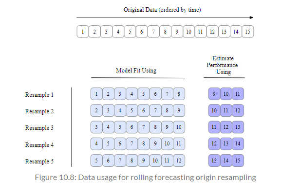

```{r setup, include = FALSE}
library(learnr)
library(tutorial.helpers)
library(tidymodels)
library(ranger)
library(doParallel)

tidymodels_prefer()
knitr::opts_chunk$set(echo = FALSE)
options(tutorial.exercise.timelimit = 60, 
        tutorial.storage = "local") 


ames_update <- ames |>
  mutate(Sale_Price = log10(Sale_Price))

set.seed(502)
ames_strata_split <- initial_split(ames_update, prop = 0.80, strata = Sale_Price)
ames_train <- training(ames_strata_split)
ames_test  <-  testing(ames_strata_split)

ames_rec <- recipe(Sale_Price ~ Neighborhood + Gr_Liv_Area + Year_Built + Bldg_Type + Latitude + Longitude, data = ames_train) |>
  step_log(Gr_Liv_Area, base = 10) |>
  step_other(Neighborhood, threshold = 0.01, id = "my_id") |>
  step_dummy(all_nominal_predictors()) |>
  step_interact( ~ Gr_Liv_Area:starts_with("Bldg_Type_")) |>
  step_ns(Latitude, Longitude, deg_free = 20)
  
lm_model <- linear_reg() |> set_engine("lm")

lm_wflow <- 
  workflow() |>
  add_model(lm_model) |> 
  add_recipe(ames_rec)

lm_fit <- fit(lm_wflow, ames_train)

rf_model <- rand_forest(trees = 1000) |>
  set_engine("ranger") |>
  set_mode("regression")

rf_wflow <- workflow() |>
  add_formula(Sale_Price ~ Neighborhood + Gr_Liv_Area + Year_Built + Bldg_Type + Latitude + Longitude) |>
  add_model(rf_model)

rf_fit <- rf_wflow |>
  fit(data = ames_train)

estimated_perf <- function(model, dat) {
  cl <- match.call()
  obj_name <- as.character(cl$model)
  data_name <- as.character(cl$dat)
  data_name <- gsub("ames_", "", data_name)
}

estimate_perf <- function(model, dat) {
  cl <- match.call()
  obj_name <- as.character(cl$model)
  data_name <- as.character(cl$dat)
  data_name <- gsub("ames_", "", data_name)
  
  reg_metrics <- metric_set(rmse, rsq)
  
  model |>
    predict(dat) |>
    bind_cols(dat |> select(Sale_Price)) |>
    reg_metrics(Sale_Price, .pred) |>
    select(-.estimator) |>
    mutate(object = obj_name, data = data_name)
}

set.seed(1001)

ames_folds <- vfold_cv(ames_train, v = 10)

set.seed(1002)

val_set <- validation_split(ames_train, prop = 3/4)

time_slices <- tibble(x = 1:365) |> 
  rolling_origin(initial = 6 * 30, assess = 30, skip = 29, cumulative = FALSE)

data_range <- function(x){
  summarize(x, first = min(x), last = max(x))
}

keep_pred <- control_resamples(save_pred = TRUE, save_workflow = TRUE)

set.seed(1003)

rf_res <- rf_wflow |> 
  fit_resamples(resamples = ames_folds, control = keep_pred)

assess_res <- collect_predictions(rf_res)

plot1 <- assess_res |>
  ggplot(aes(x = Sale_Price, y = .pred)) + 
  geom_point(alpha = .15) +
  geom_abline(color = "red") + 
  coord_obs_pred() + 
  ylab("Predicted")

over_predicted <- assess_res |>
  mutate(residual = Sale_Price - .pred) |>
  arrange(desc(abs(residual))) |>
  slice(1:2)

ames_rec1 <- 
  recipe(Sale_Price ~ Neighborhood + Gr_Liv_Area + Year_Built + Bldg_Type + Latitude + Longitude, data = ames_train) |>
  step_log(Gr_Liv_Area, base = 10) |>
  step_other(Neighborhood, threshold = 0.01) |>
  step_dummy(all_nominal_predictors()) |>
  step_interact( ~ Gr_Liv_Area:starts_with("Bldg_Type_")) |>
  step_ns(Latitude, Longitude, deg_free = 20)

lm_wflow1 <-  
  workflow() |> 
  add_recipe(ames_rec1) |>
  add_model(linear_reg() |> set_engine("lm")) 

lm_fit1 <- 
  lm_wflow1 |>
  fit(data = ames_train)

get_model <- function(x){
  extract_fit_parsnip(x) |>
    tidy()
}

ctrl <- control_resamples(extract = get_model)

lm_res <- lm_wflow1 |>
  fit_resamples(resamples = ames_folds, control = ctrl)


```

```{r copy-code-chunk, child = system.file("child_documents/copy_button.Rmd", package = "tutorial.helpers")}
```

```{r info-section, child = system.file("child_documents/info_section.Rmd", package = "tutorial.helpers")}
```

## Introduction
### 

This tutorial covers [Chapter 10: Resampling for Evaluating Performance](https://www.tmwr.org/resampling.html) from [*Tidy Modeling with R*](https://www.tmwr.org/) by Max Kuhn and Julia Silge. 

## The Resubstitution Approach
### 

Typically it isn't possible to decide on which final model to use with the test set before first assessing model performance. There is a gap between the need to measure performance reliably and the data splits (training and testing) that are available. However, resampling can fill this gap. *Resampling* estimates of performance can generalize to new data in a similar way as estimates from a test set.


### Exercise 1

Load the **tidymodels** library using `library()`

```{r the-resubstitution-a-1, exercise = TRUE}

```

```{r the-resubstitution-a-1-hint-1, eval = FALSE}
library(...)
```

```{r include = FALSE}
library(tidymodels)
```

### 

Note that before using the test set, you need to understand the performance of a model or even multiple model.

### Exercise 2

Type in `tidymodels_prefer()` to get rid of the naming conflicts.

```{r the-resubstitution-a-2, exercise = TRUE}

```

```{r the-resubstitution-a-2-hint-1, eval = FALSE}
...()
```

```{r include = FALSE}
tidymodels_prefer()
```

### 

As a reminder, several pieces that must be put together to evaluate the performance of a model have already been covered. The "Judging Model Effectiveness" tutorial described statistics for measuring model performance and the "Spending our Data" tutorial introduced the idea of data spending (the test set is recommended for obtaining an unbiased estimate of performance).

### Exercise 3

When the performance was measured on the same data that was used for training (as opposed to new data or testing data), that means the data has been *resubstituted*. Lets use the Ames housing data.

Press "Run Code".

```{r the-resubstitution-a-3, exercise = TRUE}
ames_update <- ames |>
  mutate(Sale_Price = log10(Sale_Price))

set.seed(502)
ames_strata_split <- initial_split(ames_update, prop = 0.80, strata = Sale_Price)
ames_train <- training(ames_strata_split)
ames_test  <-  testing(ames_strata_split)
```

```{r include = FALSE}
ames_update <- ames |>
  mutate(Sale_Price = log10(Sale_Price))

set.seed(502)
ames_strata_split <- initial_split(ames_update, prop = 0.80, strata = Sale_Price)
ames_train <- training(ames_strata_split)
ames_test  <-  testing(ames_strata_split)
```

### 

In the past tutorials, you have created and modified these variables. You first logged the `ames` data base, put it into `initial_split()` with the `strata` argument, and passed it into the `training()` and `testing()` functions.

### Exercise 4

Press "Run Code".

```{r the-resubstitution-a-4, exercise = TRUE}
ames_rec <- recipe(Sale_Price ~ Neighborhood + Gr_Liv_Area + Year_Built + Bldg_Type + Latitude + Longitude, data = ames_train) |>
  step_log(Gr_Liv_Area, base = 10) |>
  step_other(Neighborhood, threshold = 0.01, id = "my_id") |>
  step_dummy(all_nominal_predictors()) |>
  step_interact( ~ Gr_Liv_Area:starts_with("Bldg_Type_")) |>
  step_ns(Latitude, Longitude, deg_free = 20)
  
lm_model <- linear_reg() |> set_engine("lm")

lm_wflow <- 
  workflow() |>
  add_model(lm_model) |> 
  add_recipe(ames_rec)

lm_fit <- fit(lm_wflow, ames_train)
```

```{r include = FALSE}
ames_rec <- recipe(Sale_Price ~ Neighborhood + Gr_Liv_Area + Year_Built + Bldg_Type + Latitude + Longitude, data = ames_train) |>
  step_log(Gr_Liv_Area, base = 10) |>
  step_other(Neighborhood, threshold = 0.01, id = "my_id") |>
  step_dummy(all_nominal_predictors()) |>
  step_interact( ~ Gr_Liv_Area:starts_with("Bldg_Type_")) |>
  step_ns(Latitude, Longitude, deg_free = 20)
  
lm_model <- linear_reg() |> set_engine("lm")

lm_wflow <- 
  workflow() |>
  add_model(lm_model) |> 
  add_recipe(ames_rec)

lm_fit <- fit(lm_wflow, ames_train)
```

### 

In the "Feature Engineering with `recipes`" tutorial, you have created `ames_rec`, a linear model and a workflow using that recipe and model called `lm_wflow`. This workflow was fit on the training set, resulting in `lm_fit`.

### Exercise 5

For a comparison to this linear model, a different type of model can be used. *Random forests` are a tree ensemble method that operates by creating a large number of decision trees from slightly different versions of the training set.

Type `?rand_forest()` in the Console and look at the *Description* section. CP/CR.

```{r the-resubstitution-a-5}
question_text(NULL,
	answer(NULL, correct = TRUE),
	allow_retry = TRUE,
	try_again_button = "Edit Answer",
	incorrect = NULL,
	rows = 3)
```

### 

This collection of trees makes up the ensemble. When predicting a new sample, each ensemble member makes a separate prediction. These are averaged to create the final ensemble prediction for the new data point.

### Exercise 6

Using the same predictor set as the linear model (without the extra preprocessing steps), lets fit a random forest model to the training set via the `"ranger"` engine (which uses the ranger R package for computation). This model requires no preprocessing, so a simple formula can be used.

Type in `rand_forest()` and set `trees` to `1000`. 

```{r the-resubstitution-a-6, exercise = TRUE}

```

```{r the-resubstitution-a-6-hint-1, eval = FALSE}
rand_forest(... = ...)
```

```{r include = FALSE}
rand_forest(trees = 1000)
```

### 

 
Random forest models are very powerful, and they can emulate the underlying data patterns very closely. While this model can be computationally intensive, it is very low maintenance; very little preprocessing is required.

### Exercise 7

Copy the previous code and pipe it to `set_engine()`. Inside this function, type in `"ranger"`

```{r the-resubstitution-a-7, exercise = TRUE}

```

<button onclick = "transfer_code(this)">Copy previous code</button>

```{r the-resubstitution-a-7-hint-1, eval = FALSE}
rand_forest(trees = 1000) |>
  set_engine("...")
```

```{r include = FALSE}
rand_forest(trees = 1000) |>
  set_engine("ranger")
```

### 

As a reminder, this [table](https://www.tmwr.org/pre-proc-table.html#pre-proc-table) provides information on preprocessing methods for different models.

### Exercise 8

Copy the previous code and pipe it to `set_mode()`. In this function, pass in `"regression"`. 

```{r the-resubstitution-a-8, exercise = TRUE}

```

<button onclick = "transfer_code(this)">Copy previous code</button>

```{r the-resubstitution-a-8-hint-1, eval = FALSE}
rand_forest(trees = 1000) |>
  set_engine("ranger") |>
  set_mode("...")
```

```{r include = FALSE}
rand_forest(trees = 1000) |>
  set_engine("ranger") |>
  set_mode("regression")
```

### 

The next tutorial complements this one by demonstrating statistical methods that compare resampling results.

### Exercise 9

Copy the previous code and assign it to a new variable called `rf_model`.

```{r the-resubstitution-a-9, exercise = TRUE}

```

<button onclick = "transfer_code(this)">Copy previous code</button>

```{r the-resubstitution-a-9-hint-1, eval = FALSE}
... <- rand_forest(trees = 1000) |>
  set_engine("ranger") |>
  set_mode("regression")
```

```{r include = FALSE}
rf_model <- rand_forest(trees = 1000) |>
  set_engine("ranger") |>
  set_mode("regression")
```

### 

The predictive capacity of a model can be used to evaluate relationships in data, even when its main goal is not prediction. Modeling itself sits within the broader data analysis process, and exploratory data analysis is a key part of building high-quality models.

### Exercise 10

Next, lets create a workflow for this model. Type in `workflow()` and pipe it to `add_formula()` (Note: this will throw an error).

```{r the-resubstitution-a-10, exercise = TRUE}

```

```{r the-resubstitution-a-10-hint-1, eval = FALSE}
workflow() |>
  ...()
```

```{r include = FALSE}
#workflow() |>
#  add_formula()
```

### 

`add_formula()` specifies the terms of the model through the usage of a formula. This code throws an error because the formula hasn't been passed in.

### Exercise 11

Copy the previous code. Inside `add_formula()`, type in `Sale_Price ~ Neighborhood + Gr_Liv_Area + Year_Built + Bldg_Type + Latitude + Longitude`.

```{r the-resubstitution-a-11, exercise = TRUE}

```

<button onclick = "transfer_code(this)">Copy previous code</button>

```{r the-resubstitution-a-11-hint-1, eval = FALSE}
workflow() |>
  add_formula(Sale_Price ~ Neighborhood + ... + ... + ... + ... + ...)
```

```{r include = FALSE}
workflow() |>
  add_formula(Sale_Price ~ Neighborhood + Gr_Liv_Area + Year_Built + Bldg_Type + Latitude + Longitude)
```

### 

As you can see, this code produces the preprocessor section, which contains all of the terms that have been passed in the `add_formula()` function. However, the *Model* section displays "None".

### Exercise 12

Lets fix that. Copy the previous code and pipe it to `add_model()`. Inside this function, pass in `rf_model`.

```{r the-resubstitution-a-12, exercise = TRUE}

```

<button onclick = "transfer_code(this)">Copy previous code</button>

```{r the-resubstitution-a-12-hint-1, eval = FALSE}
workflow() |>
  add_formula(Sale_Price ~ Neighborhood + Gr_Liv_Area + Year_Built + Bldg_Type + Latitude + Longitude) |>
  add_model(...)
```

```{r include = FALSE}
workflow() |>
  add_formula(Sale_Price ~ Neighborhood + Gr_Liv_Area + Year_Built + Bldg_Type + Latitude + Longitude) |>
  add_model(rf_model)
```

### 

As described in the name, `add_model()` adds a parsnip model to a workflow. In this case, the `rf_model` that was created earlier is being passed into the workflow. 

### Exercise 13

Copy the previous code and assign it to a new variable called `rf_wflow`.

```{r the-resubstitution-a-13, exercise = TRUE}

```

<button onclick = "transfer_code(this)">Copy previous code</button>

```{r the-resubstitution-a-13-hint-1, eval = FALSE}
... <- workflow() |>
  add_formula(Sale_Price ~ Neighborhood + Gr_Liv_Area + Year_Built + Bldg_Type + Latitude + Longitude) |>
  add_model(rf_model)
```

```{r include = FALSE}
rf_wflow <- workflow() |>
  add_formula(Sale_Price ~ Neighborhood + Gr_Liv_Area + Year_Built + Bldg_Type + Latitude + Longitude) |>
  add_model(rf_model)
```

### 

Random forests are an example of an ensemble method, meaning they combines the predictions of multiple base models (decision trees) to make final predictions. The ensemble approach typically improves prediction accuracy and generalization.

### Exercise 14

Now, lets fit the model. Pipe `rf_wflow` to `fit()`. Inside this function, set `data` to `ames_train`

```{r the-resubstitution-a-14, exercise = TRUE}

```

```{r the-resubstitution-a-14-hint-1, eval = FALSE}
rf_wflow |>
  fit(... = ...)
```

```{r include = FALSE}
rf_wflow |>
  fit(data = ames_train)
```

### 

Model fitting involves finding a mathematical representation that best describes the relationship between the input variables (features) and the output variable (target) in the data. In this case, a linear regression is the mathematical representation.

### Exercise 15

Copy the previous code and assign it to a new variable called `rf_fit`

```{r the-resubstitution-a-15, exercise = TRUE}

```

<button onclick = "transfer_code(this)">Copy previous code</button>

```{r the-resubstitution-a-15-hint-1, eval = FALSE}
... <- rf_wflow |>
  fit(data = ames_train)
```

```{r include = FALSE}
rf_fit <- rf_wflow |>
  fit(data = ames_train)
```

### 

<!-- AK: Add knowledge drop -->

### Exercise 16

How should the linear and random forest models be compared? In this scenario, the training set to produce what is known as an *apparent metric* or *resubstitution metric* will be predicted. 

Lets create a function that will create predictions and format the results. In the code chunk below, type in `function() {}`. Inside the parenthesis, pass in `model` and `dat`.

```{r the-resubstitution-a-16, exercise = TRUE}

```

```{r the-resubstitution-a-16-hint-1, eval = FALSE}
function(..., ...) {
  
}
```

```{r include = FALSE}
function(model, dat) {
  
}
```

### 

The "A Tidyverse Primer" tutorial teaches the structure and functionality of `function()`. 

### Exercise 17

Copy the previous code. Inside the function, create a new variable called `cl` and assign it to `match.call()`

```{r the-resubstitution-a-17, exercise = TRUE}

```

<button onclick = "transfer_code(this)">Copy previous code</button>

```{r the-resubstitution-a-17-hint-1, eval = FALSE}
function(model, dat) {
  cl <- ...()
}
```

```{r include = FALSE}
function(model, dat) {
  cl <- match.call()
}
```

### 

`match.call()` returns a call in which all of the specified arguments are specified by their full names.

### Exercise 18

Copy the previous code. Create a new variable called `obj_name` and assign it to `as.character()`. Inside `as.character()`, type in `cl$model`.

```{r the-resubstitution-a-18, exercise = TRUE}

```

<button onclick = "transfer_code(this)">Copy previous code</button>

```{r the-resubstitution-a-18-hint-1, eval = FALSE}
function(model, dat) {
  cl <- match.call()
  obj_name <- ...(cl$...)
}
```

```{r include = FALSE}
function(model, dat) {
  cl <- match.call()
  obj_name <- as.character(cl$model)
}
```

### 

`as.character()` is used to explicitly convert an object of any data type into a character (string).

### Exercise 19

Copy the previous code. Create a new variable called `data_name` and assign it to `as.character()`. Inside `as.character()`, type in `cl$dat`.

```{r the-resubstitution-a-19, exercise = TRUE}

```

<button onclick = "transfer_code(this)">Copy previous code</button>

```{r the-resubstitution-a-19-hint-1, eval = FALSE}
function(model, dat) {
  cl <- match.call()
  obj_name <- as.character(cl$model)
  data_name <- ...(cl$...)
}
```

```{r include = FALSE}
function(model, dat) {
  cl <- match.call()
  obj_name <- as.character(cl$model)
  data_name <- as.character(cl$dat)
}
```

### 

As of now, this code extracts all of the arguments that are specified by their full names, extracts the `model` and `dat` columns, and turns their names into characters/strings.

### Exercise 20

Copy the previous code. Create a variable also called `data_name` and assign it to `gsub()`. Inside `gsub()`, type in `"ames_", "", data_name`.

```{r the-resubstitution-a-20, exercise = TRUE}

```

<button onclick = "transfer_code(this)">Copy previous code</button>

```{r the-resubstitution-a-20-hint-1, eval = FALSE}
function(model, dat) {
  cl <- match.call()
  obj_name <- as.character(cl$model)
  data_name <- as.character(cl$dat)
  data_name <- ...("ames_", "", ...)
}
```

```{r include = FALSE}
function(model, dat) {
  cl <- match.call()
  obj_name <- as.character(cl$model)
  data_name <- as.character(cl$dat)
  data_name <- gsub("ames_", "", data_name)
}
```

### 

`gsub()`, which stands for "Global Substitution", is used to replace occurrences of a pattern (substring) with a specified replacement string in a character vector.

### Exercise 21

Copy the previous code. Type in `metric_set()`, passing in `rmse` and `rsq`. Then, save it to a new variable named `reg_metrics`.

```{r the-resubstitution-a-21, exercise = TRUE}

```

<button onclick = "transfer_code(this)">Copy previous code</button>

```{r the-resubstitution-a-21-hint-1, eval = FALSE}
function(model, dat) {
  cl <- match.call()
  obj_name <- as.character(cl$model)
  data_name <- as.character(cl$dat)
  data_name <- gsub("ames_", "", data_name)
  
  reg_metrics <- metric_set(..., ...)
}
```

```{r include = FALSE}
function(model, dat) {
  cl <- match.call()
  obj_name <- as.character(cl$model)
  data_name <- as.character(cl$dat)
  data_name <- gsub("ames_", "", data_name)
  
  reg_metrics <- metric_set(rmse, rsq)
}
```

### 

Repredicting the training set will result in an artificially optimistic estimate of performance. It is a bad idea for most models.

### Exercise 22

Copy the previous code. Inside the function itself, pipe `model` to `predict()`. Inside `predict()`, type in `dat`.

```{r the-resubstitution-a-22, exercise = TRUE}

```

<button onclick = "transfer_code(this)">Copy previous code</button>

```{r the-resubstitution-a-22-hint-1, eval = FALSE}
function(model, dat) {
  cl <- match.call()
  obj_name <- as.character(cl$model)
  data_name <- as.character(cl$dat)
  data_name <- gsub("ames_", "", data_name)
  
  reg_metrics <- metric_set(rmse, rsq)
  
  model |>
    ...(dat)
}
```

```{r include = FALSE}
function(model, dat) {
  cl <- match.call()
  obj_name <- as.character(cl$model)
  data_name <- as.character(cl$dat)
  data_name <- gsub("ames_", "", data_name)
  
  reg_metrics <- metric_set(rmse, rsq)
  
  model |>
    predict(dat)
}
```

### 

*Bias* is the difference between the true pattern or relationships in data and the types of patterns that the model can emulate. Many black-box machine learning models have low bias, meaning they can reproduce complex relationships. Other models (such as linear/logistic regression, discriminant analysis, and others) are not as adaptable and are considered high bias models.

### Exercise 23

Copy the previous code. Continue the pipe to `bind_cols()`. Inside `bind_cols()`, type in `dat |> select(Sale_Price)`.

```{r the-resubstitution-a-23, exercise = TRUE}

```

<button onclick = "transfer_code(this)">Copy previous code</button>

```{r the-resubstitution-a-23-hint-1, eval = FALSE}
function(model, dat) {
  cl <- match.call()
  obj_name <- as.character(cl$model)
  data_name <- as.character(cl$dat)
  data_name <- gsub("ames_", "", data_name)
  
  reg_metrics <- metric_set(rmse, rsq)
  
  model |>
    predict(dat) |>
    bind_cols(... |> select(...))
}
```

```{r include = FALSE}
function(model, dat) {
  cl <- match.call()
  obj_name <- as.character(cl$model)
  data_name <- as.character(cl$dat)
  data_name <- gsub("ames_", "", data_name)
  
  reg_metrics <- metric_set(rmse, rsq)
  
  model |>
    predict(dat) |>
    bind_cols(dat |> select(Sale_Price))
}
```

### 

Resampling methods are empirical simulation systems that emulate the process of using some data for modeling and different data for evaluation. Most resampling methods are iterative, meaning that this process is repeated multiple times. This diagram illustrates how resampling methods generally operate:


```{r}
knitr::include_graphics("images/fig-ten-point-one.png")
```

### Exercise 24

Copy the previous code and continue the pipe to `reg_metrics()`. Inside `reg_metrics()`, type in `Sale_Price` and `.pred`.

```{r the-resubstitution-a-24, exercise = TRUE}

```

<button onclick = "transfer_code(this)">Copy previous code</button>

```{r the-resubstitution-a-24-hint-1, eval = FALSE}
function(model, dat) {
  cl <- match.call()
  obj_name <- as.character(cl$model)
  data_name <- as.character(cl$dat)
  data_name <- gsub("ames_", "", data_name)
  
  reg_metrics <- metric_set(rmse, rsq)
  
  model |>
    predict(dat) |>
    bind_cols(dat |> select(Sale_Price)) |>
    reg_metrics(..., ...)
}
```

```{r include = FALSE}
function(model, dat) {
  cl <- match.call()
  obj_name <- as.character(cl$model)
  data_name <- as.character(cl$dat)
  data_name <- gsub("ames_", "", data_name)
  
  reg_metrics <- metric_set(rmse, rsq)
  
  model |>
    predict(dat) |>
    bind_cols(dat |> select(Sale_Price)) |>
    reg_metrics(Sale_Price, .pred)
}
```

### 

As you can see from the diagram in the previous exercise, resampling is conducted only on the training set. The test set is not involved.

### Exercise 25

Copy the previous code and continue the pipe to `select()`. Inside `select()`, pass in `-.estimator`.

```{r the-resubstitution-a-25, exercise = TRUE}

```

<button onclick = "transfer_code(this)">Copy previous code</button>

```{r the-resubstitution-a-25-hint-1, eval = FALSE}
function(model, dat) {
  cl <- match.call()
  obj_name <- as.character(cl$model)
  data_name <- as.character(cl$dat)
  data_name <- gsub("ames_", "", data_name)
  
  reg_metrics <- metric_set(rmse, rsq)
  
  model |>
    predict(dat) |>
    bind_cols(dat |> select(Sale_Price)) |>
    reg_metrics(Sale_Price, .pred) |>
    select(...)
}
```

```{r include = FALSE}
function(model, dat) {
  cl <- match.call()
  obj_name <- as.character(cl$model)
  data_name <- as.character(cl$dat)
  data_name <- gsub("ames_", "", data_name)
  
  reg_metrics <- metric_set(rmse, rsq)
  
  model |>
    predict(dat) |>
    bind_cols(dat |> select(Sale_Price)) |>
    reg_metrics(Sale_Price, .pred) |>
    select(-.estimator)
}
```

### 

`select(-.estimator)` will select every column *except* for `.estimator`, which is due to the `-` in front of `.estimator`.


### Exercise 26

Copy the previous code and continue the pipe to `mutate()`. Inside `mutate()`, set `object` to `obj_name` and set `data` to `data_name`.

```{r the-resubstitution-a-26, exercise = TRUE}

```

<button onclick = "transfer_code(this)">Copy previous code</button>

```{r the-resubstitution-a-26-hint-1, eval = FALSE}
function(model, dat) {
  cl <- match.call()
  obj_name <- as.character(cl$model)
  data_name <- as.character(cl$dat)
  data_name <- gsub("ames_", "", data_name)
  
  reg_metrics <- metric_set(rmse, rsq)
  
  model |>
    predict(dat) |>
    bind_cols(dat |> select(Sale_Price)) |>
    reg_metrics(Sale_Price, .pred) |>
    select(-.estimator) |>
    mutate(object = ..., data = ...)
}
```

```{r include = FALSE}
function(model, dat) {
  cl <- match.call()
  obj_name <- as.character(cl$model)
  data_name <- as.character(cl$dat)
  data_name <- gsub("ames_", "", data_name)
  
  reg_metrics <- metric_set(rmse, rsq)
  
  model |>
    predict(dat) |>
    bind_cols(dat |> select(Sale_Price)) |>
    reg_metrics(Sale_Price, .pred) |>
    select(-.estimator) |>
    mutate(object = obj_name, data = data_name)
}
```

### 

For each iteration of resampling, the data are partitioned into two subsamples:

- The model is fit with the *analysis* set.
- The model is evaluated with the *assessment* set.

These two subsamples are somewhat analogous to training and test sets. The language of *analysis* and *assessment* avoids confusion with the initial split of the data. These data sets are mutually exclusive. The partitioning scheme used to create the analysis and assessment sets is usually the defining characteristic of the method.

### Exercise 27

Copy the previous code and save the entire function to a new variable called `estimate_perf`.

```{r the-resubstitution-a-27, exercise = TRUE}

```

<button onclick = "transfer_code(this)">Copy previous code</button>

```{r the-resubstitution-a-27-hint-1, eval = FALSE}
... <- function(model, dat) {
  cl <- match.call()
  obj_name <- as.character(cl$model)
  data_name <- as.character(cl$dat)
  data_name <- gsub("ames_", "", data_name)
  
  reg_metrics <- metric_set(rmse, rsq)
  
  model |>
    predict(dat) |>
    bind_cols(dat |> select(Sale_Price)) |>
    reg_metrics(Sale_Price, .pred) |>
    select(-.estimator) |>
    mutate(object = obj_name, data = data_name)
}
```

```{r include = FALSE}
estimate_perf <- function(model, dat) {
  cl <- match.call()
  obj_name <- as.character(cl$model)
  data_name <- as.character(cl$dat)
  data_name <- gsub("ames_", "", data_name)
  
  reg_metrics <- metric_set(rmse, rsq)
  
  model |>
    predict(dat) |>
    bind_cols(dat |> select(Sale_Price)) |>
    reg_metrics(Sale_Price, .pred) |>
    select(-.estimator) |>
    mutate(object = obj_name, data = data_name)
}
```

### 

Suppose 20 iterations of resampling are conducted. This means that 20 separate models are fit on the analysis sets, and the corresponding assessment sets produce 20 sets of performance statistics. The final estimate of performance for a model is the average of the 20 replicates of the statistics. This average has very good generalization properties and is far better than the resubstitution estimates.


### Exercise 28

Now, lets use the `estimate_perf()` function to compute the resubstitution statistics. In the code chunk below, type in `estimate_perf()`. Inside the parenthesis, pass in `rf_fit` as the first parameter and `ames_train` as the second.

```{r the-resubstitution-a-28, exercise = TRUE}

```

```{r the-resubstitution-a-28-hint-1, eval = FALSE}
estimate_perf(..., ...)
```

```{r include = FALSE}
estimate_perf(rf_fit, ames_train)
```

### 

As a reminder, `rmse` stands for the root mean standard error (lower = better). `rsq` is a "goodness-of-fit" for a linear regression model (higher = better). 

### Exercise 29

Lets compare these results to the `lm_fit`. Copy the previous code, replacing `rf_fit` with `lm_fit`.

```{r the-resubstitution-a-29, exercise = TRUE}

```

<button onclick = "transfer_code(this)">Copy previous code</button>

```{r the-resubstitution-a-29-hint-1, eval = FALSE}
estimate_perf(..., ames_train)
```

```{r include = FALSE}
estimate_perf(lm_fit, ames_train)
```

### 

Based on these results, the random forest is much more capable of predicting the sale prices; the RMSE estimate is two-fold better than linear regression. If you needed to choose between these two models for this price prediction problem, it would be recommended to chose the random forest because, on the log scale that is being using, its RMSE is about half as large. 

### Exercise 30

Now, lets look at the `rf_fit` when estimated with `ames_test`. Type in `estimate_perf()`, passing in `rf_fit` as the first parameter and `ames_test` as the second. 

```{r the-resubstitution-a-30, exercise = TRUE}

```

```{r the-resubstitution-a-30-hint-1, eval = FALSE}
estimate_perf(..., ...)
```

```{r include = FALSE}
estimate_perf(rf_fit, ames_test)
```

### 

The test set RMSE estimate, 0.0704, is much worse than the training set value of 0.0365! Why did this happen?

Many predictive models are capable of learning complex trends from the data. In statistics, these are commonly referred to as low bias models. As mentioned previously, *bias* is the difference between the true pattern or relationships in data and the types of patterns that the model can emulate.

For a low bias model, the high degree of predictive capacity can sometimes result in the model nearly memorizing the training set data. As an obvious example, consider a 1-nearest neighbor model. It will always provide perfect predictions for the training set no matter how well it truly works for other data sets. Random forest models are similar; repredicting the training set will always result in an artificially optimistic estimate of performance.

## Resampling Methods
### 

Resampling methods are empirical simulation systems that emulate the process of using some data for modeling and different data for evaluation. Most resampling methods are iterative, meaning that this process is repeated multiple times.

### Exercise 1

Cross-validation is a well established resampling method. While there are a number of variations, the most common cross-validation method is V-fold cross-validation. The data are randomly partitioned into V sets of roughly equal size (called the folds). In the image below, V = 3 is shown for a data set of 30 training set points with random fold allocations. The number inside the symbols is the sample number.

```{r}
knitr::include_graphics("images/fig-ten-point-two.png")
```

### 

The color of the symbols represents their randomly assigned folds. Stratified sampling is also an option for assigning folds.

### Exercise 2

For three-fold cross-validation, the three iterations of resampling are illustrated in Figure 10.3. For each iteration, one fold is held out for assessment statistics and the remaining folds are substrate for the model. This process continues for each fold so that three models produce three sets of performance statistics. 

```{r}

```

### 

When V = 3, the analysis sets are 2/3 of the training set and each assessment set is a distinct 1/3. The final resampling estimate of performance averages each of the V replicates.

Using V = 3 is a good choice to illustrate cross-validation, but it is a poor choice in practice because it is too low to generate reliable estimates. In practice, values of V are most often 5 or 10; generally, a 10-fold cross-validation is preferred as a default because it is large enough for good results in most situations.

### Exercise 3

Lets create a V-fold cross-validation using `vfold_cv()`. Type `vfold_cv()` in the Console and look at the *Description* section. CP/CR.

```{r resampling-methods-3}
question_text(NULL,
	answer(NULL, correct = TRUE),
	allow_retry = TRUE,
	try_again_button = "Edit Answer",
	incorrect = NULL,
	rows = 3)
```

### 

What are the effects of changing V? Larger values result in resampling estimates with small bias but substantial variance. Smaller values of V have large bias but low variance. A 10-fold is preferred since noise is reduced by replication, but bias is not.

### Exercise 4

The primary input is the training set data frame as well as the number of folds. 

In the code chunk below, on a new line, type in `vfold_cv()`, passing in `ames_train` and setting `v` to `10`.


```{r resampling-methods-4, exercise = TRUE}
set.seed(1001)
```

```{r resampling-methods-4-hint-1, eval = FALSE}
set.seed(1001)
vfold_cv(..., ... = 10)
```

```{r include = FALSE}
set.seed(1001)
vfold_cv(ames_train, v = 10)
```

### 

The column named `splits` contains the information on how to split the data (similar to the object used to create the initial training/test partition). While each row of `splits` has an embedded copy of the entire training set, R is smart enough not to make copies of the data in memory.

### Exercise 5

Copy the previous code and assign it to a new variable called `ames_folds`.

```{r resampling-methods-5, exercise = TRUE}

```

<button onclick = "transfer_code(this)">Copy previous code</button>

```{r resampling-methods-5-hint-1, eval = FALSE}
set.seed(1001)
... <- vfold_cv(ames_train, v = 10)
```

```{r include = FALSE}
set.seed(1001)
ames_folds <- vfold_cv(ames_train, v = 10)
```

### 

The print method inside of the tibble shows the frequency of each: `[2107/235]` indicates that about two thousand samples are in the analysis set and 235 are in that particular assessment set.

These objects also always contain a character column called `id` that labels the partition.

### Exercise 6

To manually retrieve the partitioned data, the `analysis()` and `dim()` functions return the corresponding data frames.

In the code chunk below, type in `ames_folds$splits[[1]]`

```{r resampling-methods-6, exercise = TRUE}

```

```{r resampling-methods-6-hint-1, eval = FALSE}
ames_folds$...[[...]]
```

```{r include = FALSE}
ames_folds$splits[[1]]
```

### 

As you can see, the code displays the analysis & assess split, which is 2107 and 235, respectively. 

### Exercise 7

The most important variation on cross-validation is repeated V-fold cross-validation. Depending on data size or other characteristics, the resampling estimate produced by V-fold cross-validation may be excessively noisy. As with many statistical problems, one way to reduce noise is to gather more data. For cross-validation, this means averaging more than V statistics.

Press "Run Code"

```{r resampling-methods-7, exercise = TRUE}
y_lab <- expression(Multiplier ~ on ~ sigma)

cv_info <- 
  tibble(replicates = rep(1:10, 2), V = 10) %>% 
  mutate(B = V * replicates, reduction = 1/B, V = format(V))

ggplot(cv_info, aes(x = replicates, y = reduction)) + 
  geom_line() + 
  geom_point() + 
  labs(
    y = y_lab,
    x = "Number of 10F-CV Replicates"
  ) +
  theme_bw() + 
  scale_x_continuous(breaks = 1:10)
```

```{r include = FALSE}
y_lab <- expression(Multiplier ~ on ~ sigma)

cv_info <- 
  tibble(replicates = rep(1:10, 2), V = 10) %>% 
  mutate(B = V * replicates, reduction = 1/B, V = format(V))

ggplot(cv_info, aes(x = replicates, y = reduction)) + 
  geom_line() + 
  geom_point() + 
  labs(
    y = y_lab,
    x = "Number of 10F-CV Replicates"
  ) +
  theme_bw() + 
  scale_x_continuous(breaks = 1:10)
```

### 

Take a look at this graph, whick looks at the relationship between the relative variance in performance estimates versus the number of cross-validation repeats. As you can see, larger numbers of replicates tend to have less impact on the standard error. However, if the baseline value of σ (which stands for the estimate’s standard deviation) is impractically large, the diminishing returns on replication may still be worth the extra computational costs.

### Exercise 8

To create repeats, the `repeats` argument must be passed into `vfold_cv()`. Type in `vfold_cv()`. Inside this function, type `ames_train`, set `v` to `10`. 

```{r resampling-methods-8, exercise = TRUE}

```

```{r resampling-methods-8-hint-1, eval = FALSE}
vfold_cv(..., v = ...)
```

```{r include = FALSE}
vfold_cv(ames_train, v = 10)

```

### 

To create _R_ repeats of _V_-fold cross-validation, the same fold generation process is done _R_ times to generate _R_ collections of _V_ partitions. Now, instead of averaging _V_ statistics, $V \times R$ statistics produce the final resampling estimate. Due to the Central Limit Theorem, the summary statistics from each model tend toward a normal distribution, as long as there is a lot of data relative to $V \times R$. 

### Exercise 9

Now, lets add the `repeats` argument. Copy the previous code and set `repeats` to `5`.

```{r resampling-methods-9, exercise = TRUE}

```

<button onclick = "transfer_code(this)">Copy previous code</button>

```{r resampling-methods-9-hint-1, eval = FALSE}
vfold_cv(ames_train, v = 10, repeats = ...)
```

```{r include = FALSE}
vfold_cv(ames_train, v = 10, repeats = 5)
```

### 

The **tidymodels** packages, such as **tune**, contain high-level user interfaces so that functions like `analysis()` are not generally needed for day-to-day work.

### Exercise 10

Another variant of V-fold cross-validation is *Monte Carlo* cross-validation. Like V-fold cross-validation, it allocates a fixed proportion of data to the assessment sets.

Type `?mc_cv()` in the Console and look at the *Description* section. CP/CR.

```{r resampling-methods-10}
question_text(NULL,
	answer(NULL, correct = TRUE),
	allow_retry = TRUE,
	try_again_button = "Edit Answer",
	incorrect = NULL,
	rows = 3)
```

### 

The difference between MCCV and regular cross-validation is that, for MCCV, this proportion of the data is randomly selected each time. This results in assessment sets that are not mutually exclusive.

### Exercise 11

Lets create these resampling objects. Type in `mc_cv()`. Type in `ames_train`, set `prop` to `9/10`, and set `times` to `20`. 

```{r resampling-methods-11, exercise = TRUE}

```

```{r resampling-methods-11-hint-1, eval = FALSE}
mc_cv(..., prop = ..., times = ...)
```

```{r include = FALSE}
mc_cv(ames_train, prop = 9/10, times = 20)
```

### 

The "splits" column contains a list of data splits for each resample. Each entry in the "splits" column represents a different resample, and it shows the number of observations in the training set followed by the number of observations in the testing set. For example, "split [2107/235]" means that there are 2107 observations in the training set and 235 observations in the testing set for that particular resample. 

### Exercise 12

Type in `?validation_split()` in the Console and look at the *Description* section. CP/CR.

```{r resampling-methods-12}
question_text(NULL,
	answer(NULL, correct = TRUE),
	allow_retry = TRUE,
	try_again_button = "Edit Answer",
	incorrect = NULL,
	rows = 3)
```

### 

A validation set is a single partition that is set aside to estimate performance separate from the test set. When using a validation set, the initial available data set is split into a training set, a validation set, and a test set, as shown below:

```{r}

```

### Exercise 13

Validation sets are often used when the original pool of data is very large. In this case, a single large partition may be adequate to characterize model performance without having to do multiple resampling iterations.

Lets create a validation set object that uses 3/4 of the data for model fitting. In the code chunk below, on a new line, type in `validation_set()`, passing in `ames_train` and setting `prop` to `3/4`.

```{r resampling-methods-13, exercise = TRUE}
set.seed(1002)
```

```{r resampling-methods-13-hint-1, eval = FALSE}
set.seed(1002)
validation_split(..., prop = ...)
```

```{r include = FALSE}
set.seed(1002)
validation_split(ames_train, prop = 3/4)
```

### 

With the **rsample** package, a validation set is like any other resampling object; this type is different only in that it has a single iteration. The diagram below shows this scheme:

```{r}

```

### Exercise 14

Copy the previous code and assign it to a new variable called `val_set`.

```{r resampling-methods-14, exercise = TRUE}

```

<button onclick = "transfer_code(this)">Copy previous code</button>

```{r resampling-methods-14-hint-1, eval = FALSE}
... <- validation_split(ames_train, prop = 3/4)
```

```{r include = FALSE}
val_set <- validation_split(ames_train, prop = 3/4)
```

### 

One variation of cross-validation is leave-one-out (LOO) cross-validation. If there are $n$ training set samples, $n$ models are fit using $n-1$ rows of the training set. Each model predicts the single excluded data point. At the end of resampling, the $n$ predictions are pooled to produce a single performance statistic.

### Exercise 15

Bootstrap resampling was originally invented as a method for approximating the sampling distribution of statistics whose theoretical properties are intractable. Using it to estimate model performance is a secondary application of the method.

Type `?bootstraps()` in the Console and look at the *Description* section. CP/CR.

```{r resampling-methods-15}
question_text(NULL,
	answer(NULL, correct = TRUE),
	allow_retry = TRUE,
	try_again_button = "Edit Answer",
	incorrect = NULL,
	rows = 3)
```

### 

A bootstrap sample of the training set is a sample that is the same size as the training set but is drawn *with replacement*. This means that some training set data points are selected multiple times for the analysis set. Each data point has a 63.2% chance of inclusion in the training set at least once. The assessment set contains all of the training set samples that were not selected for the analysis set (on average, with 36.8% of the training set). When bootstrapping, the assessment set is often called the *out-of-bag* sample.

For a training set of 30 samples, a schematic of three bootstrap samples is shown below:

```{r}

```

### Exercise 16

Now, lets use `bootstraps()` to create such bootstrap resamples. In the code chunk below, type `bootstraps()`, passing in `ames_train` and setting `times` to `5`.

```{r resampling-methods-16, exercise = TRUE}

```

```{r resampling-methods-16-hint-1, eval = FALSE}
bootstraps(..., times = ...)
```

```{r include = FALSE}
bootstraps(ames_train, times = 5)
```

### 

Bootstrap samples produce performance estimates that have very low variance (unlike cross-validation) but have significant pessimistic bias. This means that, if the true accuracy of a model is 90%, the bootstrap would tend to estimate the value to be less than 90%.

### Exercise 17

When the data has a strong time component, a resampling method should support modeling to estimate seasonal and other temporal trends within the data. A technique that randomly samples values from the training set can disrupt the model’s ability to estimate these patterns.

Type `?rolling_origin()` in the Console and look at the *Description* section. CP/CR.

```{r resampling-methods-17}
question_text(NULL,
	answer(NULL, correct = TRUE),
	allow_retry = TRUE,
	try_again_button = "Edit Answer",
	incorrect = NULL,
	rows = 3)
```

### 

Rolling forecast origin resampling provides a method that emulates how time series data is often partitioned in practice, estimating the model with historical data and evaluating it with the most recent data. For this type of resampling, the size of the initial analysis and assessment sets are specified.

### Exercise 18

To illustrate, a training set of fifteen samples was resampled with an analysis size of eight samples and an assessment set size of three. The second iteration discards the first training set sample and both data sets shift forward by one. This configuration results in five resamples, as shown below:

```{r}

```

### 

Here are two different configurations of this method:

- The analysis set can cumulatively grow (as opposed to remaining the same size). After the first initial analysis set, new samples can accrue without discarding the earlier data.

- The resamples need not increment by one. For example, for large data sets, the incremental block could be a week or month instead of a day.

### Exercise 19

For a year’s worth of data, suppose that six sets of 30-day blocks define the analysis set. For assessment sets of 30 days with a 29-day skip, the **rsample** package can be used to specify this.

In the code chunk below, type in `tibble()`. In this function, set `x` to `1:365`

```{r resampling-methods-19, exercise = TRUE}

```

```{r resampling-methods-19-hint-1, eval = FALSE}
tibble(x = ...)
```

```{r include = FALSE}
tibble(x = 1:365)
```

### 

The first iteration of resampling uses these sizes, starting from the beginning of the series. The second iteration uses the same data sizes but shifts over by a set number of samples.

### Exercise 20

Copy the previous code and pipe it to `rolling_origin()`. Inside this function, set `initial` to `6 * 30` and set `assess` to `30`.

```{r resampling-methods-20, exercise = TRUE}

```

<button onclick = "transfer_code(this)">Copy previous code</button>

```{r resampling-methods-20-hint-1, eval = FALSE}
tibble(x = 1:365) |>
  rolling_origin(initial = ..., assess = ...)
```

```{r include = FALSE}
tibble(x = 1:365) |>
  rolling_origin(initial = 6 * 30, assess = 30)
```

### 

The amount of bias in a bootstrap cannot be empirically determined with sufficient accuracy. Additionally, the amount of bias changes over the scale of the performance metric. For example, the bias is likely to be different when the accuracy is 90% versus when it is 70%.

### Exercise 21

Copy the previous code. Inside `rolling_origin()`, set `skip` to `29` and set `cumulative` to `FALSE`.  

```{r resampling-methods-21, exercise = TRUE}

```

<button onclick = "transfer_code(this)">Copy previous code</button>

```{r resampling-methods-21-hint-1, eval = FALSE}
tibble(x = 1:365) |> 
  rolling_origin(initial = 6 * 30, assess = 30, skip = ..., cumulative = ...)
```

```{r include = FALSE}
tibble(x = 1:365) |> 
  rolling_origin(initial = 6 * 30, assess = 30, skip = 29, cumulative = FALSE)
```

### 

Each row in the tibble represents one iteration of the rolling origin forecast resampling process. In this process, the time series data is divided into training and testing (forecast) sets.

### Exercise 22

Copy the previous code and assign it to a new variable called `time_slices`.

```{r resampling-methods-22, exercise = TRUE}

```

<button onclick = "transfer_code(this)">Copy previous code</button>

```{r resampling-methods-22-hint-1, eval = FALSE}
... <- tibble(x = 1:365) |> 
  rolling_origin(initial = 6 * 30, assess = 30, skip = 29, cumulative = FALSE)
```

```{r include = FALSE}
time_slices <- tibble(x = 1:365) |> 
  rolling_origin(initial = 6 * 30, assess = 30, skip = 29, cumulative = FALSE)
```

### 

The bootstrap is also used inside of many models. For example, the random forest model mentioned earlier contained 1,000 individual decision trees. Each tree was the product of a different bootstrap sample of the training set.

### Exercise 23

Next, lets create a function. In the code chunk below, type in `function(x){}`

```{r resampling-methods-23, exercise = TRUE}

```

```{r resampling-methods-23-hint-1, eval = FALSE}
function(...){
  
}
```

```{r include = FALSE}
function(x){
  
}
```

### 

The `summarize()` function creates a new data frame. It returns one row for each combination of grouping variables; if there are no grouping variables, the output will have a single row summarising all observations in the input. It will contain one column for each grouping variable and one column for each of the summary statistics that you have specified.

### Exercise 24

Copy the previous code. Inside the function, type in `summarize()`. Inside `summarize()`, type in `x`, set `first` to `min(x)`, and set `last` to `max(x)`.

```{r resampling-methods-24, exercise = TRUE}

```

<button onclick = "transfer_code(this)">Copy previous code</button>

```{r resampling-methods-24-hint-1, eval = FALSE}
function(x){
  summarize(x, first = ...(x), last = ...(x))
}
```

```{r include = FALSE}
function(x){
  summarize(x, first = min(x), last = max(x))
}
```

### 

Rolling origin forecast resampling is particularly useful for time series data because it accounts for the temporal order and captures the model's ability to generalize to future time points, making it a suitable technique for evaluating the performance of time series forecasting models

### Exercise 25

Copy the previous code and assign the entire function to a new variable called `data_range`

```{r resampling-methods-25, exercise = TRUE}

```

<button onclick = "transfer_code(this)">Copy previous code</button>

```{r resampling-methods-25-hint-1, eval = FALSE}
... <- function(x){
  summarize(x, first = min(x), last = max(x))
}
```

```{r include = FALSE}
data_range <- function(x){
  summarize(x, first = min(x), last = max(x))
}
```

### 

Common performance metrics used in rolling forecasting origin resampling include Mean Squared Error (MSE), Root Mean Squared Error (RMSE), and Mean Absolute Error (MAE).

### Exercise 26

Now, lets utilize this function to do a rolling forecast origin resample. In the code chunk below, type in `map_dfr()`. Inside this function, pass in `time_slices$splits, ~   analysis(.x) |> data_range()`.

```{r resampling-methods-26, exercise = TRUE}

```

```{r resampling-methods-26-hint-1, eval = FALSE}
map_dfr(...)
```

```{r include = FALSE}
map_dfr(time_slices$splits, ~   analysis(.x) |> data_range())
```

### 

This code iterates over each element in `time_slices$splits` and applies the `analysis()` function to it. Then, it is piped to `data_range()`, which computes the minimum and maximum values.

The `map_dfr()` function itself is used to apply a function to each element of a list or vector and then bind the results together into a single data frame.

### Exercise 27

Copy the previous code and change `analysis` to `assessment`. Then, press "Run Code".

```{r resampling-methods-27, exercise = TRUE}

```

<button onclick = "transfer_code(this)">Copy previous code</button>

```{r resampling-methods-27-hint-1, eval = FALSE}
map_dfr(time_slices$splits, ~   ...(.x) |> data_range())
```

```{r include = FALSE}
map_dfr(time_slices$splits, ~   assessment(.x) |> data_range())
```

### 

Congrats! You have learned about the different resampling methods and how to implement them.

## Estimating Performance
### 

To reiterate, the process to use resampling is:

- During resampling, the analysis set is used to preprocess the data, apply the preprocessing to itself, and use these processed data to fit the model.

- The preprocessing statistics produced by the analysis set are applied to the assessment set. The predictions from the assessment set estimate performance on new data.

### Exercise 1

Click on this [link](https://tune.tidymodels.org/reference/fit_resamples.html) and copy/paste the first paragraph which explains `fit_resamples()`.

```{r estimating-performan-1}
question_text(NULL,
	answer(NULL, correct = TRUE),
	allow_retry = TRUE,
	try_again_button = "Edit Answer",
	incorrect = NULL,
	rows = 3)
```

### 

This resampling sequence repeats for every resample. If there are `B` resamples, there are `B` replicates of each of the performance metrics. The final resampling estimate is the average of these `B` statistics. If `B` = 1, as with a validation set, the individual statistics represent overall performance.

### Exercise 2

Lets save the predictions of the `rf_wflow` object in order to visualize the model fit and residuals. In the code chunk below, type in `control_resamples()`, setting `save_pred` to `TRUE` and `save_workflow` to `TRUE`. 

```{r estimating-performan-2, exercise = TRUE}

```

```{r estimating-performan-2-hint-1, eval = FALSE}
control_resamples(save_pred = ..., save_workflow = ...)
```

```{r include = FALSE}
control_resamples(save_pred = TRUE, save_workflow = TRUE)
```

### 

The `fit_resamples()` function is analogous to `fit()`, but instead of having a data argument, `fit_resamples()` has `resamples`, which expects an `rset` object like the ones shown in this tutorial.

### Exercise 3

Copy the previous code and assign it to a new variable called `keep_pred`.

```{r estimating-performan-3, exercise = TRUE}

```

<button onclick = "transfer_code(this)">Copy previous code</button>

```{r estimating-performan-3-hint-1, eval = FALSE}
... <- control_resamples(save_pred = ..., save_workflow = ...)
```

```{r include = FALSE}
keep_pred <- control_resamples(save_pred = TRUE, save_workflow = TRUE)
```

### 

The `fit_resamples()` function has a number of optional arguments, such as:

- `metrics`: A metric set of performance statistics to compute
- `control`: A list created by `control_resamples()` with various options

### Exercise 4

Now, type in `set.seed()` and pass in `1003`.

```{r estimating-performan-4, exercise = TRUE}

```

```{r estimating-performan-4-hint-1, eval = FALSE}
set.seed(...)
```

```{r include = FALSE}
set.seed(1003)
```

### 

As a reminder, `set.seed()` ensures that you get the same sequence of numbers every time you run your code.

### Exercise 5

Pipe `rf_wflow` to `fit_resamples()`. Inside this function, set `resamples` to `ames_fold` and `control` to `keep_pred`.

```{r estimating-performan-5, exercise = TRUE}

```

```{r estimating-performan-5-hint-1, eval = FALSE}
... |> 
  fit_resamples(resamples = ..., control = ...)
```

```{r include = FALSE}
rf_wflow |> 
  fit_resamples(resamples = ames_folds, control = keep_pred)
```

### 

The return value is a tibble similar to the input resamples, along with some extra columns:

- .`metrics` is a list column of tibbles containing the assessment set performance statistics.

- `.notes` is another list column of tibbles cataloging any warnings or errors generated during resampling. Note that errors will not stop subsequent execution of resampling.

- `.predictions` is present when save_pred = TRUE. This list column contains tibbles with the out-of-sample predictions.
 
### Exercise 6

Copy the previous code and assign it to a new variable called `rf_res`.

```{r estimating-performan-6, exercise = TRUE}

```

<button onclick = "transfer_code(this)">Copy previous code</button>

```{r estimating-performan-6-hint-1, eval = FALSE}
... <- rf_wflow |> 
  fit_resamples(resamples = ames_folds, control = keep_pred)
```

```{r include = FALSE}
rf_res <- rf_wflow |> 
  fit_resamples(resamples = ames_folds, control = keep_pred)
```

### 

While these list columns may look daunting, they can be easily reconfigured using `collect_metrics()` or with convenience functions that tidymodels provides. `collect_metrics()` is a function that formats results that are produced by **tune** functions (`fit_resamples()` is a **tune** function).

### Exercise 7

Lets reconfigure the output of `rf_res`. In the code chunk below, type in `collect_metrics()`, passing in `rf_res`.

```{r estimating-performan-7, exercise = TRUE}

```

```{r estimating-performan-7-hint-1, eval = FALSE}
collect_metrics(...)
```

```{r include = FALSE}
collect_metrics(rf_res)
```

### 

These are the resampling estimates averaged over the individual replicates. To get the metrics for each resample, use the option `summarize = FALSE`.

### Exercise 8

Now, lets obtain the assessment set predictions using `collect_predictions()`. In the code chunk below, type in `collect_predictions()`, passing in `rf_res`.

```{r estimating-performan-8, exercise = TRUE}

```

```{r estimating-performan-8-hint-1, eval = FALSE}
collect_predictions(...)
```

```{r include = FALSE}
collect_predictions(rf_res)
```

### 

The prediction column names follow the conventions discussed for **parsnip** models in Chapter [6](https://www.tmwr.org/models.html#models), for consistency and ease of use. The observed outcome column always uses the original column name from the source data. The `.row` column is an integer that matches the row of the original training set so that these results can be properly arranged and joined with the original data.

### Exercise 9

Copy the previous code and assign it to a new variable called `assess_res`. 

```{r estimating-performan-9, exercise = TRUE}

```

<button onclick = "transfer_code(this)">Copy previous code</button>

```{r estimating-performan-9-hint-1, eval = FALSE}
... <- collect_predictions(rf_res)
```

```{r include = FALSE}
assess_res <- collect_predictions(rf_res)
```

### 

For some resampling methods, such as the bootstrap or repeated cross-validation, there will be multiple predictions per row of the original training set. To obtain summarized values (averages of the replicate predictions) use `collect_predictions(object, summarize = TRUE)`.

### Exercise 10

Since this analysis used 10-fold cross-validation, there is one unique prediction for each training set sample. This data can generate helpful plots of the model to understand where it potentially failed.

Lets create a plot, which will look like this:


```{r}
plot1
```

Start by piping `assess_res` to `ggplot()`. 

```{r estimating-performan-10, exercise = TRUE}

```

<button onclick = "transfer_code(this)">Copy previous code</button>

```{r estimating-performan-10-hint-1, eval = FALSE}
assess_res |>
  ...()
```

```{r include = FALSE}
assess_res |>
  ggplot()
```

### 

This [link](https://ggplot2.tidyverse.org/reference/) provides all of the functions that can be used on a **ggplot2** plot.

### Exercise 11

Copy the previous code. Inside `ggplot()`, type in `aes()`. Inside `aes()`, set `x` to `Sale_Price` and `y` to `.pred`.

```{r estimating-performan-11, exercise = TRUE}

```

<button onclick = "transfer_code(this)">Copy previous code</button>

```{r estimating-performan-11-hint-1, eval = FALSE}
assess_res |>
  ggplot(aes(x = ..., y = ...))
```

```{r include = FALSE}
assess_res |>
  ggplot(aes(x = Sale_Price, y = .pred))
```

### 

The R packages with parallel backends for **foreach** start with the prefix `"do"`.

### Exercise 12

Copy the previous code and add `geom_point()`. Inside this function, set `alpha` to `0.15`.

```{r estimating-performan-12, exercise = TRUE}

```

<button onclick = "transfer_code(this)">Copy previous code</button>

```{r estimating-performan-12-hint-1, eval = FALSE}
assess_res |>
  ggplot(aes(x = Sale_Price, y = .pred)) +
  geom_point(alpha = ...)
```

```{r include = FALSE}
assess_res |>
  ggplot(aes(x = Sale_Price, y = .pred)) +
  geom_point(alpha = 0.15)
```

### 

As a reminder, the `alpha` argument controls the opacity of the points plotted on the graph. 

### Exercise 13

Copy the previous code and add `geom_abline()`. Inside this function, set `color` to `"red"`.

```{r estimating-performan-13, exercise = TRUE}

```

<button onclick = "transfer_code(this)">Copy previous code</button>

```{r estimating-performan-13-hint-1, eval = FALSE}
assess_res |>
  ggplot(aes(x = Sale_Price, y = .pred)) +
  geom_point(alpha = 0.15) +
  geom_abline(... = "...")
```

```{r include = FALSE}
assess_res |>
  ggplot(aes(x = Sale_Price, y = .pred)) +
  geom_point(alpha = 0.15) +
  geom_abline(color = "red")
```

### 

`geom_abline()` adds a straight line to a plot. The basic idea of this function is to display the linear relationship between two variables.

### Exercise 14

Copy the previous code and add `coord_obs_pred()`.

```{r estimating-performan-14, exercise = TRUE}

```

<button onclick = "transfer_code(this)">Copy previous code</button>

```{r estimating-performan-14-hint-1, eval = FALSE}
assess_res |>
  ggplot(aes(x = Sale_Price, y = .pred)) +
  geom_point(alpha = 0.15) +
  geom_abline(color = "red") +
  ...()
```

```{r include = FALSE}
assess_res |>
  ggplot(aes(x = Sale_Price, y = .pred)) +
  geom_point(alpha = 0.15) +
  geom_abline(color = "red") +
  coord_obs_pred()
```

### 

The `coord_obs_pred()` function sets the x and y-axes to the same exact scale (aspect ratio of one).

### Exercise 15

Copy the previous code and add `labs()`. As a reminder, your graph should look like this:

```{r}
plot1
```

```{r estimating-performan-15, exercise = TRUE}

```

<button onclick = "transfer_code(this)">Copy previous code</button>

```{r estimating-performan-15-hint-1, eval = FALSE}
assess_res |>
  ggplot(aes(x = Sale_Price, y = .pred)) +
  geom_point(alpha = 0.15) +
  geom_abline(color = "red") +
  coord_obs_pred() + 
  labs(
    y = "..."
  )
```

```{r include = FALSE}
assess_res |>
  ggplot(aes(x = Sale_Price, y = .pred)) +
  geom_point(alpha = 0.15) +
  geom_abline(color = "red") +
  coord_obs_pred() + 
  labs(
    y = "Predicted"
  )
```

### 

### Exercise 16

There are two houses in the training set with a low observed sale price that are significantly overpredicted by the model. Lets use `assess_res` to find out. 

Start by piping `assess_res` to `mutate()`. Inside this function, set `residual` to `Sale_Price - .pred`.

```{r estimating-performan-16, exercise = TRUE}

```

```{r estimating-performan-16-hint-1, eval = FALSE}
... |>
  mutate(... = Sale_Price - .pred)
```

```{r include = FALSE}
assess_res |>
  mutate(residual = Sale_Price - .pred)
```

### 

As a reminder, `mutate()` is used to create, modify, and delete columns in a data frame. In this case, the `mutate()` function is being used to create a new column called `residual`, which is equal to the difference of `Sale_Price` and `.pred`. 

### Exercise 17

Copy the previous code and pipe it to `arrange()`. 

```{r estimating-performan-17, exercise = TRUE}

```

<button onclick = "transfer_code(this)">Copy previous code</button>

```{r estimating-performan-17-hint-1, eval = FALSE}
assess_res |>
  mutate(residual = Sale_Price - .pred) |>
  ...()
```

```{r include = FALSE}
assess_res |>
  mutate(residual = Sale_Price - .pred) |>
  arrange()
```

### 

The `arrange()` function is used to reorder and sort rows in a data frame.

### Exercise 18

Copy the previous code. Inside `arrange()`, type `desc()`. Inside `desc()`, type in `abs(residual)`.

```{r estimating-performan-18, exercise = TRUE}

```

<button onclick = "transfer_code(this)">Copy previous code</button>

```{r estimating-performan-18-hint-1, eval = FALSE}
assess_res |>
  mutate(residual = Sale_Price - .pred) |>
  arrange(...(abs(...)))
```

```{r include = FALSE}
assess_res |>
  mutate(residual = Sale_Price - .pred) |>
  arrange(desc(abs(residual)))
```

### 

`desc()` is a function that reorders data in a descending manner. `abs()` is used to calculate the absolute value of a specified value. What `arrange(desc(abs(residual)))` does is that it arranges the absolute values of the `residual` column in descending order.

### Exercise 19

Copy the previous code and pipe it to `slice()`. Inside this function, type in `1:2`.

```{r estimating-performan-19, exercise = TRUE}

```

<button onclick = "transfer_code(this)">Copy previous code</button>

```{r estimating-performan-19-hint-1, eval = FALSE}
assess_res |>
  mutate(residual = Sale_Price - .pred) |>
  arrange(desc(abs(residual))) |>
  ...(1:2)
```

```{r include = FALSE}
assess_res |>
  mutate(residual = Sale_Price - .pred) |>
  arrange(desc(abs(residual))) |>
  slice(1:2)
```

### 

As a reminder, `slice()`, which is part of the **dplyr** package, lets you index rows by their locations.

### Exercise 20

Copy the previous code and assign it to a new variable named `over_predicted`.

```{r estimating-performan-20, exercise = TRUE}

```

<button onclick = "transfer_code(this)">Copy previous code</button>

```{r estimating-performan-20-hint-1, eval = FALSE}
... <- assess_res |>
  mutate(residual = Sale_Price - .pred) |>
  arrange(desc(abs(residual))) |>
  slice(1:2)
```

```{r include = FALSE}
over_predicted <- assess_res |>
  mutate(residual = Sale_Price - .pred) |>
  arrange(desc(abs(residual))) |>
  slice(1:2)
```

### 

The `residual` column contains the differences between the actual sale prices and the predicted values. Residuals provide insight into how well the model's predictions match the actual data. Positive residuals indicate the model under-predicted, and negative residuals indicate over-predictions.

In this case, since the numbers are negative, the data has been over predicted, hence the variable name `over_predicted`.


### Exercise 21

Pipe `ames_train` to `slice()`. Inside this function, pass in `over_predicted$.row`.

```{r estimating-performan-21, exercise = TRUE}

```

```{r estimating-performan-21-hint-1, eval = FALSE}
ames_train |>
  ...(over_predicted$...)
```

```{r include = FALSE}
ames_train |>
  slice(over_predicted$.row)
```

### 

This code extracts two houses from the `ames_train` data set that are overpredicted.

### Exercise 22

Copy the previous code and pipe it to `select()`. Inside this function, pass in `Gr_Liv_Area, Neighborhood, Year_Built, Bedroom_AbvGr, Full_Bath`. 

```{r estimating-performan-22, exercise = TRUE}

```

<button onclick = "transfer_code(this)">Copy previous code</button>

```{r estimating-performan-22-hint-1, eval = FALSE}
ames_train |>
  slice(over_predicted$.row) |>
  select(..., ..., ..., ... ,...)
```

```{r include = FALSE}
ames_train |>
  slice(over_predicted$.row) |>
  select(Gr_Liv_Area, Neighborhood, Year_Built, Bedroom_AbvGr, Full_Bath)
```

### 

Identifying examples like these with especially poor performance can help follow up and investigate why these specific predictions are so poor.

### Exercise 23

Let’s move back to the homes overall. How can a validation set be used instead of cross-validation?

Start by piping `rf_wflow` to `fit_resamples()`, setting `resamples` to `val_set`

```{r estimating-performan-23, exercise = TRUE}

```

```{r estimating-performan-23-hint-1, eval = FALSE}
rf_wflow |>
  fit_resamples(... = ...)
```

```{r include = FALSE}
rf_wflow |>
  fit_resamples(resamples = val_set)
```

### 

As you can see, this code outputs the resampling results.

### Exercise 24

Copy the previous code and pipe it to `collect_metrics()`

```{r estimating-performan-24, exercise = TRUE}

```

<button onclick = "transfer_code(this)">Copy previous code</button>

```{r estimating-performan-24-hint-1, eval = FALSE}
rf_wflow |>
  fit_resamples(resamples = val_set) |>
  ...()
```

```{r include = FALSE}
rf_wflow |>
  fit_resamples(resamples = val_set) |>
  collect_metrics()
```

### 

In these analyses, the resampling results are very close to the test set results. The two types of estimates tend to be well correlated. However, this could be from random chance. A seed value of `55` fixed the random numbers before creating the resamples. Try changing this value and re-running the analyses to investigate whether the resampled estimates match the test set results as well.

### 

Congrats! You have learned how to estimate the performance of a model.

## Parallel Processing
### 

The models created during resampling are independent of one another. Computations of this kind are sometimes called *embarrassingly parallel*; each model could be fit simultaneously without issues. The **tune** package uses the **foreach** package to facilitate parallel computations. These computations could be split across processors on the same computer or across different computers, depending on the chosen technology.

### Exercise 1

For computations conducted on a single computer, the number of possible worker processes is determined by the `detectCores()` function in the **parallel** package.

Go to your Console and type in `parallel::detectCores()`. Inside the parenthesis, set `logical` to `FALSE`. CP/CR.

```{r parallel-processing-1}
question_text(NULL,
	answer(NULL, correct = TRUE),
	allow_retry = TRUE,
	try_again_button = "Edit Answer",
	incorrect = NULL,
	rows = 3)
```

### 

This code returns the number of physical cores in your computer. By setting `logical` to `TRUE`, the code returns the number of possible independent processes that can be simultaneously used.

### Exercise 2

Run the same code as above, but change `logical` to `TRUE`. CP/CR.

```{r parallel-processing-2}
question_text(NULL,
	answer(NULL, correct = TRUE),
	allow_retry = TRUE,
	try_again_button = "Edit Answer",
	incorrect = NULL,
	rows = 3)
```

### 

The difference between these two values is related to the computer’s processor. For example, most Intel processors use hyperthreading, which creates two virtual cores for each physical core. While these extra resources can improve performance, most of the speed-ups produced by parallel processing occur when processing uses fewer than the number of physical cores.

### Exercise 3

For `fit_resamples()` and other functions in tune, parallel processing occurs when the user registers a parallel backend package. These R packages define how to execute parallel processing. On Unix and macOS operating systems, one method of splitting computations is by forking threads. To enable this, you load the doMC package and register the number of parallel cores with **foreach**, which would look like this:

````
library(doMC)
registerDoMC(cores = 2)

# Now run fit_resamples()...
````

### 

This instructs `fit_resamples()` to run half of the computations on each of two cores. To reset the computations to sequential processing, run `registerDoSEQ()`.

### Exercise 4

Alternatively, a different approach to parallelizing computations uses network sockets. The **doParallel** package enables this method (usable by all operating systems).

Load the **doParallel** library using `library()`.

```{r parallel-processing-4, exercise = TRUE}

```

```{r parallel-processing-4-hint, eval = FALSE}
library(...)
```

```{r include = FALSE}
library(doParallel)
```

### 

The R packages with parallel backends for **foreach** start with the prefix `"do"`.

### Exercise 5

The `makePSOCKcluster()` function will be used to parallelize computations. Run `?makePSOCKcluster()` in the Console and look at the *Description* section. CP/CR.

```{r parallel-processing-5}
question_text(NULL,
	answer(NULL, correct = TRUE),
	allow_retry = TRUE,
	try_again_button = "Edit Answer",
	incorrect = NULL,
	rows = 3)
```

### 

Parallel processing with the **tune** package tends to provide linear speed-ups for the first few cores. This means that, with two cores, the computations are twice as fast. Depending on the data and model type, the linear speed-up deteriorates after four to five cores. Using more cores will still reduce the time it takes to complete the task; there are just diminishing returns for the additional cores.

### Exercise 6

The `registerDoParallel()` function will also be used. Click on this [link](https://search.r-project.org/CRAN/refmans/doParallel/html/registerDoParallel.html) and look at the *Description* section. Copy/Paste.

```{r parallel-processing-6}
question_text(NULL,
	answer(NULL, correct = TRUE),
	allow_retry = TRUE,
	try_again_button = "Edit Answer",
	incorrect = NULL,
	rows = 3)
```

### 

Another R package that facilitates parallel processing is the **future** package. Like **foreach**, it provides a framework for parallelism. This package is used in conjunction with **foreach** via the **doFuture** package.

### Exercise 7

In the code chunk below, pipe `makePSOCKcluster(2)` to `registerDoParallel()` and press "Run Code"

```{r parallel-processing-7, exercise = TRUE}

```

```{r parallel-processing-7-hint, eval = FALSE}
makePSOCKcluster(2) |>
  ...()
```

```{r include = FALSE}
makePSOCKcluster(2) |>
  registerDoParallel()
```

### 

This code creates a cluster of parallel processing with 2 worker processes. `registerDoParallel()` then registers the parallel cluster. To stop the cluster, run `stopCluster()` and pass in the code you used to create the cluster (which in this case is `makePSOCKcluster(2)`).

### 

Let’s wrap up with one final note about parallelism. For each of these technologies, the memory requirements multiply for each additional core used. For example, if the current data set is 2 GB in memory and three cores are used, the total memory requirement is 8 GB (2 for each worker process plus the original). Using too many cores might cause the computations (and the computer) to slow considerably.

## Saving the Resampled Objects
### 

The models created during resampling are not retained. These models are trained for the purpose of evaluating performance, and you typically do not need them after you have computed performance statistics. If a particular modeling approach does turn out to be the best option for y data set, then the best choice is to fit again to the whole training set so the model parameters can be estimated with more data.

### Exercise 1

Press "Run Code"

```{r saving-the-resampled-1, exercise = TRUE}
ames_rec1 <- 
  recipe(Sale_Price ~ Neighborhood + Gr_Liv_Area + Year_Built + Bldg_Type + Latitude + Longitude, data = ames_train) |>
  step_log(Gr_Liv_Area, base = 10) |>
  step_other(Neighborhood, threshold = 0.01) |>
  step_dummy(all_nominal_predictors()) |>
  step_interact( ~ Gr_Liv_Area:starts_with("Bldg_Type_")) |>
  step_ns(Latitude, Longitude, deg_free = 20)

lm_wflow1 <-  
  workflow() |> 
  add_recipe(ames_rec1) |>
  add_model(linear_reg() |> set_engine("lm")) 

lm_fit1 <- 
  lm_wflow1 |>
  fit(data = ames_train)

```

### 

This is the code for `ames_rec1`, `lm_wflow1`, and `lm_fit1`, which have been created in the "Feature Engineering with recipes" tutorial. Feel free to revisit that tutorial or read the [Chapter](https://www.tmwr.org/recipes.html#recipes) associated with it.

### Exercise 2

Lets select the recipe using `extract_recipe()`. In the code chunk below, type in `extract_recipe()`, passing in `lm_fit1` and setting `estimated` to `TRUE`.

```{r saving-the-resampled-2, exercise = TRUE}

```

```{r saving-the-resampled-2-hint-1, eval = FALSE}
extract_recipe(..., estimated = ...)
```

```{r include = FALSE}
extract_recipe(lm_fit1, estimated = TRUE)
```

### 

While these models created during resampling are not preserved, there is a method for keeping them or some of their components. The `extract` option of `control_resamples()` specifies a function that takes a single argument; in this case, `x` will be used. When executed, `x `results in a fitted workflow object, regardless of whether you provided `fit_resamples()` with a workflow. 

### Exercise 3

Now, the linear model coefficients for a fitted model object from a workflow can be saved. In the code chunk below, create a function with a parameter named `x`.

```{r saving-the-resampled-3, exercise = TRUE}

```

```{r saving-the-resampled-3-hint-1, eval = FALSE}
function(...){
  
}
```

```{r include = FALSE}
function(x){
  
}
```

### 

Recall that the **workflows** package has functions that can pull the different components of the objects (e.g., the model, recipe, etc.).

### Exercise 4

Copy the previous code. Inside the body of the function, pipe `extract_fit_parsnip(x)` to `tidy()` 

```{r saving-the-resampled-4, exercise = TRUE}

```

<button onclick = "transfer_code(this)">Copy previous code</button>

```{r saving-the-resampled-4-hint-1, eval = FALSE}
function(x){
  ...(...) |>
    tidy()
}
```

```{r include = FALSE}
function(x){
  extract_fit_parsnip(x) |>
    tidy()
}
```

### 

As a reminder, this tutorial is based off of [Chapter 10: Resampling for Evaluating Performance](https://www.tmwr.org/resampling.html) from the [*Tidy Modeling with R*](https://www.tmwr.org/index.html) textbook.

### Exercise 5

Copy the previous code and assign it to a new variable called `get_model`.

```{r saving-the-resampled-5, exercise = TRUE}

```

<button onclick = "transfer_code(this)">Copy previous code</button>

```{r saving-the-resampled-5-hint-1, eval = FALSE}
... <- function(x){
  extract_fit_parsnip(x) |>
    tidy()
}
```

```{r include = FALSE}
get_model <- function(x){
  extract_fit_parsnip(x) |>
    tidy()
}
```

### 

To test this function, try running `get_model(lm_fit1)`.

### Exercise 6

Now let’s apply this function to the ten resampled fits. In the code chunk below, type in `control_resamples()`, setting `extract` to `get_model`.

```{r saving-the-resampled-6, exercise = TRUE}

```

```{r saving-the-resampled-6-hint-1, eval = FALSE}
control_resamples(extract = ...)
```

```{r include = FALSE}
control_resamples(extract = get_model)
```

### 

The results of the extraction function is wrapped in a list object and returned in a tibble.

### Exercise 7

Copy the previous code and assign it to a new variable called `ctrl`.

```{r saving-the-resampled-7, exercise = TRUE}

```

<button onclick = "transfer_code(this)">Copy previous code</button>

```{r saving-the-resampled-7-hint-1, eval = FALSE}
... <- control_resamples(extract = get_model)
```

```{r include = FALSE}
ctrl <- control_resamples(extract = get_model)
```

### 

Resampling techniques can be computationally expensive, especially when performing exhaustive cross-validation or bootstrapping on large datasets. However, they provide valuable insights into model performance and uncertainties.

### Exercise 8

Now, lets use `ctrl` in `fit_resamples()`. Pipe `lm_wflow1` to `fit_resamples()`. Inside this function, set `resamples` to `ames_folds` and set `control` to `ctrl`.

```{r saving-the-resampled-8, exercise = TRUE}

```

```{r saving-the-resampled-8-hint-1, eval = FALSE}
... |>
  fit_resamples(resamples = ..., control = ...)
```

```{r include = FALSE}
lm_wflow1 |>
  fit_resamples(resamples = ames_folds, control = ctrl)
```

### 

As you can see, this code produces the results of the 10-fold cross-validation. However, there is now a `.extracts` column. 

### Exercise 9

Copy the previous code and assign it to a new variable named `lm_res`.

```{r saving-the-resampled-9, exercise = TRUE}

```

<button onclick = "transfer_code(this)">Copy previous code</button>

```{r saving-the-resampled-9-hint-1, eval = FALSE}
... <- lm_wflow1 |>
  fit_resamples(resamples = ames_folds, control = ctrl)
```

```{r include = FALSE}
lm_res <- lm_wflow1 |>
  fit_resamples(resamples = ames_folds, control = ctrl)
```

### 

Notice how the `.extracts` column has nested tibbles. What do these contain? 

### Exercise 10

Lets use subsetting to find out. In the code chunk below, type in `lm_res$.extracts` followed by the double bracket operator, `[[]]`. Inside the inner bracket, type in `1`.

```{r saving-the-resampled-10, exercise = TRUE}

```

<button onclick = "transfer_code(this)">Copy previous code</button>

```{r saving-the-resampled-10-hint-1, eval = FALSE}
lm_res$.extracts[[...]]
```

```{r include = FALSE}
lm_res$.extracts[[1]]
```

### 

As you can see, this code outputs a `.extracts` and a `.config` column. However, even after subsetting, the `.extracts` has a `<list>` and `<tibble>`, meaning that you will need to subset another layer.

### Exercise 11

Copy the previous code. Right after `[[1]]`, type `[[1]]` again (Note: view the hint if you are confused).

```{r saving-the-resampled-11, exercise = TRUE}

```

<button onclick = "transfer_code(this)">Copy previous code</button>

```{r saving-the-resampled-11-hint-1, eval = FALSE}
lm_res$.extracts[[1]][[...]]
```

```{r include = FALSE}
lm_res$.extracts[[1]][[1]]
```

### 

This might appear to be a convoluted method for saving the model results. However, `extract` is flexible and does not assume that the user will only save a single tibble per resample. For example, the `tidy()` method might be run on the recipe as well as the model. In this case, a list of two tibbles will be returned.

### Exercise 12

Press "Run Code"

```{r saving-the-resampled-12, exercise = TRUE}
all_coef <- map_dfr(lm_res$.extracts, ~ .x[[1]][[1]])

filter(all_coef, term == "Year_Built")
```

### 

For a more simple example, all of the results can be flattened and collected using a combination of `map_dfr()` and `filter()`, as shown above.

### 

Congrats! You now know how to save a resampled object.

## Summary
### 

In this tutorial, you have learned:

- The redistribution approach using `rand_forests()` and the `estimated_perf` function you created
- The different methods of resampling through the use of `vfold_cv()`, `mc_cv()`, `bootstraps()`, and `rolling_origin()`
- How to estimate the performance of a model using `fit_resamples()`, `control_resamples()`, `collect_metrics()`, and `collect_predictions()`
- How to parallel process using `makePSOCKcluster()` and `registerDoParallel()`
- How to save a resampled object using a combination of functions and subsetting

```{r download-answers, child = system.file("child_documents/download_answers.Rmd", package = "tutorial.helpers")}
```
