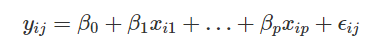

```{r setup, include = FALSE}
library(learnr)
library(tutorial.helpers)
library(tidyverse)
library(tidymodels)
library(tune)
library(ggrepel)
library(rstanarm)
library(tidyposterior)

tidymodels_prefer()

knitr::opts_chunk$set(echo = FALSE)
options(tutorial.exercise.timelimit = 60, 
        tutorial.storage = "local") 

data(ames)
ames <- mutate(ames, Sale_Price = log10(Sale_Price))

ames_split <- initial_split(ames, prop = 0.80, strata = Sale_Price)
ames_train <- training(ames_split)
ames_test  <-  testing(ames_split)

ames_rec <- 
  recipe(Sale_Price ~ Neighborhood + Gr_Liv_Area + Year_Built + Bldg_Type + 
           Latitude + Longitude, data = ames_train) %>%
  step_log(Gr_Liv_Area, base = 10) %>% 
  step_other(Neighborhood, threshold = 0.01) %>% 
  step_dummy(all_nominal_predictors()) %>% 
  step_interact( ~ Gr_Liv_Area:starts_with("Bldg_Type_") ) %>% 
  step_ns(Latitude, Longitude, deg_free = 20)
  
lm_model <- 
  linear_reg() |>
  set_engine("lm")

lm_wflow <- 
  workflow() |> 
  add_model(lm_model) |>
  add_recipe(ames_rec)

lm_fit <- fit(lm_wflow, ames_train)

rf_model <- 
  rand_forest(trees = 1000) %>% 
  set_engine("ranger") %>% 
  set_mode("regression")

rf_wflow <- 
  workflow() %>% 
  add_formula(
    Sale_Price ~ Neighborhood + Gr_Liv_Area + Year_Built + Bldg_Type + 
      Latitude + Longitude) %>% 
  add_model(rf_model) 

set.seed(1001)
ames_folds <- vfold_cv(ames_train, v = 10)

keep_pred <- control_resamples(save_pred = TRUE, save_workflow = TRUE)

set.seed(1003)
rf_res <- rf_wflow %>% fit_resamples(resamples = ames_folds, control = keep_pred)

basic_rec <- recipe(Sale_Price ~ Neighborhood + Gr_Liv_Area + Year_Built + Bldg_Type + Latitude + Longitude, data = ames_train) |>
  step_log(Gr_Liv_Area, base = 10) |>
  step_other(Neighborhood, threshold = 0.01) |>
  step_dummy(all_nominal_predictors())

interaction_rec <- 
  basic_rec |>
  step_interact( ~ Gr_Liv_Area:starts_with("Bldg_Type_") ) 

spline_rec <- 
  interaction_rec |> 
  step_ns(Latitude, Longitude, deg_free = 50)

preproc <- 
  list(basic = basic_rec, 
       interact = interaction_rec, 
       splines = spline_rec
  )

lm_models <- workflow_set(preproc, list(lm = linear_reg()), cross = FALSE)

lm_models <- 
  lm_models |>
  workflow_map("fit_resamples", 
               seed = 1101, 
               verbose = TRUE,
               resamples = ames_folds, 
               control = keep_pred)

four_models <- 
  as_workflow_set(random_forest = rf_res) |> 
  bind_rows(lm_models)

rsq_indiv_estimates <- 
  collect_metrics(four_models, summarize = FALSE) |> 
  filter(.metric == "rsq")

rsq_wider <-
  rsq_indiv_estimates |>
  select(wflow_id, .estimate, id) |>
  pivot_wider(id_cols = "id", names_from = "wflow_id", values_from = ".estimate")

rsq_anova <- perf_mod(four_models,
         metric = "rsq",
         prior_intercept = rstanarm::student_t(df = 1),
         chains = 4,
         iter = 5000,
         seed = 1102,
         )

model_post <-
  rsq_anova |>
  tidy(seed = 1103)

rqs_diff <-
  contrast_models(rsq_anova,
                  list_1 = "splines_lm",
                  list_2 = "basic_lm",
                  seed = 1104)
```

```{r copy-code-chunk, child = system.file("child_documents/copy_button.Rmd", package = "tutorial.helpers")}
```

```{r info-section, child = system.file("child_documents/info_section.Rmd", package = "tutorial.helpers")}
```

## Introduction
### 

This tutorial covers [Chapter 11: Comparing Models with Resampling](https://www.tmwr.org/compare.html#workflow-set) from [*Tidy Modeling with R*](https://www.tmwr.org/) by Max Kuhn and Julia Silge. In this tutorial, we’ll first demonstrate how workflow sets can be used to fit multiple models. Then, we’ll discuss important aspects of re-sampling statistics. Finally, we’ll look at how to formally compare models (using either hypothesis testing or a Bayesian approach).


## Creating Mulitple Models with Workflow Sets
### 

Once we create two or more models, the next step is to compare them to understand which one is best. In some cases, comparisons might be within-model, where the same model might be evaluated with different features or preprocessing methods. Alternatively, between-model comparisons, such as when we compared linear regression and random forest models are the more common scenario.

### Exercise 1

Load the library **tidymodels** using `library()`.

```{r creating-mulitple-mo-1, exercise = TRUE}

```

```{r creating-mulitple-mo-1-hint-1, eval = FALSE}
library(...)
```

```{r include = FALSE}
library(tidymodels)
```

### 

To demonstrate more with workflow sets, let’s create three different linear models that add these preprocessing steps incrementally; we can test whether these additional terms improve the model results. 

### Exercise 2

We have seen similar recipes in the previous tutorial, but lets create them again for good practice. Within `recipe()`, add the parameters `Sale_Price ~ Neighborhood + Gr_Liv_Area + Year_Built + Bldg_Type + Latitude + Longitude` and `data = ames_train`.

```{r creating-mulitple-mo-2, exercise = TRUE}

```

```{r creating-mulitple-mo-2-hint-1, eval = FALSE}
...(Sale_Price ~ Neighborhood + Gr_Liv_Area + Year_Built + Bldg_Type + Latitude + Longitude, data = ames_train)
```

```{r include = FALSE}
recipe(Sale_Price ~ Neighborhood + Gr_Liv_Area + Year_Built + Bldg_Type + Latitude + Longitude, data = ames_train)
```

### 

The `recipe()` function is part of the recipes package, which is used for creating pre-processing and feature engineering pipelines for machine learning models. It allows you to define a series of data pre-processing steps to be applied to your data before training a model.

### Exercise 3

Copy the previous code. Pipe it to the `step_log()` function. Add the parameters `Gr_Live_Area` and `base = 10`.

```{r creating-mulitple-mo-3, exercise = TRUE}

```

<button onclick = "transfer_code(this)">Copy previous code</button>

```{r creating-mulitple-mo-3-hint-1, eval = FALSE}
... |>
  step_log(..., base = ...)
```

```{r include = FALSE}
recipe(Sale_Price ~ Neighborhood + Gr_Liv_Area + Year_Built + Bldg_Type + Latitude + Longitude, data = ames_train) |>
  step_log(Gr_Liv_Area, base = 10)

```

### 

The `step_log()` function is used to apply the natural logarithm transformation to specified numeric variables in the data set. This transformation can be helpful when dealing with data that has a right-skewed distribution, as taking the logarithm can make the distribution more symmetric.

### Exercise 4

Copy the previous code and pipe it to  `step_other()`. Add the parameters `Neighborhood` and `threshold = 0.01`. 

```{r creating-mulitple-mo-4, exercise = TRUE}

```

<button onclick = "transfer_code(this)">Copy previous code</button>

```{r creating-mulitple-mo-4-hint-1, eval = FALSE}
... |> 
  step_other(Neighborhood, threshold = 0.01)
```

```{r include = FALSE}
recipe(Sale_Price ~ Neighborhood + Gr_Liv_Area + Year_Built + Bldg_Type + Latitude + Longitude, data = ames_train) |>
  step_log(Gr_Liv_Area, base = 10) |>
  step_other(Neighborhood, threshold = 0.01)
```

### 

`step_other()` creates a specification of a **recipe** step that will potentially pool infrequently occurring values into an "other" category.

### Exercise 5

Copy the previous code and pipe it to `step_dummy()`. Add the parameters `all_nominal_predictors()`. Then, set the entire expression to `basic_rec` using `<-`.

```{r creating-mulitple-mo-5, exercise = TRUE}

```

<button onclick = "transfer_code(this)">Copy previous code</button>

```{r creating-mulitple-mo-5-hint-1, eval = FALSE}
basic_rec <- ... |>
  step_dummy(...())
```

```{r include = FALSE}
basic_rec <- recipe(Sale_Price ~ Neighborhood + Gr_Liv_Area + Year_Built + Bldg_Type + Latitude + Longitude, data = ames_train) |>
  step_log(Gr_Liv_Area, base = 10) |>
  step_other(Neighborhood, threshold = 0.01) |>
  step_dummy(all_nominal_predictors())
```

### 

`step_dummy()` will create a set of binary dummy variables from a factor variable. For example, if an unordered factor column in the data set has levels of "red", "green", "blue", the dummy variable bake will create two additional columns of 0/1 data for two of those three values (and remove the original column).

### Exercise 6

Now we will create an interaction using `step_interact()`. Pipe `basic_rec` to `step_interact()`. Add the parameter `~ Gr_Liv_Area:starts_with("Bldg_Type_")`. Save this entire expression to `interaction_rec`.

```{r creating-mulitple-mo-6, exercise = TRUE}

```

```{r creating-mulitple-mo-6-hint-1, eval = FALSE}
interaction_rec <- 
  ... |>
  ...(~ Gr_Liv_Area:starts_with("Bldg_Type_"))
```

```{r include = FALSE}
interaction_rec <- 
  basic_rec |>
  step_interact(~ Gr_Liv_Area:starts_with("Bldg_Type_"))
```

### 

`step_interact()` can create interactions between variables. It is primarily intended for numeric data; categorical variables should probably be converted to dummy variables using `step_dummy()` prior to being used for interactions.

### Exercise 7

Pipe `interaction_rec` to `step_ns()`. Add the parameters `Latitude, Longitude, deg_free = 50`. Then, set the entire expression to `spline_rec` using `<-`.

```{r creating-mulitple-mo-7, exercise = TRUE}

```

```{r creating-mulitple-mo-7-hint-1, eval = FALSE}
spline_rec <- 
  ... |> 
  ...(Latitude, Longitude, deg_free = 50)
```

```{r include = FALSE}
spline_rec <- 
  interaction_rec |>
  step_ns(Latitude, Longitude, deg_free = 50)
```

### 

Spline is a special function defined piece-wise by polynomials. The term “spline” is used to refer to a wide class of functions that are used in applications requiring data interpolation and/or smoothing. 

### Exercise 8

Now we will create the pre-processor using a list. Create a list with the three previous variables created in the previous exercises and set them equal to `basic`, `interact`, and `splines`. Set the entire expression to `preproc`.

```{r creating-mulitple-mo-8, exercise = TRUE}

```

```{r creating-mulitple-mo-8-hint-1, eval = FALSE}
... <- 
  list(basic = basic_rec,
       interact = ...,
       splines = spline_rec)
```

```{r include = FALSE}
preproc <- 
  list(basic = basic_rec,
       interact = interaction_rec,
       splines = spline_rec)
```

### 

`linear_reg()` is a function from the parsnip package, which is used for modeling linear regression. The **parsnip** package provides a consistent interface for specifying machine learning models, making it easy to interchange between different model implementations in R.

### Exercise 9

Now lets create a workflow set of the pre-processor we created. Within `workflow_set()`, add the parameters `preproc`, the model `list(lm = linear_reg())`, and `cross = FALSE`. Set the entire expression to `lm_models` using `<-`. Run `lm_models` to view the set.

```{r creating-mulitple-mo-9, exercise = TRUE}

```

```{r creating-mulitple-mo-9-hint-1, eval = FALSE}
lm_models <- ...(preproc, list(lm = linear_reg()), ... = FALSE)
```

```{r include = FALSE}
lm_models <- workflow_set(preproc, list(lm = linear_reg()), cross = FALSE)

lm_models
```

### 

`workflow_map()` will execute the same function across the workflows in the set.

### Exercise 10

We will use a workflow map to resample the linear models created in the previous exercise. Pipe `lm_models` to `workflow_map()` and add the parameter `"fit_resamples"`.

```{r creating-mulitple-mo-10, exercise = TRUE}

```

<button onclick = "transfer_code(this)">Copy previous code</button>

```{r creating-mulitple-mo-10-hint-1, eval = FALSE}
lm_models |>
  ...("...")
```

```{r include = FALSE}
lm_models |>
  workflow_map("fit_resamples")
```

### 

We also set a `verbose` argument that will print the progress as well as a `seed` argument that makes sure that each model uses the same random number stream as the others.

### Exercise 11

Copy the previous code and add the parameters `seed = 1101` and `verbose = TRUE` to the 

```{r creating-mulitple-mo-11, exercise = TRUE}

```

<button onclick = "transfer_code(this)">Copy previous code</button>

```{r creating-mulitple-mo-11-hint-1, eval = FALSE}

```

```{r include = FALSE}
lm_models |>
  workflow_map("fit_resamples",
               seed = 1101,
               verbose = TRUE)
```

### 

You might see that there is an error message that is prompted after running this code. This is because the `resamples` and `control` parameters are missing.

### Exercise 12

Copy the previous code and add the parameters `resamples = ames_folds` and `control = keep_pred`. Then, set the entire expression to `lm_models` and run it on the next line.

```{r creating-mulitple-mo-12, exercise = TRUE}

```

<button onclick = "transfer_code(this)">Copy previous code</button>

```{r creating-mulitple-mo-12-hint-1, eval = FALSE}
... <- 
  lm_models |>
  workflow_map("fit_resamples", 
               seed = ..., 
               verbose = ...,
               ... = ames_folds, 
               control = ...)
```

```{r include = FALSE}
lm_models <- 
  lm_models |>
  workflow_map("fit_resamples", 
               seed = 1101, 
               verbose = TRUE,
               resamples = ames_folds, 
               control = keep_pred)

lm_models
```

### 

Notice that the `option` and `result` columns are now populated. The former includes the options to `fit_resamples()` that were given (for reproducibility), and the latter column contains the results produced by `fit_resamples()`.

### Exercise 13

There are a few convenience functions for workflow sets, including collect_metrics() to collate the performance statistics. Within `collect_metrics()`, add the parameter `lm_models`. 

```{r creating-mulitple-mo-13, exercise = TRUE}

```

```{r creating-mulitple-mo-13-hint-1, eval = FALSE}
collect_metrics(...)
```

```{r include = FALSE}
collect_metrics(lm_models)
```

### 

For `collect_metrics()`, when unsummarized, there are columns for each tuning parameter (using the `id` from `tune()`, if any). `collect_metrics(`) also has columns `.metric`, and `.estimator`.

### Exercise 14

Now we need to filter by the metric of Root Mean Squared Error (RMSE). Copy the previous code and pipe it to `filter()`. Add the parameter `.metric == "rmse"`.

```{r creating-mulitple-mo-14, exercise = TRUE}

```

<button onclick = "transfer_code(this)">Copy previous code</button>

```{r creating-mulitple-mo-14-hint-1, eval = FALSE}
... |>
  filter(.metric == "...")
```

```{r include = FALSE}
collect_metrics(lm_models) |>
  filter(.metric == "rmse")
```

### 

A Random Forest model is an ensemble learning method used for both classification and regression tasks in machine learning. It is based on the idea of combining multiple decision trees to make more accurate and robust predictions.

### Exercise 15

We will be using `as_workflow_set()` to change the random forest model created in a previous tutorial to a workflow set and then binding the rows. Within `as_workflow_set()`, add the parameter `random_forest`, setting it equal to `rf_res`.

```{r creating-mulitple-mo-15, exercise = TRUE}

```

```{r creating-mulitple-mo-15-hint-1, eval = FALSE}
as_workflow_set(random_fores = ...)
```

```{r include = FALSE}
as_workflow_set(random_fores = rf_res)
```

### 

`as_workflow_set()` uses existing objects to create a workflow set. A list of objects that are either simple workflows or objects that have class "tune_results" can be converted into a workflow set.

### Exercise 16

Copy the previous code and pipe it to `bind_rows()`. Add the parameter `lm_models` and set the entire expression to `four_models` using `<-`. Run `four_models` on the next line.

```{r creating-mulitple-mo-16, exercise = TRUE}

```

<button onclick = "transfer_code(this)">Copy previous code</button>

```{r creating-mulitple-mo-16-hint-1, eval = FALSE}
four_models <-
  ... |> 
  bind_rows(lm_models)
```

```{r include = FALSE}
four_models <- 
  as_workflow_set(random_forest = rf_res) |> 
  bind_rows(lm_models)

four_models
```

### 

In R, `bind_rows()` is a function from the **dplyr** package, which is part of the **tidyverse**. It is used to combine multiple data frames vertically (i.e., row-wise). It is particularly useful when you have multiple data frames with the same columns and want to stack them on top of each other.

### Exercise 17

Now lets `autoplot()` the four models. Pipe `four_models` to `autoplot()` and add the parameter `metric = "rsq"`. (R-Squared)

```{r creating-mulitple-mo-17, exercise = TRUE}

```

```{r creating-mulitple-mo-17-hint-1, eval = FALSE}
... |>
  autoplot(metric = "...")
```

```{r include = FALSE}
four_models |>
  autoplot(metric = "rsq")
```

### 

`geom_text_repel()` is a function provided by the **ggrepel** package, an extension to **ggplot2**. It is used to add text labels to a plot in a way that automatically avoids overlapping with other data points or labels, making the text labels more readable and visually appealing.


### Exercise 18

Copy the previous code and add `geom_text_repel()`. Within aes() of `geom_text_repel()`, set `label` to `wflow_id`.

```{r creating-mulitple-mo-18, exercise = TRUE}

```

<button onclick = "transfer_code(this)">Copy previous code</button>

```{r creating-mulitple-mo-18-hint-1, eval = FALSE}
... +
  geom_text_repel(aes(label = ...))
```

```{r include = FALSE}
four_models |>
  autoplot(metric = "rsq") +
    geom_text_repel(aes(label = wflow_id))
```

### 

The coefficient of determination, often denoted as R-squared (R²), is a statistical measure that represents the proportion of the variance in the dependent variable (target) that is predictable from the independent variables (predictors) in a regression model.

### Exercise 19

Copy the previous code and add `nudge_x` and `nudge_y` (outside of `aes()`), setting them equal to `1/8` and `1/100` respectfully.

```{r creating-mulitple-mo-19, exercise = TRUE}

```

<button onclick = "transfer_code(this)">Copy previous code</button>

```{r creating-mulitple-mo-19-hint-1, eval = FALSE}
... +
  geom_text_repel(aes(label = wflow_id), nudge_x = ..., nudge_y = ...)
```

```{r include = FALSE}
four_models |>
  autoplot(metric = "rsq") +
    geom_text_repel(
      aes(label = wflow_id), 
      nudge_x = 1/8, 
      nudge_y = 1/100) 
```

### 

`nudge_x` and `nudge_y` are parameters that can be used to move graphical elements (points, text labels, etc.) horizontally (`nudge_x`) or vertically (`nudge_y`) from their original positions.

### Exercise 20

Copy the previous code and add `theme_classic()`. Then add `theme()` and set the parameter `legend.position` to "none".

```{r creating-mulitple-mo-20, exercise = TRUE}

```

<button onclick = "transfer_code(this)">Copy previous code</button>

```{r creating-mulitple-mo-20-hint-1, eval = FALSE}
... +
  theme_classic() +
  theme(... = "none")
```

```{r include = FALSE}
four_models |>
  autoplot(metric = "rsq") +
    geom_text_repel(
      aes(label = wflow_id), 
      nudge_x = 1/8, 
      nudge_y = 1/100) +
    theme_classic() +
    theme(legend.position = "none")
```

### 

From this plot of R2 confidence intervals, we can see that the random forest method is doing the best job and there are minor improvements in the linear models as we add more recipe steps.

Now that we have 10 re-sampled performance estimates for each of the four models, these summary statistics can be used to make between-model comparisons.

### 

Great Job! You now know how to create multiple models using workflow sets by using functions such as `recipe()`, `workflow_sets()`, `as_workflow_sets()`, random forest model, etc.

## Comparing Resampled Performance statistics
### 

Considering the preceding results for the three linear models, it appears that the additional terms do not profoundly improve the mean RMSE or R2 statistics for the linear models. The difference is small, but it might be larger than the experimental noise in the system, i.e., considered statistically significant. We can formally test the hypothesis that the additional terms increase R2. In other words, there are some re-samples where performance across models tends to be low and others where it tends to be high. In statistics, this is called a resample-to-resample component of variation.

### Exercise 1

We will focus on the R2 statistic for each model, which measures correlation between the observed and predicted sale prices for each house. Let’s `filter()` to keep only the R2 metrics, reshape the results, and compute how the metrics are correlated with each other.

Within `collect_metrics()`, add the parameters `four_models` and `summarize = FALSE`.

```{r comparing-resampled--1, exercise = TRUE}

```

```{r comparing-resampled--1-hint-1, eval = FALSE}
collect_metrics(four_models, ... = FALSE)
```

```{r include = FALSE}
collect_metrics(four_models, summarize = FALSE)
```

### 

Before making between-model comparisons, it is important for us to discuss the within-resample correlation for resampling statistics. Each model was measured with the same cross-validation folds, and results for the same resample tend to be similar.

### Exercise 2

Now we need to filter the previous code by `rsq` using the `filter()` function. Copy the previous code and pipe it to `filter()`, with the parameter being `.metric == "rsq"`. Then, set the entire expression equal to `rsq_indiv_estimates`.

```{r comparing-resampled--2, exercise = TRUE}

```

<button onclick = "transfer_code(this)">Copy previous code</button>

```{r comparing-resampled--2-hint-1, eval = FALSE}
rsq_indiv_estimates <- 
  ... |>
  filter( .metric = "...")
```

```{r include = FALSE}
rsq_indiv_estimates <- 
  collect_metrics(four_models, summarize = FALSE) |> 
  filter(.metric == "rsq")
```

### 

`pivot_wider()` is a powerful data transformation function in R, provided by the **tidyr** package. It is used to reshape data from a "long" format to a "wide" format, making it easier to work with and analyze.

### Exercise 3

Pipe `rsq_indiv_estimates` to `select()`, with the three parameters being `wflow_id, .estimate, id`.

```{r comparing-resampled--3, exercise = TRUE}

```

```{r comparing-resampled--3-hint-1, eval = FALSE}
rsq_indiv_estimates |>
  select(..., .estimate, ...)
```

```{r include = FALSE}
rsq_indiv_estimates |>
  select(wflow_id, .estimate, id)
```

### 

The `tidy()` function in broom is typically used to tidy the results of model fitting functions. It takes the model object as input and returns a tidy data frame containing the model's coefficients, standard errors, p-values, and other relevant information.

### Exercise 4

Copy the previous code and pipe it to the function `pivot_wider()`. Add the parameter `id_cols = "id"`.

```{r comparing-resampled--4, exercise = TRUE}

```

<button onclick = "transfer_code(this)">Copy previous code</button>

```{r comparing-resampled--4-hint-1, eval = FALSE}
.. |>
  pivot_wider(id_cols = "...")
```

```{r include = FALSE}
# rsq_indiv_estimates |>
#   select(wflow_id, .estimate, id) |>
#   pivot_wider(id_cols = "id")
```

### 

The `correlate()` function is part of the **corrr** package and provides an easy way to compute various correlation coefficients between columns of a data frame.

### Exercise 5

Copy the previous code and add the parameters `names_from = "wflow_id"` and `values_from = ".estimate"`. Then, set the entire expression to `rsq_wider` using `<-`.

```{r comparing-resampled--5, exercise = TRUE}

```

<button onclick = "transfer_code(this)">Copy previous code</button>

```{r comparing-resampled--5-hint-1, eval = FALSE}
rsq_wider <- 
  ... |>
  pivot_wider(id_cols = "id", names_from = "wflow_id", values_from = ".estimate")
```

```{r include = FALSE}
rsq_wider <-
  rsq_indiv_estimates |>
  select(wflow_id, .estimate, id) |>
  pivot_wider(id_cols = "id", names_from = "wflow_id", values_from = ".estimate")
```

### 

The **corrr** package provides functions to compute and visualize correlations with enhanced capabilities compared to base R. It allows for the easy calculation of correlation matrices, partial correlations, and various correlation coefficients.

### Exercise 6

We will use the `correlate()` function to compute calculation across selected columns. Within `corrr::correlate()`, add the parameter `rsq_wider`. Then pipe it to `select(-id)`

```{r comparing-resampled--6, exercise = TRUE}

```

```{r comparing-resampled--6-hint-1, eval = FALSE}
corrr::correlate(rsq_wider, quiet = TRUE) |>
  select(-id)
```

```{r include = FALSE}
#corrr::correlate(rsq_wider, quiet = TRUE) |>
  #select(-id)
```

### 

`geom_line()` is one of the "geoms" or geometric objects that you can add to the plot to display data points connected by lines. It is commonly used to visualize trends over time or to show the relationship between two continuous variables.

### Exercise 7

We will the be plotting `rsq_indiv_estimates`. Type `rsq_indiv_estimates` to get a sense of the data we are looking at.

```{r comparing-resampled--7, exercise = TRUE}

```

```{r comparing-resampled--7-hint-1, eval = FALSE}
rsq_indiv_estimates
```

```{r include = FALSE}
rsq_indiv_estimates
```

### 

`reorder()` is a function in the R programming language that allows you to reorder the levels of a factor based on the values of a specific variable. It is commonly used to control the order of categories in plots and tables, especially when you want to arrange the categories based on some specific criteria, such as their frequencies or their means.

### Exercise 8

Copy the previous code and pipe it to `mutate()`. Add the parameter `wflow_id = reorder(wflow_id, .estimate)`.

```{r comparing-resampled--8, exercise = TRUE}

```

<button onclick = "transfer_code(this)">Copy previous code</button>

```{r comparing-resampled--8-hint-1, eval = FALSE}

```

```{r include = FALSE}
rsq_indiv_estimates |> 
  mutate(wflow_id = reorder(wflow_id, .estimate))
```

### 

<!-- PK: Knowledge Drop -->

### Exercise 9

Copy the previous code and pipe it to `ggplot()`. Within `aes()` of `ggplot()`, set `x = wflow_id`, `y = .estimate`.

```{r comparing-resampled--9, exercise = TRUE}

```

<button onclick = "transfer_code(this)">Copy previous code</button>

```{r comparing-resampled--9-hint-1, eval = FALSE}
... |>
  ...(aes(x = ..., y = .estimate))
```

```{r include = FALSE}
rsq_indiv_estimates |>
  mutate(wflow_id = reorder(wflow_id, .estimate)) |>
  ggplot(aes(x = wflow_id, y = .estimate))
```

### 

<!-- PK: Knowledge Drop -->

### Exercise 10

Copy the previous code and add `geom_line()`. Add the parameters `alpha` and `linewidth`, equaling `.5` and `1.25` respectfully.

```{r comparing-resampled--10, exercise = TRUE}

```

<button onclick = "transfer_code(this)">Copy previous code</button>

```{r comparing-resampled--10-hint-1, eval = FALSE}
... |>
  geom_line(alpha = ..., linewidth = ...)
```

```{r include = FALSE}
rsq_indiv_estimates |>
  mutate(wflow_id = reorder(wflow_id, .estimate)) |>
  ggplot(aes(x = wflow_id, y = .estimate)) +
    geom_line(alpha = 0.5, linewidth = 1.25)
```

### 

<!-- PK: Knowledge Drop -->

### Exercise 11

Finally, let's add the theme to the graph using `theme()`. Within `theme()`, add the parameter `legend.position` and set it to `"none"`.

```{r comparing-resampled--11, exercise = TRUE}

```

<button onclick = "transfer_code(this)">Copy previous code</button>

```{r comparing-resampled--11-hint-1, eval = FALSE}
... |>
  theme(legend.position = "...")
```

```{r include = FALSE}
rsq_indiv_estimates |>
  mutate(wflow_id = reorder(wflow_id, .estimate)) |>
  ggplot(aes(x = wflow_id, y = .estimate)) +
    geom_line(alpha = 0.5, linewidth = 1.25) +
    theme(legend.position = "none")
```

### 

If the resample-to-resample effect was not real, there would not be any parallel lines. A statistical test for the correlations evaluates whether the magnitudes of these correlations are not simply noise. 

### Exercise 12

We will have to see if the correlations are real. Let's look at `rsq_wider` by typing it below. 

```{r comparing-resampled--12, exercise = TRUE}

```

```{r comparing-resampled--12-hint-1, eval = FALSE}
rsq_wider
```

```{r include = FALSE}
rsq_wider
```

### 

`cor.test()` is a function used to perform a hypothesis test on the correlation coefficient between two continuous variables. This test helps you determine whether there is a statistically significant linear relationship between the two variables.

### Exercise 13

We will be using the `with()` function to extract the columns from `rsq_wider`. Copy the previous code and pipe it to `with()`. Within the function, use `cor.with()` and add the parameters `basic_lm, splines_lm`.

```{r comparing-resampled--13, exercise = TRUE}

```

<button onclick = "transfer_code(this)">Copy previous code</button>

```{r comparing-resampled--13-hint-1, eval = FALSE}
... |>
  with(...(basic_lm, ...))
```

```{r include = FALSE}
rsq_wider |>
  with(cor.test(basic_lm, splines_lm))
```

### 

`starts_with()` is a function provided by the **dplyr** package in R, which is a popular package for data manipulation and transformation. It is used to select columns from a data frame that have names starting with a specified prefix.

### Exercise 14

Copy the previous code and pipe to `tidy()`. Hit "Run Code".

```{r comparing-resampled--14, exercise = TRUE}

```

<button onclick = "transfer_code(this)">Copy previous code</button>

```{r comparing-resampled--14-hint-1, eval = FALSE}
... |>
  ...()
```

```{r include = FALSE}
rsq_wider |>
  with(cor.test(basic_lm, splines_lm)) |>
  tidy()
```

### 

The formula for calculating the variance of the difference between two independent random variables can be derived based on the properties of variances and co-variances.

Var(Z) = Var(X) + Var(Y) - 2 * Cov(X, Y)

X: Independent Variable
Y: Dependent Variable
Z: difference of variance between X-Y

### Exercise 15

Copy the previous code and pipe it to `select()`. Select `estimate` and `starts_with("conf")`.

```{r comparing-resampled--15, exercise = TRUE}

```

<button onclick = "transfer_code(this)">Copy previous code</button>

```{r comparing-resampled--15-hint-1, eval = FALSE}
... |>
  select(..., starts_with("conf"))
```

```{r include = FALSE}
rsq_wider |>
  with(cor.test(basic_lm, splines_lm)) |>
  tidy() |>
  select(estimate, starts_with("conf"))
```

### 

The results of the correlation test (the estimate of the correlation and the confidence intervals) show us that the within-resample correlation appears to be real.

Great Job! You now have successfully compared resample performance statistics.

## Simple Hypothesis Testing Methods
### 

We can use simple hypothesis testing to make formal comparisons between models.

```{r}
# img <- 
# img
```

Hypothesis tests and p-values are generated to statistically compare models, but we must contend with how to handle the resample-to-resample effect. A simple and fast method for comparing two models at a time is to use the differences in  R2 values as the outcome data in the ANOVA model. Since the outcomes are matched by resample, the differences do not contain the resample-to-resample effect and, for this reason, the standard analysis of variance (ANOVA) model is appropriate. To illustrate, this call to lm() tests the difference between two of the linear regression models.

### Exercise 1

Pipe `rsq_wider` to `with()`. Add the parameter `t.test()`, with the parameters being `splines_lm, basic_lm, paired = TRUE`.

```{r simple-hypothesis-te-1, exercise = TRUE}

```

```{r simple-hypothesis-te-1-hint-1, eval = FALSE}
rsq_wider |>
  with(...(splines_lm, ..., paired = ...))
```

```{r include = FALSE}
rsq_wider |>
  with(t.test(splines_lm, basic_lm, paired = TRUE))
```

### 

Treating the resamples as random effects is theoretically appealing. Methods for fitting an ANOVA model with this type of random effect could include the linear mixed model [Faraway 2016](https://www.tmwr.org/compare.html#ref-faraway2016extending) or a Bayesian hierarchical model (shown in the next section).

### Exercise 2

Copy the previous code and pipe it to`tidy()`. Hit "Run Code".

```{r simple-hypothesis-te-2, exercise = TRUE}

```

<button onclick = "transfer_code(this)">Copy previous code</button>

```{r simple-hypothesis-te-2-hint-1, eval = FALSE}
... |>
  ...()
```

```{r include = FALSE}
rsq_wider |>
  with(t.test(splines_lm, basic_lm, paired = TRUE)) |>
  tidy()
```

### 

Historically, the resample groups from the ANOVA model would be considered a *block effect* and an appropriate term was added to the model. Alternatively, the resample effect could be considered a *random effect* where these particular resamples were drawn at random from a larger population of possible resamples. 

### Exercise 3

Copy the previous code and pipe it to `select()`. Add the parameters `estimate`, `p.value`, and `starts_with("conf")`.

```{r simple-hypothesis-te-3, exercise = TRUE}

```

<button onclick = "transfer_code(this)">Copy previous code</button>

```{r simple-hypothesis-te-3-hint-1, eval = FALSE}

```

```{r include = FALSE}
rsq_wider |>
  with(t.test(splines_lm, basic_lm, paired = TRUE)) |>
  tidy() |>
  select(estimate, p.value, starts_with("conf"))
```

### 

Note that the p-value indicates a statistically significant signal; the collection of spline terms for longitude and latitude do appear to have an effect.

Great Job! You now know how to calculate simple hypothesis models using linear models and analysis of variance (ANOVA).

## Bayesian Methods
We just used hypothesis testing to formally compare models, but we can also take a more general approach to making these formal comparisons using random effects and Bayesian statistics [McElreath 2020](https://www.tmwr.org/compare.html#ref-mcelreath2020statistical). While the model is more complex than the ANOVA method, the interpretation is more simple and straight-forward than the p-value approach.

### Exercise 1

We will be using `perf_mod()`. Add the parameter `four_models`.

```{r bayesian-methods-1, exercise = TRUE}

```

<button onclick = "transfer_code(this)">Copy previous code</button>

```{r bayesian-methods-1-hint-1, eval = FALSE}
perf_mod(...)
```

```{r include = FALSE}
perf_mod(four_models)
```

### 

From any of these types of objects, the `perf_mod()` function determines an appropriate Bayesian model and fits it with the resampling statistics. For our example, it will model the four sets of R2 statistics associated with the workflows.

### Exercise 2

Copy the previous code. Add the parameter `metric` and set it equal to `"rsq"`, as we need to define the metric used for the model.

```{r bayesian-methods-2, exercise = TRUE}

```

<button onclick = "transfer_code(this)">Copy previous code</button>

```{r bayesian-methods-2-hint-1, eval = FALSE}
perf_mod(four_models,
         metric = "..."
)
```

```{r include = FALSE}
perf_mod(four_models,
         metric = "rsq"
)
```

### 

If one of the workflows in the set had data on tuning parameters, the best tuning parameters set for each workflow is used in the Bayesian analysis. In other words, despite the presence of tuning parameters, `perf_mod()` focuses on making *between-workflow comparisons*.

### Exercise 3

Copy the previous code and the parameters, `prior_intercept`, setting it equal to the **rstanarm** function `student_t()`, with the parameter being `df = 1`. Use `::` to get the function from **rstanarm**.

```{r bayesian-methods-3, exercise = TRUE}

```

<button onclick = "transfer_code(this)">Copy previous code</button>

```{r bayesian-methods-3-hint-1, eval = FALSE}

```

```{r include = FALSE}
perf_mod(four_models,
         metric = "rsq",
         prior_intercept = rstanarm::student_t(df = 1)
         )
```

### 

`perf_mod()` makes *within-model comparisons*. In this situation, the grouping variables tested in the Bayesian ANOVA model are the submodels defined by the tuning parameters.

### Exercise 4

copy the previous code and add the parameter `chains, iter, seed`, setting them equal to `4, 5000, 1102`, respectfully. Then, set the entire expression to `rsq_anova`.

```{r bayesian-methods-4, exercise = TRUE}

```

<button onclick = "transfer_code(this)">Copy previous code</button>

```{r bayesian-methods-4-hint-1, eval = FALSE}
.. |>
  (...,
   chains = ...,
   iter = 5000,
   seed = ...)
```

```{r include = FALSE}
rsq_anova <- perf_mod(four_models,
         metric = "rsq",
         prior_intercept = rstanarm::student_t(df = 1),
         chains = 4,
         iter = 5000,
         seed = 1102,
         )
```

### 

The resulting object has information on the resampling process as well as the Stan object embedded within (in an element called stan). We are most interested in the posterior distributions of the regression parameters.

### Exercise 5

We will `tidy()` to extract the posterior distributions into a tibble. Pipe `rsq_anova` to `tidy()`. Add the parameter `seed = 1103`. Then, set the entire expression to `model_post` using `<-`.

```{r bayesian-methods-5, exercise = TRUE}

```

```{r bayesian-methods-5-hint-1, eval = FALSE}
model_post <-
  rsq_anova |>
  ...(seed = ...)
```

```{r include = FALSE}
model_post <-
  rsq_anova |>
  tidy(seed = 1103)
```

### 

The `perf_mod()` function can also take a data frame produced by **rsample** that has columns of performance metrics associated with two or more model/workflow results. These could have been generated by nonstandard means.

### Exercise 6

Now let's graph the four posterior distributions retreived and stored in `model_post`. Pipe `model_post` to `mutate()`, adding the parameters `model = forcats::fct_inorder(model)`

```{r bayesian-methods-6, exercise = TRUE}

```

<button onclick = "transfer_code(this)">Copy previous code</button>

```{r bayesian-methods-6-hint-1, eval = FALSE}
model_post |>
  mutate(... = forcats::fct_inorder(...))
```

```{r include = FALSE}
model_post |> 
  mutate(model = forcats::fct_inorder(model))
```

### 

The **forcats** package focuses specifically on working with categorical (factor) variables in a data frame. It provides functions to help you manipulate, transform, and analyze categorical data efficiently.

### Exercise 7

Copy the previous code and pipe it to `ggplot()`. Within `aes()` of `ggplot()`, add the parameters `x`, setting it equal to `posterior`.

```{r bayesian-methods-7, exercise = TRUE}

```

<button onclick = "transfer_code(this)">Copy previous code</button>

```{r bayesian-methods-7-hint-1, eval = FALSE}
... |>
  ggplot(aes(x = ...))
```

```{r include = FALSE}
model_post |> 
  mutate(model = forcats::fct_inorder(model)) |>
  ggplot(aes(x = posterior))
```

### 

In R, a Stan object refers to a data structure that holds information related to a statistical model defined in the Stan programming language. Stan is a probabilistic programming language used for fitting Bayesian statistical models.

### Exercise 8

Copy the previous code and add `geom_histogram()` using `+`. First add the parameters `bins` and `alpha`, setting them equal to `50` and `0.4`, respectfully.

```{r bayesian-methods-8, exercise = TRUE}

```

<button onclick = "transfer_code(this)">Copy previous code</button>

```{r bayesian-methods-8-hint-1, eval = FALSE}
... +
  geom_histogram(bins = ..., alpha = 0.4)
```

```{r include = FALSE}
model_post |> 
  mutate(model = forcats::fct_inorder(model)) |>
  ggplot(aes(x = posterior)) +
  geom_histogram(bins = 50, alpha = 0.4)
```

### 

`geom_histogram()` is a function used in data visualization with the R programming language and the **ggplot2** package. It is used to create histograms, which are graphical representations of the distribution of a continuous variable.

### Exercise 9

Copy the previous code and add the parameters `color = "white"` and `fill = "blue"` to the histogram.

```{r bayesian-methods-9, exercise = TRUE}

```

<button onclick = "transfer_code(this)">Copy previous code</button>

```{r bayesian-methods-9-hint, eval = FALSE}
... |>
  geom_histogram(bins = 50, alpha = 0.4, color = "...", fill = "...")
```

```{r, include = FALSE}
model_post |> 
  mutate(model = forcats::fct_inorder(model)) |>
  ggplot(aes(x = posterior)) +
  geom_histogram(bins = 50, alpha = 0.4, color = "white", fill = "blue")
```

###

`facet_wrap()` is a function provided by the **ggplot2** package in R that allows you to create a grid of plots (facets) based on one or more categorical variables. The basic idea behind `facet_wrap()` is to split your data into different subsets based on one or more categorical variables, and then create a separate plot for each subset.


### Exercise 10

Copy the previous code and add `facet_wrap()`. Add the parameters `~ model` and `ncol = 1`.

```{r bayesian-methods-10, exercise = TRUE}

```

<button onclick = "transfer_code(this)">Copy previous code</button>

```{r bayesian-methods-10-hint, eval = FALSE}

```

```{r, include = FALSE}
model_post |> 
  mutate(model = forcats::fct_inorder(model)) |>
  ggplot(aes(x = posterior)) +
  geom_histogram(bins = 50, alpha = 0.4, color = "white", fill = "blue") +
  facet_wrap(~ model, ncol = 1)
```

###

There is also a basic `autoplot()` method for the model results, shown in Figure 11.4, as well as the tidied object that shows overlaid density plots.

### Exercise 11

Type `autoplot()`. Add the parameter `rsq_anova`.

```{r bayesian-methods-11, exercise = TRUE}

```

```{r bayesian-methods-11-hint, eval = FALSE}
autoplot(...)
```

```{r, include = FALSE}
autoplot(rsq_anova)
```

###

One wonderful aspect of using resampling with Bayesian models is that, once we have the posteriors for the parameters, it is trivial to get the posterior distributions for combinations of the parameters.

### Exercise 12

Copy the previous code and add `geom_text_repel()`. Within the `aes()` of `geom_text_repel()`, add `label = workflow`.

```{r bayesian-methods-12, exercise = TRUE}

```

<button onclick = "transfer_code(this)">Copy previous code</button>

```{r bayesian-methods-12-hint, eval = FALSE}

```

```{r, include = FALSE}
autoplot(rsq_anova) +
  geom_text_repel(aes(label = workflow))
```

###

Note that the regression parameters have a pretty wide prior distribution, with a standard deviation of 10. In many cases, we might not have a strong opinion about the prior beyond it being symmetric and bell shaped.

### Exercise 13

Copy the previous code and add the parameters `nudge_x` and `nudge_y` outside of `aes()`, setting them equal to `1/8` and `1/100`, respectfully.

```{r bayesian-methods-13, exercise = TRUE}

```

<button onclick = "transfer_code(this)">Copy previous code</button>

```{r bayesian-methods-13-hint, eval = FALSE}
... +
  geom_text_repel(aes(label = workflow), nudge_x = ..., nudge_y = ...)
```

```{r, include = FALSE}
autoplot(rsq_anova) +
  geom_text_repel(aes(label = workflow), nudge_x = 1/8, nudge_y = 1/100) 
```

###

<!-- PK: Knowledge Drop -->

### Exercise 14

Copy the previous code and add `theme()`, with the parameter `legend.position`, setting it equal to `"none"`.

```{r bayesian-methods-14, exercise = TRUE}

```

<button onclick = "transfer_code(this)">Copy previous code</button>

```{r bayesian-methods-14-hint, eval = FALSE}
... +
  theme(... = "...")
```

```{r, include = FALSE}
autoplot(rsq_anova) +
  geom_text_repel(aes(label = workflow), nudge_x = 1/8, nudge_y = 1/100) +
  theme(legend.position = "none")
```

###

`contrast_models()` description: The posterior distributions created by perf_mod() can be used to obtain the posterior distribution of the difference(s) between models. One or more comparisons can be computed at the same time.

### Exercise 15

Type `contrast_models()`. Add the parameters `rsq_anova`, `list_1`, `list_2`, and `seed`. Set `list_1`, `list_2`, to `"splines_lm"` and `"basic_lm"`, respectfully. Set `seed` equal to `1104`. Then set the entire expression to `rqs_diff`.

```{r bayesian-methods-15, exercise = TRUE}

```

```{r bayesian-methods-15-hint, eval = FALSE}
rqs_diff <-
  contrast_models(...,
                  list_1 = "splines_lm",
                  list_2 = "basic_lm",
                  seed = ...)
```

```{r, include = FALSE}
rqs_diff <-
  contrast_models(rsq_anova,
                  list_1 = "splines_lm",
                  list_2 = "basic_lm",
                  seed = 1104)
```

###

Now lets graph the data using `ggplot()`.

### Exercise 16

Pipe `rqs_diff` to `as_tibble()`. Then pipe the code to `ggplot()`. 

```{r bayesian-methods-16, exercise = TRUE}

```

```{r bayesian-methods-16-hint, eval = FALSE}
rqs_diff |>
  ...() |>
  ...()
```

```{r, include = FALSE}
rqs_diff  |>
  as_tibble() |> 
  ggplot()
```

###

In R, `geom_vline()` is a function provided by the **ggplot2** package, which is widely used for creating data visualizations. `geom_vline()` is used to add vertical lines to a ggplot plot. This can be useful for highlighting specific values or dividing the plot into sections.

### Exercise 17

Copy the previous code and within `aes()` of `ggplot()`, add the parameter `x`, setting it equal to `difference`.

```{r bayesian-methods-17, exercise = TRUE}

```

<button onclick = "transfer_code(this)">Copy previous code</button>

```{r bayesian-methods-17-hint, eval = FALSE}
rqs_diff  |>
  as_tibble() |> 
  ggplot(aes(x = ...))
```

```{r, include = FALSE}
rqs_diff  |>
  as_tibble() |> 
  ggplot(aes(x = difference))
```

###

<!-- PK: Knowledge Drop -->

### Exercise 18

Copy the previous code and add `geom_vline()`. Add the parameters `xintercept = 0` and `lty = 2`.

```{r bayesian-methods-18, exercise = TRUE}

```

<button onclick = "transfer_code(this)">Copy previous code</button>

```{r bayesian-methods-18-hint, eval = FALSE}
... +
    geom_vline(xintercept = ..., lty = ...)
```

```{r, include = FALSE}
rqs_diff  |>
  as_tibble() |> 
  ggplot(aes(x = difference)) +
    geom_vline(xintercept = 0, lty = 2)
```

###

<!-- PK: Knoweldge Drop -->

### Exercise 19

Copy the previous code and add `geom_histogram()`. Add the parameters `bins = 50`, `color = "white"`, `fill = "red"`, `alpha = 0.4`

```{r bayesian-methods-19, exercise = TRUE}

```

<button onclick = "transfer_code(this)">Copy previous code</button>

```{r bayesian-methods-19-hint, eval = FALSE}
... +
    geom_histogram(bins = 50, ... = "white", ... = "red", alpha = ...)
```

```{r, include = FALSE}
rqs_diff  |>
  as_tibble() |> 
  ggplot(aes(x = difference)) +
    geom_vline(xintercept = 0, lty = 2) +
    geom_histogram(bins = 50, color = "white", fill = "red", alpha = 0.4)
```

###

The `summary()` method for the `rqs_diff` object computes the mean of the distribution as well as credible intervals, the Bayesian analog to confidence intervals.

### Exercise 20

Type `summary(rqs_diff)` and hit "Run Code".

```{r bayesian-methods-20, exercise = TRUE}

```

```{r bayesian-methods-20-hint, eval = FALSE}
summary(...)
```

```{r, include = FALSE}
summary(rqs_diff)
```

###

<!-- PK: Knowledge Drop -->

### Exercise 21

Copy the previous code and `select()`. Add the parameter `-starts_with("pract")`

```{r bayesian-methods-21, exercise = TRUE}

```

<button onclick = "transfer_code(this)">Copy previous code</button>

```{r bayesian-methods-21-hint, eval = FALSE}
... |>
  ...(-starts_with("..."))
```

```{r, include = FALSE}
summary(rqs_diff) |>
  select(-starts_with("pract"))
```

###

The `probability` column reflects the proportion of the posterior that is greater than zero. This is the probability that the positive difference is real. The value is not close to zero, providing a strong case for statistical significance, i.e., the idea that statistically the actual difference is not zero.

### Exercise 22

To estimate the probability of being practically significant, the size option will be used in the `summary()` function. Copy the previous code and add `size = 0.02` to `summary()` and add `contrast` to `select()`.

```{r bayesian-methods-22, exercise = TRUE}

```

<button onclick = "transfer_code(this)">Copy previous code</button>

```{r bayesian-methods-22-hint, eval = FALSE}
summary(rqs_diff, size = ...) |> 
  select(contrast, starts_with("pract"))
```

```{r, include = FALSE}
summary(rqs_diff, size = 0.02) |> 
  select(contrast, starts_with("pract"))
```

###


## Summary
### 

This tutorial covered [Chapter 11: Comparing Models with Resampling](https://www.tmwr.org/compare.html#workflow-set) from [*Tidy Modeling with R*](https://www.tmwr.org/) by Max Kuhn and Julia Silge. In this tutorial, we first demonstrated how workflow sets can be used to fit multiple models. Then, we discussed important aspects of re-sampling statistics. Finally, we looked at how to formally compare models (using either hypothesis testing or a Bayesian approach).


```{r download-answers, child = system.file("child_documents/download_answers.Rmd", package = "tutorial.helpers")}
```
