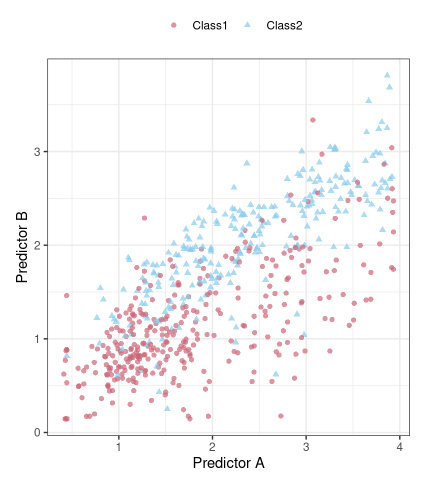
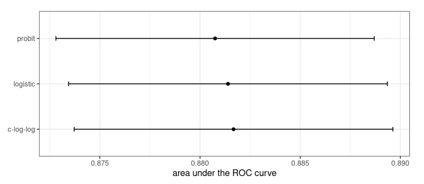
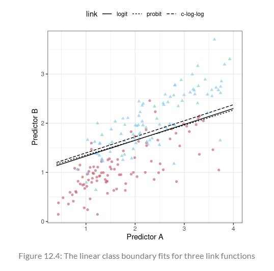
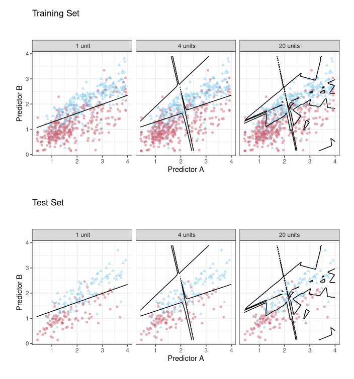
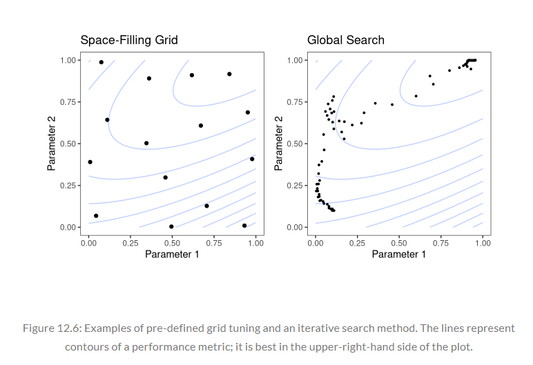

```{r setup, include = FALSE, warning = FALSE}
library(learnr)
library(tutorial.helpers)
library(knitr)
library(tidymodels)
tidymodels_prefer()

knitr::opts_chunk$set(echo = FALSE)
options(tutorial.exercise.timelimit = 60, 
        tutorial.storage = "local") 

ames_update <- ames |>
  mutate(Sale_Price = log10(Sale_Price))

set.seed(502)
ames_strata_split <- initial_split(ames_update, prop = 0.80, strata = Sale_Price)
ames_train <- training(ames_strata_split)
ames_test  <-  testing(ames_strata_split)

split <- initial_split(two_class_dat)
training_set <- training(split)
testing_set <- testing(split)

llhood <- function(...) {
  logistic_reg() |> 
    set_engine("glm", ...) |>
    fit(Class ~ ., data = training_set) |> 
    glance() |> 
    select(logLik)
}


set.seed(1201)

rs <- vfold_cv(training_set, repeats = 10)

lloss <- function(...) {
  perf_meas <- metric_set(roc_auc, mn_log_loss)
    
  logistic_reg() |> 
    set_engine("glm", ...) |>
    fit_resamples(Class ~ A + B, rs, metrics = perf_meas) |>
    collect_metrics(summarize = FALSE) |>
    select(id, id2, .metric, .estimate)
}

resampled_res <- 
  bind_rows(
  lloss() |> mutate(model = "logistic"),
  lloss(family = binomial(link = "probit")) |> mutate(model = "probit"),
  lloss(family = binomial(link = "cloglog")) |> mutate(model = "c-log-log")
) |>
  mutate(.estimate = ifelse(.metric == "mn_log_loss", -.estimate, .estimate)) |>
  group_by(model, .metric) |>
  summarize(
    .groups = "drop",
    mean = mean(.estimate, na.rm = TRUE),
    std_err = sd(.estimate, na.rm = TRUE) / sqrt(n())
)

logLikelihoodPlot <- 
  resampled_res |> 
  filter(.metric == "mn_log_loss") |>
  ggplot(aes(x = mean, y = model)) +
  geom_point() +
  geom_errorbar(aes(xmin = mean - 1.64 * std_err, xmax = mean + 1.64 * std_err, width = 0.1)) +
  labs(
    x = "log-likelihood",
    y = NULL
  )

neural_net_spec <- 
  mlp(hidden_units = tune()) |>
  set_mode("regression") |>
  set_engine("keras")

ames_rec <- 
  recipe(Sale_Price ~ Neighborhood + Gr_Liv_Area + Year_Built + Bldg_Type + 
           Latitude + Longitude, data = ames_train)  |>
  step_log(Gr_Liv_Area, base = 10) |>
  step_other(Neighborhood, threshold = tune()) |>
  step_dummy(all_nominal_predictors()) |> 
  step_interact( ~ Gr_Liv_Area:starts_with("Bldg_Type_")) |>
  step_ns(Longitude, deg_free = tune("longitude df")) |>
  step_ns(Latitude,  deg_free = tune("latitude df"))

recipes_param <- extract_parameter_set_dials(ames_rec)

wflow_param <- 
  workflow() |>
  add_recipe(ames_rec) |>
  add_model(neural_net_spec) |>
  extract_parameter_set_dials()

rf_spec <- 
  rand_forest(mtry = tune()) |>
  set_engine("ranger", regularization.factor = tune("regularization")) |>
  set_mode("regression")

rf_param <- extract_parameter_set_dials(rf_spec)

pca_rec <- 
  recipe(Sale_Price ~ ., data = ames_train) |>
  step_normalize(contains("SF")) |>
  step_pca(contains("SF"), threshold = .95)

updated_param <-
  workflow() |> 
  add_model(rf_spec) |>
  add_recipe(pca_rec) |>
  extract_parameter_set_dials() |>
  finalize(ames_train)

```

```{r copy-code-chunk, child = system.file("child_documents/copy_button.Rmd", package = "tutorial.helpers")}
```

```{r info-section, child = system.file("child_documents/info_section.Rmd", package = "tutorial.helpers")}
```

<!-- DK: Earlier in the tutorial, we should run each of the commands like `lloss() |> mutate(model = "logistic")` separately and explain why the resulting tibble has 200 rows, and what the rows mean. Only after that do we combine all those results into one big tibble with bind_rows(). -->

## Introduction
### 

This tutorial covers [Chapter 12: Model Tuning and the Dangers of Overfitting](https://www.tmwr.org/tuning.html) from [*Tidy Modeling with R*](https://www.tmwr.org/) by Max Kuhn and Julia Silge. In this tutorial, you will learn how to evaluate models when optimizing tuning parameters, using `bind_rows()` and two functions that you will create: `llhood()` and `lloss()`. You will also learn how to tune parameters in tidymodels, using `tune()`. 

## What do we Optimize?
### 

In order to use a model for prediction, the parameters for that model must be estimated. Some of these parameters can be estimated directly from the training data, but other parameters, called tuning parameters or *hyperparameters*, must be specified ahead of time and can’t be directly found from training data. These are unknown structural or other kind of values that have significant impact on the model but cannot be directly estimated from the data. 

### Exercise 1

Load the **tidymodels** library using `library()`.

```{r what-do-we-optimize-1, exercise = TRUE}

```

```{r what-do-we-optimize-1-hint-1, eval = FALSE}
library(...)
```

```{r include = FALSE}
library(tidymodels)
```

### 

In ordinary linear regression, there are two parameters $\beta_0$ and $\beta_1$ of the model: 

$$ y_i = \beta_0 + \beta_1 x_i + \epsilon_i$$ 

When you have the outcome ($y$) and predictor ($x$) data, you can estimate the two parameters $\beta_0$ and $\beta_1$: 

$$\hat \beta_1 = \frac{\sum_i (y_i-\bar{y})(x_i-\bar{x})}{\sum_i(x_i-\bar{x})^2}$$ 

and

$$\hat \beta_0 = \bar{y}-\hat \beta_1 \bar{x}.$$

You can directly estimate these values from the data for this example model because they are analytically tractable; if you have the data, then you can estimate these model parameters. 

### Exercise 2

Type in `tidymodels_prefer()` to get rid of naming conflicts.

```{r what-do-we-optimize-2, exercise = TRUE}

```

```{r what-do-we-optimize-2-hint-1, eval = FALSE}
...()
```

```{r include = FALSE}
tidymodels_prefer()
```

### 

For the KNN model, the prediction equation for a new value $x_0$ is

$$\hat y = \frac{1}{K}\sum_{\ell = 1}^K x_\ell^*$$

where $K$ is the number of neighbors and the $x_\ell^*$ are the $K$ closest values to $x_0$ in the training set.


The model itself is not defined by a model equation; the previous prediction equation instead defines it. This characteristic, along with the possible intractability of the distance measure, makes it impossible to create a set of equations that can be solved for $K$ (iteratively or otherwise). The number of neighbors has a profound impact on the model; it governs the flexibility of the class boundary. For small values of $K$, the boundary is very elaborate while for large values, it might be quite smooth.


### Exercise 3

The `two_class_dat` data frame will be used in this section. In the code chunk below, type in `two_class_dat`.

```{r what-do-we-optimize-3, exercise = TRUE}

```

```{r what-do-we-optimize-3-hint-1, eval = FALSE}
two_class_dat
```

```{r include = FALSE}
two_class_dat
```

### 

How should models be evaluated when optimizing tuning parameters? It depends on the model and the purpose of the model. For cases where the statistical properties of the tuning parameter are tractable, common statistical properties can be used as the objective function..


### Exercise 4

The `two_class_dat` data frame contains artificial data with two predictors (`A` and `B`) and a factor outcome variable (`Class`). Now, lets create a split of this data. In the code chunk below, type in `initial_split()` and pass the `two_class_dat` data frame inside the function.

```{r what-do-we-optimize-4, exercise = TRUE}

```

```{r what-do-we-optimize-4-hint-1, eval = FALSE}
initial_split(...)
```

```{r include = FALSE}
initial_split(two_class_dat)
```

### 

As an example, Jerome H. Friedman, one of the world's leading researchers in statistics and data mining, optimized the number of trees in a boosted tree ensemble and found different results when maximizing the likelihood and accuracy:

"Degrading the likelihood by over-fitting actually improves misclassification error rate. Although perhaps counter-intuitive, this is not a contradiction; likelihood and error rate measure different aspects of fit quality."

### Exercise 5

Copy the previous code and assign it to a new variable called `split`.

```{r what-do-we-optimize-5, exercise = TRUE}

```

<button onclick = "transfer_code(this)">Copy previous code</button>

```{r what-do-we-optimize-5-hint-1, eval = FALSE}
... <- initial_split(two_class_dat)
```

```{r include = FALSE}
split <- initial_split(two_class_dat)
```

### 

There are many situations where a model has parameters that can’t be directly estimated from the data.

### Exercise 6

Next, lets extract the training set from `split`. In the code chunk below, type in `training()`, passing in `split`.

```{r what-do-we-optimize-6, exercise = TRUE}

```

```{r what-do-we-optimize-6-hint-1, eval = FALSE}
...(split)
```

```{r include = FALSE}
training(split)
```

### 

To demonstrate, consider the classification data shown in the graph below with two predictors, two classes, and a training set of 593 data points:

```{r}

```

To start, a linear class boundary to these data could be fitted. The most common method for doing this is to use a generalized linear model in the form of logistic regression. This model relates the log odds of a sample being Class 1 using the logit transformation:

$$ \log\left(\frac{\pi}{1 - \pi}\right) = \beta_0 + \beta_1x_1 + \ldots + \beta_px_p$$

### Exercise 7

Copy the previous code and assign it to a new variable called `training_set`.

```{r what-do-we-optimize-7, exercise = TRUE}

```

<button onclick = "transfer_code(this)">Copy previous code</button>

```{r what-do-we-optimize-7-hint-1, eval = FALSE}
... <- training(split)
```

```{r include = FALSE}
training_set <- training(split)
```

### 

In the context of generalized linear models, the logit function is the _link function_ between the outcome ($\pi$) and the predictors. There are other link functions that include the _probit_ model: 

$$\Phi^{-1}(\pi) = \beta_0 + \beta_1x_1 + \ldots + \beta_px_p$$

where $\Phi$ is the cumulative standard normal function, as well as the _complementary log-log_ model:

$$\log(-\log(1-\pi)) = \beta_0 + \beta_1x_1 + \ldots + \beta_px_p$$

### Exercise 8

Now, lets create a testing set of `split`. Type in `testing()`, passing in `split`.

```{r what-do-we-optimize-8, exercise = TRUE}

```

```{r what-do-we-optimize-8-hint-1, eval = FALSE}
testing(...)
```

```{r include = FALSE}
testing(split)
```

### 

Each of these models results in linear class boundaries. Which one should you use? Since, for these data, the number of model parameters does not vary, the statistical approach is to compute the (log) likelihood for each model and determine the model with the largest value. Traditionally, the likelihood is computed using the same data that were used to estimate the parameters, not using approaches like data splitting or resampling.

### Exercise 9

Copy the previous code and assign it to a new variable named `testing_set`.

```{r what-do-we-optimize-9, exercise = TRUE}

```

<button onclick = "transfer_code(this)">Copy previous code</button>

```{r what-do-we-optimize-9-hint-1, eval = FALSE}
... <- testing(split)
```

```{r include = FALSE}
testing_set <- testing(split)
```

### 

There are many examples of tuning parameters or hyperparameters in different statistical and machine learning models. One of which is boosting. Boosting is an ensemble method that combines a series of base models, each of which is created sequentially and depends on the previous models. The number of boosting iterations is an important tuning parameter that usually requires optimization.

### Exercise 10

Using the `training_set` data frame, let’s create a function to compute the different models and extract the likelihood statistics for the training set. In the code chunk below, type in `function(...){}`.

```{r what-do-we-optimize-10, exercise = TRUE}

```

```{r what-do-we-optimize-10-hint-1, eval = FALSE}
# Leave the three dots inside the parenthesis of the function
function(...) {
  
}
```

```{r include = FALSE}
function(...) {
  
}
```

### 

In the classic single-layer artificial neural network (a.k.a. the multilayer perceptron), the predictors are combined using two or more hidden units. The hidden units are linear combinations of the predictors that are captured in an *activation function* (typically a nonlinear function, such as a sigmoid).

### Exercise 11

Copy the previous code. Inside the function, pipe `logistic_reg()` to `set_engine()`. Inside `set_engine()`, pass in `"glm"` and `...`.

```{r what-do-we-optimize-11, exercise = TRUE}

```

<button onclick = "transfer_code(this)">Copy previous code</button>

```{r what-do-we-optimize-11-hint-1, eval = FALSE}
function(...) {
  logistic_reg() |>
    set_engine("...", ...)
}
```

```{r include = FALSE}
function(...) {
  logistic_reg() |>
    set_engine("glm", ...)
}
```

### 

The hidden units are then connected to the outcome units; one outcome unit is used for regression models, and multiple outcome units are required for classification. The number of hidden units and the type of activation function are important structural tuning parameters.

### Exercise 12

Copy the previous code and continue the pipe to `fit()`. Inside `fit()`, type in `Class ~ .` and set `data` to `training_set` (Note: Leave the three dots inside `set_engine()`; don't remove them).

```{r what-do-we-optimize-12, exercise = TRUE}

```

<button onclick = "transfer_code(this)">Copy previous code</button>

```{r what-do-we-optimize-12-hint-1, eval = FALSE}
function(...) {
  logistic_reg() |>
    set_engine("glm", ...) |>
    fit(Class ~ ., ... = ...)
}
```

```{r include = FALSE}
function(...) {
  logistic_reg() |>
    set_engine("glm", ...) |>
    fit(Class ~ ., data = training_set)
}
```

### 

Modern gradient descent methods are improved by finding the right optimization parameters. Examples of such hyperparameters are learning rates, momentum, and the number of optimization iterations/epochs.

### Exercise 13

Copy the previous code and continue the pipe to `glance()`.

```{r what-do-we-optimize-13, exercise = TRUE}

```

<button onclick = "transfer_code(this)">Copy previous code</button>

```{r what-do-we-optimize-13-hint-1, eval = FALSE}
function(...) {
  logistic_reg() |>
    set_engine("glm", ...) |>
    fit(Class ~ ., data = training_set) |>
    ...()
}
```

```{r include = FALSE}
function(...) {
  logistic_reg() |>
    set_engine("glm", ...) |>
    fit(Class ~ ., data = training_set) |>
    glance()
}
```

### 

`glance()` is a function that is used to extract a tidy summary of model fit statistics from a variety of model objects, such as linear regression, generalized linear models, mixed-effects models, and more.

### Exercise 14

Copy the previous code and continue the pipe to `select()`. Inside `select()`, pass in `logLik`.

```{r what-do-we-optimize-14, exercise = TRUE}

```

<button onclick = "transfer_code(this)">Copy previous code</button>

```{r what-do-we-optimize-14-hint-1, eval = FALSE}
function(...) {
  logistic_reg() |>
    set_engine("glm", ...) |>
    fit(Class ~ ., data = training_set) |>
    glance() |>
    ...(logLik)
}
```

```{r include = FALSE}
function(...) {
  logistic_reg() |>
    set_engine("glm", ...) |>
    fit(Class ~ ., data = training_set) |>
    glance() |>
    select(logLik)
}
```

### 

Neural networks and some ensemble models use gradient descent to estimate the model parameters. While the tuning parameters associated with gradient descent are not structural parameters, they often require tuning.

### Exercise 15

Copy the previous code and assign the entire function to a new variable named `llhood`.

```{r what-do-we-optimize-15, exercise = TRUE}

```

<button onclick = "transfer_code(this)">Copy previous code</button>

```{r what-do-we-optimize-15-hint-1, eval = FALSE}
... <- function(...) {
  logistic_reg() |>
    set_engine("glm", ...) |>
    fit(Class ~ ., data = training_set) |>
    glance() |>
    select(logLik)
}
```

```{r include = FALSE}
llhood <- function(...) {
  logistic_reg() |>
    set_engine("glm", ...) |>
    fit(Class ~ ., data = training_set) |>
    glance() |>
    select(logLik)
}
```

### 

In some cases, preprocessing techniques require tuning:

In principal component analysis, or its supervised cousin called partial least squares, the predictors are replaced with new, artificial features that have better properties related to collinearity. The number of extracted components can be tuned.

### Exercise 16

Now, lets use this newly created function along with the `bind_rows()` function. `bind_rows()` is used to bind any number of data frames by row, creating a longer result.

In the code chunk below, type in `bind_rows()`. Inside this function, type in `llhood()`.

```{r what-do-we-optimize-16, exercise = TRUE}

```

```{r what-do-we-optimize-16-hint-1, eval = FALSE}
bind_rows(
  ...()
)
```

```{r include = FALSE}
bind_rows(
  llhood()
)
```

### 

Imputation methods estimate missing predictor values using the complete values of one or more predictors. One effective imputation tool uses $K$-nearest neighbors of the complete columns to predict the missing value. The number of neighbors modulates the amount of averaging and can be tuned.  

### Exercise 17

Copy the previous code and as the second argument of `bind_rows()`, type in `llhood()` again. Inside this function, set `family` to `binomial(link = "probit")`.

```{r what-do-we-optimize-17, exercise = TRUE}

```

<button onclick = "transfer_code(this)">Copy previous code</button>

```{r what-do-we-optimize-17-hint-1, eval = FALSE}
bind_rows(
  llhood(),
  llhood(family = ...(link = "..."))
)
```

```{r include = FALSE}
bind_rows(
  llhood(),
  llhood(family = binomial(link = "probit"))
)
```

### 

This part of the code is calling the `llhood()` function, but this time it is specifying a different model. It uses the binomial family with a probit link function, suggesting that this log-likelihood calculation is for a binomial regression model with a probit link. Type in `?binomial()` in the Console to learn more.

### Exercise 18

Copy the previous code and as the third argument of `bind_rows()`, type in `llhood()` yet again. Inside this function, set `family` to `binomial(link = "cloglog")`.

```{r what-do-we-optimize-18, exercise = TRUE}

```

<button onclick = "transfer_code(this)">Copy previous code</button>

```{r what-do-we-optimize-18-hint-1, eval = FALSE}
bind_rows(
  llhood(),
  llhood(family = binomial(link = "probit")),
  llhood(family = ...(link = "..."))
)
```

```{r include = FALSE}
bind_rows(
  llhood(),
  llhood(family = binomial(link = "probit")),
  llhood(family = binomial(link = "cloglog"))
)
```

### 

"cloglog" stands *complementary log-log*.

Also, `logLik` stands for "log-likelihood," and it is a measure used to assess how well a statistical model fits a given data set.

### Exercise 19

Copy the previous code and pipe the entire `bind_rows()` function to `mutate()`. Inside `mutate()`, set `link` to a vector containing `"logit"`, `"probit"`, and `"c-log-log"` (use `c()` to create a vector).

```{r what-do-we-optimize-19, exercise = TRUE}

```

<button onclick = "transfer_code(this)">Copy previous code</button>

```{r what-do-we-optimize-19-hint-1, eval = FALSE}
bind_rows(
  llhood(),
  llhood(family = binomial(link = "probit")),
  llhood(family = binomial(link = "cloglog"))
) |>
  mutate(link = c("...", "...", "..."))
  
```

```{r include = FALSE}
bind_rows(
  llhood(),
  llhood(family = binomial(link = "probit")),
  llhood(family = binomial(link = "cloglog"))
) |>
  mutate(link = c("logit", "probit", "c-log-log"))
```

### 

According to these results, the logistic model has the best statistical properties.

From the scale of the log-likelihood values, it is difficult to understand if these differences are important or negligible. One way of improving this analysis is to resample the statistics and separate the modeling data from the data used for performance estimation.

### Exercise 20

With this small data set, repeated 10-fold cross-validation is a good choice for resampling. In the yardstick package, the `mn_log_loss()` function is used to estimate the negative log-likelihood.

Lets perform this negative log-likelihood estimation. In the code chunk below, type in `set.seed(1201)`.

```{r what-do-we-optimize-20, exercise = TRUE}

```

<button onclick = "transfer_code(this)">Copy previous code</button>

```{r what-do-we-optimize-20-hint-1, eval = FALSE}
...(1201)
```

```{r include = FALSE}
set.seed(1201)
```

### 

Some classical statistical models also have structural parameters:

In binary regression, the logit link is commonly used (i.e., logistic regression). Other link functions, such as the probit and complementary log-log, are also available.

### Exercise 21

Lets start by creating a 10-fold-cross-validation. In the code chunk below, type in `vfold_cv()`, passing in `training_set` and setting `repeats` to `10`. 

```{r what-do-we-optimize-21, exercise = TRUE}

```

```{r what-do-we-optimize-21-hint-1, eval = FALSE}
vfold_cv(..., repeats = ...)
```

```{r include = FALSE}
vfold_cv(training_set, repeats = 10)
```

### 

As a reminder, a 10-fold-cross-validation set is when ten iterations of resampling are issued. In this case, since V = 10, the analysis sets are 9/10 of the training set and each assessment set is a distinct 1/10.

### Exercise 22

Copy the previous code and assign it to a new variable named `rs`.

```{r what-do-we-optimize-22, exercise = TRUE}

```

<button onclick = "transfer_code(this)">Copy previous code</button>

```{r what-do-we-optimize-22-hint-1, eval = FALSE}
... <- vfold_cv(training_set, repeats = 10)
```

```{r include = FALSE}
rs <- vfold_cv(training_set, repeats = 10)
```

### 

A counterexample where it is inappropriate to tune a parameter is the prior distribution required for Bayesian analysis. The prior encapsulates the analyst’s belief about the distribution of a quantity before evidence or data are taken into account.


### Exercise 23

Next, create a new function. Inside the function, set the code `metric_set(roc_auc, mn_log_loss)` to the variable `perf_meas`.

```{r what-do-we-optimize-23, exercise = TRUE}

```

```{r what-do-we-optimize-23-hint-1, eval = FALSE}
function(...){
  ... <- metric_set(..., mn_log_loss)
}
```

```{r include = FALSE}
function(...) {
  perf_meas <- metric_set(roc_auc, mn_log_loss)
}
```

### 

`metric_set()` is a function that calculates the logarithmic loss of a classification model. Click [here](https://yardstick.tidymodels.org/reference/mn_log_loss.html) to learn more. 

### Exercise 24

Copy the previous code. On a new line inside the function, pipe `logistic(reg)` to `set_engine()`. Inside `set_engine()`, type in `"glm", ...`.

```{r what-do-we-optimize-24, exercise = TRUE}

```

<button onclick = "transfer_code(this)">Copy previous code</button>

```{r what-do-we-optimize-24-hint-1, eval = FALSE}
function(...) {
  perf_meas <- metric_set(roc_auc, mn_log_loss)
  
  logistic_reg() |>
    ...("...", ...)
}
```

```{r include = FALSE}
function(...) {
  perf_meas <- metric_set(roc_auc, mn_log_loss)
    
  logistic_reg() |> 
    set_engine("glm", ...)
}
```

### 

For example, in [Section 11.4](https://www.tmwr.org/compare#tidyposterior) of [*Tidy Modeling with R*](https://www.tmwr.org/index.html), a Bayesian ANOVA model as used, and it was unclear about what the prior should be for the regression parameters (beyond being a symmetric distribution). A t-distribution was chosen with one degree of freedom for the prior since it has heavier tails; this reflects the added uncertainty. The prior beliefs should not be subject to optimization. Tuning parameters are typically optimized for performance whereas priors should not be tweaked to get “the right results.”

### Exercise 25

Copy the previous code and continue the pipe to `fit_resamples()`. Inside `fit_resamples()`, type in `Class ~ A + B, rs` as the first argument, `rs` as the second argument, and set `metrics` to `perf_meas` as the third argument.

```{r what-do-we-optimize-25, exercise = TRUE}

```

<button onclick = "transfer_code(this)">Copy previous code</button>

```{r what-do-we-optimize-25-hint-1, eval = FALSE}
function(...) {
  perf_meas <- metric_set(roc_auc, mn_log_loss)
    
  logistic_reg() |> 
    set_engine("glm", ...) |>
    fit_resamples(Class ~ A + B, ... , metrics = ...)
}
```

```{r include = FALSE}
function(...) {
  perf_meas <- metric_set(roc_auc, mn_log_loss)
    
  logistic_reg() |> 
    set_engine("glm", ...) |>
    fit_resamples(Class ~ A + B, rs, metrics = perf_meas)
}
```

### 

Another (perhaps more debatable) counterexample of a parameter that does not need to be tuned is the number of trees in a random forest or bagging model. This value should instead be chosen to be large enough to ensure numerical stability in the results; tuning it cannot improve performance as long as the value is large enough to produce reliable results.

### Exercise 26

Copy the previous code and continue the pipe to `collect_metrics()`. Inside `collect_metrics()`, set `summarize` to `FALSE`.

```{r what-do-we-optimize-26, exercise = TRUE}

```

<button onclick = "transfer_code(this)">Copy previous code</button>

```{r what-do-we-optimize-26-hint-1, eval = FALSE}
function(...) {
  perf_meas <- metric_set(roc_auc, mn_log_loss)
    
  logistic_reg() |> 
    set_engine("glm", ...) |>
    fit_resamples(Class ~ A + B, rs, metrics = perf_meas) |>
    collect_metrics(summarize = ...)
}
```

```{r include = FALSE}
function(...) {
  perf_meas <- metric_set(roc_auc, mn_log_loss)
    
  logistic_reg() |> 
    set_engine("glm", ...) |>
    fit_resamples(Class ~ A + B, rs, metrics = perf_meas) |>
    collect_metrics(summarize = FALSE)
}
```

### 

As a reminder, `collect_metrics()` and `fit_resamples()` were introduced in the "Resampling for Evaluating Performance" tutorial, which is associated with [Chapter 10 of *Tidy Modeling with R*](https://www.tmwr.org/resampling).

### Exercise 27

Copy the previous code and continue the pipe to `select()`. Inside `select()`, type in `id`, `id2`, `.metric`, and `.estimate`.

```{r what-do-we-optimize-27, exercise = TRUE}

```

<button onclick = "transfer_code(this)">Copy previous code</button>

```{r what-do-we-optimize-27-hint-1, eval = FALSE}
function(...) {
  perf_meas <- metric_set(roc_auc, mn_log_loss)
    
  logistic_reg() |> 
    set_engine("glm", ...) |>
    fit_resamples(Class ~ A + B, rs, metrics = perf_meas) |>
    collect_metrics(summarize = FALSE) |>
    select(..., ..., .metric, .estimate)
}
```

```{r include = FALSE}
function(...) {
  perf_meas <- metric_set(roc_auc, mn_log_loss)
    
  logistic_reg() |> 
    set_engine("glm", ...) |>
    fit_resamples(Class ~ A + B, rs, metrics = perf_meas) |>
    collect_metrics(summarize = FALSE) |>
    select(id, id2, .metric, .estimate)
}
```

### 

For random forests, the number of trees in a random forest or bagging mode is typically in the thousands while the number of trees needed for bagging is around 50 to 100.

### Exercise 28

Copy the previous code and assign the entire function to a new variable named `lloss`.

```{r what-do-we-optimize-28, exercise = TRUE}

```

<button onclick = "transfer_code(this)">Copy previous code</button>

```{r what-do-we-optimize-28-hint-1, eval = FALSE}
... <- function(...) {
  perf_meas <- metric_set(roc_auc, mn_log_loss)
    
  logistic_reg() |> 
    set_engine("glm", ...) |>
    fit_resamples(Class ~ A + B, rs, metrics = perf_meas) |>
    collect_metrics(summarize = FALSE) |>
    select(id, id2, .metric, .estimate)
}
```

```{r include = FALSE}
lloss <- function(...) {
  perf_meas <- metric_set(roc_auc, mn_log_loss)
    
  logistic_reg() |> 
    set_engine("glm", ...) |>
    fit_resamples(Class ~ A + B, rs, metrics = perf_meas) |>
    collect_metrics(summarize = FALSE) |>
    select(id, id2, .metric, .estimate)
}
```

### 

The purpose of this function is to return the individual resampled performance estimates.

### Exercise 29

Now, lets bind some rows. Type in `bind_rows()`. Set the first argument of this function to `lloss()`, which is piped to `mutate(model = "logistic")` (Note: view the hint if you are confused).

```{r what-do-we-optimize-29, exercise = TRUE}

```

<button onclick = "transfer_code(this)">Copy previous code</button>

```{r what-do-we-optimize-29-hint-1, eval = FALSE}
bind_rows(
  lloss() |> mutate(... = "...")
)
```

```{r include = FALSE}
bind_rows(
  lloss() |> mutate(model = "logistic")
)
```

### 

What this line of code is doing is it's calling `lloss()`, which has the individual resampled performance estimate and is creating a new column named `model`, which is set to `logistic`. This creation of the column was done by the `mutate()` function.

### Exercise 30

Copy the previous code. Set the second argument of `bind_rows()` to `lloss(family = binomial(link = "probit"))`, which is piped to `mutate(model = "probit")` (Note: view the hint if you are confused).

```{r what-do-we-optimize-30, exercise = TRUE}

```

<button onclick = "transfer_code(this)">Copy previous code</button>

```{r what-do-we-optimize-30-hint-1, eval = FALSE}
bind_rows(
  lloss() |> mutate(model = "logistic"),
  lloss(... = binomial(link = "...")) |> mutate(model = "...")
)
```

```{r include = FALSE}
bind_rows(
  lloss() |> mutate(model = "logistic"),
  lloss(family = binomial(link = "probit")) |> mutate(model = "probit")
)
```

### 

This code has now binded the `probit` models to the tibble containing `logistic` models.

### Exercise 31

Copy the previous code. Set the third argument of `bind_rows()` to `lloss(family = binomial(link = "cloglog"))`, which is piped to `mutate(model = "c-log-log")` (Note: view the hint if you are confused).

```{r what-do-we-optimize-31, exercise = TRUE}

```

<button onclick = "transfer_code(this)">Copy previous code</button>

```{r what-do-we-optimize-31-hint-1, eval = FALSE}
bind_rows(
  lloss() |> mutate(model = "logistic"),
  lloss(family = binomial(link = "probit")) |> mutate(model = "probit"),
  lloss(... = binomial(link = "...")) |> mutate(... = "...")
)
```

<!-- DK: Note that a warning appears when you run  -->
<!-- `lloss(family = binomial(link = "cloglog")) |> mutate(model = "c-log-log")` -->
<!-- both here and in later steps. The cause of this is, presumably, that using a c-log-log link function causes some of the estimated probabilities to be 0 or 1. Not sure what we should do about that, other than add a knowledge drop pointing out the warning so that students are not concerned. -->

```{r include = FALSE}
bind_rows(
  lloss() |> mutate(model = "logistic"),
  lloss(family = binomial(link = "probit")) |> mutate(model = "probit"),
  lloss(family = binomial(link = "cloglog")) |> mutate(model = "c-log-log")
)
```

### 

This code binded the `cloglog` models to the tibble containing `probit` and `logistic` models.

### Exercise 32

Copy the previous code. Pipe the entire `bind_rows()` function to `mutate()`. 

```{r what-do-we-optimize-32, exercise = TRUE}

```

<button onclick = "transfer_code(this)">Copy previous code</button>

```{r what-do-we-optimize-32-hint-1, eval = FALSE}
bind_rows(
  lloss() |> mutate(model = "logistic"),
  lloss(family = binomial(link = "probit")) |> mutate(model = "probit"),
  lloss(family = binomial(link = "cloglog")) |> mutate(model = "c-log-log")
) |>
  ...()
```

```{r include = FALSE}
bind_rows(
  lloss() |> mutate(model = "logistic"),
  lloss(family = binomial(link = "probit")) |> mutate(model = "probit"),
  lloss(family = binomial(link = "cloglog")) |> mutate(model = "c-log-log")
) |>
  mutate()
```

### 

### Exercise 33

Now, lets start converting `log-loss` to `log-likelihood`. Copy the previous code. Inside `mutate()`, set `.estimate` to `ifelse(.metric == "mn_log_loss", -.estimate, .estimate)`.

```{r what-do-we-optimize-33, exercise = TRUE}

```

<button onclick = "transfer_code(this)">Copy previous code</button>

```{r what-do-we-optimize-33-hint-1, eval = FALSE}
bind_rows(
  lloss() |> mutate(model = "logistic"),
  lloss(family = binomial(link = "probit")) |> mutate(model = "probit"),
  lloss(family = binomial(link = "cloglog")) |> mutate(model = "c-log-log")
) |>
  mutate(.estimate = ...(.metric == "...", -.estimate, .estimate))
```

```{r include = FALSE}
bind_rows(
  lloss() |> mutate(model = "logistic"),
  lloss(family = binomial(link = "probit")) |> mutate(model = "probit"),
  lloss(family = binomial(link = "cloglog")) |> mutate(model = "c-log-log")
) |>
  mutate(.estimate = ifelse(.metric == "mn_log_loss", -.estimate, .estimate))
```

### 

This code modifies the `.estimate` column: If `.metric` is equal to `mn_log_loss`, negate that value in `.estimate`. If not, then keep it unchanged.

### Exercise 34

Copy the previous code and pipe it to `group_by()`. Inside this function, type in `model` and `.metric`. 

```{r what-do-we-optimize-34, exercise = TRUE}

```

<button onclick = "transfer_code(this)">Copy previous code</button>

<!-- DK: Don't use group_by(). Use .by within summary. -->

```{r what-do-we-optimize-34-hint-1, eval = FALSE}
bind_rows(
  lloss() |> mutate(model = "logistic"),
  lloss(family = binomial(link = "probit")) |> mutate(model = "probit"),
  lloss(family = binomial(link = "cloglog")) |> mutate(model = "c-log-log")
) |>
  mutate(.estimate = ifelse(.metric == "mn_log_loss", -.estimate, .estimate)) |>
  group_by(..., ....)
```

```{r include = FALSE}
bind_rows(
  lloss() |> mutate(model = "logistic"),
  lloss(family = binomial(link = "probit")) |> mutate(model = "probit"),
  lloss(family = binomial(link = "cloglog")) |> mutate(model = "c-log-log")
) |>
  mutate(.estimate = ifelse(.metric == "mn_log_loss", -.estimate, .estimate)) |>
  group_by(model, .metric)
```

### 

In this scenario, the `group_by()` function is grouping the data based on the `model` and `.metric`.

### Exercise 35

Copy the previous code and pipe it to `summarize()`. Inside of this function, set `.groups` to `"drop"`. 

```{r what-do-we-optimize-35, exercise = TRUE}

```

<button onclick = "transfer_code(this)">Copy previous code</button>

```{r what-do-we-optimize-35-hint-1, eval = FALSE}
bind_rows(
  lloss() |> mutate(model = "logistic"),
  lloss(family = binomial(link = "probit")) |> mutate(model = "probit"),
  lloss(family = binomial(link = "cloglog")) |> mutate(model = "c-log-log")
) |>
  mutate(.estimate = ifelse(.metric == "mn_log_loss", -.estimate, .estimate)) |>
  group_by(model, .metric) |>
  summarize(
    .groups = "..."
  )
```

```{r include = FALSE, warning = FALSE}
bind_rows(
  lloss() |> mutate(model = "logistic"),
  lloss(family = binomial(link = "probit")) |> mutate(model = "probit"),
  lloss(family = binomial(link = "cloglog")) |> mutate(model = "c-log-log")
) |>
  mutate(.estimate = ifelse(.metric == "mn_log_loss", -.estimate, .estimate)) |>
  group_by(model, .metric) |>
  summarize(
    .groups = "drop"
  )
```

### 

<!-- AK: Getting a warning here and don't understand what it means: -->

<!-- A | warning: glm.fit: fitted probabilities numerically 0 or 1 occurred -->
<!-- There were issues with some computations   A: x3 -->

<!-- # A tibble: 6 × 4 -->
<!--   model     .metric       mean std_err -->
<!--   <chr>     <chr>        <dbl>   <dbl> -->
<!-- 1 c-log-log mn_log_loss -0.476 0.0117  -->
<!-- 2 c-log-log roc_auc      0.883 0.00472 -->
<!-- 3 logistic  mn_log_loss -0.443 0.00845 -->
<!-- 4 logistic  roc_auc      0.882 0.00471 -->
<!-- 5 probit    mn_log_loss -0.450 0.00850 -->
<!-- 6 probit    roc_auc      0.882 0.00471 -->

### Exercise 36

Copy the previous code. Inside `summarize()`, set `mean` to `mean(.estimate, na.rm = TRUE)`.

```{r what-do-we-optimize-36, exercise = TRUE}

```

<button onclick = "transfer_code(this)">Copy previous code</button>

```{r what-do-we-optimize-36-hint-1, eval = FALSE}
bind_rows(
  lloss() |> mutate(model = "logistic"),
  lloss(family = binomial(link = "probit")) |> mutate(model = "probit"),
  lloss(family = binomial(link = "cloglog")) |> mutate(model = "c-log-log")
) |>
  mutate(.estimate = ifelse(.metric == "mn_log_loss", -.estimate, .estimate)) |>
  group_by(model, .metric) |>
  summarize(
    .groups = "drop",
    ... = mean(..., na.rm = TRUE)
  )
```

```{r include = FALSE}
bind_rows(
  lloss() |> mutate(model = "logistic"),
  lloss(family = binomial(link = "probit")) |> mutate(model = "probit"),
  lloss(family = binomial(link = "cloglog")) |> mutate(model = "c-log-log")
) |>
  mutate(.estimate = ifelse(.metric == "mn_log_loss", -.estimate, .estimate)) |>
  group_by(model, .metric) |>
  summarize(
    .groups = "drop",
    mean = mean(.estimate, na.rm = TRUE)
  )
```

### 

The `na.rm = TRUE` argument is used to ignore any missing values and perform calculations on the non-missing values.

### Exercise 37

Copy the previous code. Inside `summarize()`, set `std_err` to `sd(.estimate, na.rm = TRUE) / sqrt(n())`

```{r what-do-we-optimize-37, exercise = TRUE}

```

<button onclick = "transfer_code(this)">Copy previous code</button>

```{r what-do-we-optimize-37-hint-1, eval = FALSE}
bind_rows(
  lloss() |> mutate(model = "logistic"),
  lloss(family = binomial(link = "probit")) |> mutate(model = "probit"),
  lloss(family = binomial(link = "cloglog")) |> mutate(model = "c-log-log")
) |>
  mutate(.estimate = ifelse(.metric == "mn_log_loss", -.estimate, .estimate)) |>
  group_by(model, .metric) |>
  summarize(
    .groups = "drop",
    mean = mean(.estimate, na.rm = TRUE),
    std_err = sd(.estimate, na.rm = TRUE) / sqrt(n())
  )
```

```{r include = FALSE}
bind_rows(
  lloss() |> mutate(model = "logistic"),
  lloss(family = binomial(link = "probit")) |> mutate(model = "probit"),
  lloss(family = binomial(link = "cloglog")) |> mutate(model = "c-log-log")
) |>
  mutate(.estimate = ifelse(.metric == "mn_log_loss", -.estimate, .estimate)) |>
  group_by(model, .metric) |>
  summarize(
    .groups = "drop",
    mean = mean(.estimate, na.rm = TRUE),
    std_err = sd(.estimate, na.rm = TRUE) / sqrt(n())
  )
```

### 

The `sd()` function is being used here to calculate the standard deviation of the values inside the `.estimate` column. To calculate the standard error, this function is being divided by the square root of `n()`.

### Exercise 38

Copy the previous code and assign it to a new variable named `resampled_res`.

```{r what-do-we-optimize-38, exercise = TRUE}

```

<button onclick = "transfer_code(this)">Copy previous code</button>

```{r what-do-we-optimize-38-hint-1, eval = FALSE}
... <- bind_rows(
  lloss() |> mutate(model = "logistic"),
  lloss(family = binomial(link = "probit")) |> mutate(model = "probit"),
  lloss(family = binomial(link = "cloglog")) |> mutate(model = "c-log-log")
) |>
  mutate(.estimate = ifelse(.metric == "mn_log_loss", -.estimate, .estimate)) |>
  group_by(model, .metric) |>
  summarize(
    .groups = "drop",
    mean = mean(.estimate, na.rm = TRUE),
    std_err = sd(.estimate, na.rm = TRUE) / sqrt(n())
  )
```

```{r include = FALSE, warning = FALSE}
resampled_res <- bind_rows(
  lloss() |> mutate(model = "logistic"),
  lloss(family = binomial(link = "probit")) |> mutate(model = "probit"),
  lloss(family = binomial(link = "cloglog")) |> mutate(model = "c-log-log")
) |>
  mutate(.estimate = ifelse(.metric == "mn_log_loss", -.estimate, .estimate)) |>
  group_by(model, .metric) |>
  summarize(
    .groups = "drop",
    mean = mean(.estimate, na.rm = TRUE),
    std_err = sd(.estimate, na.rm = TRUE) / sqrt(n())
  )
```

### 

This code has successfully resampled the results of the 10-fold-cross-validation.

### Exercise 39

Now, lets plot this data on a graph. But first, a filtration must occur. In the code chunk below, pipe `resampled_res` to `filter()`. Inside this function, type in the expression `.metric == "mn_log_loss"`.

```{r what-do-we-optimize-39, exercise = TRUE}

```

<button onclick = "transfer_code(this)">Copy previous code</button>

```{r what-do-we-optimize-39-hint-1, eval = FALSE}
resampled_res |>
  ...(.metric == "...")
```

```{r include = FALSE}
resampled_res |> 
  filter(.metric == "mn_log_loss")
```

### 

This code is filtering the data, making sure that the only `mn_log_loss` data is present.

### Exercise 40

Copy the previous code and pipe it to `ggplot()`. Inside this function, using `aes()`, set the argument `x` to `mean` and `y` to `model`.

```{r what-do-we-optimize-40, exercise = TRUE}

```

<button onclick = "transfer_code(this)">Copy previous code</button>

```{r what-do-we-optimize-40-hint-1, eval = FALSE}
resampled_res |> 
  filter(.metric == "mn_log_loss") |>
  ggplot(aes(x = ..., y = ...))
```

```{r include = FALSE}
resampled_res |> 
  filter(.metric == "mn_log_loss") |>
  ggplot(aes(x = mean, y = model))
```

### 

If you are unfamiliar with the term "model tuning", model tuning refers to the process of adjusting the hyperparameters of a model in order to optimize its performance.

### Exercise 41

Copy the previous code and add `geom_point()`.

```{r what-do-we-optimize-41, exercise = TRUE}

```

<button onclick = "transfer_code(this)">Copy previous code</button>

```{r what-do-we-optimize-41-hint-1, eval = FALSE}
resampled_res |> 
  filter(.metric == "mn_log_loss") |>
  ggplot(aes(x = mean, y = model)) +
  ...()
```

```{r include = FALSE}
resampled_res |> 
  filter(.metric == "mn_log_loss") |>
  ggplot(aes(x = mean, y = model)) +
  geom_point()
```

### 

As you can see, this produces three points on the graph. Using these points, the 90& confidence intervals can be created using `geom_errorbar()`.

### Exercise 42

Copy the previous code and add `geom_errorbar()`. Inside this function, using `aes()`, set `xmin` to `mean - 1.64 * std_err` (Note: This will throw an error).

```{r what-do-we-optimize-42, exercise = TRUE}

```

<button onclick = "transfer_code(this)">Copy previous code</button>

```{r what-do-we-optimize-42-hint-1, eval = FALSE}
resampled_res |> 
  filter(.metric == "mn_log_loss") |>
  ggplot(aes(x = mean, y = model)) +
  geom_point() +
  geom_errorbar(...(... = mean - 1.64 * std_err))
```

```{r include = FALSE}
#resampled_res |> 
#  filter(.metric == "mn_log_loss") |>
#  ggplot(aes(x = mean, y = model)) +
#  geom_point() +
#  geom_errorbar(aes(xmin = mean - 1.64 * std_err))
```

### 

This code throws an error because the `xmax` hasn't been defined yet.

### Exercise 43

Copy the previous code. Inside the `aes()` function inside of `geom_errorbar()`, set `xmax` to `mean + 1.64 * std_err`. 

```{r what-do-we-optimize-43, exercise = TRUE}

```

<button onclick = "transfer_code(this)">Copy previous code</button>

```{r what-do-we-optimize-43-hint-1, eval = FALSE}
resampled_res |> 
  filter(.metric == "mn_log_loss") |>
  ggplot(aes(x = mean, y = model)) +
  geom_point() +
  geom_errorbar(aes(xmin = mean - 1.64 * std_err, ... = mean + 1.64 * std_err))
```

```{r include = FALSE}
resampled_res |> 
  filter(.metric == "mn_log_loss") |>
  ggplot(aes(x = mean, y = model)) +
  geom_point() +
  geom_errorbar(aes(xmin = mean - 1.64 * std_err, xmax = mean + 1.64 * std_err))
```

### 

As you can see, each point now has a line on the right and left side, which represents the confidence intervals. 

### Exercise 44

Copy the previous code. Inside the `aes()` function inside of `geom_errorbar()`, set the `width` to `0.1`.

```{r what-do-we-optimize-44, exercise = TRUE}

```

<button onclick = "transfer_code(this)">Copy previous code</button>

```{r what-do-we-optimize-44-hint-1, eval = FALSE}
resampled_res |> 
  filter(.metric == "mn_log_loss") |>
  ggplot(aes(x = mean, y = model)) +
  geom_point() +
  geom_errorbar(aes(xmin = mean - 1.64 * std_err, xmax = mean + 1.64 * std_err, width = ...))
```

```{r include = FALSE}
resampled_res |> 
  filter(.metric == "mn_log_loss") |>
  ggplot(aes(x = mean, y = model)) +
  geom_point() +
  geom_errorbar(aes(xmin = mean - 1.64 * std_err, xmax = mean + 1.64 * std_err, width = 0.1))
```

### 

The scale of these values is different than the previous values since they are computed on a smaller data set; the value produced by `broom::glance()` is a sum while `yardstick::mn_log_loss()` is an average.

### Exercise 45

Copy the previous code and add your labs. The final plot should look like this:

```{r}
logLikelihoodPlot
```

```{r what-do-we-optimize-45, exercise = TRUE}

```

<button onclick = "transfer_code(this)">Copy previous code</button>

```{r what-do-we-optimize-45-hint-1, eval = FALSE}
resampled_res |> 
  filter(.metric == "mn_log_loss") |>
  ggplot(aes(x = mean, y = model)) +
  geom_point() +
  geom_errorbar(aes(xmin = mean - 1.64 * std_err, xmax = mean + 1.64 * std_err, width = 0.1)) +
  labs(
    x = "...",
    ... = NULL
  )
```

```{r include = FALSE}
resampled_res |> 
  filter(.metric == "mn_log_loss") |>
  ggplot(aes(x = mean, y = model)) +
  geom_point() +
  geom_errorbar(aes(xmin = mean - 1.64 * std_err, xmax = mean + 1.64 * std_err, width = 0.1)) +
  labs(
    x = "log-likelihood",
    y = NULL
  )
```

### 

These results exhibit evidence that the choice of the link function matters somewhat. Although there is an overlap in the confidence intervals, the logistic model has the best results.

### Exercise 46

What about a different metric? The area under the ROC curve for each resample was also calculated These results, which reflect the discriminating ability of the models across numerous probability thresholds, show a lack of difference 

```{r}

```

### 

Given the overlap of the intervals, as well as the scale of the x-axis, any of these options could be used.

### Exercise 47

When the class boundaries for the three models are overlaid on the test set of 198 data points as shown in the image below, this is seen again:

```{r}

```

### 

This exercise emphasizes that different metrics might lead to different decisions about the choice of tuning parameter values. In this case, one metric indicates the models are somewhat different while another metric shows no difference at all.

### 

Congrats! You have learned how to evaluate models when optimizing tuning parameters.

## Tuning Parameters in Tidymodels
### 

You have already dealt with quite a number of arguments that correspond to tuning parameters for recipe and model specifications in previous chapters. It is possible to tune:

- the threshold for combining neighborhoods into an “other” category (with argument name `threshold`)

- the number of degrees of freedom in a natural spline (`deg_free`)

- the number of data points required to execute a split in a tree-based model (`min_n`)

- the amount of regularization in penalized models (`penalty`)

### Exercise 1

The `rand_forest()` function contains a series of arguments that can be passed in. Type `?rand_forest()` in the Console and look at the *Arguments* section. CP/CR.

```{r tuning-parameters-in-1}
question_text(NULL,
	answer(NULL, correct = TRUE),
	allow_retry = TRUE,
	try_again_button = "Edit Answer",
	incorrect = NULL,
	rows = 3)
```

### 

For **parsnip** model specifications, there are two kinds of parameter arguments. Main arguments are those that are most often optimized for performance and are available in multiple engines. The main tuning parameters are top-level arguments to the model specification function. For example, the `rand_forest()` function has *main* arguments `trees`, `min_n`, and `mtry` since these are most frequently specified or optimized.

### Exercise 2

A secondary set of tuning parameters are *engine specific*. These are either infrequently optimized or are specific only to certain engines. Again using random forests as an example, the **ranger** package contains some arguments that are not used by other packages.

Type `?set_engine()` in the Console and look at the *Arguments* section. CP/CR.

```{r tuning-parameters-in-2}
question_text(NULL,
	answer(NULL, correct = TRUE),
	allow_retry = TRUE,
	try_again_button = "Edit Answer",
	incorrect = NULL,
	rows = 3)
```

### 

One example is gain penalization, which regularizes the predictor selection in the tree induction process. This parameter can help modulate the trade-off between the number of predictors used in the ensemble and performance. The name of this argument in **ranger** is `regularization.factor`.

### Exercise 3

Now, lets specify a value via a **parsnip** model specification. In the code chunk below, type in `rand_forest()`.

```{r tuning-parameters-in-3, exercise = TRUE}

```

```{r tuning-parameters-in-3-hint-1, eval = FALSE}
...()
```

```{r include = FALSE}
rand_forest()
```

### 

Many tuning parameters modulate the amount of model complexity. More complexity often implies more malleability in the patterns that a model can emulate. For example, adding degrees of freedom in a spline function increases the intricacy of the prediction equation. While this is an advantage when the underlying motifs in the data are complex, it can also lead to over-interpretation of chance patterns that would not reproduce in new data. 

### Exercise 4

Copy the previous code. Inside the function, set `trees` to `2000`

```{r tuning-parameters-in-4, exercise = TRUE}

```

<button onclick = "transfer_code(this)">Copy previous code</button>

```{r tuning-parameters-in-4-hint-1, eval = FALSE}
rand_forest(... = 2000)
```

```{r include = FALSE}
rand_forest(trees = 2000)
```

### 

Overfitting is the situation where a model adapts too much to the training data; it performs well for the data used to build the model but poorly for new data. Since tuning model parameters can increase model complexity, poor choices can lead to overfitting.

### Exercise 5

Copy the previous code. Inside `rand_forest()`, set `min_n` to `10`.

```{r tuning-parameters-in-5, exercise = TRUE}

```

<button onclick = "transfer_code(this)">Copy previous code</button>

```{r tuning-parameters-in-5-hint-1, eval = FALSE}
rand_forest(trees = 2000, ... = 10)
```

```{r include = FALSE}
rand_forest(trees = 2000, min_n = 10)
```

### 

With a single hidden unit and sigmoidal activation functions, a neural network for classification is, for all intents and purposes, just logistic regression. However, as the number of hidden units increases, so does the complexity of the model. 

In fact, when the network model uses sigmoidal activation units, George Cybenko, the Dorothy and Walter Gramm Professor of Engineering at Dartmouth, showed that the model is a universal function approximator as long as there are enough hidden units.

### Exercise 6

Copy the previous code and pipe it to `set_engine()`. Inside this function, type in `"ranger"` and set `regularization.factor` to `0.5`.

```{r tuning-parameters-in-6, exercise = TRUE}

```

<button onclick = "transfer_code(this)">Copy previous code</button>

```{r tuning-parameters-in-6-hint-1, eval = FALSE}
rand_forest(trees = 2000, min_n = 10) |>
  set_engine("...", regularization.factor = ...
```

```{r include = FALSE}
rand_forest(trees = 2000, min_n = 10) |>
  set_engine("ranger", regularization.factor = 0.5)  
```

### 

The main arguments use a harmonized naming system to remove inconsistencies across engines while engine-specific arguments do not.

### Exercise 7

How can you signal to tidymodels functions which arguments should be optimized? Parameters are marked for tuning by assigning them a value of `tune()`. Lets do just that.

In the code chunk below, type in `mlp()`. Inside this function, set the `hidden_units` argument to `tune()`.

```{r tuning-parameters-in-7, exercise = TRUE}

```

<button onclick = "transfer_code(this)">Copy previous code</button>

```{r tuning-parameters-in-7-hint-1, eval = FALSE}
mlp(... = tune())
```

```{r include = FALSE}
mlp(hidden_units = tune())
```

### 

Neural network classification models are fit to the same two-class data from the previous section, varying the number of hidden units. Using the area under the ROC curve as a performance metric, the effectiveness of the model on the training set increases as more hidden units are added. 

The network model thoroughly and meticulously learns the training set. If the model judges itself on the training set ROC value, it prefers many hidden units so that it can nearly eliminate errors.

### Exercise 8

Copy the previous code and pipe it to `set_mode()`. Inside this function, type in `"regression"`.

```{r tuning-parameters-in-8, exercise = TRUE}

```

<button onclick = "transfer_code(this)">Copy previous code</button>

```{r tuning-parameters-in-8-hint-1, eval = FALSE}
mlp(hidden_units = tune()) |>
  set_mode("...")
```

```{r include = FALSE}
mlp(hidden_units = tune()) |>
  set_mode("regression")
```

### 

[Chapters 5](https://www.tmwr.org/splitting#splitting) and [10](https://www.tmwr.org/resampling#resampling) in the [*Tidy Modeling with R*](https://www.tmwr.org/index.html) textbook demonstrated that simply repredicting the training set is a poor approach to model evaluation. Here, the neural network very quickly begins to overinterpret patterns that it sees in the training set. Compare these three example class boundaries (developed with the training set) overlaid on training and test sets in the image below:

```{r}

```

### Exercise 9

Copy the previous code and pipe it to `set_engine()`. Inside this function, type in `"keras"`.

```{r tuning-parameters-in-9, exercise = TRUE}

```

<button onclick = "transfer_code(this)">Copy previous code</button>

```{r tuning-parameters-in-9-hint-1, eval = FALSE}
mlp(hidden_units = tune()) |>
  set_mode("regression") |>
  set_engine("...")
```

```{r include = FALSE}
mlp(hidden_units = tune()) |>
  set_mode("regression") |>
  set_engine("keras")
```

### 

As you can see from the graph in the previous exercise, the single unit model does not adapt very flexibly to the data (since it is constrained to be linear). A model with four hidden units begins to show signs of overfitting with an unrealistic boundary for values away from the data mainstream. This is caused by a single data point from the first class in the upper-right corner of the data. 

### Exercise 10

Copy the previous code and assign it to a new variable called `neural_net_spec`.

```{r tuning-parameters-in-10, exercise = TRUE}

```

<button onclick = "transfer_code(this)">Copy previous code</button>

```{r tuning-parameters-in-10-hint-1, eval = FALSE}
... <- 
  mlp(hidden_units = tune()) |>
  set_mode("regression") |>
  set_engine("keras")
```

```{r include = FALSE}
neural_net_spec <- 
  mlp(hidden_units = tune()) |>
  set_mode("regression") |>
  set_engine("keras")
```

### 

By 20 hidden units, the model (from the graph) is beginning to memorize the training set, creating small islands around those data to minimize the resubstitution error rate. These patterns do not repeat in the test set. This last panel is the best illustration of how tuning parameters that control complexity must be modulated so that the model is effective. For a 20-unit model, the training set ROC AUC is 0.944 but the test set value is 0.855.

### Exercise 11

The tune() function doesn’t actually execute any particular parameter value; it only returns an expression. In the code chunk below, type in `tune()` and press "Run Code".

```{r tuning-parameters-in-11, exercise = TRUE}

```

```{r tuning-parameters-in-11-hint-1, eval = FALSE}
...()
```

```{r include = FALSE}
tune()
```

### 

Embedding this `tune()` value in an argument will tag the parameter for optimization. The model tuning functions shown in the next two chapters parse the model specification and/or recipe to discover the tagged parameters. These functions can automatically configure and process these parameters since they understand their characteristics (e.g., the range of possible values, etc.).

### Exercise 12

To enumerate the tuning parameters for an object, the `extract_parameter_set_dials()` will be used. In the code chunk below, type in `extract_parameter_set_dials()`, passing in `neural_net_spec`.

```{r tuning-parameters-in-12, exercise = TRUE}

```

```{r tuning-parameters-in-12-hint-1, eval = FALSE}
extract_parameter_set_dials(...)
```

```{r include = FALSE}
extract_parameter_set_dials(neural_net_spec)
```

### 

The results show a value of `nparam[+]`, indicating that the number of hidden units is a numeric parameter.

### Exercise 13

Press "Run Code".

```{r tuning-parameters-in-13, exercise = TRUE}
ames_rec <- 
  recipe(Sale_Price ~ Neighborhood + Gr_Liv_Area + Year_Built + Bldg_Type + 
           Latitude + Longitude, data = ames_train)  |>
  step_log(Gr_Liv_Area, base = 10) |>
  step_other(Neighborhood, threshold = tune()) |>
  step_dummy(all_nominal_predictors()) |> 
  step_interact( ~ Gr_Liv_Area:starts_with("Bldg_Type_")) |>
  step_ns(Longitude, deg_free = tune("longitude df")) |>
  step_ns(Latitude,  deg_free = tune("latitude df"))
```

```{r include = FALSE}
ames_rec <- 
  recipe(Sale_Price ~ Neighborhood + Gr_Liv_Area + Year_Built + Bldg_Type + 
           Latitude + Longitude, data = ames_train)  |>
  step_log(Gr_Liv_Area, base = 10) |>
  step_other(Neighborhood, threshold = tune()) |>
  step_dummy(all_nominal_predictors()) |> 
  step_interact( ~ Gr_Liv_Area:starts_with("Bldg_Type_")) |>
  step_ns(Longitude, deg_free = tune("longitude df")) |>
  step_ns(Latitude,  deg_free = tune("latitude df"))
```

### 

There is an optional identification argument that associates a name with the parameters. This can come in handy when the same kind of parameter is being tuned in different places. For example, with the Ames housing data from the *Resampling for Evaluating Performance* tutorial (which is associated with [Chapter 10](https://www.tmwr.org/resampling#resampling-summary)), the recipe encoded both longitude and latitude with spline functions.

### Exercise 14

Now, lets use the `extract_parameter_set_dials()` function on `ames_rec`. In the code chunk below, type `extract_parameter_set_dials()`, passing in `ames_rec`.

```{r tuning-parameters-in-14, exercise = TRUE}

```

```{r tuning-parameters-in-14-hint-1, eval = FALSE}
extract_parameter_set_dials(...)
```

```{r include = FALSE}
extract_parameter_set_dials(ames_rec)
```

### 

Note that the `identifier` and `type` columns are not the same for both of the spline parameters.

### Exercise 15

Copy the previous code and assign it to a new variable called `recipes_param`. 

```{r tuning-parameters-in-15, exercise = TRUE}

```

<button onclick = "transfer_code(this)">Copy previous code</button>

```{r tuning-parameters-in-15-hint-1, eval = FALSE}
... <- extract_parameter_set_dials(ames_rec)
```

```{r include = FALSE}
recipes_param <- extract_parameter_set_dials(ames_rec)
```

### 

In general, a quantitative approach must be used for detecting overfitting.

### Exercise 16

Now, lets create a workflow with `ames_rec` and `neural_net_spec`. Start by piping `workflow()` to `add_recipe()`. Inside `add_recipe()`, pass in `ames_rec`.

```{r tuning-parameters-in-16, exercise = TRUE}

```

```{r tuning-parameters-in-16-hint-1, eval = FALSE}
workflow() |>
  add_recipe(...)
```

```{r include = FALSE}
workflow() |>
  add_recipe(ames_rec)
```

### 

The solution for detecting when a model is overemphasizing the training set is using out-of-sample data.

### Exercise 17

Copy the previous code and pipe it to `add_model()`. Inside this function, type `neural_net_spec`.

```{r tuning-parameters-in-17, exercise = TRUE}

```

<button onclick = "transfer_code(this)">Copy previous code</button>

```{r tuning-parameters-in-17-hint-1, eval = FALSE}
workflow() |>
  add_recipe(ames_rec) |>
  add_model(...)
```

```{r include = FALSE}
workflow() |>
  add_recipe(ames_rec) |>
  add_model(neural_net_spec)
```

### 

Tuning parameter optimization usually falls into one of two categories: grid search and iterative search:

Grid search is when you predefine a set of parameter values to evaluate. The main choices involved in grid search are how to make the grid and how many parameter combinations to evaluate. Grid search is often judged as inefficient since the number of grid points required to cover the parameter space can become unmanageable with the curse of dimensionality.

### Exercise 18

Copy the previous code and pipe it to `extract_parameter_set_dials()`.

```{r tuning-parameters-in-18, exercise = TRUE}

```

<button onclick = "transfer_code(this)">Copy previous code</button>

```{r tuning-parameters-in-18-hint-1, eval = FALSE}
workflow() |>
  add_recipe(ames_rec) |>
  add_model(neural_net_spec) |>
  ...()
```

```{r include = FALSE}
workflow() |>
  add_recipe(ames_rec) |>
  add_model(neural_net_spec) |>
  extract_parameter_set_dials()
```

### 

Neural networks are exquisitely capable of emulating nonlinear patterns. Adding spline terms to this type of model is unnecessary; the model and recipe are combined for this illustration only.

### Exercise 19

Copy the previous code and assign it to a new variable named `wflow_param`.

```{r tuning-parameters-in-19, exercise = TRUE}

```

<button onclick = "transfer_code(this)">Copy previous code</button>

```{r tuning-parameters-in-19-hint-1, eval = FALSE}
... <- 
  workflow() |>
  add_recipe(ames_rec) |>
  add_model(neural_net_spec) |>
  extract_parameter_set_dials()
```

```{r include = FALSE}
wflow_param <- 
  workflow() |>
  add_recipe(ames_rec) |>
  add_model(neural_net_spec) |>
  extract_parameter_set_dials()
```

### 

*Iterative search* or sequential search is when you sequentially discover new parameter combinations based on previous results. Almost any nonlinear optimization method is appropriate, although some are more efficient than others. In some cases, an initial set of results for one or more parameter combinations is required to start the optimization process. 

### Exercise 20

Each tuning parameter argument has a corresponding function in the **dials** package. In the vast majority of the cases, the function has the same name as the parameter argument.

In the code chunk below, type in `hidden_units()` and press "Run code".

```{r tuning-parameters-in-20, exercise = TRUE}

```

```{r tuning-parameters-in-20-hint-1, eval = FALSE}
...()
```

```{r include = FALSE}
hidden_units()
```

### 

The graph below shows two panels that demonstrate the grid and iterative approaches for a situation with two tuning parameters that range between zero and one. In each, a set of contours shows the true (simulated) relationship between the parameters and the outcome. The optimal results are in the upper-right-hand corners:

```{r}

```

### Exercise 21

Another function in the **dials** package that has the same name as the parameter argument is `threshold()`. In the code chunk below, type in `threshold()` and press "Run code".

```{r tuning-parameters-in-21, exercise = TRUE}

```

```{r tuning-parameters-in-21-hint-1, eval = FALSE}
...()
```

```{r include = FALSE}
threshold()
```

### 

```{r}

```

The left-hand panel of the graph shows a type of grid called a space-filling design. This is a type of experimental design devised for covering the parameter space such that tuning parameter combinations are not close to one another. The results for this design do not place any points exactly at the truly optimal location. However, one point is in the general vicinity and would probably have performance metric results that are within the noise of the most optimal value.

### Exercise 22

The `deg_free` parameter is a counterexample; the notion of degrees of freedom comes up in a variety of different contexts. When used with splines, there is a specialized dials function called `spline_degree()` that is, by default, invoked for splines.

In the code chunk below, type in `spline_degree()` and press "Run code".

```{r tuning-parameters-in-22, exercise = TRUE}

```

```{r tuning-parameters-in-22-hint-1, eval = FALSE}
...()
```

```{r include = FALSE}
spline_degree()
```

### 

```{r}

```

The right-hand panel of the graph illustrates the results of a global search method: the Nelder-Mead simplex method . The starting point is in the lower-left part of the parameter space. The search meanders across the space until it reaches the optimum location, where it strives to come as close as possible to the numerically best value. This particular search method, while effective, is not known for its efficiency; it requires many function evaluations, especially near the optimal values

### Exercise 23

The **dials** package also has a convenience function for extracting a particular parameter object. Pipe `wflow_param` to `extract_parameter_dials()`. Inside this function, type in `"threshold"`.

```{r tuning-parameters-in-23, exercise = TRUE}

```

<button onclick = "transfer_code(this)">Copy previous code</button>

```{r tuning-parameters-in-23-hint-1, eval = FALSE}
wflow_param |>
  extract_parameter_dials("...")
```

```{r include = FALSE}
wflow_param |>
  extract_parameter_dials("threshold")
```

### 

This code identifies the parameter using the id value.

### Exercise 24

Inside the parameter set, the range of the parameters can also be updated in place. In the code chunk below, pipe `extract_parameter_set_dials(ames_rec)` to `update()`. Inside `update()`, set `threshold` to `threshold(c(0.8, 1.0))`

```{r tuning-parameters-in-24, exercise = TRUE}

```

<button onclick = "transfer_code(this)">Copy previous code</button>

```{r tuning-parameters-in-24-hint-1, eval = FALSE}
extract_parameter_set_dials(...) |> 
  ...(threshold = ...(c(0.8, 1.0)))
```

```{r include = FALSE}
extract_parameter_set_dials(ames_rec) |> 
  update(threshold = threshold(c(0.8, 1.0)))
```

### 

The parameter sets created by `extract_parameter_set_dials()` are consumed by the tidymodels tuning functions (when needed). If the defaults for the tuning parameter objects require modification, a modified parameter set is passed to the appropriate tuning function.

### Exercise 25

Type in `rand_forest()`. Inside this function, set `mtry` to `tune()`

```{r tuning-parameters-in-25, exercise = TRUE}

```

```{r tuning-parameters-in-25-hint-1, eval = FALSE}
rand_forest(mtry = ...())
```

```{r include = FALSE}
rand_forest(mtry = tune())
```

### 

In some cases, it is easy to have reasonable defaults for the range of possible values. In other cases, the parameter range is critical and cannot be assumed. The primary tuning parameter for random forest models is the number of predictor columns that are randomly sampled for each split in the tree, usually denoted as `mtry()`. Without knowing the number of predictors, this parameter range cannot be preconfigured and requires finalization.

### Exercise 26

Copy the previous code and pipe it to `set_engine()`. Inside this function, type in `"ranger"` and set `regularization.factor` to `tune("regularization")`

```{r tuning-parameters-in-26, exercise = TRUE}

```

<button onclick = "transfer_code(this)">Copy previous code</button>

```{r tuning-parameters-in-26-hint-1, eval = FALSE}
rand_forest(mtry = tune()) |>
  set_engine("...", regularization.factor = tune("..."))
```

```{r include = FALSE}
rand_forest(mtry = tune()) |>
  set_engine("ranger", regularization.factor = tune("regularization"))
```

### 

Some tuning parameters depend on the dimensions of the data. For example, the number of nearest neighbors must be between one and the number of rows in the data.

### Exercise 27

Copy the previous code and pipe it to `set_mode()`. Inside this function, type in `"regression"`.

```{r tuning-parameters-in-27, exercise = TRUE}

```

<button onclick = "transfer_code(this)">Copy previous code</button>

```{r tuning-parameters-in-27-hint-1, eval = FALSE}
rand_forest(mtry = tune()) |>
  set_engine("ranger", regularization.factor = tune("regularization")) |>
  set_mode("...")
```

```{r include = FALSE}
rand_forest(mtry = tune()) |>
  set_engine("ranger", regularization.factor = tune("regularization")) |>
  set_mode("regression")
```

### 

Along with grid and iterative searching, hybrid strategies are also an option and can work well. After an initial grid search, a sequential optimization can start from the best grid combination.

### Exercise 28

Copy the previous code and assign it to a variable called `rf_spec`.

```{r tuning-parameters-in-28, exercise = TRUE}

```

<button onclick = "transfer_code(this)">Copy previous code</button>

```{r tuning-parameters-in-28-hint-1, eval = FALSE}
... <- 
  rand_forest(mtry = tune()) |>
  set_engine("ranger", regularization.factor = tune("regularization")) |>
  set_mode("regression")
```

```{r include = FALSE}
rf_spec <- 
  rand_forest(mtry = tune()) |>
  set_engine("ranger", regularization.factor = tune("regularization")) |>
  set_mode("regression")
```

### 

Examples of the grid and iterative searching processes strategies are discussed in detail in Chapters [13](https://www.tmwr.org/grid-search) and [14](https://www.tmwr.org/iterative-search) in the [*Tidy Modeling with R*](https://www.tmwr.org/index.html) textbook. 

These processes are also discussed in the "Grid Search" and "Iterative Search" tutorials.

### Exercise 29

In the code chunk below, type in `extract_parameter_set_dials()`, passing in `rf_spec`.

```{r tuning-parameters-in-29, exercise = TRUE}

```

```{r tuning-parameters-in-29-hint-1, eval = FALSE}
extract_parameter_set_dials(...)
```

```{r include = FALSE}
extract_parameter_set_dials(rf_spec)
```

### 

Complete parameter objects have `[+]` in their summary; a value of `[?]` indicates that at least one end of the possible range is missing.

### Exercise 30

Copy the previous code and assign it to the variable `rf_param`. 

```{r tuning-parameters-in-30, exercise = TRUE}

```

<button onclick = "transfer_code(this)">Copy previous code</button>

```{r tuning-parameters-in-30-hint-1, eval = FALSE}
... <- extract_parameter_set_dials(rf_spec)
```

```{r include = FALSE}
rf_param <- extract_parameter_set_dials(rf_spec)
```

### 

R provides various libraries for hyperparameter tuning, such as **caret**, **mlr**, **tune**, and **RSample**. These libraries offer functions and tools for efficient parameter search and evaluation.

### Exercise 31

There are two methods for handling the value of `[?]`. The first is to use `update()`, to add a range based on what you know about the data dimensions.

In the code chunk below, pipe `rf_param` to `update()`. Inside this function, set `mtry` to `mtry(c(1, 70))`

```{r tuning-parameters-in-31, exercise = TRUE}

```

```{r tuning-parameters-in-31-hint-1, eval = FALSE}
rf_param |> 
  ...(mtry = mtry(c(..., ...)))
```

```{r include = FALSE}
rf_param |> 
  update(mtry = mtry(c(1, 70)))
```

### 

`mtry()`: The number of predictors that will be randomly sampled at each split when creating tree models.

### Exercise 32

However, this approach might not work if a recipe is attached to a workflow that uses steps that either add or subtract columns. If those steps are not slated for tuning, the `finalize()` function can execute the recipe once to obtain the dimensions.

In the code chunk below, type in `recipe()`. Inside this function, type in `Sale_Price ~ .` and set `data` to `ames_train`.

```{r tuning-parameters-in-32, exercise = TRUE}

```

```{r tuning-parameters-in-32-hint-1, eval = FALSE}
...(Sale_Price ~ ., data = ...)
```

```{r include = FALSE}
recipe(Sale_Price ~ ., data = ames_train)
```

### 

As a reminder, PCA stands for Principal Component Analysis. It is used for dimensionality reduction and feature extraction.

### Exercise 33

Copy the code and pipe it to `step_normalize()`. Inside this function, type in `contains("SF")`.

```{r tuning-parameters-in-33, exercise = TRUE}

```

<button onclick = "transfer_code(this)">Copy previous code</button>

```{r tuning-parameters-in-33-hint-1, eval = FALSE}
recipe(Sale_Price ~ ., data = ames_train) |>
  step_normalize(contains("..."))
```

```{r include = FALSE}
recipe(Sale_Price ~ ., data = ames_train) |>
  step_normalize(contains("SF"))
```

### 

This code selects the square-footage predictors and extracts their PCA components.,

### Exercise 34

Copy the previous code and pipe it to `step_pca()`. Inside this function, type `contains("SF")` and set `threshold` to `0.95`.

```{r tuning-parameters-in-34, exercise = TRUE}

```

<button onclick = "transfer_code(this)">Copy previous code</button>

```{r tuning-parameters-in-34-hint-1, eval = FALSE}
recipe(Sale_Price ~ ., data = ames_train) |>
  step_normalize(contains("SF")) |>
  step_pca(contains("..."), threshold = ...)
```

```{r include = FALSE}
recipe(Sale_Price ~ ., data = ames_train) |>
  step_normalize(contains("SF")) |>
  step_pca(contains("SF"), threshold = .95)
```

### 

This code selects the number of components needed to capture 95% of the variance in the predictors.

### Exercise 35

Copy the previous code and assign it to a new variable named `pca_rec`.

```{r tuning-parameters-in-35, exercise = TRUE}

```

<button onclick = "transfer_code(this)">Copy previous code</button>

```{r tuning-parameters-in-35-hint-1, eval = FALSE}
... <- 
  recipe(Sale_Price ~ ., data = ames_train) |>
  step_normalize(contains("SF")) |>
  step_pca(contains("SF"), threshold = .95)
```

```{r include = FALSE}
pca_rec <- 
  recipe(Sale_Price ~ ., data = ames_train) |>
  step_normalize(contains("SF")) |>
  step_pca(contains("SF"), threshold = .95)
```

### 

`step_pca()` is a function that creates a specification of a recipe step that will convert numeric data into one or more principal components.

### Exercise 36

Next, lets create a workflow. Pipe `workflow()` to `add_model()`. Inside `add_model()`, pass in `rf_spec`.

```{r tuning-parameters-in-36, exercise = TRUE}

```

```{r tuning-parameters-in-36-hint-1, eval = FALSE}
workflow() |> 
  add_model(...)
```

```{r include = FALSE}
workflow() |> 
  add_model(rf_spec)
```

### 

In the case of binary logistic regression, the link function can be chosen by maximizing the likelihood or information criteria. However, these statistical properties may not align with the results achieved using accuracy-oriented properties.

### Exercise 37

Copy the previous code and pipe it to `add_recipe()`. Inside this function, pass in `pca_rec`.

```{r tuning-parameters-in-37, exercise = TRUE}

```

<button onclick = "transfer_code(this)">Copy previous code</button>

```{r tuning-parameters-in-37-hint-1, eval = FALSE}
workflow() |> 
  add_model(rf_spec) |>
  add_recipe(...)
```

```{r include = FALSE}
workflow() |> 
  add_model(rf_spec) |>
  add_recipe(pca_rec)
```

### 

PCA helps in reducing the number of features (dimensions) in a data set while retaining as much of the original variance as possible. This is particularly useful when dealing with data sets that have a large number of correlated features, as it can simplify the analysis and improve computational efficiency.

### Exercise 38

Copy the previous code and pipe it to `extract_parameter_set_dials()`.

```{r tuning-parameters-in-38, exercise = TRUE}

```

<button onclick = "transfer_code(this)">Copy previous code</button>

```{r tuning-parameters-in-38-hint-1, eval = FALSE}
workflow() |> 
  add_model(rf_spec) |>
  add_recipe(pca_rec) |>
  ...()
```

```{r include = FALSE}
workflow() |> 
  add_model(rf_spec) |>
  add_recipe(pca_rec) |>
  extract_parameter_set_dials()
```

### 

This [link](https://workflows.tidymodels.org/reference/workflow.html) provides more information regarding workflows in R. 

### Exercise 39

Copy the previous code and pipe it to `finalize()`. Inside this function, type `ames_train`.

```{r tuning-parameters-in-39, exercise = TRUE}

```

<button onclick = "transfer_code(this)">Copy previous code</button>

```{r tuning-parameters-in-39-hint-1, eval = FALSE}
workflow() |> 
  add_model(rf_spec) |>
  add_recipe(pca_rec) |>
  extract_parameter_set_dials() |>
  finalize(...)
```

```{r include = FALSE}
workflow() |> 
  add_model(rf_spec) |>
  add_recipe(pca_rec) |>
  extract_parameter_set_dials() |>
  finalize(ames_train)
```

### 

`finalize()` is a function that finalizes data-specific parameter ranges.

### Exercise 40

Copy the previous code and assign it to a new variable named `updated_param`.

```{r tuning-parameters-in-40, exercise = TRUE}

```

<button onclick = "transfer_code(this)">Copy previous code</button>

```{r tuning-parameters-in-40-hint-1, eval = FALSE}
... <-
  workflow() |> 
  add_model(rf_spec) |>
  add_recipe(pca_rec) |>
  extract_parameter_set_dials() |>
  finalize(ames_train)
```

```{r include = FALSE}
updated_param <-
  workflow() |> 
  add_model(rf_spec) |>
  add_recipe(pca_rec) |>
  extract_parameter_set_dials() |>
  finalize(ames_train)
```

### 

The results of `extract_parameter_set_dials()` will include engine-specific parameters (if any). They are discovered in the same way as the main arguments and included in the parameter set.

### Exercise 41

In the code chunk below, pipe `updated_param` to `extract_parameter_set_dials("mtry)`

```{r tuning-parameters-in-41, exercise = TRUE}

```

```{r tuning-parameters-in-41-hint-1, eval = FALSE}
updated_param |>
  extract_parameter_dials("...")
```

```{r include = FALSE}
updated_param |>
  extract_parameter_dials("mtry")
```

### 

When the recipe is prepared, the `finalize()` function learns to set the upper range of `mtry` to 74 predictors.

### Exercise 42

The **dials** package contains parameter functions for all potentially tunable engine-specific parameters.

in the code chunk below, type in `rf_param`. Then, on a new line, type in `regularization_factor()`

```{r tuning-parameters-in-42, exercise = TRUE}

```

```{r tuning-parameters-in-42-hint-1, eval = FALSE}
rf_param
...()
```

```{r include = FALSE}
rf_param
regularization_factor()
```

### 

Finally, some tuning parameters are best associated with transformations. A good example of this is the penalty parameter associated with many regularized regression models. This parameter is non-negative and it is common to vary its values in log units

### Exercise 43

The primary **dials** parameter object indicates that a transformation is used by default. In the code chunk below, type in `penalty()`.

```{r tuning-parameters-in-43, exercise = TRUE}

```

```{r tuning-parameters-in-43-hint-1, eval = FALSE}
...()
```

```{r include = FALSE}
penalty()
```

### 

Tuning parameters that are best associated with transformations are important to know, especially when altering the range.

### Exercise 44

Note that new range values must be in the transformed units. In the code chunk below, pipe `penalty(c(-1, 0))` to `value_sample(1000)`. Then, pipe this to `summary()`.

```{r tuning-parameters-in-44, exercise = TRUE}

```

```{r tuning-parameters-in-44-hint-1, eval = FALSE}
penalty(c(..., ...)) |>
  value_sample(...) |>
  summary()
```

```{r include = FALSE}
penalty(c(-1, 0)) |>
  value_sample(1000) |>
  summary()
```

### 

`penalty()` is a numeric parameter function representing the amount of penalties (e.g. L1, L2, etc) in regularized models.

`value_sample()` creates setters and validators for parameter values. Additionally, tools for creating sequences of parameter values and for transforming parameter values are provided.

### Exercise 45

The scale can be changed if desired with the trans argument. You can use natural units but the same range.

In the code chunk below, type in `penalty()`. Inside this function, set `trans` to `NULL` and `range` to `10^c(-10, 0)`

```{r tuning-parameters-in-45, exercise = TRUE}

```

```{r tuning-parameters-in-45-hint-1, eval = FALSE}
...(trans = ..., range = 10^c(-10, 0))
```

```{r include = FALSE}
penalty(trans = NULL, range = 10^c(-10, 0))
```

### 

Congrats! You have learned how to tune parameters in tidymodels.

## Summary
### 

In this tutorial, you have learned:

- Model parameters for ordinary linear regression and KNN models
- Tuning parameters for different types of models
- How to evaluate models when optimizing tuning parameters, using `bind_rows()` in combination with the `llhood()` and `lloss()` function you created
- How to tune parameters in tidymodels, using `tune()` and `extract_parameter_set_dials()`
- How to edit the range of parameters, using `update()`

```{r download-answers, child = system.file("child_documents/download_answers.Rmd", package = "tutorial.helpers")}
```
