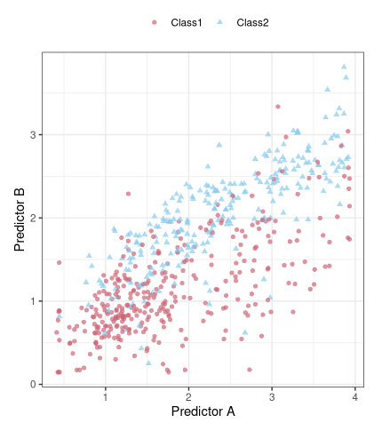

```{r setup, include = FALSE}
library(learnr)
library(tutorial.helpers)
library(tidymodels)
tidymodels_prefer()

knitr::opts_chunk$set(echo = FALSE)
options(tutorial.exercise.timelimit = 60, 
        tutorial.storage = "local") 
```

```{r copy-code-chunk, child = system.file("child_documents/copy_button.Rmd", package = "tutorial.helpers")}
```

```{r info-section, child = system.file("child_documents/info_section.Rmd", package = "tutorial.helpers")}
```

## Introduction
### 

This tutorial covers [Chapter 12: Model Tuning and the Dangers of Overfitting](https://www.tmwr.org/tuning.html) from [*Tidy Modeling with R*](https://www.tmwr.org/) by Max Kuhn and Julia Silge. 

## What do we Optimize?
### 

In order to use a model for prediction, the parameters for that model must be estimated. Some of these parameters can be estimated directly from the training data, but other parameters, called tuning parameters or *hyperparameters*, must be specified ahead of time and can’t be directly found from training data. These are unknown structural or other kind of values that have significant impact on the model but cannot be directly estimated from the data. 

### Exercise 1

Load the **tidymodels** library using `library()`.

```{r what-do-we-optimize-1, exercise = TRUE}

```

```{r what-do-we-optimize-1-hint-1, eval = FALSE}
library(...)
```

```{r include = FALSE}
library(tidymodels)
```

### 

In ordinary linear regression, there are two parameters $\beta_0$ and $\beta_1$ of the model: 

$$ y_i = \beta_0 + \beta_1 x_i + \epsilon_i$$ 

When we have the outcome ($y$) and predictor ($x$) data, we can estimate the two parameters $\beta_0$ and $\beta_1$: 

$$\hat \beta_1 = \frac{\sum_i (y_i-\bar{y})(x_i-\bar{x})}{\sum_i(x_i-\bar{x})^2}$$ 

and

$$\hat \beta_0 = \bar{y}-\hat \beta_1 \bar{x}.$$

We can directly estimate these values from the data for this example model because they are analytically tractable; if we have the data, then we can estimate these model parameters. 

### Exercise 2

Type in `tidymodels_prefer()` to get rid of naming conflicts.

```{r what-do-we-optimize-2, exercise = TRUE}

```

```{r what-do-we-optimize-2-hint-1, eval = FALSE}
...()
```

```{r include = FALSE}
tidymodels_prefer()
```

### 

For the KNN model, the prediction equation for a new value $x_0$ is

$$\hat y = \frac{1}{K}\sum_{\ell = 1}^K x_\ell^*$$

where $K$ is the number of neighbors and the $x_\ell^*$ are the $K$ closest values to $x_0$ in the training set.


The model itself is not defined by a model equation; the previous prediction equation instead defines it. This characteristic, along with the possible intractability of the distance measure, makes it impossible to create a set of equations that can be solved for $K$ (iteratively or otherwise). The number of neighbors has a profound impact on the model; it governs the flexibility of the class boundary. For small values of $K$, the boundary is very elaborate while for large values, it might be quite smooth.


### Exercise 3

The `two_class_dat` data frame will be used in this section. In the code chunk below, type in `two_class_dat`.

```{r what-do-we-optimize-3, exercise = TRUE}

```

```{r what-do-we-optimize-3-hint-1, eval = FALSE}
two_class_dat
```

```{r include = FALSE}
two_class_dat
```

### 

How should we evaluate models when we optimize tuning parameters? It depends on the model and the purpose of the model. For cases where the statistical properties of the tuning parameter are tractable, common statistical properties can be used as the objective function. For example, in the case of binary logistic regression, the link function can be chosen by maximizing the likelihood or information criteria. However, these statistical properties may not align with the results achieved using accuracy-oriented properties.


### Exercise 4

The `two_class_dat` data frame contains artificial data with two predictors (`A` and `B`) and a factor outcome variable (`Class`). Now, lets create a split of this data. In the code chunk below, type in `initial_split()` and pass the `two_class_dat` data frame inside the function.

```{r what-do-we-optimize-4, exercise = TRUE}

```

```{r what-do-we-optimize-4-hint-1, eval = FALSE}
initial_split(...)
```

```{r include = FALSE}
initial_split(two_class_dat)
```

### 

As an example, Jerome H. Friedman, one of the world's leading researchers in statistics and data mining, optimized the number of trees in a boosted tree ensemble and found different results when maximizing the likelihood and accuracy:

"Degrading the likelihood by overfitting actually improves misclassification error rate. Although perhaps counterintuitive, this is not a contradiction; likelihood and error rate measure different aspects of fit quality."

### Exercise 5

Copy the previous code and assign it to a new variable called `split`.

```{r what-do-we-optimize-5, exercise = TRUE}

```

<button onclick = "transfer_code(this)">Copy previous code</button>

```{r what-do-we-optimize-5-hint-1, eval = FALSE}
... <- initial_split(two_class_dat)
```

```{r include = FALSE}
split <- initial_split(two_class_dat)
```

### 

There are many situations where a model has parameters that can’t be directly estimated from the data.

### Exercise 6

Next, lets extract the training set from `split`. In the code chunk below, type in `training()`, passing in `split`.

```{r what-do-we-optimize-6, exercise = TRUE}

```

```{r what-do-we-optimize-6-hint-1, eval = FALSE}
...(split)
```

```{r include = FALSE}
training(split)
```

### 

To demonstrate, consider the classification data shown in the graph below with two predictors, two classes, and a training set of 593 data points:

```{r}

```

To start, a linear class boundary to these data could be fitted. The most common method for doing this is to use a generalized linear model in the form of logistic regression. This model relates the log odds of a sample being Class 1 using the logit transformation:

$$ \log\left(\frac{\pi}{1 - \pi}\right) = \beta_0 + \beta_1x_1 + \ldots + \beta_px_p$$

### Exercise 7

Copy the previous code and assign it to a new variable called `training_set`.

```{r what-do-we-optimize-7, exercise = TRUE}

```

<button onclick = "transfer_code(this)">Copy previous code</button>

```{r what-do-we-optimize-7-hint-1, eval = FALSE}
... <- training(split)
```

```{r include = FALSE}
training_set <- training(split)
```

### 

## Summary
### 

<!-- Two to four sentences which bring the lessons of the tutorial together for the student. What do they know now that they did not know before? How does this tutorial connect to other tutorials? OK if this is very similar to the Introduction. You made a promise as to what they would learn. You (we hope!) kept that promise.-->

```{r download-answers, child = system.file("child_documents/download_answers.Rmd", package = "tutorial.helpers")}
```
