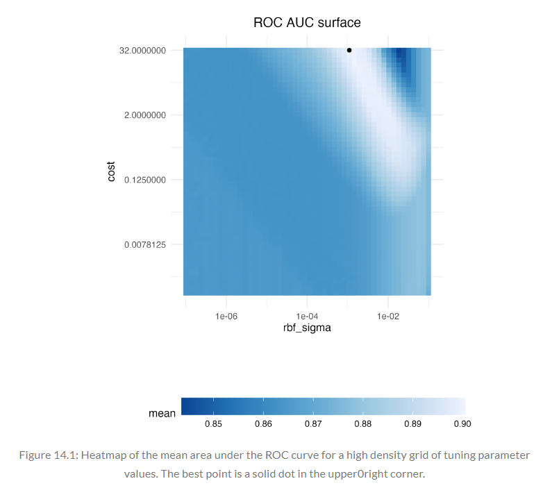
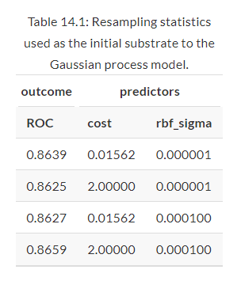
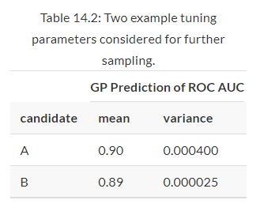
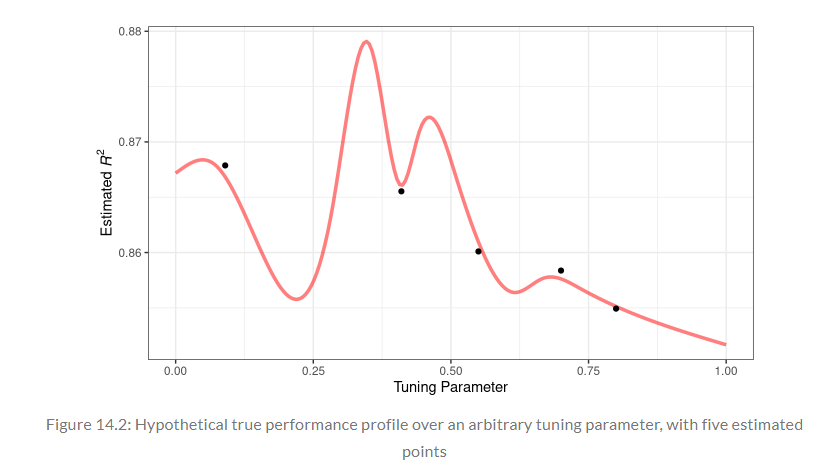
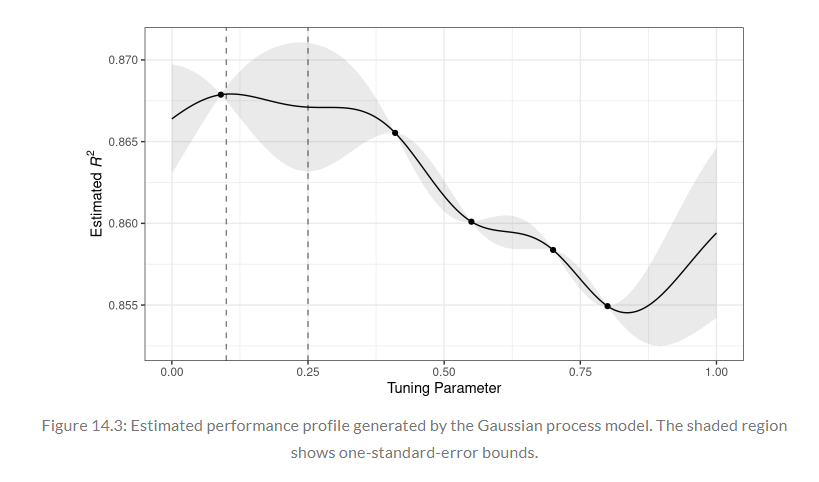
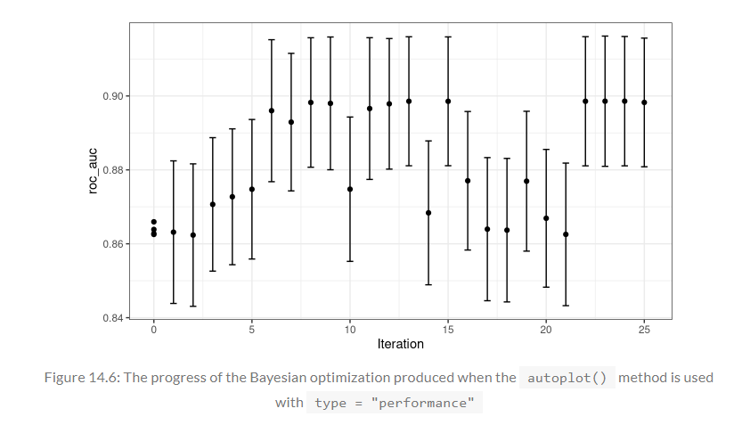
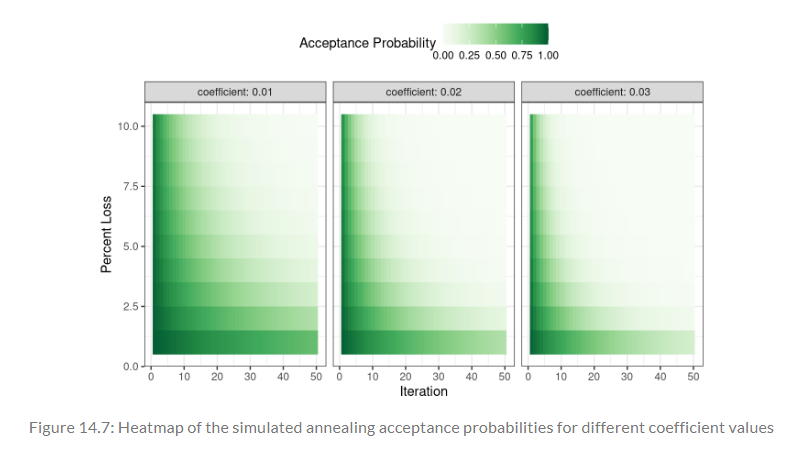
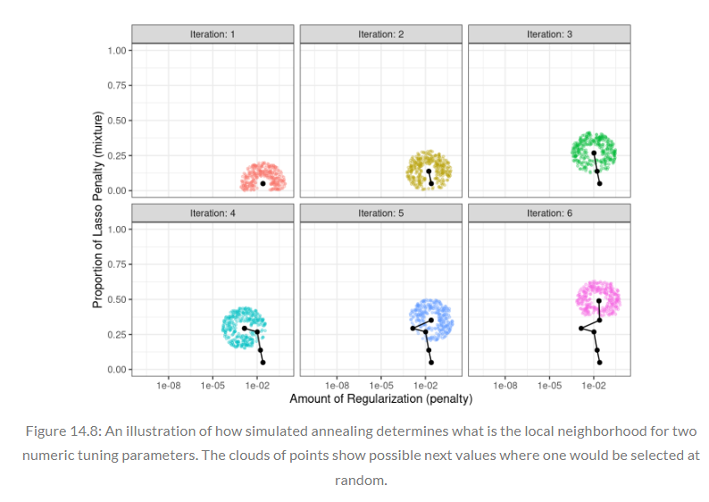
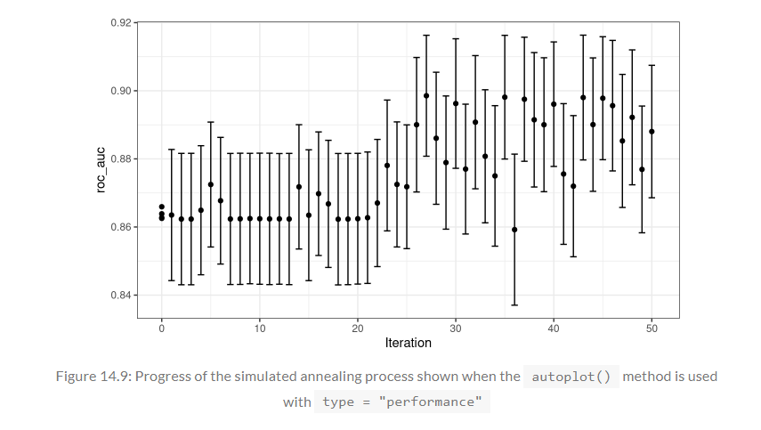
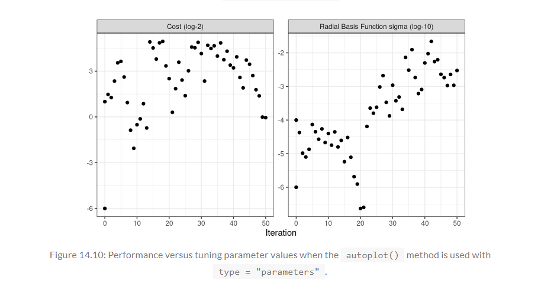

```{r setup, include = FALSE}
library(learnr)
library(tutorial.helpers)
library(tidymodels)
library(knitr)
library(kernlab)
library(finetune)
tidymodels_prefer()

knitr::opts_chunk$set(echo = FALSE)
options(tutorial.exercise.timelimit = 60, 
        tutorial.storage = "local") 

data(cells)
cells1 <- cells |> select(-case)

set.seed(1304)
cell_folds <- vfold_cv(cells1)

roc_res <- metric_set(roc_auc)

svm_rec <- 
  recipe(class ~ ., data = cells1) |>
  step_YeoJohnson(all_numeric_predictors()) |>
  step_normalize(all_numeric_predictors())

svm_spec <- 
  svm_rbf(cost = tune(), rbf_sigma = tune()) |>
  set_engine("kernlab") |>
  set_mode("classification")

svm_wflow <- 
  workflow() |> 
  add_model(svm_spec) |>
  add_recipe(svm_rec)

svm_param <- 
  svm_wflow |> 
  extract_parameter_set_dials() |> 
  update(rbf_sigma = rbf_sigma(c(-7, -1)))

set.seed(1402)

start_grid <- 
  svm_param |> 
  update(
    cost = cost(c(-6, 1)),
    rbf_sigma = rbf_sigma(c(-6, -4))
  ) |>
   grid_regular(levels = 2)

svm_initial <- 
  svm_wflow |> 
  tune_grid(resamples = cell_folds, grid = start_grid, metrics = roc_res)

ctrl <- control_bayes(verbose = TRUE)

set.seed(1403)
svm_bo <- 
  svm_wflow |>
  tune_bayes(
    resamples = cell_folds,
    metrics = roc_res,
    initial = svm_initial,
    param_info = svm_param,
    iter = 25,
    control = ctrl
  )

ctrl_sa <- control_sim_anneal(verbose = TRUE, no_improve = 10L)

svm_sa <- 
  svm_wflow |>
  tune_sim_anneal(
    resamples = cell_folds,
    metrics = roc_res,
    initial = svm_initial,
    param_info = svm_param,
    iter = 50,
    control = ctrl_sa
  )

```

```{r copy-code-chunk, child = system.file("child_documents/copy_button.Rmd", package = "tutorial.helpers")}
```

```{r info-section, child = system.file("child_documents/info_section.Rmd", package = "tutorial.helpers")}
```

## Introduction
### 

This tutorial covers [Chapter 14: Iterative Search](https://www.tmwr.org/iterative-search) from [*Tidy Modeling with R*](https://www.tmwr.org/) by Max Kuhn and Julia Silge. In this tutorial, you will learn about Bayesian optimization, with the use of `control_bayes()` and `tune_bayes()`, as well as simulated annealing, with the use of `control_sim_anneal()` and `tune_sim_anneal()`. These functions come from the [**tidymodels**](https://www.tidymodels.org/packages/) and [**finetune**](https://finetune.tidymodels.org/) packages.

## A Support Vector Machine Model
### 

The "Grid Search" tutorial, which is associated with [Chapter 13](https://www.tmwr.org/grid-search), demonstrated how grid search takes a pre-defined set of candidate values, evaluates them, then chooses the best settings. Iterative search methods pursue a different strategy. During the search process, they predict which values to test next.

### Exercise 1

Load the **tidymodels** package using `library()`.

```{r a-support-vector-mac-1, exercise = TRUE}

```

```{r a-support-vector-mac-1-hint-1, eval = FALSE}
library(...)
```

```{r include = FALSE}
library(tidymodels)
```

### 

The cell segmentation data will be used one again, as described in Chapter 13, for modeling, with a support vector machine (SVM) model to demonstrate sequential tuning methods. The two tuning parameters to optimize are the SVM cost value and the radial basis function kernel parameter $\sigma$. Both parameters can have a profound effect on the model complexity and performance.

### Exercise 2

Type `tidymodels_prefer()` to get rid of naming conflicts.

```{r a-support-vector-mac-2, exercise = TRUE}

```

```{r a-support-vector-mac-2-hint-1, eval = FALSE}
...()
```

```{r include = FALSE}
tidymodels_prefer()
```

### 

The SVM model uses a dot product and, for this reason, it is necessary to center and scale the predictors. Like the multilayer perceptron model, this model would benefit from the use of PCA feature extraction. However, this third tuning parameter in this chapter will not be used so that the search process in two dimensions can be visualized. 

### Exercise 3

Load the **kernlab** package using `library()`.

```{r a-support-vector-mac-3, exercise = TRUE}

```

<button onclick = "transfer_code(this)">Copy previous code</button>

```{r a-support-vector-mac-3-hint-1, eval = FALSE}
library(...)
```

```{r include = FALSE}
library(kernlab)
```

### 

**kernlab** is a package that provides kernlab-based machine learning methods.

### Exercise 4

Press "Run code"

```{r a-support-vector-mac-4, exercise = TRUE}
data(cells)
cells1 <- cells |> select(-case)

set.seed(1304)
cell_folds <- vfold_cv(cells1)

roc_res <- metric_set(roc_auc)
```

```{r include = FALSE}
data(cells)
cells1 <- cells |> select(-case)

set.seed(1304)
cell_folds <- vfold_cv(cells1)

roc_res <- metric_set(roc_auc)
```

### 

These were the variables created in the "Grid Search" tutorial, and will be used for this tutorial.

### Exercise 5

Lets create three tidymodel objects: `svm_rec`, `svm_spec`, and `svm_wflow`.

Start by typing `recipe()`. Inside this function, type in `class ~ .` and set `data` to `cells1`. 

```{r a-support-vector-mac-5, exercise = TRUE}

```

```{r a-support-vector-mac-5-hint-1, eval = FALSE}
 ...(class ~ ., data = ...)
```

```{r include = FALSE}
recipe(class ~ ., data = cells1)
```

### 

When grid search is infeasible or inefficient, iterative methods are a sensible approach for optimizing tuning parameters.

### Exercise 6

Copy the previous code and pipe it to `step_YeoJohnson()`. Inside this function, type in `all_numeric_predictors()`.

```{r a-support-vector-mac-6, exercise = TRUE}

```

<button onclick = "transfer_code(this)">Copy previous code</button>

```{r a-support-vector-mac-6-hint-1, eval = FALSE}
recipe(class ~ ., data = cells1) |>
  step_YeoJohnson(...())
```

```{r include = FALSE}
recipe(class ~ ., data = cells1) |>
  step_YeoJohnson(all_numeric_predictors())
```

### 

`step_YeoJohnson()` creates a *specification* of a recipe step that will transform data using a Yeo-Johnson transformation. The Yeo-Johnson transformation is a a mathematical method used for transforming data to achieve a more normal or symmetric distribution.

### Exercise 7

Copy the previous code and pipe it to `step_normalize()`. Inside this function, type `all_numeric_predictors()`.

```{r a-support-vector-mac-7, exercise = TRUE}

```

<button onclick = "transfer_code(this)">Copy previous code</button>

```{r a-support-vector-mac-7-hint-1, eval = FALSE}
recipe(class ~ ., data = cells1) |>
  step_YeoJohnson(all_numeric_predictors()) |>
  step_normalize(...())
```

```{r include = FALSE}
recipe(class ~ ., data = cells1) |>
  step_YeoJohnson(all_numeric_predictors()) |>
  step_normalize(all_numeric_predictors())
```

### 

Bayesian optimization techniques analyze the current resampling results and create a predictive model to suggest tuning parameter values that have yet to be evaluated. The suggested parameter combination is then resampled. These results are then used in another predictive model that recommends more candidate values for testing, and so on. The process proceeds for a set number of iterations or until no further improvements occur.

### Exercise 8

Copy the previous code and assign it to a new variable named `svm_rec`.

```{r a-support-vector-mac-8, exercise = TRUE}

```

<button onclick = "transfer_code(this)">Copy previous code</button>

```{r a-support-vector-mac-8-hint-1, eval = FALSE}
... <- 
  recipe(class ~ ., data = cells1) |>
  step_YeoJohnson(all_numeric_predictors()) |>
  step_normalize(all_numeric_predictors())
```

```{r include = FALSE}
svm_rec <- 
  recipe(class ~ ., data = cells1) |>
  step_YeoJohnson(all_numeric_predictors()) |>
  step_normalize(all_numeric_predictors())
```

### 

When using Bayesian optimization, the primary concerns are how to create the model and how to select parameters recommended by that model.

### Exercise 9

Next, lets create `svm_spec`. Start by typing in `svm_rbf()`. Inside this function, set `cost` to `tune()` and `rbf_sigma` to `tune()`. 

```{r a-support-vector-mac-9, exercise = TRUE}

```

```{r a-support-vector-mac-9-hint-1, eval = FALSE}
svm_rbf(cost = ...(), ... = tune())
```

```{r include = FALSE}
svm_rbf(cost = tune(), rbf_sigma = tune())
```

### 

Gaussian process (GP) models are well-known statistical techniques that have a history in spatial statistics (under the name of kriging methods). They can be derived in multiple ways, including as a Bayesian model. This [book](https://direct.mit.edu/books/book/2320/Gaussian-Processes-for-Machine-Learning), written by Carl Edward Rasmussen and Christopher K. I. Williams, is an excellent reference for GP models.

### Exercise 10

Copy the previous code and pipe it to `set_engine()`. Inside this function, type `"kernlab"`.

```{r a-support-vector-mac-10, exercise = TRUE}

```

<button onclick = "transfer_code(this)">Copy previous code</button>

```{r a-support-vector-mac-10-hint-1, eval = FALSE}
svm_rbf(cost = tune(), rbf_sigma = tune()) |>
  set_engine("...")
```

```{r include = FALSE}
svm_rbf(cost = tune(), rbf_sigma = tune()) |>
  set_engine("kernlab")
```

### 

`svm_rbf()` is a function that defines a support vector machine model. For classification, the model tries to maximize the width of the margin between classes using a nonlinear class boundary. For regression, the model optimizes a robust loss function that is only affected by very large model residuals and uses nonlinear functions of the predictors. The function can fit classification and regression models.

### Exercise 11

Copy the previous code and pipe it to `set_mode()`. Inside this function, type `"classification"`.

```{r a-support-vector-mac-11, exercise = TRUE}

```

<button onclick = "transfer_code(this)">Copy previous code</button>

```{r a-support-vector-mac-11-hint-1, eval = FALSE}
svm_rbf(cost = tune(), rbf_sigma = tune()) |>
  set_engine("kernlab") |>
  set_mode("...")
```

```{r include = FALSE}
svm_rbf(cost = tune(), rbf_sigma = tune()) |>
  set_engine("kernlab") |>
  set_mode("classification")
```

### 

The default parameter range for the tuning parameter `cost` are:

````
cost()
# > Cost (quantitative)
# > Transformer: log-2 [1e-100, Inf]
# > Range (transformed scale): [-10, 5]
````

### Exercise 12

Copy the previous code and assign it to a new variable named `svm_spec`.

```{r a-support-vector-mac-12, exercise = TRUE}

```

<button onclick = "transfer_code(this)">Copy previous code</button>

```{r a-support-vector-mac-12-hint, eval = FALSE}
... <- 
  svm_rbf(cost = tune(), rbf_sigma = tune()) |>
  set_engine("kernlab") |>
  set_mode("classification")
```

```{r include = FALSE}
svm_spec <- 
  svm_rbf(cost = tune(), rbf_sigma = tune()) |>
  set_engine("kernlab") |>
  set_mode("classification")
```

### 

The default parameter range for `rbf_sigma` is:

````
rbf_sigma()
# > Radial Basis Function sigma (quantitative)
# > Transformer: log-10 [1e-100, Inf]
# > Range (transformed scale): [-10, 0]
````

### Exercise 13

Finally, lets create a workflow. Start by piping `workflow()` to `add_model()`. Inside `add_model()`, type `svm_spec`.

```{r a-support-vector-mac-13, exercise = TRUE}

```

```{r a-support-vector-mac-13-hint, eval = FALSE}
workflow() |> 
  add_model(...)
```

```{r include = FALSE}
workflow() |> 
  add_model(svm_spec)
```

### 

Along with `add_model()`, there are 2 other functions that work with models: `remove_model()` and `update_model()`. `remove_model()` removes the model specification (as well as any fitted model object) and any extra formulas. `update_model()` removes the model and then adds the new specification to the workflow.

### Exercise 14

Copy the previous code and pipe it to `add_recipe()`. Inside this function, type `svm_rec`

```{r a-support-vector-mac-14, exercise = TRUE}

```

<button onclick = "transfer_code(this)">Copy previous code</button>

```{r a-support-vector-mac-14-hint, eval = FALSE}
workflow() |> 
  add_model(svm_spec) |>
  add_recipe(...)
```

```{r include = FALSE}
workflow() |> 
  add_model(svm_spec) |>
  add_recipe(svm_rec)
```

### 

`add_recipe()` also has a remove and update counterpart: `remove_recipe()` and `update_recipe()`.

### Exercise 15

Copy the previous code and assign it to a new variable named `svm_wflow`.

```{r a-support-vector-mac-15, exercise = TRUE}

```

<button onclick = "transfer_code(this)">Copy previous code</button>

```{r a-support-vector-mac-15-hint, eval = FALSE}
... <- 
  workflow() |> 
  add_model(svm_spec) |>
  add_recipe(svm_rec)
```

```{r include = FALSE}
svm_wflow <- 
  workflow() |> 
  add_model(svm_spec) |>
  add_recipe(svm_rec)
```

### 

Mathematically, a GP is a collection of random variables whose joint probability distribution is multivariate Gaussian. In the context of this tutorial's application application, this is the collection of performance metrics for the tuning parameter candidate values.

### Exercise 16

For illustration, let’s slightly change the kernel parameter range, to improve the visualizations of the search. Start by piping `svm_wflow` to `extract_parameter_set_dials()`.

```{r a-support-vector-mac-16, exercise = TRUE}

```

```{r a-support-vector-mac-16-hint, eval = FALSE}
svm_wflow |> 
  ...()
```

```{r include = FALSE}
svm_wflow |> 
  extract_parameter_set_dials()
```

### 

Before discussing specific details about iterative search and how it works, let’s explore the relationship between the two SVM tuning parameters and the area under the ROC curve for this specific data set. A very large regular grid has been constructed, composed of 2,500 candidate values, and evaluated the grid using resampling. This is obviously impractical in regular data analysis and tremendously inefficient. However, it elucidates the path that the search process should take and where the numerically optimal value(s) occur.

### Exercise 17

Copy the previous code and pipe it to `update()`. Inside this function, set `rbf_sigma` to `rbf_sigma(c(-7, -1))`.

```{r a-support-vector-mac-17, exercise = TRUE}

```

<button onclick = "transfer_code(this)">Copy previous code</button>

```{r a-support-vector-mac-17-hint, eval = FALSE}
svm_wflow |> 
  extract_parameter_set_dials() |>
  update(rbf_sigma = ...(c(-7, ...)))
```

```{r include = FALSE}
svm_wflow |> 
  extract_parameter_set_dials() |> 
  update(rbf_sigma = rbf_sigma(c(-7, -1)))
```

### 

The image below shows the results of evaluating this grid (mentioned in the previous exercise), with lighter color corresponding to higher (better) model performance. There is a large swath in the lower diagonal of the parameter space that is relatively flat with poor performance. 

```{r}

```

### Exercise 18

Copy the previous code and assign it to the variable `svm_param`.

```{r a-support-vector-mac-18, exercise = TRUE}

```

<button onclick = "transfer_code(this)">Copy previous code</button>

```{r a-support-vector-mac-18-hint, eval = FALSE}
... <- 
  svm_wflow |> 
  extract_parameter_set_dials() |> 
  update(rbf_sigma = rbf_sigma(c(-7, -1)))
```

```{r include = FALSE}
svm_param <- 
  svm_wflow |> 
  extract_parameter_set_dials() |> 
  update(rbf_sigma = rbf_sigma(c(-7, -1)))
```

### 

Looking at the graph from the previous exercise, you can see that a ridge of best performance occurs in the upper-right portion of the space. The black dot indicates the best settings. The transition from the plateau of poor results to the ridge of best performance is very sharp. There is also a sharp drop in the area under the ROC curve just to the right of the ridge.

### Exercise 19

Type in `set.seed()` and pass in `1401`

```{r a-support-vector-mac-19, exercise = TRUE}

```

<button onclick = "transfer_code(this)">Copy previous code</button>

```{r a-support-vector-mac-19-hint, eval = FALSE}
...(1401)
```

```{r include = FALSE}
set.seed(1401)
```

### 

As a reminder, `set.seed()` ensures the reproduciblility of the data.

### Exercise 20

The following search procedures require at least some resampled performance statistics before proceeding. For this purpose, you will create a small regular grid that resides in the flat portion of the parameter space. 

In the code chunk below, on a new line, pipe `svm_param` to `update()`. Inside this function, set `cost` to `cost(c(-6, 1))`.


```{r a-support-vector-mac-20, exercise = TRUE}

```

```{r a-support-vector-mac-20-hint, eval = FALSE}
... |> 
  update(
    cost = ...(c(-6, 1))
  )
```

```{r include = FALSE}
svm_param |> 
  update(
    cost = cost(c(-6, 1))
  )
```

### 

As you finish creating this grid, the realization of the four random variables will be 0.8639, 0.8625, 0.8627, and 0.8659, which are assumed to be distributed as multivariate Gaussian. The inputs that define the independent variables/predictors for the GP model are the corresponding tuning parameter values, as shown in the table below:

```{r}

```

### Exercise 21

Copy the previous code. Inside `update()`, set `rbf_sigma` to `rbf_sigma(c(-6, -4))`.

```{r a-support-vector-mac-21, exercise = TRUE}

```

<button onclick = "transfer_code(this)">Copy previous code</button>

```{r a-support-vector-mac-21-hint, eval = FALSE}
svm_param |> 
  update(
    cost = cost(c(-6, 1)),
    ... = rbf_sigma(...(-6, -4))
  )
```

```{r include = FALSE}
svm_param |> 
  update(
    cost = cost(c(-6, 1)),
    rbf_sigma = rbf_sigma(c(-6, -4))
  )
```

### 

Gaussian process models are specified by their mean and covariance functions, although the latter has the most effect on the nature of the GP model. The covariance function is often parameterized in terms of the input values (denoted as $x$).

### Exercise 22

Copy the previous code and pipe the `update()` function to `grid_regular()`. Inside this function, set `levels` to `2`.

```{r a-support-vector-mac-22, exercise = TRUE}

```

<button onclick = "transfer_code(this)">Copy previous code</button>

```{r a-support-vector-mac-22-hint, eval = FALSE}
svm_param |> 
  update(
    cost = cost(c(-6, 1)),
    rbf_sigma = rbf_sigma(c(-6, -4))
  ) |>
   ...(levels = 2)
```

```{r include = FALSE}
svm_param |> 
  update(
    cost = cost(c(-6, 1)),
    rbf_sigma = rbf_sigma(c(-6, -4))
  ) |>
   grid_regular(levels = 2)
```

### 

Essentially, this code creates a grid of SVM models that have varying costs and RBF sigma parameters. The resulting grid will consist of different SVM model configurations with different combinations of cost and RBF sigma values, each ready for training and evaluation.

### Exercise 23

Copy the previous code and assign it to a new variable named `start_grid`.

```{r a-support-vector-mac-23, exercise = TRUE}

```

<button onclick = "transfer_code(this)">Copy previous code</button>

```{r a-support-vector-mac-23-hint, eval = FALSE}
... <- 
  svm_param |> 
  update(
    cost = cost(c(-6, 1)),
    rbf_sigma = rbf_sigma(c(-6, -4))
  ) |>
   grid_regular(levels = 2)
```

```{r include = FALSE}
start_grid <- 
  svm_param |> 
  update(
    cost = cost(c(-6, 1)),
    rbf_sigma = rbf_sigma(c(-6, -4))
  ) |>
   grid_regular(levels = 2)
```

### 

As an example, a commonly used covariance function is the squared exponential function:

$$\operatorname{cov}(\boldsymbol{x}_i, \boldsymbol{x}_j) = \exp\left(-\frac{1}{2}|\boldsymbol{x}_i - \boldsymbol{x}_j|^2\right) + \sigma^2_{ij}$$

where where $\sigma^2_{ij}$ is a constant error variance term that is zero when $i=j$. 


This equation translates to: 

As the distance between two tuning parameter combinations increases, the covariance between the performance metrics increase exponentially.

### Exercise 24

Next, type in `set.seed()` and pass in `1402`.

```{r a-support-vector-mac-24, exercise = TRUE}

```

<button onclick = "transfer_code(this)">Copy previous code</button>

```{r a-support-vector-mac-24-hint, eval = FALSE}
...(1402)
```

```{r include = FALSE}
set.seed(1402)
```

### 

The nature of this covariance function (see the previous exercise) allows the Gaussian process to represent highly nonlinear relationships between model performance and the tuning parameters even when only a small amount of data exists.

### Exercise 25

Next, lets tune `svm_wflow`. Start by piping `svm_wflow` to `tune_grid()`. Inside this function, set `resamples` to `cell_folds`.

```{r a-support-vector-mac-25, exercise = TRUE}

```

```{r a-support-vector-mac-25-hint, eval = FALSE}
... |> 
  tune_grid(resamples = ...)
```

```{r include = FALSE}
svm_wflow |> 
  tune_grid(resamples = cell_folds)
```

### 

An important virtue of these Gaussian process models is that, since a full probability model is specified, the predictions for new inputs can reflect the entire distribution of the outcome. In other words, new performance statistics can be predicted in terms of both mean and variance.

### Exercise 26

Copy the previous code. Inside `tune_grid()`, set `grid` to `start_grid` and `metrics` to `roc_res`.

```{r a-support-vector-mac-26, exercise = TRUE}

```

<button onclick = "transfer_code(this)">Copy previous code</button>

```{r a-support-vector-mac-26-hint, eval = FALSE}
svm_wflow |> 
  tune_grid(resamples = cell_folds, grid = ..., metrics = ...) 
```

```{r include = FALSE}
svm_wflow |> 
  tune_grid(resamples = cell_folds, grid = start_grid, metrics = roc_res)
```

### 

Suppose that two new tuning parameters were under consideration. In the table below, candidate *A* has a slightly better mean ROC value than candidate *B* (the current best is 0.8659). However, its variance is four-fold larger than *B*. Is this good or bad? Choosing option *A* is riskier but has potentially higher return. The increase in variance also reflects that this new value is farther from the existing data than *B*.

```{r}

```

### Exercise 27

Copy the previous code and assign it to a new variable named `svm_initial`.

```{r a-support-vector-mac-27, exercise = TRUE}

```

<button onclick = "transfer_code(this)">Copy previous code</button>

```{r a-support-vector-mac-27-hint, eval = FALSE}
... <- svm_wflow |> 
  tune_grid(resamples = cell_folds, grid = start_grid, metrics = roc_res)
```

```{r include = FALSE}
svm_initial <- 
  svm_wflow |> 
  tune_grid(resamples = cell_folds, grid = start_grid, metrics = roc_res)

```

### 

Based on the initial grid of four results (which you will code in the next exercise), the GP model is fit, candidates are predicted, and a fifth tuning parameter combination is selected.The performance estimates for the new configuration are computed, the GP is refit with the five existing results (and so on).

### Exercise 28

Type in `collect_metrics()` and pass in `svm_initial`.

```{r a-support-vector-mac-28, exercise = TRUE}

```

```{r a-support-vector-mac-28-hint, eval = FALSE}
collect_metrics(...)
```

```{r include = FALSE}
collect_metrics(svm_initial)
```

### 

This initial grid shows fairly equivalent results, with no individual point much better than any of the others. These results can be ingested by the iterative tuning functions.

### 

Congrats! You have learned how to create a Support Vector Model (SVM).

## Bayesian Optimization
### 

As mentioned in the last section, Bayesian optimization techniques analyze the current resampling results and create a predictive model to suggest tuning parameter values that have yet to be evaluated. The suggested parameter combination is then resampled. These results are then used in another predictive model that recommends more candidate values for testing, and so on. The process proceeds for a set number of iterations or until no further improvements occur.

### Exercise 1

Type `?control_bayes()` in the Console and look at the *Description* section. Copy Paste the Command Response (or CP/CR).

```{r bayesian-optimizatio-1}
question_text(NULL,
	answer(NULL, correct = TRUE),
	allow_retry = TRUE,
	try_again_button = "Edit Answer",
	incorrect = NULL,
	rows = 3)
```

### 

A class of objective functions, called *acquisition functions*, facilitate the trade-off between mean and variance. Recall that the predicted variance of the GP models are mostly driven by how far away they are from the existing data. The trade-off between the predicted mean and variance for new candidates is frequently viewed through the lens of exploration and exploitation.

### Exercise 2

Next, type `?tune_bayes()` in the Console and look at the *Description* section. CP/CR.

```{r bayesian-optimizatio-2}
question_text(NULL,
	answer(NULL, correct = TRUE),
	allow_retry = TRUE,
	try_again_button = "Edit Answer",
	incorrect = NULL,
	rows = 3)
```

### 

*Exploration* biases the selection towards regions where there are fewer (if any) observed candidate models. This tends to give more weight to candidates with higher variance and focuses on finding new results.

*Exploitation* principally relies on the mean prediction to find the best (mean) value. It focuses on existing results.

### Exercise 3

Lets use the SVM results from the previous section as the initial substrate for the Gaussian process model. Recall that, for this application, the goal is to maximize the area under the ROC curve.

Start by typing `control_bayes()`, setting `verbose` to `TRUE`.

```{r bayesian-optimizatio-3, exercise = TRUE}

```

```{r bayesian-optimizatio-3-hint-1, eval = FALSE}
control_bayes(... = TRUE)
```

```{r include = FALSE}
control_bayes(verbose = TRUE)
```

### 

As a reminder, here is the Heat map of the mean area under the ROC curve for a high density grid of tuning parameter values:

```{r}

```

### Exercise 4

Copy the previous code and assign it to a new variable named `ctrl`.

```{r bayesian-optimizatio-4, exercise = TRUE}

```

<button onclick = "transfer_code(this)">Copy previous code</button>

```{r bayesian-optimizatio-4-hint-1, eval = FALSE}
... <- control_bayes(verbose = TRUE)
```

```{r include = FALSE}
ctrl <- control_bayes(verbose = TRUE)
```

### 

To demonstrate exploration and exploitation, let's look at a toy example with a single parameter that has values between [0, 1] and the performance metric is $R^2$. The true function is shown in the image below, along with five candidate values that have existing results as points.

```{r}

```

### Exercise 5

Next, type in `set.seed()` and pass in `1403`.

```{r bayesian-optimizatio-5, exercise = TRUE}

```

<button onclick = "transfer_code(this)">Copy previous code</button>

```{r bayesian-optimizatio-5-hint-1, eval = FALSE}
...(1403)
```

```{r include = FALSE}
set.seed(1403)
```

### 

From the graph in the previous exercise, the Gaussian process model is shown below. The shaded region indicates the mean $\pm$ 1 standard error. The two vertical lines indicate two candidate points that are examined in more detail later.

```{r}

```

### 

This nonlinear trend passes through each observed point, but the model is not perfect. There are no observed points near the true optimum setting and, in this region, the fit could be much better.

### Exercise 6

Now, lets start using `tune_bayes()` on `svm_wflow`. Start by piping `svm_wflow` to `tune_bayes()` (Note: This will throw an error).

```{r bayesian-optimizatio-6, exercise = TRUE}

```

```{r bayesian-optimizatio-6-hint-1, eval = FALSE}
svm_wflow |>
  ...()
```

```{r include = FALSE}
#svm_wflow |>
#  tune_bayes()
```

### 

This code throws an error because the `resamples` argument hasn't been passed in a value.

### Exercise 7

Copy the previous code. Inside `tune_bayes()`, set `resamples` to `cell_folds`.

```{r bayesian-optimizatio-7, exercise = TRUE}

```

<button onclick = "transfer_code(this)">Copy previous code</button>

```{r bayesian-optimizatio-7-hint-1, eval = FALSE}
svm_wflow |>
  tune_bayes(
    resamples = ...
  )
```

```{r include = FALSE}
svm_wflow |>
  tune_bayes(
    resamples = cell_folds
  )
```

### 

As a way to encourage exploration, a simple (but not often used) approach is to find the tuning parameter associated with the largest confidence interval. For example (looking at the graphs from the previous exercises), by using a single standard deviation for the $R^2$ confidence bound, the next point to sample would be 0.236. This is slightly more into the region with no observed results. Increasing the number of standard deviations used in the upper bound would push the selection farther into empty regions. 


### Exercise 8

Copy the previous code. Inside `tune_bayes()`, set `metrics` to `roc_res`.

```{r bayesian-optimizatio-8, exercise = TRUE}

```

<button onclick = "transfer_code(this)">Copy previous code</button>

```{r bayesian-optimizatio-8-hint-1, eval = FALSE}
svm_wflow |>
  tune_bayes(
    resamples = cell_folds,
    metrics = ...
  )
```

```{r include = FALSE}
svm_wflow |>
  tune_bayes(
    resamples = cell_folds,
    metrics = roc_res
  )
```

### 

One of the most commonly used acquisition functions is *expected improvement*. The notion of improvement requires a value for the current best results (unlike the confidence bound approach). Since the GP can describe a new candidate point using a distribution, the parts of the distribution that show improvement can be weighed using the probability of the improvement occurring.

### Exercise 9

Copy the previous code. Inside `tune_bayes()`, set `initial` to `svm_initial`.

```{r bayesian-optimizatio-9, exercise = TRUE}

```

<button onclick = "transfer_code(this)">Copy previous code</button>

```{r bayesian-optimizatio-9-hint-1, eval = FALSE}
svm_wflow |>
  tune_bayes(
    resamples = cell_folds,
    metrics = roc_res,
    initial = ...
  )
```

```{r include = FALSE}
svm_wflow |>
  tune_bayes(
    resamples = cell_folds,
    metrics = roc_res,
    initial = svm_initial
  )
```

### 

The `initial` argument can be either an integer, an object produced using `tune_grid()`, or one of the racing functions. Using an integer specifies the size of a space-filling design that is sampled prior to the first GP model.

### Exercise 10

Copy the previous code. Set the `param_info` argument to `svm_param`

```{r bayesian-optimizatio-10, exercise = TRUE}

```

<button onclick = "transfer_code(this)">Copy previous code</button>

```{r bayesian-optimizatio-10-hint-1, eval = FALSE}
svm_wflow |>
  tune_bayes(
    resamples = cell_folds,
    metrics = roc_res,
    initial = svm_initial,
    param_info = ...
  )
```

```{r include = FALSE}
svm_wflow |>
  tune_bayes(
    resamples = cell_folds,
    metrics = roc_res,
    initial = svm_initial,
    param_info = svm_param
  )
```

### 

The `param_info` argument, in this case, specifies the range of the parameters as well as any transformations that are used. These are used to define the search space. In situations where the default parameter objects are insufficient, `param_info` is used to override the defaults.

### Exercise 11

Copy the previous code and set the argument `iter` to `25`. Also, set `control` to `ctrl`. (Note: This will produce a series of iterations (ex: "Iteration 1")).

```{r bayesian-optimizatio-11, exercise = TRUE}

```

<button onclick = "transfer_code(this)">Copy previous code</button>

```{r bayesian-optimizatio-11-hint-1, eval = FALSE}
svm_wflow |>
  tune_bayes(
    resamples = cell_folds,
    metrics = roc_res,
    initial = svm_initial,
    param_info = svm_param,
    iter = ...,
    control = ...
  )
```

```{r include = FALSE}
svm_wflow |>
  tune_bayes(
    resamples = cell_folds,
    metrics = roc_res,
    initial = svm_initial,
    param_info = svm_param,
    iter = 25,
    control = ctrl
  )
```

### 

The search process starts with an initial best value of 0.8659 for the area under the ROC curve. A Gaussian process model uses these four statistics to create a model. The large candidate set is automatically generated and scored using the expected improvement acquisition function. The first iteration failed to improve the outcome with an ROC value of 0.86315. After fitting another Gaussian process model with the new outcome value, the second iteration also failed to yield an improvement.

### Exercise 12

Copy the previous code and assign to a new variable named `svm_bo`.

```{r bayesian-optimizatio-12, exercise = TRUE}

```

<button onclick = "transfer_code(this)">Copy previous code</button>

```{r bayesian-optimizatio-12-hint-1, eval = FALSE}
... <- 
  svm_wflow |>
  tune_bayes(
    resamples = cell_folds,
    metrics = roc_res,
    initial = svm_initial,
    param_info = svm_param,
    iter = 25,
    control = ctrl
  )
```

```{r include = FALSE}
svm_bo <- 
  svm_wflow |>
  tune_bayes(
    resamples = cell_folds,
    metrics = roc_res,
    initial = svm_initial,
    param_info = svm_param,
    iter = 25,
    control = ctrl
  )
```

### 

Bayesian optimization is an iterative process.

### Exercise 13

Now, lets look at some of the iterations. The log of the first two iterations, produced by the verbose option, was:

````

# > 
# > ── Iteration 1 ──────────────────────────────────────────────────────────────────────
# > 
# > i Current best:      roc_auc=0.8659 (@iter 0)
# > i Gaussian process model
# > ✓ Gaussian process model
# > i Generating 5000 candidates
# > i Predicted candidates
# > i cost=0.386, rbf_sigma=0.000266
# > i Estimating performance
# > ✓ Estimating performance
# > ⓧ Newest results:    roc_auc=0.8631 (+/-0.00866)
# > 
# > ── Iteration 2 ──────────────────────────────────────────────────────────────────────
# > 
# > i Current best:      roc_auc=0.8659 (@iter 0)
# > i Gaussian process model
# > ✓ Gaussian process model
# > i Generating 5000 candidates
# > i Predicted candidates
# > i cost=13.8, rbf_sigma=7.83e-07
# > i Estimating performance
# > ✓ Estimating performance
# > ⓧ Newest results:    roc_auc=0.8624 (+/-0.00865)
````

### 

The "Newest results" represents the area under the ROC curve. Remember that the goal is the maximize the area under the ROC curve.

### Exercise 14

The search continues. There were a total of 9 improvements in the outcome along the way at iterations 3, 4, 5, 6, 8, 13, 22, 23, and 24. The best result occurred at iteration 24 with an area under the ROC curve of 0.8986:

````
# > ── Iteration 24 ─────────────────────────────────────────────────────────────────────
# > 
# > i Current best:      roc_auc=0.8986 (@iter 23)
# > i Gaussian process model
# > ✓ Gaussian process model
# > i Generating 5000 candidates
# > i Predicted candidates
# > i cost=31.8, rbf_sigma=0.0016
# > i Estimating performance
# > ✓ Estimating performance
# > ♥ Newest results:    roc_auc=0.8986 (+/-0.00785)
````

### 

The last iteration, Iteration 25, produced this:

````
# > ── Iteration 25 ─────────────────────────────────────────────────────────────────────
# > 
# > i Current best:      roc_auc=0.8986 (@iter 24)
# > i Gaussian process model
# > ✓ Gaussian process model
# > i Generating 5000 candidates
# > i Predicted candidates
# > i cost=20, rbf_sigma=0.00188
# > i Estimating performance
# > ✓ Estimating performance
# > ⓧ Newest results:    roc_auc=0.8982 (+/-0.00781)
````
### 

The "current best" section shows the current maximum of the area under the ROC curve.

### Exercise 15

The functions that are used to interrogate the results are the same as those used for grid search. Type `?show_best()` in the Console and look at the *Description* section. CP/CR.

```{r bayesian-optimizatio-15}
question_text(NULL,
	answer(NULL, correct = TRUE),
	allow_retry = TRUE,
	try_again_button = "Edit Answer",
	incorrect = NULL,
	rows = 3)
```

### 

The `autoplot()` function has several options for iterative search methods. The graph below shows how the outcome changed over the search by using `autoplot(svm_bo, type = "performance")`:

```{r}

```

### Exercise 16

Now, lets use `show_best()` to find the top sub-models. In the code chunk below, type in `show_best()` and pass in `svm_bo`.

```{r bayesian-optimizatio-16, exercise = TRUE}

```

```{r bayesian-optimizatio-16-hint, eval = FALSE}
show_best(...)
```

```{r include = FALSE}
show_best(svm_bo)
```

### 

As you can see, the `show_best()` function showed the top 5 mean areas under the ROC curve. Looking at the `.config` column, Iteration 24 had the highest area. The next highest areas were Iteration 23, 22, 13, and 15.

### 

<!-- AK: I want to add the video from section 14.2.3 in the textbook but not sure how to. -->

## Simulated Annealing
### 

Simulated annealing (SA) is a general nonlinear search routine inspired by the process in which metal cools. It is a global search method that can effectively navigate many different types of search landscapes, including discontinuous functions. Unlike most gradient-based optimization routines, simulated annealing can reassess previous solutions.

### Exercise 1

To implement iterative search via simulated annealing, the **finetune** package is needed. Load **finetune** using `library()`

```{r simulated-annealing-1, exercise = TRUE}

```

```{r simulated-annealing-1-hint-1, eval = FALSE}
library(...)
```

```{r include = FALSE}
library(finetune)
```

### 

The process of using simulated annealing starts with an initial value and embarks on a controlled random walk through the parameter space. Each new candidate parameter value is a small perturbation of the previous value that keeps the new point within a local neighborhood.

### Exercise 2

Type `?control_sim_anneal()` in the Console and look at the *Description* section. CP/CR.
 
```{r simulated-annealing-2}
question_text(NULL,
	answer(NULL, correct = TRUE),
	allow_retry = TRUE,
	try_again_button = "Edit Answer",
	incorrect = NULL,
	rows = 3)
```

### 

The candidate point is resampled to obtain its corresponding performance value. If this achieves better results than the previous parameters, it is accepted as the new best and the process continues. If the results are worse than the previous value the search procedure may still use this parameter to define further steps.

### 

This depends on two factors. First, the likelihood of accepting a bad result decreases as performance becomes worse. In other words, a slightly worse result has a better chance of acceptance than one with a large drop in performance. The other factor is the number of search iterations. Simulated annealing wants to accept fewer sub optimal values as the search proceeds.

### Exercise 3

Next, type `?tune_sim_anneal()` in the Console and look at the *Description* section. CP/CR.

```{r simulated-annealing-3}
question_text(NULL,
	answer(NULL, correct = TRUE),
	allow_retry = TRUE,
	try_again_button = "Edit Answer",
	incorrect = NULL,
	rows = 3)
```

### 

From the two factors mentioned in the previous exercise, the acceptance probability for a bad result can be formalized as:

$$\operatorname{Pr}[\text{accept suboptimal parameters at iteration } i] = \exp(c\times D_i \times i)$$

where $i$ is the iteration number, $c$ is a user-specified constant, and $D_i$ is the percent difference between the old and new values (where negative values imply worse results).

For a bad result, the acceptance probability is determined and is compared to a random uniform number. If the random number is greater than the probability value, the search discards the current parameters and the next iteration creates its candidate value in the neighborhood of the previous value. Otherwise, the next iteration forms the next set of parameters based on the current (sub optimal) values.

### Exercise 4

Now, lets implement an iterative search via simulated annealing, which is very consistent with Bayesian optimization in terms of syntax.

Start by typing `control_sim_anneal()`. Inside this function, set `verbose` to `TRUE`.

```{r simulated-annealing-4, exercise = TRUE}

```

```{r simulated-annealing-4-hint-1, eval = FALSE}
control_sim_anneal(verbose = TRUE)
```

```{r include = FALSE}
control_sim_anneal(verbose = TRUE)
```

### 

How are acceptance probabilities influenced? The heat map in the graph below shows how the acceptance probability can change over iterations, performance, and the user-specified coefficient:

```{r}

```

### Exercise 5

Copy the previous code. Inside `control_sim_anneal()`, set `no_improve` to `10L`.

```{r simulated-annealing-5, exercise = TRUE}

```

<button on click = "transfer_code(this)">Copy previous code</button>

```{r simulated-annealing-5-hint-1, eval = FALSE}
control_sim_anneal(verbose = TRUE, no_improve = ...)
```

```{r include = FALSE}
control_sim_anneal(verbose = TRUE, no_improve = 10L)
```

### 

`no_improve`, for simulated annealing, is an integer that will stop the search if no global best or improved results are discovered within `no_improve` iterations. Accepted sub optimal or discarded parameters count as “no improvement.”

### Exercise 6

Copy the previous code and assign it to a new variable named `ctrl_sa`.

```{r simulated-annealing-6, exercise = TRUE}

```

<button on click = "transfer_code(this)">Copy previous code</button>

```{r simulated-annealing-6-hint-1, eval = FALSE}
... <- control_sim_anneal(verbose = TRUE, no_improve = 10L)
```

```{r include = FALSE}
ctrl_sa <- control_sim_anneal(verbose = TRUE, no_improve = 10L)
```

### 

The `control_sim_anneal()` has numerous arguments. If you type `?control_sim_anneal()` in the Console and look at the *Arguments* section, you will find out about these arguments.

### Exercise 7

In the code chunk below, type in `set.seed()` and pass in `1404`.

```{r simulated-annealing-7, exercise = TRUE}

```

<button on click = "transfer_code(this)">Copy previous code</button>

```{r simulated-annealing-7-hint-1, eval = FALSE}
set.seed(...)
```

```{r include = FALSE}
set.seed(1404)
```

### 

Lets look at this graph once more:

```{r}

```

The user can adjust the coefficients to find a probability profile that suits their needs. In `finetune::control_sim_anneal()`, the default for this `cooling_coef` argument is 0.02. Decreasing this coefficient will encourage the search to be more forgiving of poor results.

This process continues for a set amount of iterations but can halt if no globally best results occur within a pre-determined number of iterations. However, it can be very helpful to set a *restart threshold*. If there are a string of failures, this feature revisits the last globally best parameter settings and starts anew.

### Exercise 8

In the code chunk below, pipe `svm_wflow` to `tune_sim_anneal()`. Inside this function, set `resamples` to `cell_folds`.

```{r simulated-annealing-8, exercise = TRUE}

```

```{r simulated-annealing-8-hint-1, eval = FALSE}
... |>
  tune_sim_anneal(
    resamples = ...
  )
```

```{r include = FALSE}
svm_wflow |>
  tune_sim_anneal(
    resamples = cell_folds
  )
```

### 

The acceptance probabilities of simulated annealing allow the search to proceed in the wrong direction, at least for the short term, with the potential to find a much better region of the parameter space in the long run.

### Exercise 9

Copy the previous code and set the `metrics` argument to `roc_res`.

```{r simulated-annealing-9, exercise = TRUE}

```

<button on click = "transfer_code(this)">Copy previous code</button>

```{r simulated-annealing-9-hint-1, eval = FALSE}
svm_wflow |>
  tune_sim_anneal(
    resamples = cell_folds,
    metrics = ...
  )
```

```{r include = FALSE}
svm_wflow |>
  tune_sim_anneal(
    resamples = cell_folds,
    metrics = roc_res
  )
```

### 

Looking at the graph in exercise 6, the main important detail is to define how to perturb the tuning parameters from iteration to iteration. There are a variety of methods in the literature for this, such as the *generalized simulated annealing*. For continuous tuning parameters, a small radius is defined to specify the local “neighborhood.” For example, suppose there are two tuning parameters and each is bounded by zero and one. The simulated annealing process generates random values on the surrounding radius and randomly chooses one to be the current candidate value.

### Exercise 10

Copy the previous code and set `initial` to `svm_initial`.

```{r simulated-annealing-10, exercise = TRUE}

```

<button on click = "transfer_code(this)">Copy previous code</button>

```{r simulated-annealing-10-hint-1, eval = FALSE}
svm_wflow |>
  tune_sim_anneal(
    resamples = cell_folds,
    metrics = roc_res,
    initial = ...
  )
```

```{r include = FALSE}
svm_wflow |>
  tune_sim_anneal(
    resamples = cell_folds,
    metrics = roc_res,
    initial = svm_initial
  )
```

### 

Take a look at the graph below, which is an illustration of how simulated annealing determines what is the local neighborhood for two numeric tuning parameters:

```{r}

```

The process of creating this graph started with initial values of `penalty = 0.025` and `mixture = 0.050`. `penalty` stands for the amount of total regularization, and `mixture` stands for the proportion of the lasso penalty.

Using a radius that randomly fluctuated between 0.050 and 0.015, the data was appropriately scaled, random values were generated on radii around the initial point, then one was randomly chosen as the candidate. For illustration, it was assumed that all candidate values were improvements. Using the new value, a set of new random neighbors were generated, one was chosen, and so on.

### Exercise 11

Copy the previous code and set `param_info` to `svm_param`

```{r simulated-annealing-11, exercise = TRUE}

```

<button on click = "transfer_code(this)">Copy previous code</button>

```{r simulated-annealing-11-hint-1, eval = FALSE}
svm_wflow |>
  tune_sim_anneal(
    resamples = cell_folds,
    metrics = roc_res,
    initial = svm_initial,
    param_info = ...
  )
```

```{r include = FALSE}
svm_wflow |>
  tune_sim_anneal(
    resamples = cell_folds,
    metrics = roc_res,
    initial = svm_initial,
    param_info = svm_param
  )
```

### 

Looking at the graph from the previous exercise, note that, during some iterations, the candidate sets along the radius exclude points outside of the parameter boundaries. Also, the implementation of the data on the graph biases the choice of the next tuning parameter configurations away from new values that are very similar to previous configurations.

### Exercise 12

Copy the previous code and set `iter` to `50`.

```{r simulated-annealing-12, exercise = TRUE}

```

<button on click = "transfer_code(this)">Copy previous code</button>

```{r simulated-annealing-12-hint-1, eval = FALSE}
svm_wflow |>
  tune_sim_anneal(
    resamples = cell_folds,
    metrics = roc_res,
    initial = svm_initial,
    param_info = svm_param,
    iter = ...
  )
```

```{r include = FALSE}
svm_wflow |>
  tune_sim_anneal(
    resamples = cell_folds,
    metrics = roc_res,
    initial = svm_initial,
    param_info = svm_param,
    iter = 50
  )
```

### 

For non-numeric parameters, a probability for how often the parameter value changes is assigned.

### Exercise 13

Copy the previous code and set `control` to `ctrl_sa`.

```{r simulated-annealing-13, exercise = TRUE}

```

<button on click = "transfer_code(this)">Copy previous code</button>

```{r simulated-annealing-13-hint-1, eval = FALSE}
svm_wflow |>
  tune_sim_anneal(
    resamples = cell_folds,
    metrics = roc_res,
    initial = svm_initial,
    param_info = svm_param,
    iter = 50,
    control = ...
  )
```

```{r include = FALSE}
svm_wflow |>
  tune_sim_anneal(
    resamples = cell_folds,
    metrics = roc_res,
    initial = svm_initial,
    param_info = svm_param,
    iter = 50,
    control = ctrl_sa
  )
```

### 

`cooling_coef` is the $c$ coefficient in $\exp(c\times D_i \times i)$ that modulates how quickly the acceptance probability decreases over iterations. Larger values of `cooling_coef` decrease the probability of accepting a sub optimal parameter setting.

### Exercise 14

Copy the previous code and assign it to a new variable named `svm_sa`.

```{r simulated-annealing-14, exercise = TRUE}

```

<button on click = "transfer_code(this)">Copy previous code</button>

```{r simulated-annealing-14-hint-1, eval = FALSE}
... <- 
  svm_wflow |>
  tune_sim_anneal(
    resamples = cell_folds,
    metrics = roc_res,
    initial = svm_initial,
    param_info = svm_param,
    iter = 50,
    control = ctrl_sa
  )
```

```{r include = FALSE}
svm_sa <- 
  svm_wflow |>
  tune_sim_anneal(
    resamples = cell_folds,
    metrics = roc_res,
    initial = svm_initial,
    param_info = svm_param,
    iter = 50,
    control = ctrl_sa
  )
```

### 

The simulated annealing process discovered new global optimums at 4 different iterations. The earliest improvement was at iteration 5 and the final optimum occurred at iteration 27. The best overall results occurred at iteration 27 with a mean area under the ROC curve of *0.8985* (compared to an initial best of 0.8659). There were 4 restarts at iterations 13, 21, 35, and 43 as well as 12 discarded candidates during the process.

### Exercise 15

As with the other `tune_*()` functions, the corresponding `autoplot()` function produces visual assessments of the results. Using `autoplot(svm_sa, type = "performance")` shows the performance over iterations (see the image below).

```{r}

```

### 

`autoplot(svm_sa, type = "parameters")` plots performance versus specific tuning parameter values:

```{r}

```

### 

<!-- AK: I want to add the video from section 14.3.2 in the textbook but not sure how to. -->


## Summary
### 

Congrats! You have completed the "Iterative Search" tutorial. In this tutorial, you have learned:

- How to create a Support Vector Model (SVM) using `svm_rbf()`
- How to resample a grid using `tune_grid()`
- How to implement iterative search via Bayesian optimization (`control_bayes()` and `tune_bayes()`)
- How to display the top sub-models and their performance estimates using `show_best()`
- How to implement iterative search via simulated annealing (`control_sim_anneal()` and `tune_sim_anneal()`)

```{r download-answers, child = system.file("child_documents/download_answers.Rmd", package = "tutorial.helpers")}
```
