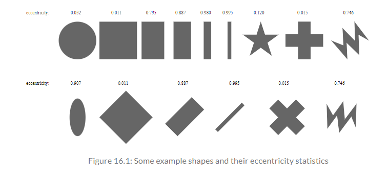
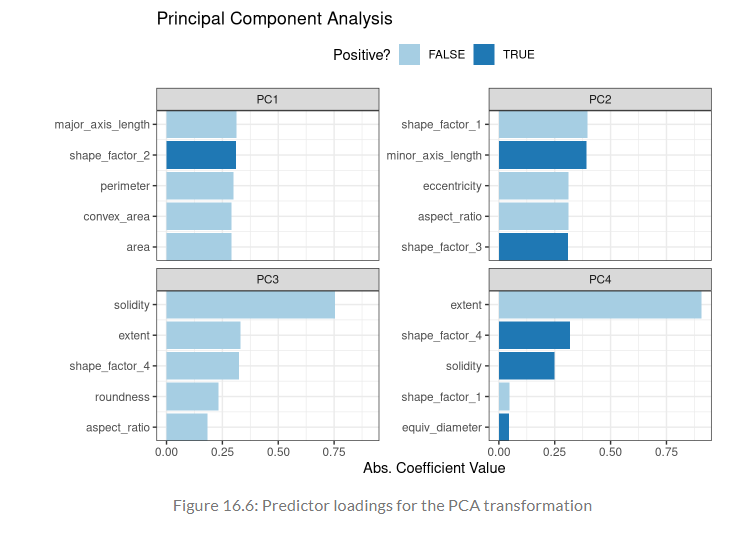
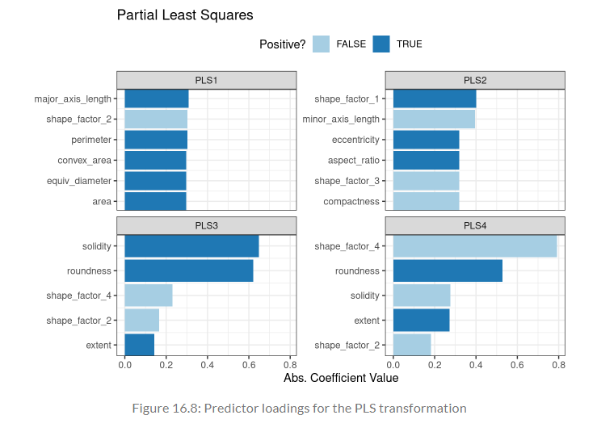
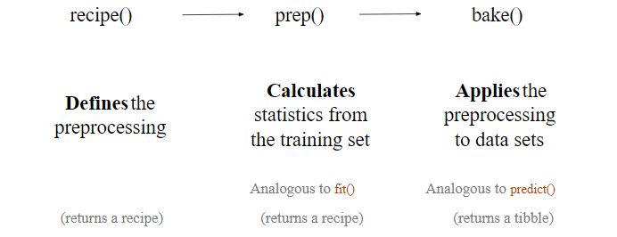
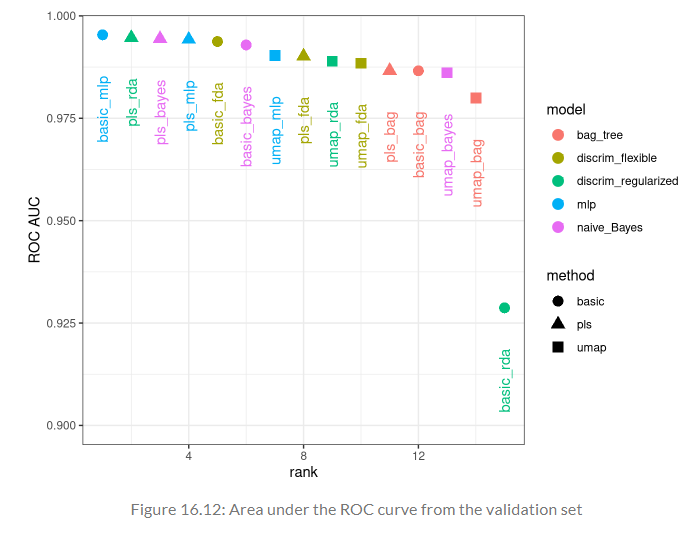

```{r setup, include = FALSE}
library(learnr)
library(tutorial.helpers)
library(knitr)

library(tidymodels)
library(beans)
library(corrplot)
library(bestNormalize)
library(ggforce)
library(fastICA)
library(embed)
library(baguette)
library(discrim)
library(mixOmics)
tidymodels_prefer()

knitr::opts_chunk$set(echo = FALSE)
options(tutorial.exercise.timelimit = 60, 
        tutorial.storage = "local") 

set.seed(1601)

bean_split <- initial_split(beans, strata = class, prop = 3/4)
bean_train <- training(bean_split)
bean_test <- testing(bean_split)

set.seed(1602)

bean_val <- validation_split(bean_train, strata = class, prop = 4/5)

tmwr_cols <- colorRampPalette(c("#91CBD765", "#CA225E"))

bean_rec <- 
  recipe(class ~ ., data = analysis(bean_val$splits[[1]])) |>
  step_zv(all_numeric_predictors()) |>
  step_orderNorm(all_numeric_predictors()) |>
  step_normalize(all_numeric_predictors())

bean_rec_trained <- prep(bean_rec)

bean_validation <- 
  bean_val$splits |>
  pluck(1) |>
  assessment()

bean_val_processed <- bake(bean_rec_trained, new_data = bean_validation)


p1 <- 
  bean_validation |> 
  ggplot(aes(x = area)) +
  geom_histogram(bins = 30, alpha = 1/3, color = "white", fill = "blue") +
  ggtitle("Original validation set data")

p2 <-
  bean_val_processed |> 
  ggplot(aes(x = area)) + 
  geom_histogram(bins = 30, color = "white", fill = "red", alpha = 1/3) + 
  ggtitle("Processed validation set data")

plot_validation_results <- function(recipe, dat = assessment(bean_val$splits[[1]])) {
  recipe |>
    prep() |>
    bake(new_data = dat) |>
    ggplot(aes(x = .panel_x, y = .panel_y, color = class, fill = class)) +
    geom_point(alpha = 0.4, size = 0.5) +
    geom_autodensity(alpha = 0.3) +
    facet_matrix(vars(-class), layer.diag = 2) + 
    scale_color_brewer(palette = "Dark2") + 
    scale_fill_brewer(palette = "Dark2")
}


UMAP_plot <- bean_rec_trained |>
  step_umap(all_numeric_predictors(), num_comp = 4) |>
  plot_validation_results() +
  ggtitle("UMAP")

mlp_spec <- 
  mlp(hidden_units = tune(), penalty = tune(), epochs = tune()) |>
  set_engine('nnet') |>
  set_mode('classification')

bagging_spec <- 
  bag_tree() |>
  set_engine('rpart') |>
  set_mode('classification')

fda_spec <- 
  discrim_flexible(prod_degree = tune()) |>
  set_engine('earth')

rda_spec <- 
  discrim_regularized(frac_common_cov = tune(), frac_identity = tune()) |>
  set_engine('klaR')

bayes_spec <- 
  naive_Bayes() |>
  set_engine('klaR')

bean_rec1 <- 
  recipe(class ~ ., data = bean_train) |>
  step_zv(all_numeric_predictors()) |>
  step_orderNorm(all_numeric_predictors()) |>
  step_normalize(all_numeric_predictors())

pls_rec <- 
  bean_rec |> 
  step_pls(all_numeric_predictors(), outcome = "class", num_comp = tune())

umap_rec <- 
  bean_rec |>
  step_umap(
    all_numeric_predictors(),
    outcome = "class",
    num_comp = tune(),
    neighbors = tune(),
    min_dist = tune()
  )

ctrl <- 
  control_grid(parallel_over = "everything")

bean_res <-
  workflow_set(
    preproc = list(basic = class ~., pls = pls_rec, umap = umap_rec), 
    models = list(bayes = bayes_spec, fda = fda_spec,
                  rda = rda_spec, bag = bagging_spec,
                  mlp = mlp_spec)
  ) |>
  workflow_map(
    verbose = TRUE,
    seed = 1603,
    resamples = bean_val,
    grid = 10,
    metrics = metric_set(roc_auc),
    control = ctrl
  )

# AK: Getting a lot of warnings/weird output when running "bean_res"


rankings <-
  rank_results(bean_res, select_best = TRUE) |>
  mutate(method = map_chr(wflow_id, ~ str_split(.x, "_", simplify = TRUE)[1]))

rda_res <- 
  bean_res |> 
  extract_workflow("pls_rda") |>
  finalize_workflow(
    bean_res |> 
      extract_workflow_set_result("pls_rda") |>
      select_best(metric = "roc_auc")
  ) |>
  last_fit(split = bean_split, metrics = metric_set(roc_auc))

```

```{r copy-code-chunk, child = system.file("child_documents/copy_button.Rmd", package = "tutorial.helpers")}
```

```{r info-section, child = system.file("child_documents/info_section.Rmd", package = "tutorial.helpers")}
```

## Introduction
### 

<!-- Two to four sentence about the main topics covered in this tutorial. Why are we here? What will students get out of giving you 90 minutes of their lives? How does this tutorial connect to other tutorials? -->

## A Picture Is Worth A Thousand...Beans
### 

Dimensionality reduction transforms a data set from a high-dimensional space into a low-dimensional space, and can be a good choice when you suspect there are “too many” variables. An excess of variables, usually predictors, can be a problem because it is difficult to understand or visualize data in higher dimensions.

### Exercise 1

Load the **tidymodels** library using `library()`.

```{r a-picture-is-worth-a-1, exercise = TRUE}

```

```{r a-picture-is-worth-a-1-hint-1, eval = FALSE}
library(...)
```

```{r include = FALSE}
library(tidymodels)
```

### 

Let’s walk through how to use dimensionality reduction with recipes for an example data set. Murat Koklu, an Academician at Selcuk University, and İlker Ali ÖZKAN, a Faculty of Technology at Selcuk University, published a data set of visual characteristics of dried beans and described methods for determining the varieties of dried beans in an image. While the dimensionality of these data is not very large compared to many real-world modeling problems, it does provide a nice working example to demonstrate how to reduce the number of features.

### Exercise 2

Type in `tidymodels_prefer()` to get rid of naming conflicts.

```{r a-picture-is-worth-a-2, exercise = TRUE}

```

```{r a-picture-is-worth-a-2-hint-1, eval = FALSE}
...()
```

```{r include = FALSE}
tidymodels_prefer()
```

### 

This is an excerpt from Koklu's and ÖZKAN's manuscript:

"The primary objective of this study is to provide a method for obtaining uniform seed varieties from crop production, which is in the form of population, so the seeds are not certified as a sole variety. Thus, a computer vision system was developed to distinguish seven different registered varieties of dry beans with similar features in order to obtain uniform seed classification. For the classification model, images of 13,611 grains of 7 different registered dry beans were taken with a high-resolution camera".

### Exercise 3

The data created by Koklu and ÖZKAN will be used. Load the **beans** package using `library()`. 

```{r a-picture-is-worth-a-3, exercise = TRUE}

```

```{r a-picture-is-worth-a-3-hint-1, eval = FALSE}
library(...)
```

```{r include = FALSE}
library(beans)
```

### 

Each image in the data contains multiple beans. The process of determining which pixels correspond to a particular bean is called *image segmentation*. These pixels can be analyzed to produce features for each bean, such as color and morphology (i.e., shape). These features are then used to model the outcome (bean variety) because different bean varieties look different.

The training data come from a set of manually labeled images, and this data set is used to create a predictive model that can distinguish between seven bean varieties: Cali, Horoz, Dermason, Seker, Bombay, Barbunya, and Sira. Producing an effective model can help manufacturers quantify the homogeneity of a batch of beans.

### Exercise 4

Lets take a look at the `beans` data set. In the code chunk below, type in `beans` and press "Run code".

```{r a-picture-is-worth-a-4, exercise = TRUE}

```

```{r a-picture-is-worth-a-4-hint-1, eval = FALSE}
beans
```

```{r include = FALSE}
beans
```

### 

As you can see, this data set of 58 beans contains various details about each bean, including the `area`, `compactness`, and `aspect_ratio`. 

### Exercise 5

Type in `set.seed()` and pass in `1601`.

```{r a-picture-is-worth-a-5, exercise = TRUE}

```

```{r a-picture-is-worth-a-5-hint-1, eval = FALSE}
set.seed(...)
```

```{r include = FALSE}
set.seed(1601)
```

### 

There are numerous methods for quantifying shapes of objects. Many are related to the boundaries or regions of the object of interest. One feature is the area: the area (or size) can be estimated using the number of pixels in the object or the size of the convex hull around the object.

### Exercise 6

Now, lets split the data and create a training and testing set. In the code chunk below, type in `initial_split()`. Inside this function, type in `beans` and set `strata` to `class`.

```{r a-picture-is-worth-a-6, exercise = TRUE}

```

```{r a-picture-is-worth-a-6-hint-1, eval = FALSE}
initial_split(..., strata = ...)
```

```{r include = FALSE}
initial_split(beans, strata = class)
```

### 

As you can see, this code splits the data into a training and testing set, with 13611 total values. However, the desired split should be 75% training and 25 testing, which is not the case as of right now.

### Exercise 7

Copy the previous code. Inside `initial_split()`, set `prop` to `3/4`.

```{r a-picture-is-worth-a-7, exercise = TRUE}

```

<button onclick = "transfer_code(this)">Copy previous code</button>

```{r a-picture-is-worth-a-7-hint-1, eval = FALSE}
initial_split(beans, strata = class, prop = ... / ...)
```

```{r include = FALSE}
initial_split(beans, strata = class, prop = 3/4)
```

### 

As you can see, the data has successfully been split with the correct proportion (75% training and 25% testing).

### Exercise 8

Copy the previous code and assign it to a new variable named `bean_split`.

```{r a-picture-is-worth-a-8, exercise = TRUE}

```

<button onclick = "transfer_code(this)">Copy previous code</button>

```{r a-picture-is-worth-a-8-hint-1, eval = FALSE}
... <- initial_split(beans, strata = class, prop = 3/4)
```

```{r include = FALSE}
bean_split <- initial_split(beans, strata = class, prop = 3/4)
```

### 

Another methods for quantifying shapes of objects include perimeter: the perimeter can be measured using the number of pixels in the boundary as well as the area of the bounding box (the smallest rectangle enclosing an object).

### Exercise 9

Now, let's extract the training and testing data. In the code chunk below, type in `training()`, passing in `bean_split`.

```{r a-picture-is-worth-a-9, exercise = TRUE}

```

```{r a-picture-is-worth-a-9-hint-1, eval = FALSE}
training(...)
```

```{r include = FALSE}
training(bean_split)
```

### 

As a reminder, `training()` is used to extract the training data from the data split. As you can see from the output, the training data contains 10,206 rows.

### Exercise 10

Copy the previous code and assign it to a new variable named `bean_train`.

```{r a-picture-is-worth-a-10, exercise = TRUE}

```

<button onclick = "transfer_code(this)">Copy previous code</button>

```{r a-picture-is-worth-a-10-hint-1, eval = FALSE}
... <- training(bean_split)
```

```{r include = FALSE}
bean_train <- training(bean_split)
```

### 

The *major axis* quantifies the longest line connecting the most extreme parts of the object. The *minor axis* is perpendicular to the major axis.

### Exercise 11

Now, let's extract the testing data. In the code chunk below, type in `testing()` and pass in `bean_split`.

```{r a-picture-is-worth-a-11, exercise = TRUE}

```

```{r a-picture-is-worth-a-11-hint-1, eval = FALSE}
testing(...)
```

```{r include = FALSE}
testing(bean_split)
```

### 

Just like `training()`, `testing()` is used to extract the testing data from the data split. As you can see from the output, the training data contains 3,404 rows.

### Exercise 12

Copy the previous code and assign it to a new variable named `bean_test`.

```{r a-picture-is-worth-a-12, exercise = TRUE}

```

<button onclick = "transfer_code(this)">Copy previous code</button>

```{r a-picture-is-worth-a-12-hint-1, eval = FALSE}
... <- testing(bean_split)
```

```{r include = FALSE}
bean_test <- testing(bean_split)
```

### 

The compactness of an object can be measured using the ratio of the object’s area to the area of a circle with the same perimeter. For example, the symbols “•” and “×” have very different compactness.

### Exercise 13

Type in `set.seed()` and pass in `1602`. 

```{r a-picture-is-worth-a-13, exercise = TRUE}

```

```{r a-picture-is-worth-a-13-hint-1, eval = FALSE}
set.seed(...)
```

```{r include = FALSE}
set.seed(1602)
```

### 

There are also different measures of how *elongated* or oblong an object is. For example, the *eccentricity* statistic is the ratio of the major and minor axes. There are also related estimates for roundness and convexity.

### Exercise 14

Now, lets create a validation set of `bean_train`. In the code chunk below, type in `validation_split()` and type in `bean_train`. Also, set `strata` to `class`.

```{r a-picture-is-worth-a-14, exercise = TRUE}

```

```{r a-picture-is-worth-a-14-hint-1, eval = FALSE}
validation_split(..., strata = ...)
```

```{r include = FALSE}
validation_split(bean_train, strata = class)
```

### 

Notice the eccentricity for the different shapes in the image below:

```{r}

```

Shapes such as circles and squares have low eccentricity while oblong shapes have high values. Also, the metric is unaffected by the rotation of the object.

### Exercise 15

Copy the previous code. Inside `validation_split()`, set `prop` to `4/5`.

```{r a-picture-is-worth-a-15, exercise = TRUE}

```

<button onclick = "transfer_code(this)">Copy previous code</button>

```{r a-picture-is-worth-a-15-hint-1, eval = FALSE}
validation_split(bean_train, strata = class, prop = .../...)
```

```{r include = FALSE}
validation_split(bean_train, strata = class, prop = 3/4)
```

### 

Looking at the images from the previous exercise, many of them features have high correlations; objects with large areas are more likely to have large perimeters. There are often multiple methods to quantify the same underlying characteristics (e.g., size).

### Exercise 16

Copy the previous code and assign it to a new variable named `bean_val`.

```{r a-picture-is-worth-a-16, exercise = TRUE}

```

<button onclick = "transfer_code(this)">Copy previous code</button>

```{r a-picture-is-worth-a-16-hint-1, eval = FALSE}
... <- validation_split(bean_train, strata = class, prop = 3/4)
```

```{r include = FALSE}
bean_val <- validation_split(bean_train, strata = class, prop = 3/4)
```

### 

As a reminder, a validation split takes a single random sample (without replacement) of the original data set to be used for analysis. This sample is then used to evaluate a model's performance and can also be used to tune hyperparameters.

### Exercise 17

Looking at the output of `bean_val`, you can see that there is 1 row, which contains a list. Lets use sub-setting to see the contents of the list.

In the code chunk below, type in `bean_val$splits[[]]`. Inside the double brackets, type in `1`.

```{r a-picture-is-worth-a-17, exercise = TRUE}

```

```{r a-picture-is-worth-a-17-hint-1, eval = FALSE}
bean_val$splits[[...]]
```

```{r include = FALSE}
bean_val$splits[[1]]
```

### 

The double bracket operator, `[[`, and dollar sign, `$`, can be used to extract columns out of a data frame. `[[` can access by position *or* by name, and `$` is specialized for access *by name*.

To visually assess how well different methods perform, the methods on the training set (n = 8163 beans) can be estimated and the results using the validation set (n = 2043) can be displayed.

### Exercise 18

Before beginning any dimensionality reduction, let's spend some time investigating the data. Since it's now known that many of these shape features are probably measuring similar concepts, let’s take a look at the correlation structure of the data.

Load the **corrplot** library using `library()`.

```{r a-picture-is-worth-a-18, exercise = TRUE}

```

```{r a-picture-is-worth-a-18-hint-1, eval = FALSE}
library(...)
```

```{r include = FALSE}
library(corrplot)
```

### 

**corrplot** is a graphical display of a correlation matrix and confidence intervals.

### Exercise 19

In the code chunk below, type in `colorRampPalette()`. Inside this function, type in `c("#91CBD765", "#CA225E")`.

```{r a-picture-is-worth-a-19, exercise = TRUE}

```

```{r a-picture-is-worth-a-19-hint-1, eval = FALSE}
colorRampPalette(c("...", "..."))
```

```{r include = FALSE}
colorRampPalette(c("#91CBD765", "#CA225E"))
```

### 

`colorRampPalette()` is a function that interpolates a set of given colors to create new color palettes and color ramps. The strings that were passed in are color codes represented as hexadecimal values.

### Exercise 20

Copy the previous code and assign it to a new variable named `tmwr_cols`.

```{r a-picture-is-worth-a-20, exercise = TRUE}

```

<button onclick = "transfer_code(this)">Copy previous code</button>

```{r a-picture-is-worth-a-20-hint-1, eval = FALSE}
... <- colorRampPalette(c("#91CBD765", "#CA225E"))
```

```{r include = FALSE}
tmwr_cols <- colorRampPalette(c("#91CBD765", "#CA225E"))
```

### 

In the bean data, 16 morphology features were computed: area, perimeter, major axis length, minor axis length, aspect ratio, eccentricity, convex area, equiv diameter, extent, solidity, roundness, compactness, shape factor 1, shape factor 2, shape factor 3, and shape factor 4.

### Exercise 21

Now, lets create a visual of the correlation matrix of the predictors. Start by piping `bean_train` to `select()`. Inside this function, type in `-class`.

```{r a-picture-is-worth-a-21, exercise = TRUE}

```

```{r a-picture-is-worth-a-21-hint-1, eval = FALSE}
bean_train |>
  select(...)
```

```{r include = FALSE}
bean_train |>
  select(-class)
```

### 

It is important to maintain good data discipline when evaluating dimensionality reduction techniques, especially if you will use them within a model.

### Exercise 22

Copy the previous code and pipe it to `cor()`. 

```{r a-picture-is-worth-a-22, exercise = TRUE}

```

<button onclick = "transfer_code(this)">Copy previous code</button>

```{r a-picture-is-worth-a-22-hint-1, eval = FALSE}
bean_train |>
  select(-class) |>
  ...()
```

```{r include = FALSE}
bean_train |>
  select(-class) |>
  cor()
```

### 

`cor()` is a function that computes the correlation coefficient between numeric variables in a dataset. 

### Exercise 23

Copy the previous code and pipe it to `corrplot()`. Inside this function, set `col` to `tmwr_cols(200)` and `tl.col` to `"black"`.

```{r a-picture-is-worth-a-23, exercise = TRUE}

```

<button onclick = "transfer_code(this)">Copy previous code</button>

```{r a-picture-is-worth-a-23-hint-1, eval = FALSE}
bean_train |>
  select(-class) |>
  cor() |>
  ...(col = tmwr_cols(...), tl.col = "...")
```

```{r include = FALSE}
bean_train |>
  select(-class) |>
  cor() |>
  corrplot(col = tmwr_cols(200), tl.col = "black")
```

### 

This visualization is the correlation matrix of the predictors with variables ordered via clustering. The legend on the right side represents the level of correlation. As you can see, many of these predictors are highly correlated, such as area and perimeter or shape factors 2 and 3.

While it isn't done here,  it is also important to see if this correlation structure significantly changes across the outcome categories. This can help create better models.

### 

Congrats! You have analyzed the `beans` data set, creating various splits and a visual of the correlation matrix of the predictors.

## A Starter Recipe
### 

It’s time to look at the beans data in a smaller space. Let's start with a basic recipe to preprocess the data prior to any dimensionality reduction steps. Several predictors are ratios and so are likely to have skewed distributions. Such distributions can wreak havoc on variance calculations (such as the ones used in PCA).

### Exercise 1

To start, load the **bestNormalize** library using `library()`.

```{r a-starter-recipe-1, exercise = TRUE}

```

```{r a-starter-recipe-1-hint-1, eval = FALSE}
library(...)
```

```{r include = FALSE}
library(bestNormalize)
```

### 

Dimensionality reduction can be used either in feature engineering or in exploratory data analysis. For example, in high-dimensional biology experiments, one of the first tasks, before any modeling, is to determine if there are any unwanted trends in the data (e.g., effects not related to the question of interest, such as lab-to-lab differences).

### Exercise 2

Let's use the training data from the `bean_val` split object to create a recipe. In the code chunk below, type in `recipe()`. Inside this function, type in `class ~ .` and set `data` to `analysis(bean_val$splits[[1]])`.

```{r a-starter-recipe-2, exercise = TRUE}

```

```{r a-starter-recipe-2-hint-1, eval = FALSE}
...(class ~ ., data = ...(bean_val$splits[[...]])) 
```

```{r include = FALSE}
recipe(class ~ ., data = analysis(bean_val$splits[[1]])) 
```

### 

Debugging the data is difficult when there are hundreds of thousands of dimensions, and dimensionality reduction can be an aid for exploratory data analysis.

### Exercise 3

Copy the previous code and pipe it to `step_zv()`. Inside this function, type in `all_numeric_predictors()`.

```{r a-starter-recipe-3, exercise = TRUE}

```

<button onclick = "transfer_code(this)">Copy previous code</button>

```{r a-starter-recipe-3-hint-1, eval = FALSE}
recipe(class ~ ., data = analysis(bean_val$splits[[1]])) |>
  step_zv(...())
```

```{r include = FALSE}
recipe(class ~ ., data = analysis(bean_val$splits[[1]])) |>
  step_zv(all_numeric_predictors())
```

### 

`step_zv()` creates a specification of a recipe step that will remove variables that contain only a single value.

### Exercise 4

Copy the previous code and pipe it to `step_orderNorm()`. Inside this function, type in `all_numeric_predictors()`.

```{r a-starter-recipe-4, exercise = TRUE}

```

<button onclick = "transfer_code(this)">Copy previous code</button>

```{r a-starter-recipe-4-hint-1, eval = FALSE}
recipe(class ~ ., data = analysis(bean_val$splits[[1]])) |>
  step_zv(all_numeric_predictors()) |>
  step_orderNorm(...())
```

```{r include = FALSE}
recipe(class ~ ., data = analysis(bean_val$splits[[1]])) |>
  step_zv(all_numeric_predictors()) |>
  step_orderNorm(all_numeric_predictors())
```

### 

`step_orderNorm()` is a function that creates a specification of a recipe step that will transform data using the ORQ (orderNorm) transformation, which approximates the "true" normalizing transformation if one exists.

### Exercise 5

Copy the previous code and pipe it to `step_normalize()`. Inside this function, type `all_numeric_predictors()`.

```{r a-starter-recipe-5, exercise = TRUE}

```

<button onclick = "transfer_code(this)">Copy previous code</button>

```{r a-starter-recipe-5-hint-1, eval = FALSE}
recipe(class ~ ., data = analysis(bean_val$splits[[1]])) |>
  step_zv(all_numeric_predictors()) |>
  step_orderNorm(all_numeric_predictors()) |>
  step_normalize(...())
```

```{r include = FALSE}
recipe(class ~ ., data = analysis(bean_val$splits[[1]])) |>
  step_zv(all_numeric_predictors()) |>
  step_orderNorm(all_numeric_predictors()) |>
  step_normalize(all_numeric_predictors())
```

### 

`step_normalize()` creates a *specification* of a recipe step that will normalize numeric data to have a standard deviation of one and a mean of zero.

### Exercise 6

Copy the previous code and assign it to a new variable named `bean_rec`.

```{r a-starter-recipe-6, exercise = TRUE}

```

<button onclick = "transfer_code(this)">Copy previous code</button>

```{r a-starter-recipe-6-hint-1, eval = FALSE}
... <- 
  recipe(class ~ ., data = analysis(bean_val$splits[[1]])) |>
  step_zv(all_numeric_predictors()) |>
  step_orderNorm(all_numeric_predictors()) |>
  step_normalize(all_numeric_predictors())
```

```{r include = FALSE}
bean_rec <- 
  recipe(class ~ ., data = analysis(bean_val$splits[[1]])) |>
  step_zv(all_numeric_predictors()) |>
  step_orderNorm(all_numeric_predictors()) |>
  step_normalize(all_numeric_predictors())
```

### 

Remember that when invoking the `recipe()` function, the steps are not estimated or executed in any way.

### 

This recipe will be extended with additional steps for the dimensionality reduction analyses. Before doing so, let’s go over how a recipe can be used outside of a workflow.


## Recipes In The Wild
### 

A workflow containing a recipe uses `fit()` to estimate the recipe and model, then `predict()` to process the data and make model predictions. There are analogous functions in the recipes package that can be used for the same purpose:

- `prep(recipe, training)` fits the recipe to the training set.
- `bake(recipe, new_data)` applies the recipe operations to `new_data`

### Exercise 1

Let’s estimate `bean_rec` using the training set data, with `prep()`. In the code chunk below, type in `prep()` and pass in `bean_rec`.

```{r recipes-in-the-wild-1, exercise = TRUE}

```

```{r recipes-in-the-wild-1-hint-1, eval = FALSE}
prep(...)
```

```{r include = FALSE}
prep(bean_rec)
```

### 

Note in the output that the steps have been trained and that the selectors are no longer general (i.e., `all_numeric_predictors()`); they now show the actual columns that were selected. 

Also, `prep(bean_rec)` does not require the `training` argument. You can pass any data into that argument, but omitting it means that the original `data` from the call to `recipe()` will be used. In our case, this was the training set data.

### Exercise 2

Copy the previous code and assign it to a new variable named `bean_rec_trained`.

```{r recipes-in-the-wild-2, exercise = TRUE}

```

<button onclick = "transfer_code(this)">Copy previous code</button>

```{r recipes-in-the-wild-2-hint-1, eval = FALSE}
... <- prep(bean_rec)
```

```{r include = FALSE}
bean_rec_trained <- prep(bean_rec)
```

### 

Remember that `prep()` for a recipe is like `fit()` for a model.

### Exercise 3

Once new steps are added to this estimated recipe, reapplying `prep()` will estimate only the untrained steps. This will come in handy when different feature extraction methods are tried.

Here is an example of this process. Press "Run code" (Note: This will throw an error, as `cornbread` is not a real predictor. The code below is just an example of adding a step and reapplying `prep()`).

```{r recipes-in-the-wild-3, exercise = TRUE}
bean_rec_trained |> 
  step_dummy(cornbread) |>  # <- not a real predictor
  prep(verbose = TRUE)
```

```{r include = FALSE}
#bean_rec_trained |> 
#  step_dummy(cornbread) |>  # <- not a real predictor
#  prep(verbose = TRUE)
```

### 

In geenral, if you encounter errors when working with a recipe, `prep()` can be used with its `verbose` option to troubleshoot.

### Exercise 4

Another option that can help you understand what happens in the analysis is `log_changes`. In the code chunk below, pipe `bean_rec` to `prep()`. Inside this function, set `log_changes` to `TRUE`.

```{r recipes-in-the-wild-4, exercise = TRUE}

```

```{r recipes-in-the-wild-4-hint-1, eval = FALSE}
bean_rec |> 
  prep(... = ...)
```

```{r include = FALSE}
bean_rec |> 
  prep(log_changes = TRUE)
```

### 

Since `prep()` has to execute the recipe as it proceeds, it may be advantageous to keep this version of the training set so that, if that data set is to be used later, redundant calculations can be avoided. However, if the training set is big, it may be problematic to keep such a large amount of data in memory. Use `retain = FALSE` to avoid this.

### Exercise 5

Using `bake()` with a recipe is much like using `predict()` with a model; the operations estimated from the training set are applied to any data, like testing data or new data at prediction time.

In the code chunk below, pipe `bean_val$splits` to `pluck()`. Inside this function, type in `1`. 

```{r recipes-in-the-wild-5, exercise = TRUE}

```

```{r recipes-in-the-wild-5-hint-1, eval = FALSE}
bean_val$splits |>
  ...(1)
```

```{r include = FALSE}
bean_val$splits |>
  pluck(1)
```

### 

`pluck()` implements a generalized form of the double bracket operator, `[[`, that allow you to index deeply and flexibly into data structures.

### Exercise 6

Copy the previous code and pipe it to `assessment()`. Then, press "Run code".

```{r recipes-in-the-wild-6, exercise = TRUE}

```

<button onclick = "transfer_code(this)">Copy previous code</button>

```{r recipes-in-the-wild-6-hint-1, eval = FALSE}
bean_val$splits |>
  pluck(1) |>
  ...()
```

```{r include = FALSE}
bean_val$splits |>
  pluck(1) |>
  assessment()
```

### 

In this scenario, `assessment()` returns the code as a data frame (specifically a tibble).

### Exercise 7

Copy the previous code and assign it to a new variable named `bean_validation`.

```{r recipes-in-the-wild-7, exercise = TRUE}

```

<button onclick = "transfer_code(this)">Copy previous code</button>

```{r recipes-in-the-wild-7-hint-1, eval = FALSE}
... <- 
  bean_val$splits |>
  pluck(1) |>
  assessment()
```

```{r include = FALSE}
bean_validation <- 
  bean_val$splits |>
  pluck(1) |>
  assessment()
```

### 

This [link](https://recipes.tidymodels.org/reference/bake.html) contains more information about `bake()`.

### Exercise 8

Now, lets process `bean_validation` with `bake()`. In the code chunk below, type in `bake()`. Inside this funciton, type in `bean_rec_trained` and set `new_data` to `bean_validation`.

```{r recipes-in-the-wild-8, exercise = TRUE}

```

```{r recipes-in-the-wild-8-hint-1, eval = FALSE}
bake(..., new_data = ...)
```

```{r include = FALSE}
bake(bean_rec_trained, new_data = bean_validation)
```

### 

By using `bake()`, the validation set samples have now been processed.

### Exercise 9

Copy the previous code and assign it to a new variable named `bean_val_processed`.

```{r recipes-in-the-wild-9, exercise = TRUE}

```

<button onclick = "transfer_code(this)">Copy previous code</button>

```{r recipes-in-the-wild-9-hint-1, eval = FALSE}
... <- bake(bean_rec_trained, new_data = bean_validation)
```

```{r include = FALSE}
bean_val_processed <- bake(bean_rec_trained, new_data = bean_validation)
```

### 

Another potential consequence of having a multitude of predictors is possible harm to a model. The simplest example is a method like ordinary linear regression where the number of predictors should be less than the number of data points used to fit the model. 

### Exercise 10

Now, lets create 2 histograms of the `area` predictor that show the before and after of the prepared recipe. When completed, the histograms will look like this:

```{r}
p1
p2
```

In the code chunk below, pipe `bean_validation` to `ggplot()`. Inside this function, using `aes()`, set `x` to `area`.

```{r recipes-in-the-wild-10, exercise = TRUE}

```

```{r recipes-in-the-wild-10-hint-1, eval = FALSE}
bean_validation |> 
  ...(aes(x = ...))
```

```{r include = FALSE}
bean_validation |> 
  ggplot(aes(x = area))
```

### 

Another potential consequence of having a multitude of predictors is multicollinearity, where between-predictor correlations can negatively impact the mathematical operations used to estimate a model.

### Exercise 11

Copy the previous code and add `geom_histogram()`. Inside this function, set `bins` to `30` and `alpha` to `1/3`. 

```{r recipes-in-the-wild-11, exercise = TRUE}

```

<button onclick = "transfer_code(this)">Copy previous code</button>

```{r recipes-in-the-wild-11-hint-1, eval = FALSE}
bean_validation |> 
  ggplot(aes(x = area)) +
  geom_histogram(bins = ..., alpha = ...)
```

```{r include = FALSE}
bean_validation |> 
  ggplot(aes(x = area)) +
  geom_histogram(bins = 30, alpha = 1/3)
```

### 

If there are an extremely large number of predictors, it is fairly unlikely that there are an equal number of real underlying effects. Predictors may be measuring the same latent effect(s), and thus such predictors will be highly correlated. Many dimensionality reduction techniques thrive in this situation. In fact, most can be effective only when there are such relationships between predictors that can be exploited.

### Exercise 12

Copy the previous code. Inside `geom_histogram()`, set `color` to `"white"` and `fill` to `"blue"`.

```{r recipes-in-the-wild-12, exercise = TRUE}

```

<button onclick = "transfer_code(this)">Copy previous code</button>

```{r recipes-in-the-wild-12-hint-1, eval = FALSE}
bean_validation |> 
  ggplot(aes(x = area)) +
  geom_histogram(bins = 30, alpha = 1/3, color = "...", fill = "...")
```

```{r include = FALSE}
bean_validation |> 
  ggplot(aes(x = area)) +
  geom_histogram(bins = 30, alpha = 1/3, color = "white", fill = "blue")
```

### 

When starting a new modeling project, reducing the dimensions of the data may provide some intuition about how hard the modeling problem may be.

### Exercise 13

Copy the previous code and add `ggtitle()`. Inside this function, type in `"Original validation set data"`. The final graph should look like this:

```{r}
p1
```

```{r recipes-in-the-wild-13, exercise = TRUE}

```

<button onclick = "transfer_code(this)">Copy previous code</button>

```{r recipes-in-the-wild-13-hint-1, eval = FALSE}
bean_validation |> 
  ggplot(aes(x = area)) +
  geom_histogram(bins = 30, alpha = 1/3, color = "white", fill = "blue") +
  ggtitle("...")
```

```{r include = FALSE}
bean_validation |> 
  ggplot(aes(x = area)) +
  geom_histogram(bins = 30, alpha = 1/3, color = "white", fill = "blue") +
  ggtitle("Original validation set data")
```

### 

`ggtitle()` is another way to add a title to a graph. `labs()` also has the capibility of doing this, but it's good to know other ways as well. 

### Exercise 14

Now, lets create the processed validation set graph, which will look like this:

```{r}
p2
```

Pipe `bean_val_processed` to `ggplot()`. Inside this function, using `aes()`, set `x` to `area`.

```{r recipes-in-the-wild-14, exercise = TRUE}

```

```{r recipes-in-the-wild-14-hint-1, eval = FALSE}
bean_val_processed |>
  ...(aes(x = ...))
```

```{r include = FALSE}
bean_val_processed |>
  ggplot(aes(x = area))
```

### 

Principal component analysis (PCA) is one of the most straightforward methods for reducing the number of columns in the data set because it relies on linear methods and is unsupervised (i.e., does not consider the outcome data).

### Exercise 15

Copy the previous code and add `geom_histogram()`. Inside this function, set `bins` to `30`, `alpha` to `1/3`, `color` to `"white"`, and `fill` to `"red"`.

```{r recipes-in-the-wild-15, exercise = TRUE}

```

<button onclick = "transfer_code(this)">Copy previous code</button>

```{r recipes-in-the-wild-15-hint-1, eval = FALSE}
bean_val_processed |>
  ggplot(aes(x = area)) +
  geom_histogram(bins = ..., alpha = ..., color = "...", fill = "...")
```

```{r include = FALSE}
bean_val_processed |>
  ggplot(aes(x = area)) +
  geom_histogram(bins = 30, alpha = 1/3, color = "white", fill = "red")
```

### 

For a high-dimensional classification problem, an initial plot of the main PCA components might show a clear separation between the classes. If this is the case, then it is fairly safe to assume that a linear classifier might do a good job. However, the converse is not true; a lack of separation does not mean that the problem is insurmountable.

### Exercise 16

Copy the previous code and add `ggtitle()`. Inside this function, type `"Processed validation set data"`. The final graph should look like this:

```{r}
p2
```

```{r recipes-in-the-wild-16, exercise = TRUE}

```

<button onclick = "transfer_code(this)">Copy previous code</button>

```{r recipes-in-the-wild-16-hint-1, eval = FALSE}
bean_val_processed |>
  ggplot(aes(x = area)) +
  geom_histogram(bins = 30, alpha = 1/3, color = "white", fill = "red") +
  ggtitle("...")
```

```{r include = FALSE}
bean_val_processed |>
  ggplot(aes(x = area)) +
  geom_histogram(bins = 30, alpha = 1/3, color = "white", fill = "red") +
  ggtitle("Processed validation set data")
```

### 

As you can see, the processed validation set data is much more different than the original validation set data.

### Exercise 17

As previously mentioned, using `prep(recipe, retain = TRUE)` keeps the existing processed version of the training set in the recipe. This enables the user to use `bake(recipe, new_data = NULL)`, which returns that data set without further computations.

Press "Run code".

```{r recipes-in-the-wild-17, exercise = TRUE}
bake(bean_rec_trained, new_data = NULL) |> nrow()

bean_val$splits |> pluck(1) |> analysis() |> nrow()
```

```{r include = FALSE}
bake(bean_rec_trained, new_data = NULL) |> nrow()

bean_val$splits |> pluck(1) |> analysis() |> nrow()
```

### 

If the training set is not pathologically large, using this value of `retain` can save a lot of computational time.

Also, additional selectors can be used in the call to specify which columns to return. The default selector is `everything()`, but more specific directives can be used.

### 

Congrats! You have learned how to bake a recipe with the use of `bake()`. 


## Feature Extraction Techniques
### 

Since recipes are the primary option in tidymodels for dimensionality reduction, let’s write a function that will estimate the transformation and plot the resulting data in a scatter plot matrix via the **ggforce** package.

### Exercise 1

Load the **ggforce** package using `library()`.

```{r feature-extraction-t-1, exercise = TRUE}

```

```{r feature-extraction-t-1-hint-1, eval = FALSE}
library(...)
```

```{r include = FALSE}
library(ggforce)
```

### 

**ggforce** is an accelerated version of the **ggplot2** package.

### Exercise 2

Now, lets start creating the function. In the code chunk below, type in `function(){}`. Inside the parenthesis, type in `recipe` and set `data` to `assessment(bean_val$splits[[1]])`.

```{r feature-extraction-t-2, exercise = TRUE}

```

```{r feature-extraction-t-2-hint-1, eval = FALSE}
function(..., dat = ...(bean_val$splits[[...]])) {
  
}
```

```{r include = FALSE}
function(recipe, dat = assessment(bean_val$splits[[1]])) {
  
}
```

### 

Methods such as PCA represent the original predictors using a smaller subset of new features. All of the original predictors are required to compute these new features. The exception to this are sparse methods that have the ability to completely remove the impact of predictors when creating the new features.

### Exercise 3

Copy the previous code. Inside the function, pipe `recipe` to `prep()`.

```{r feature-extraction-t-3, exercise = TRUE}

```

<button onclick = "transfer_code(this)">Copy previous code</button>

```{r feature-extraction-t-3-hint-1, eval = FALSE}
function(recipe, dat = assessment(bean_val$splits[[1]])) {
  recipe |>
    ...()
}
```

```{r include = FALSE}
function(recipe, dat = assessment(bean_val$splits[[1]])) {
  recipe |>
    prep()
}
```

### 

[Chapter 19](https://r4ds.had.co.nz/functions.html#choosing-names) of the [*R for Data Science*](https://r4ds.hadley.nz/) textbook provides information about functions `function()`.

### Exercise 4

Copy the previous code. Pipe `prep()` to `bake()`. Inside `bake()`, set `new_data` to `dat`.

```{r feature-extraction-t-4, exercise = TRUE}

```

<button onclick = "transfer_code(this)">Copy previous code</button>

```{r feature-extraction-t-4-hint-1, eval = FALSE}
function(recipe, dat = assessment(bean_val$splits[[1]])) {
  recipe |>
    prep() |>
    ...(new_data = dat)
}
```

```{r include = FALSE}
function(recipe, dat = assessment(bean_val$splits[[1]])) {
  recipe |>
    prep() |>
    bake(new_data = dat)
}
```

### 

The `new_data` argument is a data frame or tibble for whom the preprocessing will be applied. If `NULL` is given to `new_data`, the pre-processed training data will be returned (assuming that `prep(retain = TRUE)` was used).

### Exercise 5

Copy the previous code and pipe `bake()` to `ggplot()`. Inside this function, using `aes()`, set `x` to `.panel_x`, `y` to `.panel_y`, `color` to `class`, and `fill` to `class`.

```{r feature-extraction-t-5, exercise = TRUE}

```

<button onclick = "transfer_code(this)">Copy previous code</button>

```{r feature-extraction-t-5-hint-1, eval = FALSE}
function(recipe, dat = assessment(bean_val$splits[[1]])) {
  recipe |>
    prep() |>
    bake(new_data = dat) |>
    ggplot(...(x = ..., y = ..., color = class, fill = class))
}
```

```{r include = FALSE}
function(recipe, dat = assessment(bean_val$splits[[1]])) {
  recipe |>
    prep() |>
    bake(new_data = dat) |>
    ggplot(aes(x = .panel_x, y = .panel_y, color = class, fill = class))
}
```

### 

Another type of dimensionality reduction tecnique is t-Distributed Stochastic Neighbor Embedding, or t-SNE. t-SNE is particularly useful for reducing high-dimensional data to two or three dimensions, which can then be visualized.

### Exercise 6

Copy the previous code and add `geom_point()` to the graph. Inside `geom_point()`, set `alpha` to `0.4` and `size` to `0.5`. 

```{r feature-extraction-t-6, exercise = TRUE}

```

<button onclick = "transfer_code(this)">Copy previous code</button>

```{r feature-extraction-t-6-hint-1, eval = FALSE}
function(recipe, dat = assessment(bean_val$splits[[1]])) {
  recipe |>
    prep() |>
    bake(new_data = dat) |>
    ggplot(aes(x = .panel_x, y = .panel_y, color = class, fill = class)) +
    geom_point(alpha = ..., size = ...)
}
```

```{r include = FALSE}
function(recipe, dat = assessment(bean_val$splits[[1]])) {
  recipe |>
    prep() |>
    bake(new_data = dat) |>
    ggplot(aes(x = .panel_x, y = .panel_y, color = class, fill = class)) +
    geom_point(alpha = 0.4, size = 0.5)
}
```

### 

As a reminder, the `alpha` argument inside `geom_point()` controls the transparency or opacity of the points.

### Exercise 7

Copy the previous code and add `geom_autodensity()` to the plot. Inside this function, set `alpha` to `0.3`.

```{r feature-extraction-t-7, exercise = TRUE}

```

<button onclick = "transfer_code(this)">Copy previous code</button>

```{r feature-extraction-t-7-hint-1, eval = FALSE}
function(recipe, dat = assessment(bean_val$splits[[1]])) {
  recipe |>
    prep() |>
    bake(new_data = dat) |>
    ggplot(aes(x = .panel_x, y = .panel_y, color = class, fill = class)) +
    geom_point(alpha = 0.4, size = 0.5) +
    geom_autodensity(alpha = ...)
}
```

```{r include = FALSE}
function(recipe, dat = assessment(bean_val$splits[[1]])) {
  recipe |>
    prep() |>
    bake(new_data = dat) |>
    ggplot(aes(x = .panel_x, y = .panel_y, color = class, fill = class)) +
    geom_point(alpha = 0.4, size = 0.5) +
    geom_autodensity(alpha = 0.3)
}
```

### 

`geom_autodensity()` is a distribution geoms that fills the panel and works with discrete and continuous data.

### Exercise 8

Copy the previous code and add `facet_matrix()` to the graph. Inside `facet_matrix()`, type `vars(-class)` and set `layer.diag` to `2`.

```{r feature-extraction-t-8, exercise = TRUE}

```

<button onclick = "transfer_code(this)">Copy previous code</button>

```{r feature-extraction-t-8-hint-1, eval = FALSE}
function(recipe, dat = assessment(bean_val$splits[[1]])) {
  recipe |>
    prep() |>
    bake(new_data = dat) |>
    ggplot(aes(x = .panel_x, y = .panel_y, color = class, fill = class)) +
    geom_point(alpha = 0.4, size = 0.5) +
    geom_autodensity(alpha = 0.3) +
    facet_matrix(...(-class), layer.diag = ...)
}
```

```{r include = FALSE}
function(recipe, dat = assessment(bean_val$splits[[1]])) {
  recipe |>
    prep() |>
    bake(new_data = dat) |>
    ggplot(aes(x = .panel_x, y = .panel_y, color = class, fill = class)) +
    geom_point(alpha = 0.4, size = 0.5) +
    geom_autodensity(alpha = 0.3) +
    facet_matrix(vars(-class), layer.diag = 2)
}
```

### 

`facet_matrix()` allows you to put different data columns into different rows and columns in a grid of panels.

### Exercise 9

Copy the previous code and add `scale_color_brewer()` to the graph. Inside this function, set `palette` to `"Dark2"`.

```{r feature-extraction-t-9, exercise = TRUE}

```

<button onclick = "transfer_code(this)">Copy previous code</button>

```{r feature-extraction-t-9-hint-1, eval = FALSE}
function(recipe, dat = assessment(bean_val$splits[[1]])) {
  recipe |>
    prep() |>
    bake(new_data = dat) |>
    ggplot(aes(x = .panel_x, y = .panel_y, color = class, fill = class)) +
    geom_point(alpha = 0.4, size = 0.5) +
    geom_autodensity(alpha = 0.3) +
    facet_matrix(vars(-class), layer.diag = 2) + 
    scale_color_brewer(palette = "...")
}
```

```{r include = FALSE}
function(recipe, dat = assessment(bean_val$splits[[1]])) {
  recipe |>
    prep() |>
    bake(new_data = dat) |>
    ggplot(aes(x = .panel_x, y = .panel_y, color = class, fill = class)) +
    geom_point(alpha = 0.4, size = 0.5) +
    geom_autodensity(alpha = 0.3) +
    facet_matrix(vars(-class), layer.diag = 2) + 
    scale_color_brewer(palette = "Dark2")
}
```

### 

As a reminder, `scale_color_brewer()` is a function that provides sequential, diverging and qualitative colour schemes.

### Exercise 10

Copy the previous code and add `scale_fill_brewer()` to the graph. Inside this function, set `palette` to `"Dark2"`.

```{r feature-extraction-t-10, exercise = TRUE}

```

<button onclick = "transfer_code(this)">Copy previous code</button>

```{r feature-extraction-t-10-hint-1, eval = FALSE}
function(recipe, dat = assessment(bean_val$splits[[1]])) {
  recipe |>
    prep() |>
    bake(new_data = dat) |>
    ggplot(aes(x = .panel_x, y = .panel_y, color = class, fill = class)) +
    geom_point(alpha = 0.4, size = 0.5) +
    geom_autodensity(alpha = 0.3) +
    facet_matrix(vars(-class), layer.diag = 2) + 
    scale_color_brewer(palette = "Dark2") + 
    scale_fill_brewer(palette = "...")
}
```

```{r include = FALSE}
function(recipe, dat = assessment(bean_val$splits[[1]])) {
  recipe |>
    prep() |>
    bake(new_data = dat) |>
    ggplot(aes(x = .panel_x, y = .panel_y, color = class, fill = class)) +
    geom_point(alpha = 0.4, size = 0.5) +
    geom_autodensity(alpha = 0.3) +
    facet_matrix(vars(-class), layer.diag = 2) + 
    scale_color_brewer(palette = "Dark2") + 
    scale_fill_brewer(palette = "Dark2")
}
```

### 

`scale_fill_brewer()` fills in the data on the graph with a certain color (in this case it is `"Dark2"`).

### Exercise 11

Finally, copy the previous code and assign the entire function to a new variable named `plot_validation_results`.

```{r feature-extraction-t-11, exercise = TRUE}

```

<button onclick = "transfer_code(this)">Copy previous code</button>

```{r feature-extraction-t-11-hint-1, eval = FALSE}
... <- function(recipe, dat = assessment(bean_val$splits[[1]])) {
  recipe |>
    prep() |>
    bake(new_data = dat) |>
    ggplot(aes(x = .panel_x, y = .panel_y, color = class, fill = class)) +
    geom_point(alpha = 0.4, size = 0.5) +
    geom_autodensity(alpha = 0.3) +
    facet_matrix(vars(-class), layer.diag = 2) + 
    scale_color_brewer(palette = "Dark2") + 
    scale_fill_brewer(palette = "Dark2")
}
```

```{r include = FALSE}
plot_validation_results <- function(recipe, dat = assessment(bean_val$splits[[1]])) {
  recipe |>
    prep() |>
    bake(new_data = dat) |>
    ggplot(aes(x = .panel_x, y = .panel_y, color = class, fill = class)) +
    geom_point(alpha = 0.4, size = 0.5) +
    geom_autodensity(alpha = 0.3) +
    facet_matrix(vars(-class), layer.diag = 2) + 
    scale_color_brewer(palette = "Dark2") + 
    scale_fill_brewer(palette = "Dark2")
}
```

### 

This function will be reused several times in this tutorial.

### Exercise 12

PCA has been mentioned several times already in this book, and it’s time to go into more detail. PCA is an unsupervised method that uses linear combinations of the predictors to define new features. These features attempt to account for as much variation as possible in the original data.

Let's add `step_pca()` to the original recipe and use the function to visualize the results on the validation set. In the code chunk below, pipe `bean_rec_trained` to `step_pca()`. Inside this function, type in `all_numeric_predictors()` and set `num_comp` to `4`.

```{r feature-extraction-t-12, exercise = TRUE}

```

```{r feature-extraction-t-12-hint-1, eval = FALSE}
bean_rec_trained |>
  step_pca(...(), num_comp = ...)
```

```{r include = FALSE}
bean_rec_trained |>
  step_pca(all_numeric_predictors(), num_comp = 4)
```

### 

`step_pca()` creates a specification of a recipe step that will convert numeric data into one or more principal components.

### Exercise 13

Copy the previous code and pipe it to the function you created, `plot_validation_results()`. Then, add `ggtitle("Principal Component Analysis")` using the `+` operator (view the hint if you are confused).

```{r feature-extraction-t-13, exercise = TRUE}

```

<button onclick = "transfer_code(this)">Copy previous code</button>

```{r feature-extraction-t-13-hint-1, eval = FALSE}
bean_rec_trained |>
  step_pca(all_numeric_predictors(), num_comp = 4) |>
  ...() +
  ggtitle("...")
```

```{r include = FALSE}
bean_rec_trained |>
  step_pca(all_numeric_predictors(), num_comp = 4) |>
  plot_validation_results() +
  ggtitle("Principal Component Analysis")
```

### 

As you can see, the first two components `PC1` and `PC2`, especially when used together, do an effective job distinguishing between or separating the classes. This may lead you to expect that the overall problem of classifying these beans will not be especially difficult.

### Exercise 14

Recall that PCA is unsupervised. For these data, it turns out that the PCA components that explain the most variation in the predictors also happen to be predictive of the classes. What features are driving performance? The **learntidymodels** package has functions that can help visualize the top features for each component.

The prepared recipe will be needed; the PCA step is added in the following code along with a call to `prep()`:

````
library(learntidymodels)
bean_rec_trained |>
  step_pca(all_numeric_predictors(), num_comp = 4) |> 
  prep() |> 
  plot_top_loadings(component_number <= 4, n = 5) + 
  scale_fill_brewer(palette = "Paired") +
  ggtitle("Principal Component Analysis")
  
````

### 

This produces the image below:

```{r}

```

The top loadings are mostly related to the cluster of correlated predictors shown in the top-left portion of the previous correlation plot: perimeter, area, major axis length, and convex area. These are all related to bean size.

### 

Click [here](https://github.com/tidymodels/learntidymodels) to learn more about the **learntidymodels** package, which comes from Github.

### Exercise 15

Partial Least Squares (PLS) is a supervised version of PCA. It tries to find components that simultaneously maximize the variation in the predictors while also maximizing the relationship between those components and the outcome.

Let's graph the PLS. In the code chunk below, pipe `bean_rec_trained` to `step_pls()`. Inside this function, type in `all_numeric_predictors()` as the first argument, set `outcome` to `"class"` as the second argument, and set `num_comp` to `4` as the third argument.

```{r feature-extraction-t-15, exercise = TRUE}

```

```{r feature-extraction-t-15-hint-1, eval = FALSE}
bean_rec_trained |>
  step_pls(...(), outcome = "...", num_comp = ...)
```

```{r include = FALSE}
bean_rec_trained |>
  step_pls(all_numeric_predictors(), outcome = "class", num_comp = 4)
```

### 

Click [here](https://recipes.tidymodels.org/reference/step_pls.html) to learn more about Partial Least Squares Feature Extraction and `step_pls()`.

### Exercise 16

Copy the previous code and pipe it to `plot_validation_results()`. 

```{r feature-extraction-t-16, exercise = TRUE}

```

<button onclick = "transfer_code(this)">Copy previous code</button>

```{r feature-extraction-t-16-hint-1, eval = FALSE}
bean_rec_trained |>
  step_pls(all_numeric_predictors(), outcome = "class", num_comp = 4) |>
  ...()
```

```{r include = FALSE}
bean_rec_trained |>
  step_pls(all_numeric_predictors(), outcome = "class", num_comp = 4) |>
  plot_validation_results()
```

### 

The idea of PLS was introduced in the "Grid Search" tutorial, which is associated with section [13.5.1](https://www.tmwr.org/grid-search#submodel-trick) in the [*Tidy Modeling with R*](https://www.tmwr.org/index.html) textbook .

### Exercise 17

Copy the previous code and add `ggtitle()` using the `+` operator. Inside this function, pass in `"Partial Least Squares"`. 

```{r feature-extraction-t-17, exercise = TRUE}

```

<button onclick = "transfer_code(this)">Copy previous code</button>

```{r feature-extraction-t-17-hint-1, eval = FALSE}
bean_rec_trained |>
  step_pls(all_numeric_predictors(), outcome = "class", num_comp = 4) |>
  plot_validation_results() +
  ggtitle("...")
```

```{r include = FALSE}
bean_rec_trained |>
  step_pls(all_numeric_predictors(), outcome = "class", num_comp = 4) |>
  plot_validation_results() +
  ggtitle("Partial Least Squares")
```

### 

The first two PLS components plotted in this graph are nearly identical to the first two PCA components! The textbook find this result because those PCA components are so effective at separating the varieties of beans. The remaining components are different.

### Exercise 18

Take a look at the code, which is used to visualize the predictor loadings for the PLS transformation:

````
bean_rec_trained %>%
  step_pls(all_numeric_predictors(), outcome = "class", num_comp = 4) %>%
  prep() %>% 
  plot_top_loadings(component_number <= 4, n = 5, type = "pls") + 
  scale_fill_brewer(palette = "Paired") +
  ggtitle("Partial Least Squares")
````

### 

The code above produces the image below:

```{r}

```

Solidity (i.e., the density of the bean) drives the third PLS component, along with roundness. Solidity may be capturing bean features related to “bumpiness” of the bean surface since it can measure irregularity of the bean boundaries.

### Exercise 19

Load the **fastICA** package using `library()`.

```{r feature-extraction-t-19, exercise = TRUE}

```

```{r feature-extraction-t-19-hint-1, eval = FALSE}
library(...)
```

```{r include = FALSE}
library(fastICA)
```

### 

This package is used to perform Independent Component Analysis.

### Exercise 20

Independent Component Analysis (ICA) is slightly different than PCA in that it finds components that are as statistically independent from one another as possible (as opposed to being uncorrelated). It can be thought of as maximizing the “non-Gaussianity” of the ICA components, or separating information instead of compressing information like PCA.,

Let’s use `step_ica()` to create a visualization of the ICA component scores for the bean validation set. In the code chunk below, pipe `bean_rec_trained` to `step_ica()`. Inside this function, type in `all_numeric_predictors()` as the first argument and set `num_comp` to `4` as the second argument. 

```{r feature-extraction-t-20, exercise = TRUE}

```

```{r feature-extraction-t-20-hint-1, eval = FALSE}
bean_rec_trained |>
  step_ica(...(), num_comp = ...)
```

```{r include = FALSE}
bean_rec_trained |>
  step_ica(all_numeric_predictors(), num_comp = 4)
```

### 

Here is an image that summarizes recipe-related functions:

```{r}

```

### Exercise 21

Copy the previous code and pipe it to `plot_validation_results()`.

```{r feature-extraction-t-21, exercise = TRUE}

```

<button onclick = "transfer_code(this)">Copy previous code</button>

```{r feature-extraction-t-21-hint-1, eval = FALSE}
bean_rec_trained |>
  step_ica(all_numeric_predictors(), num_comp = 4) |>
  plot_validation_results()
```

```{r include = FALSE}
bean_rec_trained |>
  step_ica(all_numeric_predictors(), num_comp = 4) |>
  plot_validation_results()
```

### 

As a reminder, `all_numeric_predictors()` is a function that is used to select variables in a formula that have certain roles.

### Exercise 22

Copy the previous code and add `ggtitle()` using the `+` operator. Inside this function, pass in `"Independent Component Analysis"`.

```{r feature-extraction-t-22, exercise = TRUE}

```

<button onclick = "transfer_code(this)">Copy previous code</button>

```{r feature-extraction-t-22-hint-1, eval = FALSE}
bean_rec_trained |>
  step_ica(all_numeric_predictors(), num_comp = 4) |>
  plot_validation_results() +
  ggtitle("...")
```

```{r include = FALSE}
bean_rec_trained |>
  step_ica(all_numeric_predictors(), num_comp = 4) |>
  plot_validation_results() +
  ggtitle("Independent Component Analysis")
```

### 

Inspecting this plot, there does not appear to be much separation between the classes in the first few components when using ICA. These independent (or as independent as possible) components do not separate the bean types.

### Exercise 23

Uniform Manifold Approximation and Projection (UMAP) is similar to the popular t-SNE method for nonlinear dimension reduction. In the original high-dimensional space, UMAP uses a distance-based nearest neighbor method to find local areas of the data where the data points are more likely to be related. The relationship between data points is saved as a directed graph model where most points are not connected.

Load the **embed** package using `library()`.

```{r feature-extraction-t-23, exercise = TRUE}

```

```{r feature-extraction-t-23-hint-1, eval = FALSE}
library(...)
```

```{r include = FALSE}
library(embed)
```

### 

From there, UMAP translates points in the graph to the reduced dimensional space. To do this, the algorithm has an optimization process that uses cross-entropy to map data points to the smaller set of features so that the graph is well approximated.

### Exercise 24

Lets create the graph below. To create the mapping, the embed package contains a step function for this method.

```{r}
UMAP_plot
```

Pipe `bean_rec_trained` to ` step_umap()`. Inside this function, type in `all_numeric_predictors()` as the first argument and set `num_comp` to `4` as the second argument.

```{r feature-extraction-t-24, exercise = TRUE}

```

```{r feature-extraction-t-24-hint-1, eval = FALSE}
bean_rec_trained |>
  step_umap(...(), num_comp = ...)
```

```{r include = FALSE}
bean_rec_trained |>
  step_umap(all_numeric_predictors(), num_comp = 4)
```

### 

Click [here](https://embed.tidymodels.org/reference/step_umap.html) to learn more about `step_umap()`.

### Exercise 25

Copy the previous code and pipe it to `plot_validation_results()`.

```{r feature-extraction-t-25, exercise = TRUE}

```

<button onclick = "transfer_code(this)">Copy previous code</button>

```{r feature-extraction-t-25-hint-1, eval = FALSE}
bean_rec_trained |>
  step_umap(all_numeric_predictors(), num_comp = 4) |>
  ...()
```

```{r include = FALSE}
bean_rec_trained |>
  step_umap(all_numeric_predictors(), num_comp = 4) |>
  plot_validation_results()
```

### 

This [link](https://r-graph-gallery.com/38-rcolorbrewers-palettes.html) provides the various color palettes that the **RColorBrewer** package provides.

### Exercise 26

Copy the previous code and add `ggtitle()` using the `+` operator. Inside this function, pass in `"UMAP"`.

```{r feature-extraction-t-26, exercise = TRUE}

```

<button onclick = "transfer_code(this)">Copy previous code</button>

```{r feature-extraction-t-26-hint-1, eval = FALSE}
bean_rec_trained |>
  step_umap(all_numeric_predictors(), num_comp = 4) |>
  plot_validation_results() +
  ggtitle("...")
```

```{r include = FALSE}
bean_rec_trained |>
  step_umap(all_numeric_predictors(), num_comp = 4) |>
  plot_validation_results() +
  ggtitle("UMAP")
```

### 

While the between-cluster space is pronounced, the clusters can contain a heterogeneous mixture of classes.

### Exercise 27

Lets create a supervised version of the UMAP visual. Copy the previous code. Inside `step_umap()`, set `outcome` to `"class"`.

```{r feature-extraction-t-27, exercise = TRUE}

```

<button onclick = "transfer_code(this)">Copy previous code</button>

```{r feature-extraction-t-27-hint-1, eval = FALSE}
bean_rec_trained |>
  step_umap(all_numeric_predictors(), num_comp = 4, outcome = "...") |>
  plot_validation_results() +
  ggtitle("UMAP")
```

```{r include = FALSE}
bean_rec_trained |>
  step_umap(all_numeric_predictors(), num_comp = 4, outcome = "class") |>
  plot_validation_results() +
  ggtitle("UMAP")
```

### 

UMAP is a powerful method to reduce the feature space. However, it can be very sensitive to tuning parameters (e.g., the number of neighbors and so on). For this reason, it would help to experiment with a few of the parameters to assess how robust the results are for these data.

### 

Congrats! You have learned about various feature extraction techniques, such as PCA, PLS, ICA, and UMAP.


## Modeling
### 

Both the PLS and UMAP methods are worth investigating in conjunction with different models. Let’s explore a variety of different models with these dimensionality reduction techniques (along with no transformation at all): a single layer neural network, bagged trees, flexible discriminant analysis (FDA), naive Bayes, and regularized discriminant analysis (RDA).

### Exercise 1

Load the **baguette** package. Then, on a new line, load the **discrim** package. Then, on a new line, load the **mixOmics** package.

```{r modeling-1, exercise = TRUE}

```

```{r modeling-1-hint-1, eval = FALSE}
library(...)
library(...)
library(mixOmics)
```

```{r include = FALSE}
library(baguette)
library(discrim)
library(mixOmics)
```

### 

This [blog](https://www.tidyverse.org/blog/2020/04/parsnip-adjacent/) written by Max Kuhn, one of the authors of [*Tidy Modeling with R*](https://www.tmwr.org/index.html), provides more details about the **baguette** package.

This [blog](https://www.tidyverse.org/blog/2019/10/discrim-0-0-1/) provides more details about **discrim**.

### Exercise 2

Let's go back into "modeling mode"; let's create a series of model specifications and then use a workflow set to tune the models in the following code.

In the code chunk below, type in `mlp()`. Inside this function, set `hidden_units`, `penalty`, and `epochs` to `tune()`.

```{r modeling-2, exercise = TRUE}

```

```{r modeling-2-hint-1, eval = FALSE}
mlp(hidden_units = ...(), penalty = ...(), epochs = ...())
```

```{r include = FALSE}
mlp(hidden_units = tune(), penalty = tune(), epochs = tune())
```

### 

`mlp()` defines a multi-layer perceptron model (a.k.a. a single layer, feed-forward neural network). This function can fit classification and regression models.

### Exercise 3

Copy the previous code and pipe it to `set_engine()`. Inside this function, type in `'nnet'`.  

```{r modeling-3, exercise = TRUE}

```

<button onclick = "transfer_code(this)">Copy previous code</button>

```{r modeling-3-hint-1, eval = FALSE}
mlp(hidden_units = tune(), penalty = tune(), epochs = tune()) |>
  set_engine('...')
```

```{r include = FALSE}
mlp(hidden_units = tune(), penalty = tune(), epochs = tune()) |>
  set_engine('nnet')
```

### 

`nnet`: Software for feed-forward neural networks with a single hidden layer, and for multinomial log-linear models.

### Exercise 4

Copy the previous code and pipe it to `set_mode()`. Inside this function, type in `'classification'`.

```{r modeling-4, exercise = TRUE}

```

<button onclick = "transfer_code(this)">Copy previous code</button>

```{r modeling-4-hint-1, eval = FALSE}
mlp(hidden_units = tune(), penalty = tune(), epochs = tune()) |>
  set_engine('nnet') |>
  set_mode('...')
```

```{r include = FALSE}
mlp(hidden_units = tune(), penalty = tune(), epochs = tune()) |>
  set_engine('nnet') |>
  set_mode('classification')
```

### 

Note that the model parameters that are going to made created are tuned in conjunction with the recipe parameters (e.g., size of the reduced dimension, UMAP parameters).

### Exercise 5

Copy the previous code and assign it to a new variable named `mlp_spec`.

```{r modeling-5, exercise = TRUE}

```

<button onclick = "transfer_code(this)">Copy previous code</button>

```{r modeling-5-hint-1, eval = FALSE}
... <- 
  mlp(hidden_units = tune(), penalty = tune(), epochs = tune()) |>
  set_engine('nnet') |>
  set_mode('classification')
```

```{r include = FALSE}
mlp_spec <- 
  mlp(hidden_units = tune(), penalty = tune(), epochs = tune()) |>
  set_engine('nnet') |>
  set_mode('classification')
```

### 

As a reminder, `tune()` is used to perform hyperparameter tuning for predictive models.

### Exercise 6

Now, let's create a bagged decision tree model. In the code chunk below, type in `bag_tree()` and pipe it to `set_engine()`. Inside this function, type in `'rpart'`,

```{r modeling-6, exercise = TRUE}

```

<button onclick = "transfer_code(this)">Copy previous code</button>

```{r modeling-6-hint-1, eval = FALSE}
bag_tree() |>
  set_engine('...')
```

```{r include = FALSE}
bag_tree() |>
  set_engine('rpart')
```

### 

`bag_tree()` defines an ensemble of decision trees. This function can fit classification, regression, and censored regression models.

### Exercise 7

Copy the previous code and pipe it to `set_mode()`. Inside this function, type in `'classification'`.

```{r modeling-7, exercise = TRUE}

```

<button onclick = "transfer_code(this)">Copy previous code</button>

```{r modeling-7-hint-1, eval = FALSE}
bag_tree() |>
  set_engine('rpart') |>
  set_mode('...')
```

```{r include = FALSE}
bag_tree() |>
  set_engine('rpart') |>
  set_mode('classification')
```

### 

Click [here](https://parsnip.tidymodels.org/reference/bag_tree.html) to learn more about the `bag_tree()` function.

### Exercise 8

Copy the previous code and assign it to a new variable named `bagging_spec`.

```{r modeling-8, exercise = TRUE}

```

<button onclick = "transfer_code(this)">Copy previous code</button>

```{r modeling-8-hint-1, eval = FALSE}
... <- 
  bag_tree() |>
  set_engine('rpart') |>
  set_mode('classification')
```

```{r include = FALSE}
bagging_spec <- 
  bag_tree() |>
  set_engine('rpart') |>
  set_mode('classification')
```

### 

Bagging involves creating multiple subsets of the training data through random sampling with replacement. Each subset is used to train a separate decision tree. This helps reduce the risk of overfitting by introducing diversity in the training data.

### Exercise 9

Now, lets create a flexible discriminant model. In the code chunk below, type in `discrim_flexible()`. Inside this function, set `prod_degree` to `tune()`.

```{r modeling-9, exercise = TRUE}

```

```{r modeling-9-hint-1, eval = FALSE}
discrim_flexible(prod_degree = ...())
```

```{r include = FALSE}
discrim_flexible(prod_degree = tune())
```

### 

`discrim_flexible()` defines a model that fits a discriminant analysis model that can use nonlinear features created using multivariate adaptive regression splines (MARS). This function can fit classification models.

### Exercise 10

Copy the previous code and pipe it to `set_engine()`. Inside this function, type `'earth'`.

```{r modeling-10, exercise = TRUE}

```

<button onclick = "transfer_code(this)">Copy previous code</button>

```{r modeling-10-hint-1, eval = FALSE}
discrim_flexible(prod_degree = tune()) |>
  set_engine('...')
```

```{r include = FALSE}
discrim_flexible(prod_degree = tune()) |>
  set_engine('earth')
```

### 

Click [here](https://parsnip.tidymodels.org/reference/discrim_flexible.html) to learn more about flexible discriminant analysis and `discrim_flexible()`.

### Exercise 11

Copy the previous code and assign it to a new variable named `fda_spec`.

```{r modeling-11, exercise = TRUE}

```

<button onclick = "transfer_code(this)">Copy previous code</button>

```{r modeling-11-hint-1, eval = FALSE}
... <- 
  discrim_flexible(prod_degree = tune()) |>
  set_engine('earth')
```

```{r include = FALSE}
fda_spec <- 
  discrim_flexible(prod_degree = tune()) |>
  set_engine('earth')
```

### 

Flexible Discriminant Analysis builds upon the concepts of Linear Discriminant Analysis, which is used for classification and dimensionality reduction by finding linear combinations of features that maximize the separation between classes.

### Exercise 12

Now, let's create a Regularized Discriminant Model. In the code chunk below, type in `discrim_regularized()`. Inside this function, set `frac_common_cov` to `tune()` and `frac_identity` to `tune()`. 

```{r modeling-12, exercise = TRUE}

```

```{r modeling-12-hint-1, eval = FALSE}
discrim_regularized(... = tune(), ... = tune())
```

```{r include = FALSE}
discrim_regularized(frac_common_cov = tune(), frac_identity = tune())
```

### 

`discrim_regularized()` defines a model that estimates a multivariate distribution for the predictors separately for the data in each class. The structure of the model can be LDA, QDA, or some amalgam of the two. Bayes' theorem is used to compute the probability of each class, given the predictor values. This function can fit classification models.

### Exercise 13

Copy the previous code and pipe it to ` set_engine()`. Inside this function, type in `'klaR'`.

```{r modeling-13, exercise = TRUE}

```

<button onclick = "transfer_code(this)">Copy previous code</button>

```{r modeling-13-hint-1, eval = FALSE}
discrim_regularized(frac_common_cov = tune(), frac_identity = tune()) |>
  set_engine('...')
```

```{r include = FALSE}
discrim_regularized(frac_common_cov = tune(), frac_identity = tune()) |>
  set_engine('klaR')
```

### 

Click [here](https://search.r-project.org/CRAN/refmans/parsnip/html/discrim_regularized.html) to learn more about `discrim_regularized()`.

### Exercise 14

Copy the previous code and assign it to a new variable named `rda_spec`.

```{r modeling-14, exercise = TRUE}

```

<button onclick = "transfer_code(this)">Copy previous code</button>

```{r modeling-14-hint-1, eval = FALSE}
... <- 
  discrim_regularized(frac_common_cov = tune(), frac_identity = tune()) |>
  set_engine('klaR')
```

```{r include = FALSE}
rda_spec <- 
  discrim_regularized(frac_common_cov = tune(), frac_identity = tune()) |>
  set_engine('klaR')
```

### 

RDA is especially useful when dealing with situations where the number of observations (samples) is smaller than the number of features (variables). In such cases, standard LDA can be unstable or non-invertible due to the "small sample size" problem.

### Exercise 15

Now, let's create a Naive Bayes model. In the code chunk below, type in `naive_Bayes()` and pipe it to `set_engine()`. Inside this function, type in `'klaR'`.

```{r modeling-15, exercise = TRUE}

```

```{r modeling-15-hint-1, eval = FALSE}
naive_Bayes() |>
  set_engine('...')
```

```{r include = FALSE}
naive_Bayes() |>
  set_engine('klaR')
```

### 

`naive_Bayes()` defines a model that uses Bayes' theorem to compute the probability of each class, given the predictor values. This function can fit classification models.

### Exercise 16

Copy the previous code and assign it to a new variable named `bayes_spec`.

```{r modeling-16, exercise = TRUE}

```

<button onclick = "transfer_code(this)">Copy previous code</button>

```{r modeling-16-hint-1, eval = FALSE}
... <- 
  naive_Bayes() |>
  set_engine('klaR')
```

```{r include = FALSE}
bayes_spec <- 
  naive_Bayes() |>
  set_engine('klaR')
```

### 

Bayes' Theorem describes the probability of an event given prior knowledge of conditions that might be related to the event. The theorem is named after the Reverend Thomas Bayes, who formulated it. Bayes' theorem is used to update the probability of an event as new information becomes available.

### Exercise 17

Recipes for the dimensionality reduction methods that are going to be tried are needed. Let’s start with a base recipe `bean_rec` and then extend it with different dimensionality reduction steps.

Take a look at `bean_rec`, which you created earlier in this tutorial. Inside `recipe()`, set `data` to `bean_train` instead of `analysis(bean_val$splits[[1]])`.

```{r modeling-17, exercise = TRUE}
recipe(class ~ ., data = analysis(bean_val$splits[[1]])) |>
  step_zv(all_numeric_predictors()) |>
  step_orderNorm(all_numeric_predictors()) |>
  step_normalize(all_numeric_predictors())
```

```{r modeling-17-hint-1, eval = FALSE}
recipe(class ~ ., data = ...) |>
  step_zv(all_numeric_predictors()) |>
  step_orderNorm(all_numeric_predictors()) |>
  step_normalize(all_numeric_predictors())
```

```{r include = FALSE}
recipe(class ~ ., data = bean_train) |>
  step_zv(all_numeric_predictors()) |>
  step_orderNorm(all_numeric_predictors()) |>
  step_normalize(all_numeric_predictors())
```

### 

If you recall, `bean_train` contains the training data from the `beans` data set. Here is the code that was used to create this variable:

````
set.seed(1601)
bean_split <- initial_split(beans, strata = class, prop = 3/4)

bean_train <- training(bean_split)
````

### Exercise 18

Copy the previous code assign it to a new variable named `bean_rec1`. 

```{r modeling-18, exercise = TRUE}

```

<button onclick = "transfer_code(this)">Copy previous code</button>

```{r modeling-18-hint-1, eval = FALSE}
... <- 
  recipe(class ~ ., data = bean_train) |>
  step_zv(all_numeric_predictors()) |>
  step_orderNorm(all_numeric_predictors()) |>
  step_normalize(all_numeric_predictors())
```

```{r include = FALSE}
bean_rec1 <- 
  recipe(class ~ ., data = bean_train) |>
  step_zv(all_numeric_predictors()) |>
  step_orderNorm(all_numeric_predictors()) |>
  step_normalize(all_numeric_predictors())
```

### 

By creating recipes, you ensure that your data preprocessing steps are reproducible and consistent. You can easily apply the same preprocessing to new data in the future.

### Exercise 19

Now, lets create a PLS recipe, which builds off of `bean_rec1`. In the code chunk below, pipe `bean_rec1`. to `step_pls()`. Inside this functions, type in `all_numeric_predictors()` as the first argument, set `outcome` to `"class"` as the second argument, and set `num_comp` to `tune()` as the third argument.

```{r modeling-19, exercise = TRUE}

```

```{r modeling-19-hint-1, eval = FALSE}
bean_rec |> 
  step_pls(...(), outcome = "...", num_comp = ...())
```

```{r include = FALSE}
bean_rec |> 
  step_pls(all_numeric_predictors(), outcome = "class", num_comp = tune())
```

### 

As used earlier in this tutorial, `step_pls()` creates a specification of a recipe step that will convert numeric data into one or more new dimensions.

### Exercise 20

Copy the previous code and assign it to a new variable named `pls_rec`.

```{r modeling-20, exercise = TRUE}

```

<button onclick = "transfer_code(this)">Copy previous code</button>

```{r modeling-20-hint-1, eval = FALSE}
... <- 
  bean_rec |> 
  step_pls(all_numeric_predictors(), outcome = "class", num_comp = tune())
```

```{r include = FALSE}
pls_rec <- 
  bean_rec |> 
  step_pls(all_numeric_predictors(), outcome = "class", num_comp = tune())
```

### 

Dimensionality reduction can be a helpful method for exploratory data analysis as well as modeling. The **recipes** and **embed** packages contain steps for a variety of different methods and workflowsets facilitates choosing an appropriate method for a data set. 

### Exercise 21

Now, let's create a UMAP recipe. In the code chunk below, pipe `bean_rec` to `step_umap()`. Inside this function, type in `all_numeric_predictors()` as the first argument. Then, set `outcome` to `"class"` as the second argument.

```{r modeling-21, exercise = TRUE}

```

<button onclick = "transfer_code(this)">Copy previous code</button>

```{r modeling-21-hint-1, eval = FALSE}
bean_rec |>
  step_umap(
    ...(),
    outcome = "..."
  )
```

```{r include = FALSE}
bean_rec |>
  step_umap(
    all_numeric_predictors(),
    outcome = "class"
  )
```

### 

Uniform Manifold Approximation and Projection (UMAP) is often used for clustering analysis and visualization of high-dimensional data. It can help reveal underlying structures and patterns in the data.

### Exercise 22

Copy the previous code. Inside `step_umap()`, set `num_comp`, `neighbors`, and `min_dist` to `tune()`.

```{r modeling-22, exercise = TRUE}

```

<button onclick = "transfer_code(this)">Copy previous code</button>

```{r modeling-22-hint-1, eval = FALSE}
bean_rec |>
  step_umap(
    all_numeric_predictors(),
    outcome = "class",
    ... = tune(),
    neighbors = ...(),
    ... = tune()
  )
```

```{r include = FALSE}
bean_rec |>
  step_umap(
    all_numeric_predictors(),
    outcome = "class",
    num_comp = tune(),
    neighbors = tune(),
    min_dist = tune()
  )
```

### 

The `min_dist` argument inside `step_umap()` represents the effective minimum distance between embedded points.

### Exercise 23

Copy the previous code and assign it to a new variable named `umap_rec`.

```{r modeling-23, exercise = TRUE}

```

<button onclick = "transfer_code(this)">Copy previous code</button>

```{r modeling-23-hint-1, eval = FALSE}
... <- 
  bean_rec |>
  step_umap(
    all_numeric_predictors(),
    outcome = "class",
    num_comp = tune(),
    neighbors = tune(),
    min_dist = tune()
  )
```

```{r include = FALSE}
umap_rec <- 
  bean_rec |>
  step_umap(
    all_numeric_predictors(),
    outcome = "class",
    num_comp = tune(),
    neighbors = tune(),
    min_dist = tune()
  )
```

### 

UMAP is versatile and can be applied to various types of data, including numeric data, categorical data, and even complex data structures like graphs.

### Exercise 24

Once again, the **workflowsets** package takes the preprocessors and models and crosses them. The `control` option `parallel_over` is set so that the parallel processing can work simultaneously across tuning parameter combinations.

Let's create a grid search. In the code chunk below, type in `control_grid()`. Inside this function, set `parallel_over` to `"everything"`.

```{r modeling-24, exercise = TRUE}

```

```{r modeling-24-hint-1, eval = FALSE}
control_grid(parallel_over = "...")
```

```{r include = FALSE}
control_grid(parallel_over = "everything")
```

### 

Click [here](https://workflowsets.tidymodels.org/) to learn more about the **workflowsets** package.

### Exercise 25

Copy the previous code and assign it to a new variable named `ctrl`.

```{r modeling-25, exercise = TRUE}

```

<button onclick = "transfer_code(this)">Copy previous code</button>

```{r modeling-25-hint-1, eval = FALSE}
... <- 
  control_grid(parallel_over = "everything")
```

```{r include = FALSE}
ctrl <- 
  control_grid(parallel_over = "everything")
```

### 

If `parallel_over` is set to `"everything"` (which in this case it is), then tuning will be performed in parallel at two levels. An outer parallel loop will iterate over resamples. Additionally, an inner parallel loop will iterate over all unique combinations of preprocessor and model tuning parameters for that specific resample. This will result in the preprocessor being re-processed multiple times, but can be faster if that processing is extremely fast.

### Exercise 26

Next, type in `workflow_set()`. Inside this function, set `preproc` to `list(basic = class ~., pls = pls_rec, umap = umap_rec)`.

Then, set `models` to `list(bayes = bayes_spec, fda = fda_spec, rda = rda_spec, bag = bagging_spec, mlp = mlp_spec)`. 

```{r modeling-26, exercise = TRUE}

```

<button onclick = "transfer_code(this)">Copy previous code</button>

```{r modeling-26-hint-1, eval = FALSE}
...(
    preproc = ...(basic = class ~., pls = pls_rec, umap = umap_rec), 
    models = ...(bayes = bayes_spec, fda = fda_spec,
                  rda = rda_spec, bag = bagging_spec,
                  mlp = mlp_spec)
  )
```

```{r include = FALSE}
workflow_set(
    preproc = list(basic = class ~., pls = pls_rec, umap = umap_rec), 
    models = list(bayes = bayes_spec, fda = fda_spec,
                  rda = rda_spec, bag = bagging_spec,
                  mlp = mlp_spec)
  )
```

### 

Often a data practitioner needs to consider a large number of possible modeling approaches for a task at hand, especially for new data sets and/or when there is little knowledge about what modeling strategy will work best. Workflow sets provide an expressive interface for investigating multiple models or feature engineering strategies in such a situation.

### Exercise 27

Copy the previous code and pipe the entire `workflow_set()` function to `workflow_map()`. Inside `workflow_map()`, set `verbose` to `TRUE`, `seed` to `1603`, and `resamples` to `bean_val`.

```{r modeling-27, exercise = TRUE}

```

<button onclick = "transfer_code(this)">Copy previous code</button>

```{r modeling-27-hint-1, eval = FALSE}
workflow_set(
    preproc = list(basic = class ~., pls = pls_rec, umap = umap_rec), 
    models = list(bayes = bayes_spec, fda = fda_spec,
                  rda = rda_spec, bag = bagging_spec,
                  mlp = mlp_spec)
  ) |>
  workflow_map(
    ... = TRUE,
    seed = ...,
    ... = bean_val
  )
```

```{r include = FALSE}
workflow_set(
    preproc = list(basic = class ~., pls = pls_rec, umap = umap_rec), 
    models = list(bayes = bayes_spec, fda = fda_spec,
                  rda = rda_spec, bag = bagging_spec,
                  mlp = mlp_spec)
  ) |>
  workflow_map(
    verbose = TRUE,
    seed = 1603,
    resamples = bean_val
  )
```

### 

The `workflow_map()` function applies grid search to optimize the model/preprocessing parameters (if any) across 10 parameter combinations.

### Exercise 28

Copy the previous code. Inside `workflow_map()`, set `grid` to `10`, `metrics` to `metric_set(roc_auc)`, and `control` to `ctrl`.

```{r modeling-28, exercise = TRUE}

```

<button onclick = "transfer_code(this)">Copy previous code</button>

```{r modeling-28-hint-1, eval = FALSE}
workflow_set(
    preproc = list(basic = class ~., pls = pls_rec, umap = umap_rec), 
    models = list(bayes = bayes_spec, fda = fda_spec,
                  rda = rda_spec, bag = bagging_spec,
                  mlp = mlp_spec)
  ) |>
  workflow_map(
    verbose = TRUE,
    seed = 1603,
    resamples = bean_val,
    grid = ...,
    metrics = metric_set(...),
    control = ...
  )
```

```{r include = FALSE}
workflow_set(
    preproc = list(basic = class ~., pls = pls_rec, umap = umap_rec), 
    models = list(bayes = bayes_spec, fda = fda_spec,
                  rda = rda_spec, bag = bagging_spec,
                  mlp = mlp_spec)
  ) |>
  workflow_map(
    verbose = TRUE,
    seed = 1603,
    resamples = bean_val,
    grid = 10,
    metrics = metric_set(roc_auc),
    control = ctrl
  )
```

### 

The multiclass area under the ROC curve is estimated on the validation set.

### Exercise 29

Copy the previous code and assign the entire code to a new variable named `bean_res`.

```{r modeling-29, exercise = TRUE}

```

<button onclick = "transfer_code(this)">Copy previous code</button>

```{r modeling-29-hint-1, eval = FALSE}
... <-
  workflow_set(
    preproc = list(basic = class ~., pls = pls_rec, umap = umap_rec), 
    models = list(bayes = bayes_spec, fda = fda_spec,
                  rda = rda_spec, bag = bagging_spec,
                  mlp = mlp_spec)
  ) |>
  workflow_map(
    verbose = TRUE,
    seed = 1603,
    resamples = bean_val,
    grid = 10,
    metrics = metric_set(roc_auc),
    control = ctrl
  )
```

```{r include = FALSE}
bean_res <-
  workflow_set(
    preproc = list(basic = class ~., pls = pls_rec, umap = umap_rec), 
    models = list(bayes = bayes_spec, fda = fda_spec,
                  rda = rda_spec, bag = bagging_spec,
                  mlp = mlp_spec)
  ) |>
  workflow_map(
    verbose = TRUE,
    seed = 1603,
    resamples = bean_val,
    grid = 10,
    metrics = metric_set(roc_auc),
    control = ctrl
  )
```

### 

In `workflow_map()`, there is a `seed` argument, which works in the same way as `set.seed()`.

### Exercise 30

Now, the models can be ranked by their validation set estimates of the area under the ROC curve.

In the code chunk below, type in `rank_results()`. Inside this function, type in `bean_res` and set `select_best` to `TRUE`.

```{r modeling-30, exercise = TRUE}

```

```{r modeling-30-hint-1, eval = FALSE}
rank_results(..., select_best = ...)
```

```{r include = FALSE}
rank_results(bean_res, select_best = TRUE)
```

### 

`rank_results()` is a function that sorts the results by a specific performance metric.

### Exercise 31

Copy the previous code and pipe it to `mutate()`. Inside this function, set `method` to `map_chr(wflow_id, ~ str_split(.x, "_", simplify = TRUE)[1])`.

```{r modeling-31, exercise = TRUE}

```

<button onclick = "transfer_code(this)">Copy previous code</button>

```{r modeling-31-hint, eval = FALSE}
rank_results(bean_res, select_best = TRUE) |>
  mutate(... = ...(wflow_id, ~ str_split(.x, "_", simplify = TRUE)[...]))
```

```{r, include = FALSE}
rank_results(bean_res, select_best = TRUE) |>
  mutate(method = map_chr(wflow_id, ~ str_split(.x, "_", simplify = TRUE)[1]))
```

###

In general, `map` function transform their input by applying a function to each element of a list or atomic vector and returning an object of the same length as the input.

### Exercise 32

Copy the previous code and assign it to a new variable named `rankings`.

```{r modeling-32, exercise = TRUE}

```

<button onclick = "transfer_code(this)">Copy previous code</button>

```{r modeling-32-hint, eval = FALSE}
... <-
  rank_results(bean_res, select_best = TRUE) |>
  mutate(method = map_chr(wflow_id, ~ str_split(.x, "_", simplify = TRUE)[1]))
```

```{r, include = FALSE}
rankings <-
  rank_results(bean_res, select_best = TRUE) |>
  mutate(method = map_chr(wflow_id, ~ str_split(.x, "_", simplify = TRUE)[1]))
```

###

This code has now ranked the models by their validation set estimates of the area under the ROC curve.

### Exercise 33

Now, let's extract the top 5 ranked models. In the code chunk below, type in `filter()`. Inside this function, pass in `rankings` as the first argument and `rank <= 5` as the second argument.

```{r modeling-33, exercise = TRUE}

```

<button onclick = "transfer_code(this)">Copy previous code</button>

```{r modeling-33-hint, eval = FALSE}
filter(rankings, ... <= ...)
```

```{r, include = FALSE}
filter(rankings, rank <= 5)
```

###

As you can see, by filtering the data, you were able to display the top 5 ranked models.

### Exercise 34

Copy the previous code and pipe it to `dplyr::select()`. Inside this function, pass in `rank, mean, model, method`.

```{r modeling-34, exercise = TRUE}

```

<button onclick = "transfer_code(this)">Copy previous code</button>

```{r modeling-34-hint, eval = FALSE}
filter(rankings, rank <= 5) |>
  dplyr::select(..., mean, ..., method)
```

```{r, include = FALSE}
filter(rankings, rank <= 5) |>
  dplyr::select(rank, mean, model, method)
```

###

The reason you have to specify `dplyr::select()` is to ensure you don't use the `select()` function from a different package.

### Exercise 35

The image below illustrates these rankings:

```{r}

```

###

It is clear from these results that most models give very good performance; there are few bad choices here.

### Exercise 36

For demonstration, let's use the RDA model with PLS features as the final model. The workflow with the numerically best parameters will be finalized, fit it into the training set, and evaluated with the test set.

In the code chunk below, pipe `bean_res` to `extract_workflow()`. Inside this function, pass in `"pls_rda"`.

```{r modeling-36, exercise = TRUE}

```

```{r modeling-36-hint, eval = FALSE}
bean_res |> 
  extract_workflow("...")
```

```{r, include = FALSE}
bean_res |> 
  extract_workflow("pls_rda")
```

###

`extract_workflow()` returns the workflow object.

### Exercise 37

Copy the previous code and pipe it to `finalize_workflow()`. Inside this function, pipe `bean_res` to `extract_workflow_set_result("pls_rda")`.

```{r modeling-37, exercise = TRUE}

```

<button onclick = "transfer_code(this)">Copy previous code</button>

```{r modeling-37-hint, eval = FALSE}
bean_res |> 
  extract_workflow("pls_rda") |>
  finalize_workflow(
    ... |> 
      extract_workflow_set_result("...")
  )
```

```{r, include = FALSE}
bean_res |> 
  extract_workflow("pls_rda") |>
  finalize_workflow(
    bean_res |> 
      extract_workflow_set_result("pls_rda")
  )
```

###

The `finalize_*` functions take a list or tibble of tuning parameter values and update objects with those values.

### Exercise 38

Copy the previous code and pipe `extract_workflow_set_result("pls_rda")` to `select_best()`. Inside `select_best()`, set `metric` to `"roc_auc"`.

```{r modeling-38, exercise = TRUE}

```

<button onclick = "transfer_code(this)">Copy previous code</button>

```{r modeling-38-hint, eval = FALSE}
bean_res |> 
  extract_workflow("pls_rda") |>
  finalize_workflow(
    bean_res |> 
      extract_workflow_set_result("pls_rda") |>
      select_best(... = "...")
  )
```

```{r, include = FALSE}
bean_res |> 
  extract_workflow("pls_rda") |>
  finalize_workflow(
    bean_res |> 
      extract_workflow_set_result("pls_rda") |>
      select_best(metric = "roc_auc")
  )
```

###

As a reminder, `select_best()` displays the top sub-models and their performance estimates.

### Exercise 39

Copy the previous code and pipe the entire `finalize_workflow()` function to `last_fit()`. Inside this function, set `split` to `bean_split` and `metrics` to `metric_set(roc_auc)`.

```{r modeling-39, exercise = TRUE}

```

<button onclick = "transfer_code(this)">Copy previous code</button>

```{r modeling-39-hint, eval = FALSE}
bean_res |> 
  extract_workflow("pls_rda") |>
  finalize_workflow(
    bean_res |> 
      extract_workflow_set_result("pls_rda") |>
      select_best(metric = "roc_auc")
  ) |>
  last_fit(split = ..., metrics = metric_set(...))
```

```{r, include = FALSE}
bean_res |> 
  extract_workflow("pls_rda") |>
  finalize_workflow(
    bean_res |> 
      extract_workflow_set_result("pls_rda") |>
      select_best(metric = "roc_auc")
  ) |>
  last_fit(split = bean_split, metrics = metric_set(roc_auc))
```

###

`last_fit()` emulates the process where, after determining the best model, the final fit on the entire training set is needed and is then evaluated on the test set.

### Exercise 40

Copy the previous exercise and assign the entire code to a new variable named `rda_res`.

```{r modeling-40, exercise = TRUE}

```

<button onclick = "transfer_code(this)">Copy previous code</button>

```{r modeling-40-hint, eval = FALSE}
... <- 
  bean_res |> 
  extract_workflow("pls_rda") |>
  finalize_workflow(
    bean_res |> 
      extract_workflow_set_result("pls_rda") |>
      select_best(metric = "roc_auc")
  ) |>
  last_fit(split = bean_split, metrics = metric_set(roc_auc))
```

```{r, include = FALSE}
rda_res <- 
  bean_res |> 
  extract_workflow("pls_rda") |>
  finalize_workflow(
    bean_res |> 
      extract_workflow_set_result("pls_rda") |>
      select_best(metric = "roc_auc")
  ) |>
  last_fit(split = bean_split, metrics = metric_set(roc_auc))
```

###

<!-- AK: Add knowledge drop -->

### Exercise 41

What are the results for our metric (multiclass ROC AUC) on the testing set? Let's find out using `collect_metrics()`. In the code chunk below, type in `collect_metrics()` and pass in `rda_res`.

```{r modeling-41, exercise = TRUE}

```

```{r modeling-41-hint, eval = FALSE}
collect_metrics(...)
```

```{r, include = FALSE}
collect_metrics(rda_res)
```

###

As you can see, the results are pretty good!

###

Congrats! You have created many models, ranked them by their validation set estimates of the area under the ROC curve, and finalized the workflow.

## Summary
### 

<!-- Two to four sentences which bring the lessons of the tutorial together for the student. What do they know now that they did not know before? How does this tutorial connect to other tutorials? OK if this is very similar to the Introduction. You made a promise as to what they would learn. You (we hope!) kept that promise.-->

```{r download-answers, child = system.file("child_documents/download_answers.Rmd", package = "tutorial.helpers")}
```
