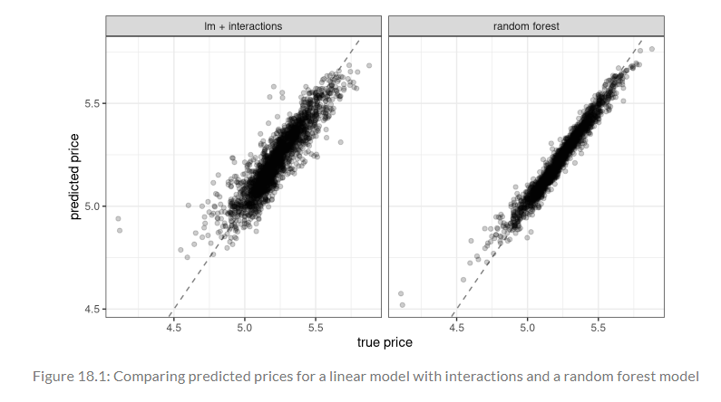
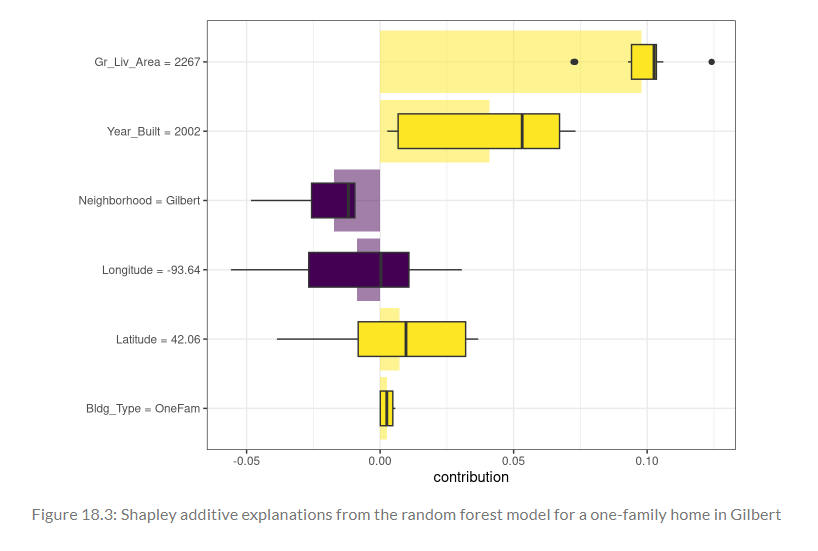

```{r setup, include = FALSE}
library(learnr)
library(tutorial.helpers)
library(knitr)

library(tidymodels)
library(DALEXtra)
library(forcats)

tidymodels_prefer()


knitr::opts_chunk$set(echo = FALSE)
options(tutorial.exercise.timelimit = 60, 
        tutorial.storage = "local") 

ames_update <- ames |>
  mutate(Sale_Price = log10(Sale_Price))

set.seed(502)
ames_strata_split <- initial_split(ames_update, prop = 0.80, strata = Sale_Price)
ames_train <- training(ames_strata_split)

ames_rec <- 
  recipe(Sale_Price ~ Neighborhood + Gr_Liv_Area + Year_Built + Bldg_Type + 
           Latitude + Longitude, data = ames_train) |>
  step_log(Gr_Liv_Area, base = 10) |> 
  step_other(Neighborhood, threshold = 0.01) |> 
  step_dummy(all_nominal_predictors()) |> 
  step_interact( ~ Gr_Liv_Area:starts_with("Bldg_Type_") ) |> 
  step_ns(Latitude, Longitude, deg_free = 20)
  
lm_model <- linear_reg() |> set_engine("lm")

lm_wflow <- 
  workflow() |> 
  add_model(lm_model) |> 
  add_recipe(ames_rec)

lm_fit <- fit(lm_wflow, ames_train)

vip_features <- c("Neighborhood", "Gr_Liv_Area", "Year_Built", "Bldg_Type", "Latitude", "Longitude")

vip_train <- 
  ames_train |> 
  select(all_of(vip_features))

explainer_lm <-
  explain_tidymodels(
    lm_fit, 
    data = vip_train, 
    y = ames_train$Sale_Price,
    label = "lm + interactions",
    verbose = FALSE
)

rf_model <- 
  rand_forest(trees = 1000) |> 
  set_engine("ranger") |> 
  set_mode("regression")

rf_wflow <- 
  workflow() |> 
  add_formula(
    Sale_Price ~ Neighborhood + Gr_Liv_Area + Year_Built + Bldg_Type + 
      Latitude + Longitude) |> 
  add_model(rf_model) 

rf_fit <- rf_wflow |> fit(data = ames_train)

explainer_rf <- 
  explain_tidymodels(
    rf_fit, 
    data = vip_train, 
    y = ames_train$Sale_Price,
    label = "random forest",
    verbose = FALSE
  )

duplex <- vip_train[120, ]

lm_breakdown <- predict_parts(explainer = explainer_lm, new_observation = duplex)

rf_breakdown <- predict_parts(explainer = explainer_rf, new_observation = duplex)


set.seed(1801)
shap_duplex <- 
  predict_parts(
  explainer = explainer_rf, 
  new_observation = duplex,
  type = "shap",
  B = 20
 )

big_house <- vip_train[1269, ]

set.seed(1802)

```

```{r copy-code-chunk, child = system.file("child_documents/copy_button.Rmd", package = "tutorial.helpers")}
```

```{r info-section, child = system.file("child_documents/info_section.Rmd", package = "tutorial.helpers")}
```

## Introduction
### 

<!-- Two to four sentence about the main topics covered in this tutorial. Why are we here? What will students get out of giving you 90 minutes of their lives? How does this tutorial connect to other tutorials? -->

## Software for Model Explanations 
### 

In Section [1.2](https://www.tmwr.org/software-modeling#model-types) of Chapter [1](https://www.tmwr.org/software-modeling), a taxonomy of models were outlined and suggested that models typically are built as one or more of descriptive, inferential, or predictive. The chapter suggested that model performance, as measured by appropriate metrics (like RMSE for regression or area under the ROC curve for classification), can be important for all modeling applications. Similarly, model explanations, answering *why* a model makes the predictions it does, can be important whether the purpose of your model is largely descriptive, to test a hypothesis, or to make a prediction.

### Exercise 1

Load the **DALEXtra** library using `library()`.

```{r software-for-model-e-1, exercise = TRUE}

```

```{r software-for-model-e-1-hint-1, eval = FALSE}
library(...)
```

```{r include = FALSE}
library(DALEXtra)
```

### 

The tidymodels framework does not itself contain software for model explanations. Instead, models trained and evaluated with tidymodels can be explained with other, supplementary software in R packages such as **lime**, **vip**, and **DALEX**.

**DALEXtra**, which is an add-on package for **DALEX**, provides support for tidymodels. 

### Exercise 2

In Chapters [10](https://www.tmwr.org/resampling) and [11](https://www.tmwr.org/compare), several models were trained and compared to predict the price of homes in Ames, IA, including a linear model with interactions and a random forest model, with the results shown below:

```{r}

```

### 

**vip** functions are chosen for *model-based* methods that take advantage of model structure (and are often faster)
**DALEX** functions are chosen for *model-agnostic* methods that can be applied to any model

### Exercise 3

Let’s build model-agnostic explainers for both of these models (see the graph from the previous exercise) to find out why they make these predictions.

In the code chunk below, create a vector that contains `"Neighborhood"`, `"Gr_Liv_Area"`, `"Year_Built"`, `"Bldg_Type"`, `"Latitude"`, and `"Longitude"`.

```{r software-for-model-e-3, exercise = TRUE}

```

```{r software-for-model-e-3-hint-1, eval = FALSE}
c("...", "...", "...", "Bldg_Type", "Latitude", "Longitude")
```

```{r include = FALSE}
c("Neighborhood", "Gr_Liv_Area", "Year_Built", "Bldg_Type", "Latitude", "Longitude")
```

### 

Answering the question “why?” allows modeling practitioners to understand which features were important in predictions and even how model predictions would change under different values for the features. 


### Exercise 4

Copy the previous code and assign it to a new variable named `vip_features`.

```{r software-for-model-e-4, exercise = TRUE}

```

<button onclick = "transfer_code(this)">Copy previous code</button>

```{r software-for-model-e-4-hint-1, eval = FALSE}
... <- c("Neighborhood", "Gr_Liv_Area", "Year_Built", "Bldg_Type", "Latitude", "Longitude")
```

```{r include = FALSE}
vip_features <- c("Neighborhood", "Gr_Liv_Area", "Year_Built", "Bldg_Type", "Latitude", "Longitude")
```

### 

For some models, like linear regression, it is usually clear how to explain why the model makes its predictions. The structure of a linear model contains coefficients for each predictor that are typically straightforward to interpret.

### Exercise 5

Load the **tidymodels** package using `library()`. Then, on a new line, type in `tidymodels_prefer()` to get rid of naming conflicts.

```{r software-for-model-e-5, exercise = TRUE}

```

```{r software-for-model-e-5-hint-1, eval = FALSE}
library(...)
tidymodels_prefer()
```

```{r include = FALSE}
library(tidymodels)
tidymodels_prefer()
```

### 

As a reminder, the `ames` data set comes from the **modeldata** package, which is loaded when you load the **tidymodels** package.

### Exercise 6

Since the models from the graph in Exercise 2 use Ames data set, the code for the splits and recipes are needed. Press "Run code". 

```{r software-for-model-e-6, exercise = TRUE}
ames_update <- ames |>
  mutate(Sale_Price = log10(Sale_Price))

set.seed(502)
ames_strata_split <- initial_split(ames_update, prop = 0.80, strata = Sale_Price)
ames_train <- training(ames_strata_split)

ames_rec <- 
  recipe(Sale_Price ~ Neighborhood + Gr_Liv_Area + Year_Built + Bldg_Type + 
           Latitude + Longitude, data = ames_train) |>
  step_log(Gr_Liv_Area, base = 10) |> 
  step_other(Neighborhood, threshold = 0.01) |> 
  step_dummy(all_nominal_predictors()) |> 
  step_interact( ~ Gr_Liv_Area:starts_with("Bldg_Type_") ) |> 
  step_ns(Latitude, Longitude, deg_free = 20)
  
lm_model <- linear_reg() |> set_engine("lm")

lm_wflow <- 
  workflow() |> 
  add_model(lm_model) |> 
  add_recipe(ames_rec)

lm_fit <- fit(lm_wflow, ames_train)
```

```{r include = FALSE}
ames_update <- ames |>
  mutate(Sale_Price = log10(Sale_Price))

set.seed(502)
ames_strata_split <- initial_split(ames_update, prop = 0.80, strata = Sale_Price)
ames_train <- training(ames_strata_split)

ames_rec <- 
  recipe(Sale_Price ~ Neighborhood + Gr_Liv_Area + Year_Built + Bldg_Type + 
           Latitude + Longitude, data = ames_train) |>
  step_log(Gr_Liv_Area, base = 10) |> 
  step_other(Neighborhood, threshold = 0.01) |> 
  step_dummy(all_nominal_predictors()) |> 
  step_interact( ~ Gr_Liv_Area:starts_with("Bldg_Type_") ) |> 
  step_ns(Latitude, Longitude, deg_free = 20)
  
lm_model <- linear_reg() |> set_engine("lm")

lm_wflow <- 
  workflow() |> 
  add_model(lm_model) |> 
  add_recipe(ames_rec)

lm_fit <- fit(lm_wflow, ames_train)
```

### 

These are the variables you coded in the past tutorials for the `ames` data set. See the "Feature Engineering with recipes" tutorial or Chapter [8](https://www.tmwr.org/recipes) to review this.

### Exercise 7

In the code chunk below, pipe `ames_train` to `select()`. Inside this function, type `all_of()`. Inside `all_of()`, type in `vip_features`. 

```{r software-for-model-e-7, exercise = TRUE}

```

```{r software-for-model-e-7-hint-1, eval = FALSE}
... |> 
  select(all_of(...))
```

```{r include = FALSE}
ames_train |> 
  select(all_of(vip_features))
```

### 

`all_of()` is a function that selects variables from character vectors. As you can see, the code outputs all the data from the specified column names in `vip_features`. Looking at the tibble, you can see that there are 2,342 rows. If you recall, each value in the `ames` data set represents a house in Ames, Iowa.

### Exercise 8

Copy the previous code and assign it to a new variable named `vip_train`.

```{r software-for-model-e-8, exercise = TRUE}

```

<button onclick = "transfer_code(this)">Copy previous code</button>

```{r software-for-model-e-8-hint-1, eval = FALSE}
... <- 
  ames_train |> 
  select(all_of(vip_features))
```

```{r include = FALSE}
vip_train <- 
  ames_train |> 
  select(all_of(vip_features))
```

### 

Przemyslaw Biecek and Tomasz Burzykowski's [*Explanatory Model Analysis*](https://ema.drwhy.ai/) book provide a thorough exploration of how to use **DALEX** for model explanations.

### Exercise 9

Now, let's generate some information about the model. In the code chunk below, type in `explain_tidymodels()`. `explain_tidymodels()` is a function (from the **DALEXtra** package) that creates an explainer from your tidymodels workflow.

Inside this function, type in `lm_fit`, set `data` to `vip_train`, and set `y` to `ames_train$Sale_Price`.

```{r software-for-model-e-9, exercise = TRUE}

```

```{r software-for-model-e-9-hint-1, eval = FALSE}
explain_tidymodels(
    ..., 
    data = vip_train, 
    y = ...$...
)
```

```{r include = FALSE}
explain_tidymodels(
    lm_fit, 
    data = vip_train, 
    y = ames_train$Sale_Price
)
```

### 

As you can see, this produces a detailed explanation of `lm_fit` and `vip_train`, including the model label, the number of rows and columns, predicted values, and residuals. 

The code creates a new explainer, as you can see from the output. The `Data head` represents the first few values in the data set.

### Exercise 10

Copy the previous code. Inside `explain_tidymodels()`, set `label` to `"lm + interactions"` and `verbose` to `FALSE`.

```{r software-for-model-e-10, exercise = TRUE}

```

<button onclick = "transfer_code(this)">Copy previous code</button>

```{r software-for-model-e-10-hint-1, eval = FALSE}
explain_tidymodels(
    lm_fit, 
    data = vip_train, 
    y = ames_train$Sale_Price,
    ... = "lm + interactions",
    verbose = ...
)
```

```{r include = FALSE}
explain_tidymodels(
    lm_fit, 
    data = vip_train, 
    y = ames_train$Sale_Price,
    label = "lm + interactions",
    verbose = FALSE
)
```

### 

For other models, like random forests that can capture nonlinear behavior by design, it is less transparent how to explain the model’s predictions from only the structure of the model itself. Instead, we can apply model explainer algorithms to generate understanding of predictions.

### Exercise 11

Copy the previous code and assign it to a new variable named `explainer_lm`.

```{r software-for-model-e-11, exercise = TRUE}

```

<button onclick = "transfer_code(this)">Copy previous code</button>

```{r software-for-model-e-11-hint-1, eval = FALSE}
... <-
  explain_tidymodels(
    lm_fit, 
    data = vip_train, 
    y = ames_train$Sale_Price,
    label = "lm + interactions",
    verbose = FALSE
)
```

```{r include = FALSE}
explainer_lm <-
  explain_tidymodels(
    lm_fit, 
    data = vip_train, 
    y = ames_train$Sale_Price,
    label = "lm + interactions",
    verbose = FALSE
)
```

### 

Click [here](https://search.r-project.org/CRAN/refmans/DALEXtra/html/explain_tidymodels.html) to learn more about the `explain_tidymodels()` function.

### Exercise 12

Press "Run code".

```{r software-for-model-e-12, exercise = TRUE}
rf_model <- 
  rand_forest(trees = 1000) |> 
  set_engine("ranger") |> 
  set_mode("regression")

rf_wflow <- 
  workflow() |> 
  add_formula(
    Sale_Price ~ Neighborhood + Gr_Liv_Area + Year_Built + Bldg_Type + 
      Latitude + Longitude) |> 
  add_model(rf_model) 

rf_fit <- rf_wflow |> fit(data = ames_train)
```

```{r include = FALSE}
rf_model <- 
  rand_forest(trees = 1000) |> 
  set_engine("ranger") |> 
  set_mode("regression")

rf_wflow <- 
  workflow() |> 
  add_formula(
    Sale_Price ~ Neighborhood + Gr_Liv_Area + Year_Built + Bldg_Type + 
      Latitude + Longitude) |> 
  add_model(rf_model) 

rf_fit <- rf_wflow |> fit(data = ames_train)
```

### 

These were the variables you created in the "Resampling for Evaluating Performance" tutorial. `rf_model` is a random forest model that has `1000` trees. Then, this model is used to create a random forest workflow, adding `Sale_Price ~ Neighborhood + Gr_Liv_Area + Year_Built + Bldg_Type + Latitude + Longitude` as the formula. Then, this model is fitted, with `data` being `ames_train`.

Visit Chapter [10](https://www.tmwr.org/resampling) to review this process.

### Exercise 13

In the code chunk below, type in `explain_tidymodels()`. Inside this function, type in `rf_fit`, set `data` to `vip_train`, and set `y` to `ames_train$Sale_Price`.

```{r software-for-model-e-13, exercise = TRUE}

```

```{r software-for-model-e-13-hint-1, eval = FALSE}
explain_tidymodels(
    ..., 
    data = ..., 
    ... = ames_train$Sale_Price
)
```

```{r include = FALSE}
explain_tidymodels(
    rf_fit, 
    data = vip_train, 
    y = ames_train$Sale_Price
)
```

### 

As you can see, the output is very similar to the `explain_tidymodels()` call in the previous exercises. However, this explainer is for `rf_fit`.

### Exercise 14

Copy the previous code. Inside `explain_tidymodels()`, set `label` to `"random forest"` and set `verbose` to `FALSE`.

```{r software-for-model-e-14, exercise = TRUE}

```

<button onclick = "transfer_code(this)">Copy previous code</button>

```{r software-for-model-e-14-hint-1, eval = FALSE}
explain_tidymodels(
    rf_fit, 
    data = vip_train, 
    y = ames_train$Sale_Price,
    label = "...",
    ... = FALSE
  )
```

```{r include = FALSE}
explain_tidymodels(
    rf_fit, 
    data = vip_train, 
    y = ames_train$Sale_Price,
    label = "random forest",
    verbose = FALSE
  )
```

### 

A linear model is typically straightforward to interpret and explain; you may not often find yourself using separate model explanation algorithms for a linear model. However, it can sometimes be difficult to understand or explain the predictions of even a linear model once it has splines and interaction terms!

### Exercise 15

Copy the previous code and assign it to a new variable named `explainer_rf`.

```{r software-for-model-e-15, exercise = TRUE}

```

<button onclick = "transfer_code(this)">Copy previous code</button>

```{r software-for-model-e-15-hint-1, eval = FALSE}
... <- 
  explain_tidymodels(
    rf_fit, 
    data = vip_train, 
    y = ames_train$Sale_Price,
    label = "random forest",
    verbose = FALSE
  )
```

```{r include = FALSE}
explainer_rf <- 
  explain_tidymodels(
    rf_fit, 
    data = vip_train, 
    y = ames_train$Sale_Price,
    label = "random forest",
    verbose = FALSE
  )
```

### 

Dealing with significant feature engineering transformations during model explainability highlights some options that are available (or sometimes, ambiguity in such analyses). Global (which provide an overall understanding aggregated over a whole set of observations) or local (which provide information about a prediction for a single observation) model explanations can be quantified either in terms of:

- *original, basic predictors* as they existed without significant feature engineering transformations, or
- *derived features*, such as those created via dimensionality reduction (Chapter [16](https://www.tmwr.org/dimensionality#dimensionality)) or interactions and spline terms, as in this example.

### 

Congrats! You have learned how to create an explainer for models.

## Local Explanations
### 

Local model explanations provide information about a prediction for a single observation.

### Exercise 1

For example, let’s consider an older duplex in the North Ames neighborhood. In the code chunk below, type in `vip_train[]`. Inside the brackets, type in `120,`. 

```{r local-explanations-1, exercise = TRUE}

```

```{r local-explanations-1-hint-1, eval = FALSE}
vip_train[..., ]
```

```{r include = FALSE}
vip_train[120, ]
```

### 

This code returns an older duplex in the `North_Ames` neighborhood.

### Exercise 2

Copy the previous code and assign it to a new variable named `duplex`.

```{r local-explanations-2, exercise = TRUE}

```

<button onclick = "transfer_code(this)">Copy previous code</button>

```{r local-explanations-2-hint-1, eval = FALSE}
... <- vip_train[120, ]
```

```{r include = FALSE}
duplex <- vip_train[120, ]
```

### 

There are multiple possible approaches to understanding why a model predicts a given price for this duplex. One is a break-down explanation, implemented with the **DALEX** function `predict_parts()`; it computes how contributions attributed to individual features change the mean model’s prediction for a particular observation, like our duplex.

### Exercise 3

Let's use the `predict_parts()` function. In the code chunk below, type `predict_parts()`. Inside this function, set `explainer` to `explainer_lm` and `new_observation` to `duplex`.

```{r local-explanations-3, exercise = TRUE}

```

```{r local-explanations-3-hint-1, eval = FALSE}
predict_parts(explainer = ..., new_observation = ...)
```

```{r include = FALSE}
predict_parts(explainer = explainer_lm, new_observation = duplex)
```

### 

As you can see, the output shows how the predicted price was given for this duplex. First, the model started with the intercept price, which is `5.221`. Then, the price was driven down by the `Gr_Liv_Area`, `Bldg_Type`, `Longitude`, `Year_Built`, `Latitude`, and `Neigborhood`. After the calculations, the predicted value is returned, which in this case is `5.002`.

### Exercise 4

Copy the previous code and assign it to a new variable named `lm_breakdown`. 

```{r local-explanations-4, exercise = TRUE}

```

<button onclick = "transfer_code(this)">Copy previous code</button>

```{r local-explanations-4-hint-1, eval = FALSE}
... <- predict_parts(explainer = explainer_lm, new_observation = duplex)
```

```{r include = FALSE}
lm_breakdown <- predict_parts(explainer = explainer_lm, new_observation = duplex)
```

### 

Since this linear model was trained using spline terms for latitude and longitude, the contribution to price for Longitude shown here combines the effects of all of its individual spline terms. The contribution is in terms of the original Longitude feature, not the derived spline features.

### Exercise 5

Now, lets run `predict_parts()` on the random forest mode. In the code chunk below, type in `predict_parts()`. Inside this function, set `explainer` to `explainer_rf` and `new_observation` to `duplex`.

```{r local-explanations-5, exercise = TRUE}

```

```{r local-explanations-5-hint-1, eval = FALSE}
predict_parts(explainer = ..., new_observation = ...)
```

```{r include = FALSE}
predict_parts(explainer = explainer_rf, new_observation = duplex)
```

### 

As you can see from the code's output, the size, age, and duplex status are the most important in the prediction of the price of the house, as they change the price of the house the most.

### Exercise 6

Copy the previous code and assign it to a new variable named `rf_breakdown`.

```{r local-explanations-6, exercise = TRUE}

```

<button onclick = "transfer_code(this)">Copy previous code</button>

```{r local-explanations-6-hint-1, eval = FALSE}
... <- predict_parts(explainer = explainer_rf, new_observation = duplex)
```

```{r include = FALSE}
rf_breakdown <- predict_parts(explainer = explainer_rf, new_observation = duplex)
```

### 

Model break-down explanations like these depend on the *order* of the features.

### Exercise 7

If you choose the `order` for the random forest model explanation to be the same as the default for the linear model (chosen via a heuristic), you can change the relative importance of the features.

Take a look at the code for `rf_breakdown`. Inside this function, set `order` to `lm_breakdown$variable_name`.

```{r local-explanations-7, exercise = TRUE}
predict_parts(
  explainer = explainer_rf, 
  new_observation = duplex
)
```

```{r local-explanations-7-hint-1, eval = FALSE}
predict_parts(
  explainer = explainer_rf, 
  new_observation = duplex,
  order = ...$...
)
```

```{r include = FALSE}
predict_parts(
  explainer = explainer_rf, 
  new_observation = duplex,
  order = lm_breakdown$variable_name
)
```

### 

Even though the features are in a different order now, the starting and ending values are still the same. 

### Exercise 8

Let's use the fact that these break-down explanations change based on order to compute the most important features over all (or many) possible orderings. This is the idea behind Shapley Additive Explanations, where the average contributions of features are computed under different combinations or “coalitions” of feature orderings.

Type in `set.seed()`, passing in `1801`.

```{r local-explanations-8, exercise = TRUE}

```

```{r local-explanations-8-hint-1, eval = FALSE}
set.seed(...)
```

```{r include = FALSE}
set.seed(1801)
```

### 

For this tutorial, Shapley Additive Explanations will be referred to as SHAP.

### Exercise 9

 Let’s compute SHAP attributions for the duplex, using `B = 20` random orderings. In the code chunk below, type in `predict_parts()`. Inside this function, set `explainer` to `explainer_rf` and `new_observation` to `duplex`, 

```{r local-explanations-9, exercise = TRUE}

```

```{r local-explanations-9-hint-1, eval = FALSE}
predict_parts(
  ... = explainer_rf, 
  new_observation = ...
 )
```

```{r include = FALSE}
predict_parts(
  explainer = explainer_rf, 
  new_observation = duplex
 )
```

### 

Note that this is the same code as `rf_breakdown`, which shows the breakdown of the random forest model.

### Exercise 10

Copy the previous code. Inside the function, set `type` to `"shap"` as the third argument and set `B` to `20` as the fourth argument.

```{r local-explanations-10, exercise = TRUE}

```

<button onclick = "transfer_code(this)">Copy previous code</button>

```{r local-explanations-10-hint-1, eval = FALSE}
predict_parts(
  explainer = explainer_rf, 
  new_observation = duplex,
  type = "...",
  B = ...
 )
```

```{r include = FALSE}
predict_parts(
  explainer = explainer_rf, 
  new_observation = duplex,
  type = "shap",
  B = 20
 )
```

### 

These SHAP attributions show the impact they have on the predicted price. For example, looking at the `Bldg_Type` row, the negative value means that `Bldg_Type` brings down the price.

### Exercise 11

Copy the previous code and assign it to a new variable named `shap_duplex`.

```{r local-explanations-11, exercise = TRUE}

```

<button onclick = "transfer_code(this)">Copy previous code</button>

```{r local-explanations-11-hint-1, eval = FALSE}
... <- 
  predict_parts(
  explainer = explainer_rf, 
  new_observation = duplex,
  type = "shap",
  B = 20
 )
```

```{r include = FALSE}
shap_duplex <- 
  predict_parts(
  explainer = explainer_rf, 
  new_observation = duplex,
  type = "shap",
  B = 20
 )
```

### 

If you look closely at the output of `shape_duplex`, the values seem like they can be displayed in a box plot.

### Exercise 12

Load the **forcats** library using `library()`.

```{r local-explanations-12, exercise = TRUE}

```

```{r local-explanations-12-hint-1, eval = FALSE}
library(...)
```

```{r include = FALSE}
library(forcats)
```

### 

Click [here](https://forcats.tidyverse.org/) to learn more about this package.


### Exercise 13

Let's create a box plot that displays the distribution of contributors across all the orderings that were tried.

In the code chunk below, pipe `shap_duplex` to `group_by()`. Inside this function, type `variable`.

```{r local-explanations-13, exercise = TRUE}

```

```{r local-explanations-13-hint-1, eval = FALSE}
shap_duplex |>
  group_by(...)
```

```{r include = FALSE}
shap_duplex |>
  group_by(variable)
```

### 

This groups the data together by `variable`, but the output looks very unorganized. For example, the name of the contributor and its value are in the same column, rather than separate columns.

### Exercise 14

Let's reorganize this data. Copy the previous code and pipe it to `mutate()`. Inside this function, set `mean_val` to `mean(contribution)`. 

```{r local-explanations-14, exercise = TRUE}

```

<button onclick = "transfer_code(this)">Copy previous code</button>

```{r local-explanations-14-hint-1, eval = FALSE}
shap_duplex |>
  group_by(variable) |>
  ...(mean_val = mean(...))
```

```{r include = FALSE}
shap_duplex |>
  group_by(variable) |>
  mutate(mean_val = mean(contribution))
```

### 

By adding `mutate()` to the pipe, a new column has been created in the tibble, called `mean_val`. This column contains the average contribution value of each contributor.

### Exercise 15

Copy the previous code and pipe it to `ungroup()`.

```{r local-explanations-15, exercise = TRUE}

```

<button onclick = "transfer_code(this)">Copy previous code</button>

```{r local-explanations-15-hint-1, eval = FALSE}
shap_duplex |>
  group_by(variable) |>
  mutate(mean_val = mean(contribution)) |>
  ...()
```

```{r include = FALSE}
shap_duplex |>
  group_by(variable) |>
  mutate(mean_val = mean(contribution)) |>
  ungroup()
```

### 

`ungroup()` is the opposite of `group_by()`; it removes the grouping.

### Exercise 16

Copy the previous code and pipe it to `mutate()`. Inside this function, set `variable` to `fct_reorder()`. Inside this function, type in `variable` as the first argument and `abs(mean_val)` as the second argument.

```{r local-explanations-16, exercise = TRUE}

```

<button onclick = "transfer_code(this)">Copy previous code</button>

```{r local-explanations-16-hint-1, eval = FALSE}
shap_duplex |>
  group_by(variable) |>
  mutate(mean_val = mean(contribution)) |>
  ungroup() |>
  mutate(... = fct_reorder(..., abs(...)))
```

```{r include = FALSE}
shap_duplex |>
  group_by(variable) |>
  mutate(mean_val = mean(contribution)) |>
  ungroup() |>
  mutate(variable = fct_reorder(variable, abs(mean_val)))
```

### 

If you look closely at the first column, you can see that the type has been changed from `<chr>` to `<fct>`. `fct` represents a factor data type, which is used to represent categorical or nominal data.

### Exercise 17

Copy the previous code and pipe it to `ggplot()`. Inside this function, using the `aes()` function, set `x` to `contribution` and `y` to `variable`. Also, set `fill` to `mean_val > 0`.

```{r local-explanations-17, exercise = TRUE}

```

<button onclick = "transfer_code(this)">Copy previous code</button>

```{r local-explanations-17-hint-1, eval = FALSE}
shap_duplex |>
  group_by(variable) |>
  mutate(mean_val = mean(contribution)) |>
  ungroup() |>
  mutate(variable = fct_reorder(variable, abs(mean_val))) |>
  ggplot(aes(x = ..., y = ..., fill = ... > 0))
```

```{r include = FALSE}
shap_duplex |>
  group_by(variable) |>
  mutate(mean_val = mean(contribution)) |>
  ungroup() |>
  mutate(variable = fct_reorder(variable, abs(mean_val))) |>
  ggplot(aes(x = contribution, y = variable, fill = mean_val > 0))
```

### 

By setting `fill` to `mean_val > 0`, the graph will only fill in the plot with color *if* the mean value is greater than 0.

### Exercise 18

Copy the previous code and add `geom_col()` using the `+` operator. Inside this function, set `data` to `~distinct(., variable, mean_val)` as the first argument, type in `aes(mean_val, variable)` as the second argument, and set `alpha` to `0.5` as the third argument.

```{r local-explanations-18, exercise = TRUE}

```

<button onclick = "transfer_code(this)">Copy previous code</button>

```{r local-explanations-18-hint-1, eval = FALSE}
shap_duplex |>
  group_by(variable) |>
  mutate(mean_val = mean(contribution)) |>
  ungroup() |>
  mutate(variable = fct_reorder(variable, abs(mean_val))) |>
  ggplot(aes(x = contribution, y = variable, fill = mean_val > 0)) +
  geom_col(... = ~distinct(., variable, ...), 
           ...(mean_val, variable), 
           alpha = ...)
```

```{r include = FALSE}
shap_duplex |>
  group_by(variable) |>
  mutate(mean_val = mean(contribution)) |>
  ungroup() |>
  mutate(variable = fct_reorder(variable, abs(mean_val))) |>
  ggplot(aes(x = contribution, y = variable, fill = mean_val > 0)) +
  geom_col(data = ~distinct(., variable, mean_val), 
           aes(mean_val, variable), 
           alpha = 0.5)
```

### 

`geom_col()` is used if you want the heights of the bars to represent values in the data. 

### Exercise 19

Copy the previous code and add `geom_boxplot()`. Inside this function, set `width` to `0.5`.

```{r local-explanations-19, exercise = TRUE}

```

<button onclick = "transfer_code(this)">Copy previous code</button>

```{r local-explanations-19-hint-1, eval = FALSE}
shap_duplex |>
  group_by(variable) |>
  mutate(mean_val = mean(contribution)) |>
  ungroup() |>
  mutate(variable = fct_reorder(variable, abs(mean_val))) |>
  ggplot(aes(x = contribution, y = variable, fill = mean_val > 0)) +
  geom_col(data = ~distinct(., variable, mean_val), 
           aes(mean_val, variable), 
           alpha = 0.5) +
  geom_boxplot(width = ...)
```

```{r include = FALSE}
shap_duplex |>
  group_by(variable) |>
  mutate(mean_val = mean(contribution)) |>
  ungroup() |>
  mutate(variable = fct_reorder(variable, abs(mean_val))) |>
  ggplot(aes(x = contribution, y = variable, fill = mean_val > 0)) +
  geom_col(data = ~distinct(., variable, mean_val), 
           aes(mean_val, variable), 
           alpha = 0.5) +
  geom_boxplot(width = 0.5)
```

### 

As you can see, the box plot has been added with `geom_boxplot()`.

### Exercise 20

Copy the previous code and add `theme()`. Inside this function, set `legend.position` to `"none"`.

```{r local-explanations-20, exercise = TRUE}

```

<button onclick = "transfer_code(this)">Copy previous code</button>

```{r local-explanations-20-hint-1, eval = FALSE}
shap_duplex |>
  group_by(variable) |>
  mutate(mean_val = mean(contribution)) |>
  ungroup() |>
  mutate(variable = fct_reorder(variable, abs(mean_val))) |>
  ggplot(aes(x = contribution, y = variable, fill = mean_val > 0)) +
  geom_col(data = ~distinct(., variable, mean_val), 
           aes(mean_val, variable), 
           alpha = 0.5) +
  geom_boxplot(width = 0.5) +
  theme(legend.position = "...")
```

```{r include = FALSE}
shap_duplex |>
  group_by(variable) |>
  mutate(mean_val = mean(contribution)) |>
  ungroup() |>
  mutate(variable = fct_reorder(variable, abs(mean_val))) |>
  ggplot(aes(x = contribution, y = variable, fill = mean_val > 0)) +
  geom_col(data = ~distinct(., variable, mean_val), 
           aes(mean_val, variable), 
           alpha = 0.5) +
  geom_boxplot(width = 0.5) +
  theme(legend.position = "none")
```

### 

By setting `legend.position` to `"none"`, the legend disappears entirely from the graph. Using the `legend.position` argument, you can move the legend to multiple areas. Visit this [link](https://r-graphics.org/recipe-legend-position) to learn about the various positions you can move the legend to.

### Exercise 21

Copy the previous code and add `scale_fill_viridis_d()`.

```{r local-explanations-21, exercise = TRUE}

```

<button onclick = "transfer_code(this)">Copy previous code</button>

```{r local-explanations-21-hint-1, eval = FALSE}
shap_duplex |>
  group_by(variable) |>
  mutate(mean_val = mean(contribution)) |>
  ungroup() |>
  mutate(variable = fct_reorder(variable, abs(mean_val))) |>
  ggplot(aes(x = contribution, y = variable, fill = mean_val > 0)) +
  geom_col(data = ~distinct(., variable, mean_val), 
           aes(mean_val, variable), 
           alpha = 0.5) +
  geom_boxplot(width = 0.5) +
  theme(legend.position = "none") +
  ...()
```

```{r include = FALSE}
shap_duplex |>
  group_by(variable) |>
  mutate(mean_val = mean(contribution)) |>
  ungroup() |>
  mutate(variable = fct_reorder(variable, abs(mean_val))) |>
  ggplot(aes(x = contribution, y = variable, fill = mean_val > 0)) +
  geom_col(data = ~distinct(., variable, mean_val), 
           aes(mean_val, variable), 
           alpha = 0.5) +
  geom_boxplot(width = 0.5) +
  theme(legend.position = "none") +
  scale_fill_viridis_d()
```

### 

As you can see, the color scheme of the graph has changed with `scale_fill_viridis_d()`. There are many more viridis functions, such as `scale_fill_viridis_b()` and `scale_fill_viridis_c()`. Type in `?scale_fill_viridis_d()` to look at the other viridis functions.

### Exercise 22

Copy the previous code and add `labs()`. Inside this function, set `y` to `NULL`.

```{r local-explanations-22, exercise = TRUE}

```

<button onclick = "transfer_code(this)">Copy previous code</button>

```{r local-explanations-22-hint-1, eval = FALSE}
shap_duplex |>
  group_by(variable) |>
  mutate(mean_val = mean(contribution)) |>
  ungroup() |>
  mutate(variable = fct_reorder(variable, abs(mean_val))) |>
  ggplot(aes(x = contribution, y = variable, fill = mean_val > 0)) +
  geom_col(data = ~distinct(., variable, mean_val), 
           aes(mean_val, variable), 
           alpha = 0.5) +
  geom_boxplot(width = 0.5) +
  theme(legend.position = "none") +
  scale_fill_viridis_d() +
  labs(y = ...)
```

```{r include = FALSE}
shap_duplex |>
  group_by(variable) |>
  mutate(mean_val = mean(contribution)) |>
  ungroup() |>
  mutate(variable = fct_reorder(variable, abs(mean_val))) |>
  ggplot(aes(x = contribution, y = variable, fill = mean_val > 0)) +
  geom_col(data = ~distinct(., variable, mean_val), 
           aes(mean_val, variable), 
           alpha = 0.5) +
  geom_boxplot(width = 0.5) +
  theme(legend.position = "none") +
  scale_fill_viridis_d() +
  labs(y = NULL)
```

### 

By specifying `y` as `NULL`, the y-axis title gets removed. You can also do this for the x-axis.

### Exercise 23

What about a different observation in our data set? Let’s look at a larger, newer one-family home in the Gilbert neighborhood. In the code chunk below, type in `vip_train[]`. Inside the brackets, type in `1269,`.

```{r local-explanations-23, exercise = TRUE}

```

```{r local-explanations-23-hint-1, eval = FALSE}
vip_train[..., ]
```

```{r include = FALSE}
vip_train[1269, ]
```

### 

This prints out a newer *house* that was built in 2002, as oppose to the duplex, which was built in 1949.

### Exercise 24

Copy the previous code and assign it to a new variable named `big_house`.

```{r local-explanations-24, exercise = TRUE}

```

<button onclick = "transfer_code(this)">Copy previous code</button>

```{r local-explanations-24-hint-1, eval = FALSE}
... <- vip_train[1269, ]
```

```{r include = FALSE}
big_house <- vip_train[1269, ]
```

### 

Chapter [28](https://r4ds.hadley.nz/base-r) of the [*R for Data Science*](https://r4ds.hadley.nz/) textbook provides information about the usage of the single bracket operator, `[`.

### Exercise 25

Type in `set.seed()` and pass in `1802`. 

```{r local-explanations-25, exercise = TRUE}

```

```{r local-explanations-25-hint-1, eval = FALSE}
set.seed(...)
```

```{r include = FALSE}
set.seed(1802)
```

### 

As a reminder, `set.seed()` is used to ensure the reproducilibility of data. 

### Exercise 26

Now, let's compute SHAP average attributions for this house in the same way as before. In the code chunk below, type in `predict_parts()`. Inside this function, set `explainer` to `explainer_rf`, `new_observation` to `big_house`, `type` to `"shap"`, and `B` to `20`. 

```{r local-explanations-26, exercise = TRUE}

```

```{r local-explanations-26-hint-1, eval = FALSE}
predict_parts(
    explainer = ..., 
    new_observation = ..., 
    type = "...",
    B = ...
  )
```

```{r include = FALSE}
predict_parts(
    explainer = explainer_rf, 
    new_observation = big_house, 
    type = "shap",
    B = 20
  )
```

### 

The results are shown in the graph below; unlike the duplex, the size and age of this house contribute to its price being higher:

```{r}

```

### 

Congrats! You have learned how to use `predict_parts()`, which computes how contributions attributed to individual features change the mean model’s prediction for a particular observation.

## Global Explanations
### 

Global model explanations, also called global feature importance or variable importance, help us understand which features are most important in driving the predictions of the linear and random forest models overall, aggregated over the whole training set.

## Summary
### 

<!-- Two to four sentences which bring the lessons of the tutorial together for the student. What do they know now that they did not know before? How does this tutorial connect to other tutorials? OK if this is very similar to the Introduction. You made a promise as to what they would learn. You (we hope!) kept that promise.-->

```{r download-answers, child = system.file("child_documents/download_answers.Rmd", package = "tutorial.helpers")}
```
