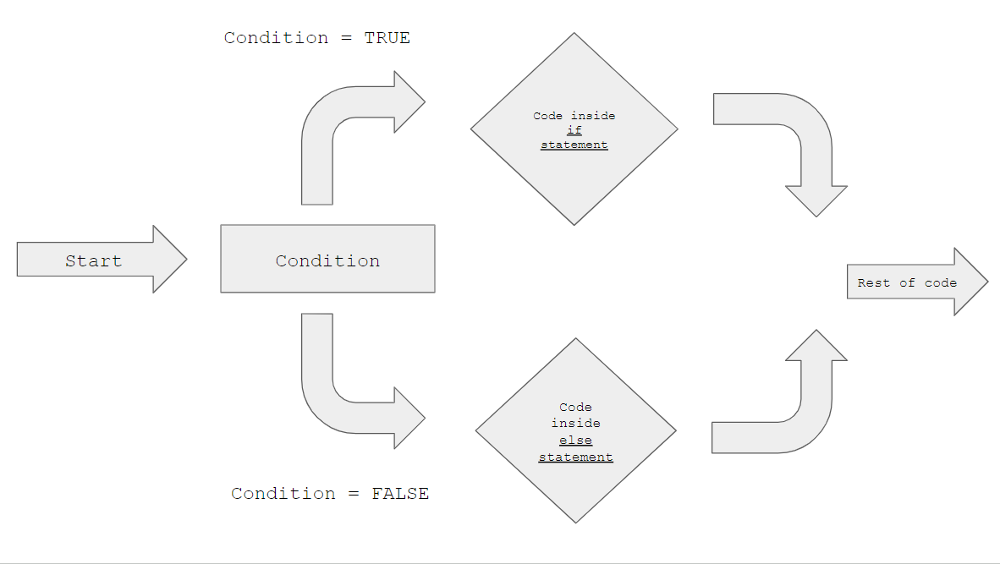
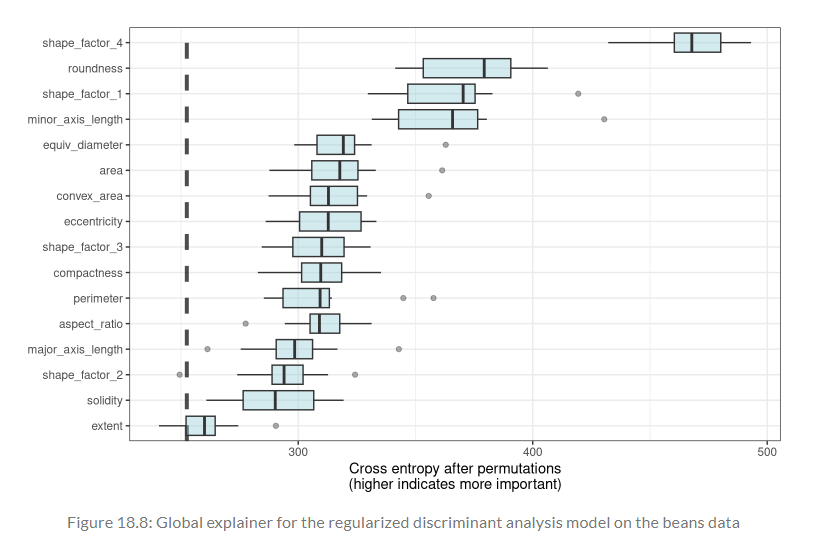

```{r setup, include = FALSE}
library(learnr)
library(tutorial.helpers)
library(knitr)

library(tidymodels)
library(DALEXtra)
library(forcats)

tidymodels_prefer()


knitr::opts_chunk$set(echo = FALSE)
options(tutorial.exercise.timelimit = 60, 
        tutorial.storage = "local") 

ames_update <- ames |>
  mutate(Sale_Price = log10(Sale_Price))

set.seed(502)
ames_strata_split <- initial_split(ames_update, prop = 0.80, strata = Sale_Price)
ames_train <- training(ames_strata_split)

ames_rec <- 
  recipe(Sale_Price ~ Neighborhood + Gr_Liv_Area + Year_Built + Bldg_Type + 
           Latitude + Longitude, data = ames_train) |>
  step_log(Gr_Liv_Area, base = 10) |> 
  step_other(Neighborhood, threshold = 0.01) |> 
  step_dummy(all_nominal_predictors()) |> 
  step_interact( ~ Gr_Liv_Area:starts_with("Bldg_Type_") ) |> 
  step_ns(Latitude, Longitude, deg_free = 20)
  
lm_model <- linear_reg() |> set_engine("lm")

lm_wflow <- 
  workflow() |> 
  add_model(lm_model) |> 
  add_recipe(ames_rec)

lm_fit <- fit(lm_wflow, ames_train)

vip_features <- c("Neighborhood", "Gr_Liv_Area", "Year_Built", "Bldg_Type", "Latitude", "Longitude")

vip_train <- 
  ames_train |> 
  select(all_of(vip_features))

explainer_lm <-
  explain_tidymodels(
    lm_fit, 
    data = vip_train, 
    y = ames_train$Sale_Price,
    label = "lm + interactions",
    verbose = FALSE
)

rf_model <- 
  rand_forest(trees = 1000) |> 
  set_engine("ranger") |> 
  set_mode("regression")

rf_wflow <- 
  workflow() |> 
  add_formula(
    Sale_Price ~ Neighborhood + Gr_Liv_Area + Year_Built + Bldg_Type + 
      Latitude + Longitude) |> 
  add_model(rf_model) 

rf_fit <- rf_wflow |> fit(data = ames_train)

explainer_rf <- 
  explain_tidymodels(
    rf_fit, 
    data = vip_train, 
    y = ames_train$Sale_Price,
    label = "random forest",
    verbose = FALSE
  )

duplex <- vip_train[120, ]

lm_breakdown <- predict_parts(explainer = explainer_lm, new_observation = duplex)

rf_breakdown <- predict_parts(explainer = explainer_rf, new_observation = duplex)


set.seed(1801)
shap_duplex <- 
  predict_parts(
  explainer = explainer_rf, 
  new_observation = duplex,
  type = "shap",
  B = 20
 )

big_house <- vip_train[1269, ]

set.seed(1802)

shap_house <- 
  predict_parts(
    explainer = explainer_rf, 
    new_observation = big_house, 
    type = "shap",
    B = 20
  )

set.seed(1803)

vip_lm <- model_parts(explainer_lm, loss_function = loss_root_mean_square)

set.seed(1804)

vip_rf <- model_parts(explainer_rf, loss_function = loss_root_mean_square)

ggplot_imp <- function(...) {
  obj <- list(...)
   metric_name <- attr(obj[[1]], "loss_name")
   metric_lab <- paste(metric_name, "after permutations\n(higher indicates more important)")
   
    full_vip <- bind_rows(obj) |>
    filter(variable != "_baseline_")
    
    perm_vals <- full_vip |> 
    filter(variable == "_full_model_") |>
    summarise(dropout_loss = mean(dropout_loss), .by = label)
    
    p <- full_vip |>
    filter(variable != "_full_model_") |>
    mutate(variable = fct_reorder(variable, dropout_loss)) |>
    ggplot(aes(x = dropout_loss, y = variable)) 
    
    if(length(obj) > 1) {
      p <- p + 
        facet_wrap(vars(label)) +
        geom_vline(
          data = perm_vals,
          aes(xintercept = dropout_loss, color = label),
          linewidth = 1.4, 
          lty = 2, 
          alpha = 0.7
        ) +
        geom_boxplot(aes(color = label, fill = label), alpha = 0.2)
    } else {
      p <- p + 
      geom_vline(
        data = perm_vals,
        linewidth = 1.4, 
        lty = 2, 
        alpha = 0.7,
        aes(xintercept = dropout_loss)
      ) +
      geom_boxplot(fill = "#91CBD765", alpha = 0.4)
    }
    
    p +
      theme(legend.position = "none") +
      labs(
        x = metric_lab,
        y = NULL,
        fill = NULL,
        color = NULL
      )
}

set.seed(1805)
pdp_age <- model_profile(explainer_rf, N = 500, variables = "Year_Built")

ggplot_pdp <- function(obj, x){
   p <- 
    as_tibble(obj$agr_profiles) |>
    mutate(`_label_` = stringr::str_remove(`_label_`, "^[^_]*_")) |>
    ggplot(aes(x = `_x_`, y = `_yhat_`)) +
    geom_line(
      data = as_tibble(obj$cp_profiles),
      aes(x = {{ x }}, group = `_ids_`),
      linewidth = 0.5, 
      alpha = 0.05, 
      color = "gray50"
    )
   
   num_colors <- n_distinct(obj$agr_profiles$`_label_`)
   
   if (num_colors > 1) {
     p <- p + geom_line(aes(color = `_label_`), linewidth = 1.2, alpha = 0.8)
   } else {
     p <- p + geom_line(color = "midnightblue", linewidth = 1.2, alpha = 0.8)
   }
   
   
   p
}

set.seed(1806)

pdp_liv <- 
  model_profile(
  explainer_rf,
  N = 1000,
  variables = "Gr_Liv_Area",
  groups = "Bldg_Type"
)

plot1 <- 
  ggplot_pdp(pdp_liv, Gr_Liv_Area) +
  scale_x_log10() +
  scale_color_brewer(palette = "Dark2") +
  labs(x = "Gross living area", 
       y = "Sale Price (log)", 
       color = NULL)

plot2 <- 
  as_tibble(pdp_liv$agr_profiles) |>
  mutate(Bldg_Type = stringr::str_remove(`_label_`, "random forest_")) |>
  ggplot(aes(x = `_x_`, y = `_yhat_`, color = Bldg_Type)) +
  geom_line(
    data = as_tibble(pdp_liv$cp_profiles),
    aes(x = Gr_Liv_Area, group = `_ids_`),
    linewidth = 0.5, 
    alpha = 0.1, 
    color = "gray50"
  ) +
  geom_line(
    linewidth = 1.2, 
    alpha = 0.8, 
    show.legend = FALSE
  ) +
  scale_x_log10() +
  facet_wrap(~Bldg_Type) +
  scale_color_brewer(palette = "Dark2") +
  labs(x = "Gross living area", 
       y = "Sale Price (log)", 
       color = NULL)

```

```{r copy-code-chunk, child = system.file("child_documents/copy_button.Rmd", package = "tutorial.helpers")}
```

```{r info-section, child = system.file("child_documents/info_section.Rmd", package = "tutorial.helpers")}
```

## Introduction
### 

This tutorial covers [Chapter 18: Explaining Models and Predictions](https://www.tmwr.org/explain) from [*Tidy Modeling with R*](https://www.tmwr.org/) by Max Kuhn and Julia Silge. In this tutorial, you will learn how to create model explainers with the use of `explain_tidymodels()`, local explanations with the use of `predict_parts()`, global explanations with the use of `model_parts()` and a user-created function, and building global explanations from local explanations. The packages used in this tutorial include [**tidymodels**](https://www.tidymodels.org/), [**DALEXtra**](https://modeloriented.github.io/DALEXtra/), and [**forcats**](https://forcats.tidyverse.org/).


## Software for Model Explanations 
### 

In Section [1.2](https://www.tmwr.org/software-modeling#model-types) of Chapter [1](https://www.tmwr.org/software-modeling), a taxonomy of models were outlined and suggested that models typically are built as one or more of descriptive, inferential, or predictive. The chapter suggested that model performance, as measured by appropriate metrics (like RMSE for regression or area under the ROC curve for classification), can be important for all modeling applications. Similarly, model explanations, answering *why* a model makes the predictions it does, can be important whether the purpose of your model is largely descriptive, to test a hypothesis, or to make a prediction.

### Exercise 1

Load the **DALEXtra** library using `library()`.

```{r software-for-model-e-1, exercise = TRUE}

```

```{r software-for-model-e-1-hint-1, eval = FALSE}
library(...)
```

```{r include = FALSE}
library(DALEXtra)
```

### 

The tidymodels framework does not itself contain software for model explanations. Instead, models trained and evaluated with tidymodels can be explained with other, supplementary software in R packages such as **lime**, **vip**, and **DALEX**.

**DALEXtra**, which is an add-on package for **DALEX**, provides support for tidymodels. 

### Exercise 2

In Chapters [10](https://www.tmwr.org/resampling) and [11](https://www.tmwr.org/compare), several models were trained and compared to predict the price of homes in Ames, IA, including a linear model with interactions and a random forest model, with the results shown below:

```{r}
knitr::include_graphics("images/pic1.png")
```

### 

**vip** functions are chosen for *model-based* methods that take advantage of model structure (and are often faster)
**DALEX** functions are chosen for *model-agnostic* methods that can be applied to any model

### Exercise 3

Let’s build model-agnostic explainers for both of these models (see the graph from the previous exercise) to find out why they make these predictions.

In the code chunk below, create a vector that contains `"Neighborhood"`, `"Gr_Liv_Area"`, `"Year_Built"`, `"Bldg_Type"`, `"Latitude"`, and `"Longitude"`.

```{r software-for-model-e-3, exercise = TRUE}

```

```{r software-for-model-e-3-hint-1, eval = FALSE}
c("...", "...", "...", "Bldg_Type", "Latitude", "Longitude")
```

```{r include = FALSE}
c("Neighborhood", "Gr_Liv_Area", "Year_Built", "Bldg_Type", "Latitude", "Longitude")
```

### 

Answering the question “why?” allows modeling practitioners to understand which features were important in predictions and even how model predictions would change under different values for the features. 


### Exercise 4

Copy the previous code and assign it to a new variable named `vip_features`.

```{r software-for-model-e-4, exercise = TRUE}

```

<button onclick = "transfer_code(this)">Copy previous code</button>

```{r software-for-model-e-4-hint-1, eval = FALSE}
... <- c("Neighborhood", "Gr_Liv_Area", "Year_Built", "Bldg_Type", "Latitude", "Longitude")
```

```{r include = FALSE}
vip_features <- c("Neighborhood", "Gr_Liv_Area", "Year_Built", "Bldg_Type", "Latitude", "Longitude")
```

### 

For some models, like linear regression, it is usually clear how to explain why the model makes its predictions. The structure of a linear model contains coefficients for each predictor that are typically straightforward to interpret.

### Exercise 5

Load the **tidymodels** package using `library()`. Then, on a new line, type in `tidymodels_prefer()` to get rid of naming conflicts.

```{r software-for-model-e-5, exercise = TRUE}

```

```{r software-for-model-e-5-hint-1, eval = FALSE}
library(...)
tidymodels_prefer()
```

```{r include = FALSE}
library(tidymodels)
tidymodels_prefer()
```

### 

As a reminder, the `ames` data set comes from the **modeldata** package, which is loaded when you load the **tidymodels** package.

### Exercise 6

Since the models from the graph in Exercise 2 use Ames data set, the code for the splits and recipes are needed. Press "Run code". 

```{r software-for-model-e-6, exercise = TRUE}
ames_update <- ames |>
  mutate(Sale_Price = log10(Sale_Price))

set.seed(502)
ames_strata_split <- initial_split(ames_update, prop = 0.80, strata = Sale_Price)
ames_train <- training(ames_strata_split)

ames_rec <- 
  recipe(Sale_Price ~ Neighborhood + Gr_Liv_Area + Year_Built + Bldg_Type + 
           Latitude + Longitude, data = ames_train) |>
  step_log(Gr_Liv_Area, base = 10) |> 
  step_other(Neighborhood, threshold = 0.01) |> 
  step_dummy(all_nominal_predictors()) |> 
  step_interact( ~ Gr_Liv_Area:starts_with("Bldg_Type_") ) |> 
  step_ns(Latitude, Longitude, deg_free = 20)
  
lm_model <- linear_reg() |> set_engine("lm")

lm_wflow <- 
  workflow() |> 
  add_model(lm_model) |> 
  add_recipe(ames_rec)

lm_fit <- fit(lm_wflow, ames_train)
```

```{r include = FALSE}
ames_update <- ames |>
  mutate(Sale_Price = log10(Sale_Price))

set.seed(502)
ames_strata_split <- initial_split(ames_update, prop = 0.80, strata = Sale_Price)
ames_train <- training(ames_strata_split)

ames_rec <- 
  recipe(Sale_Price ~ Neighborhood + Gr_Liv_Area + Year_Built + Bldg_Type + 
           Latitude + Longitude, data = ames_train) |>
  step_log(Gr_Liv_Area, base = 10) |> 
  step_other(Neighborhood, threshold = 0.01) |> 
  step_dummy(all_nominal_predictors()) |> 
  step_interact( ~ Gr_Liv_Area:starts_with("Bldg_Type_") ) |> 
  step_ns(Latitude, Longitude, deg_free = 20)
  
lm_model <- linear_reg() |> set_engine("lm")

lm_wflow <- 
  workflow() |> 
  add_model(lm_model) |> 
  add_recipe(ames_rec)

lm_fit <- fit(lm_wflow, ames_train)
```

### 

These are the variables you coded in the past tutorials for the `ames` data set. See the "Feature Engineering with recipes" tutorial or Chapter [8](https://www.tmwr.org/recipes) to review this.

### Exercise 7

In the code chunk below, pipe `ames_train` to `select()`. Inside this function, type `all_of()`. Inside `all_of()`, type in `vip_features`. 

```{r software-for-model-e-7, exercise = TRUE}

```

```{r software-for-model-e-7-hint-1, eval = FALSE}
... |> 
  select(all_of(...))
```

```{r include = FALSE}
ames_train |> 
  select(all_of(vip_features))
```

### 

`all_of()` is a function that selects variables from character vectors. As you can see, the code outputs all the data from the specified column names in `vip_features`. Looking at the tibble, you can see that there are 2,342 rows. If you recall, each value in the `ames` data set represents a house in Ames, Iowa.

### Exercise 8

Copy the previous code and assign it to a new variable named `vip_train`.

```{r software-for-model-e-8, exercise = TRUE}

```

<button onclick = "transfer_code(this)">Copy previous code</button>

```{r software-for-model-e-8-hint-1, eval = FALSE}
... <- 
  ames_train |> 
  select(all_of(vip_features))
```

```{r include = FALSE}
vip_train <- 
  ames_train |> 
  select(all_of(vip_features))
```

### 

Przemyslaw Biecek and Tomasz Burzykowski's [*Explanatory Model Analysis*](https://ema.drwhy.ai/) book provide a thorough exploration of how to use **DALEX** for model explanations.

### Exercise 9

Now, let's generate some information about the model. In the code chunk below, type in `explain_tidymodels()`. `explain_tidymodels()` is a function (from the **DALEXtra** package) that creates an explainer from your tidymodels workflow.

Inside this function, type in `lm_fit`, set `data` to `vip_train`, and set `y` to `ames_train$Sale_Price`.

```{r software-for-model-e-9, exercise = TRUE}

```

```{r software-for-model-e-9-hint-1, eval = FALSE}
explain_tidymodels(
    ..., 
    data = vip_train, 
    y = ...$...
)
```

```{r include = FALSE}
explain_tidymodels(
    lm_fit, 
    data = vip_train, 
    y = ames_train$Sale_Price
)
```

### 

As you can see, this produces a detailed explanation of `lm_fit` and `vip_train`, including the model label, the number of rows and columns, predicted values, and residuals. 

The code creates a new explainer, as you can see from the output. The `Data head` represents the first few values in the data set.

### Exercise 10

Copy the previous code. Inside `explain_tidymodels()`, set `label` to `"lm + interactions"` and `verbose` to `FALSE`.

```{r software-for-model-e-10, exercise = TRUE}

```

<button onclick = "transfer_code(this)">Copy previous code</button>

```{r software-for-model-e-10-hint-1, eval = FALSE}
explain_tidymodels(
    lm_fit, 
    data = vip_train, 
    y = ames_train$Sale_Price,
    ... = "lm + interactions",
    verbose = ...
)
```

```{r include = FALSE}
explain_tidymodels(
    lm_fit, 
    data = vip_train, 
    y = ames_train$Sale_Price,
    label = "lm + interactions",
    verbose = FALSE
)
```

### 

For other models, like random forests that can capture nonlinear behavior by design, it is less transparent how to explain the model’s predictions from only the structure of the model itself. Instead, we can apply model explainer algorithms to generate understanding of predictions.

### Exercise 11

Copy the previous code and assign it to a new variable named `explainer_lm`.

```{r software-for-model-e-11, exercise = TRUE}

```

<button onclick = "transfer_code(this)">Copy previous code</button>

```{r software-for-model-e-11-hint-1, eval = FALSE}
... <-
  explain_tidymodels(
    lm_fit, 
    data = vip_train, 
    y = ames_train$Sale_Price,
    label = "lm + interactions",
    verbose = FALSE
)
```

```{r include = FALSE}
explainer_lm <-
  explain_tidymodels(
    lm_fit, 
    data = vip_train, 
    y = ames_train$Sale_Price,
    label = "lm + interactions",
    verbose = FALSE
)
```

### 

Click [here](https://search.r-project.org/CRAN/refmans/DALEXtra/html/explain_tidymodels.html) to learn more about the `explain_tidymodels()` function.

### Exercise 12

Press "Run code".

```{r software-for-model-e-12, exercise = TRUE}
rf_model <- 
  rand_forest(trees = 1000) |> 
  set_engine("ranger") |> 
  set_mode("regression")

rf_wflow <- 
  workflow() |> 
  add_formula(
    Sale_Price ~ Neighborhood + Gr_Liv_Area + Year_Built + Bldg_Type + 
      Latitude + Longitude) |> 
  add_model(rf_model) 

rf_fit <- rf_wflow |> fit(data = ames_train)
```

```{r include = FALSE}
rf_model <- 
  rand_forest(trees = 1000) |> 
  set_engine("ranger") |> 
  set_mode("regression")

rf_wflow <- 
  workflow() |> 
  add_formula(
    Sale_Price ~ Neighborhood + Gr_Liv_Area + Year_Built + Bldg_Type + 
      Latitude + Longitude) |> 
  add_model(rf_model) 

rf_fit <- rf_wflow |> fit(data = ames_train)
```

### 

These were the variables you created in the "Resampling for Evaluating Performance" tutorial. `rf_model` is a random forest model that has `1000` trees. Then, this model is used to create a random forest workflow, adding `Sale_Price ~ Neighborhood + Gr_Liv_Area + Year_Built + Bldg_Type + Latitude + Longitude` as the formula. Then, this model is fitted, with `data` being `ames_train`.

Visit Chapter [10](https://www.tmwr.org/resampling) to review this process.

### Exercise 13

In the code chunk below, type in `explain_tidymodels()`. Inside this function, type in `rf_fit`, set `data` to `vip_train`, and set `y` to `ames_train$Sale_Price`.

```{r software-for-model-e-13, exercise = TRUE}

```

```{r software-for-model-e-13-hint-1, eval = FALSE}
explain_tidymodels(
    ..., 
    data = ..., 
    ... = ames_train$Sale_Price
)
```

```{r include = FALSE}
explain_tidymodels(
    rf_fit, 
    data = vip_train, 
    y = ames_train$Sale_Price
)
```

### 

As you can see, the output is very similar to the `explain_tidymodels()` call in the previous exercises. However, this explainer is for `rf_fit`.

### Exercise 14

Copy the previous code. Inside `explain_tidymodels()`, set `label` to `"random forest"` and set `verbose` to `FALSE`.

```{r software-for-model-e-14, exercise = TRUE}

```

<button onclick = "transfer_code(this)">Copy previous code</button>

```{r software-for-model-e-14-hint-1, eval = FALSE}
explain_tidymodels(
    rf_fit, 
    data = vip_train, 
    y = ames_train$Sale_Price,
    label = "...",
    ... = FALSE
  )
```

```{r include = FALSE}
explain_tidymodels(
    rf_fit, 
    data = vip_train, 
    y = ames_train$Sale_Price,
    label = "random forest",
    verbose = FALSE
  )
```

### 

A linear model is typically straightforward to interpret and explain; you may not often find yourself using separate model explanation algorithms for a linear model. However, it can sometimes be difficult to understand or explain the predictions of even a linear model once it has splines and interaction terms!

### Exercise 15

Copy the previous code and assign it to a new variable named `explainer_rf`.

```{r software-for-model-e-15, exercise = TRUE}

```

<button onclick = "transfer_code(this)">Copy previous code</button>

```{r software-for-model-e-15-hint-1, eval = FALSE}
... <- 
  explain_tidymodels(
    rf_fit, 
    data = vip_train, 
    y = ames_train$Sale_Price,
    label = "random forest",
    verbose = FALSE
  )
```

```{r include = FALSE}
explainer_rf <- 
  explain_tidymodels(
    rf_fit, 
    data = vip_train, 
    y = ames_train$Sale_Price,
    label = "random forest",
    verbose = FALSE
  )
```

### 

Dealing with significant feature engineering transformations during model explainability highlights some options that are available (or sometimes, ambiguity in such analyses). Global (which provide an overall understanding aggregated over a whole set of observations) or local (which provide information about a prediction for a single observation) model explanations can be quantified either in terms of:

- *original, basic predictors* as they existed without significant feature engineering transformations, or
- *derived features*, such as those created via dimensionality reduction (Chapter [16](https://www.tmwr.org/dimensionality#dimensionality)) or interactions and spline terms, as in this example.

### 

Congrats! You have learned how to create an explainer for models.

## Local Explanations
### 

Local model explanations provide information about a prediction for a single observation.

### Exercise 1

For example, let’s consider an older duplex in the North Ames neighborhood. In the code chunk below, type in `vip_train[]`. Inside the brackets, type in `120,`. 

```{r local-explanations-1, exercise = TRUE}

```

```{r local-explanations-1-hint-1, eval = FALSE}
vip_train[..., ]
```

```{r include = FALSE}
vip_train[120, ]
```

### 

This code returns an older duplex in the `North_Ames` neighborhood.

### Exercise 2

Copy the previous code and assign it to a new variable named `duplex`.

```{r local-explanations-2, exercise = TRUE}

```

<button onclick = "transfer_code(this)">Copy previous code</button>

```{r local-explanations-2-hint-1, eval = FALSE}
... <- vip_train[120, ]
```

```{r include = FALSE}
duplex <- vip_train[120, ]
```

### 

There are multiple possible approaches to understanding why a model predicts a given price for this duplex. One is a break-down explanation, implemented with the **DALEX** function `predict_parts()`; it computes how contributions attributed to individual features change the mean model’s prediction for a particular observation, like our duplex.

### Exercise 3

Let's use the `predict_parts()` function. In the code chunk below, type `predict_parts()`. Inside this function, set `explainer` to `explainer_lm` and `new_observation` to `duplex`.

```{r local-explanations-3, exercise = TRUE}

```

```{r local-explanations-3-hint-1, eval = FALSE}
predict_parts(explainer = ..., new_observation = ...)
```

```{r include = FALSE}
predict_parts(explainer = explainer_lm, new_observation = duplex)
```

### 

As you can see, the output shows how the predicted price was given for this duplex. First, the model started with the intercept price, which is `5.221`. Then, the price was driven down by the `Gr_Liv_Area`, `Bldg_Type`, `Longitude`, `Year_Built`, `Latitude`, and `Neigborhood`. After the calculations, the predicted value is returned, which in this case is `5.002`.

### Exercise 4

Copy the previous code and assign it to a new variable named `lm_breakdown`. 

```{r local-explanations-4, exercise = TRUE}

```

<button onclick = "transfer_code(this)">Copy previous code</button>

```{r local-explanations-4-hint-1, eval = FALSE}
... <- predict_parts(explainer = explainer_lm, new_observation = duplex)
```

```{r include = FALSE}
lm_breakdown <- predict_parts(explainer = explainer_lm, new_observation = duplex)
```

### 

Since this linear model was trained using spline terms for latitude and longitude, the contribution to price for Longitude shown here combines the effects of all of its individual spline terms. The contribution is in terms of the original Longitude feature, not the derived spline features.

### Exercise 5

Now, lets run `predict_parts()` on the random forest mode. In the code chunk below, type in `predict_parts()`. Inside this function, set `explainer` to `explainer_rf` and `new_observation` to `duplex`.

```{r local-explanations-5, exercise = TRUE}

```

```{r local-explanations-5-hint-1, eval = FALSE}
predict_parts(explainer = ..., new_observation = ...)
```

```{r include = FALSE}
predict_parts(explainer = explainer_rf, new_observation = duplex)
```

### 

As you can see from the code's output, the size, age, and duplex status are the most important in the prediction of the price of the house, as they change the price of the house the most.

### Exercise 6

Copy the previous code and assign it to a new variable named `rf_breakdown`.

```{r local-explanations-6, exercise = TRUE}

```

<button onclick = "transfer_code(this)">Copy previous code</button>

```{r local-explanations-6-hint-1, eval = FALSE}
... <- predict_parts(explainer = explainer_rf, new_observation = duplex)
```

```{r include = FALSE}
rf_breakdown <- predict_parts(explainer = explainer_rf, new_observation = duplex)
```

### 

Model break-down explanations like these depend on the *order* of the features.

### Exercise 7

If you choose the `order` for the random forest model explanation to be the same as the default for the linear model (chosen via a heuristic), you can change the relative importance of the features.

Take a look at the code for `rf_breakdown`. Inside this function, set `order` to `lm_breakdown$variable_name`.

```{r local-explanations-7, exercise = TRUE}
predict_parts(
  explainer = explainer_rf, 
  new_observation = duplex
)
```

```{r local-explanations-7-hint-1, eval = FALSE}
predict_parts(
  explainer = explainer_rf, 
  new_observation = duplex,
  order = ...$...
)
```

```{r include = FALSE}
predict_parts(
  explainer = explainer_rf, 
  new_observation = duplex,
  order = lm_breakdown$variable_name
)
```

### 

Even though the features are in a different order now, the starting and ending values are still the same. 

### Exercise 8

Let's use the fact that these break-down explanations change based on order to compute the most important features over all (or many) possible orderings. This is the idea behind Shapley Additive Explanations, where the average contributions of features are computed under different combinations or “coalitions” of feature orderings.

Type in `set.seed()`, passing in `1801`.

```{r local-explanations-8, exercise = TRUE}

```

```{r local-explanations-8-hint-1, eval = FALSE}
set.seed(...)
```

```{r include = FALSE}
set.seed(1801)
```

### 

For this tutorial, Shapley Additive Explanations will be referred to as SHAP.

### Exercise 9

 Let’s compute SHAP attributions for the duplex, using `B = 20` random orderings. In the code chunk below, type in `predict_parts()`. Inside this function, set `explainer` to `explainer_rf` and `new_observation` to `duplex`, 

```{r local-explanations-9, exercise = TRUE}

```

```{r local-explanations-9-hint-1, eval = FALSE}
predict_parts(
  ... = explainer_rf, 
  new_observation = ...
 )
```

```{r include = FALSE}
predict_parts(
  explainer = explainer_rf, 
  new_observation = duplex
 )
```

### 

Note that this is the same code as `rf_breakdown`, which shows the breakdown of the random forest model.

### Exercise 10

Copy the previous code. Inside the function, set `type` to `"shap"` as the third argument and set `B` to `20` as the fourth argument.

```{r local-explanations-10, exercise = TRUE}

```

<button onclick = "transfer_code(this)">Copy previous code</button>

```{r local-explanations-10-hint-1, eval = FALSE}
predict_parts(
  explainer = explainer_rf, 
  new_observation = duplex,
  type = "...",
  B = ...
 )
```

```{r include = FALSE}
predict_parts(
  explainer = explainer_rf, 
  new_observation = duplex,
  type = "shap",
  B = 20
 )
```

### 

These SHAP attributions show the impact they have on the predicted price. For example, looking at the `Bldg_Type` row, the negative value means that `Bldg_Type` brings down the price.

### Exercise 11

Copy the previous code and assign it to a new variable named `shap_duplex`.

```{r local-explanations-11, exercise = TRUE}

```

<button onclick = "transfer_code(this)">Copy previous code</button>

```{r local-explanations-11-hint-1, eval = FALSE}
... <- 
  predict_parts(
  explainer = explainer_rf, 
  new_observation = duplex,
  type = "shap",
  B = 20
 )
```

```{r include = FALSE}
shap_duplex <- 
  predict_parts(
  explainer = explainer_rf, 
  new_observation = duplex,
  type = "shap",
  B = 20
 )
```

### 

If you look closely at the output of `shape_duplex`, the values seem like they can be displayed in a box plot.

### Exercise 12

Load the **forcats** library using `library()`.

```{r local-explanations-12, exercise = TRUE}

```

```{r local-explanations-12-hint-1, eval = FALSE}
library(...)
```

```{r include = FALSE}
library(forcats)
```

### 

Click [here](https://forcats.tidyverse.org/) to learn more about this package.


### Exercise 13

Let's create a box plot that displays the distribution of contributors across all the orderings that were tried.

In the code chunk below, pipe `shap_duplex` to `group_by()`. Inside this function, type `variable`.

```{r local-explanations-13, exercise = TRUE}

```

```{r local-explanations-13-hint-1, eval = FALSE}
shap_duplex |>
  group_by(...)
```

```{r include = FALSE}
shap_duplex |>
  group_by(variable)
```

### 

This groups the data together by `variable`, but the output looks very unorganized. For example, the name of the contributor and its value are in the same column, rather than separate columns.

### Exercise 14

Let's reorganize this data. Copy the previous code and pipe it to `mutate()`. Inside this function, set `mean_val` to `mean(contribution)`. 

```{r local-explanations-14, exercise = TRUE}

```

<button onclick = "transfer_code(this)">Copy previous code</button>

```{r local-explanations-14-hint-1, eval = FALSE}
shap_duplex |>
  group_by(variable) |>
  ...(mean_val = mean(...))
```

```{r include = FALSE}
shap_duplex |>
  group_by(variable) |>
  mutate(mean_val = mean(contribution))
```

### 

By adding `mutate()` to the pipe, a new column has been created in the tibble, called `mean_val`. This column contains the average contribution value of each contributor.

### Exercise 15

Copy the previous code and pipe it to `ungroup()`.

```{r local-explanations-15, exercise = TRUE}

```

<button onclick = "transfer_code(this)">Copy previous code</button>

```{r local-explanations-15-hint-1, eval = FALSE}
shap_duplex |>
  group_by(variable) |>
  mutate(mean_val = mean(contribution)) |>
  ...()
```

```{r include = FALSE}
shap_duplex |>
  group_by(variable) |>
  mutate(mean_val = mean(contribution)) |>
  ungroup()
```

### 

`ungroup()` is the opposite of `group_by()`; it removes the grouping.

### Exercise 16

Copy the previous code and pipe it to `mutate()`. Inside this function, set `variable` to `fct_reorder()`. Inside this function, type in `variable` as the first argument and `abs(mean_val)` as the second argument.

```{r local-explanations-16, exercise = TRUE}

```

<button onclick = "transfer_code(this)">Copy previous code</button>

```{r local-explanations-16-hint-1, eval = FALSE}
shap_duplex |>
  group_by(variable) |>
  mutate(mean_val = mean(contribution)) |>
  ungroup() |>
  mutate(... = fct_reorder(..., abs(...)))
```

```{r include = FALSE}
shap_duplex |>
  group_by(variable) |>
  mutate(mean_val = mean(contribution)) |>
  ungroup() |>
  mutate(variable = fct_reorder(variable, abs(mean_val)))
```

### 

If you look closely at the first column, you can see that the type has been changed from `<chr>` to `<fct>`. `fct` represents a factor data type, which is used to represent categorical or nominal data.

### Exercise 17

Copy the previous code and pipe it to `ggplot()`. Inside this function, using the `aes()` function, set `x` to `contribution` and `y` to `variable`. Also, set `fill` to `mean_val > 0`.

```{r local-explanations-17, exercise = TRUE}

```

<button onclick = "transfer_code(this)">Copy previous code</button>

```{r local-explanations-17-hint-1, eval = FALSE}
shap_duplex |>
  group_by(variable) |>
  mutate(mean_val = mean(contribution)) |>
  ungroup() |>
  mutate(variable = fct_reorder(variable, abs(mean_val))) |>
  ggplot(aes(x = ..., y = ..., fill = ... > 0))
```

```{r include = FALSE}
shap_duplex |>
  group_by(variable) |>
  mutate(mean_val = mean(contribution)) |>
  ungroup() |>
  mutate(variable = fct_reorder(variable, abs(mean_val))) |>
  ggplot(aes(x = contribution, y = variable, fill = mean_val > 0))
```

### 

By setting `fill` to `mean_val > 0`, the graph will only fill in the plot with color *if* the mean value is greater than 0.

### Exercise 18

Copy the previous code and add `geom_col()` using the `+` operator. Inside this function, set `data` to `~distinct(., variable, mean_val)` as the first argument, type in `aes(mean_val, variable)` as the second argument, and set `alpha` to `0.5` as the third argument.

```{r local-explanations-18, exercise = TRUE}

```

<button onclick = "transfer_code(this)">Copy previous code</button>

```{r local-explanations-18-hint-1, eval = FALSE}
shap_duplex |>
  group_by(variable) |>
  mutate(mean_val = mean(contribution)) |>
  ungroup() |>
  mutate(variable = fct_reorder(variable, abs(mean_val))) |>
  ggplot(aes(x = contribution, y = variable, fill = mean_val > 0)) +
  geom_col(... = ~distinct(., variable, ...), 
           ...(mean_val, variable), 
           alpha = ...)
```

```{r include = FALSE}
shap_duplex |>
  group_by(variable) |>
  mutate(mean_val = mean(contribution)) |>
  ungroup() |>
  mutate(variable = fct_reorder(variable, abs(mean_val))) |>
  ggplot(aes(x = contribution, y = variable, fill = mean_val > 0)) +
  geom_col(data = ~distinct(., variable, mean_val), 
           aes(mean_val, variable), 
           alpha = 0.5)
```

### 

`geom_col()` is used if you want the heights of the bars to represent values in the data. 

### Exercise 19

Copy the previous code and add `geom_boxplot()`. Inside this function, set `width` to `0.5`.

```{r local-explanations-19, exercise = TRUE}

```

<button onclick = "transfer_code(this)">Copy previous code</button>

```{r local-explanations-19-hint-1, eval = FALSE}
shap_duplex |>
  group_by(variable) |>
  mutate(mean_val = mean(contribution)) |>
  ungroup() |>
  mutate(variable = fct_reorder(variable, abs(mean_val))) |>
  ggplot(aes(x = contribution, y = variable, fill = mean_val > 0)) +
  geom_col(data = ~distinct(., variable, mean_val), 
           aes(mean_val, variable), 
           alpha = 0.5) +
  geom_boxplot(width = ...)
```

```{r include = FALSE}
shap_duplex |>
  group_by(variable) |>
  mutate(mean_val = mean(contribution)) |>
  ungroup() |>
  mutate(variable = fct_reorder(variable, abs(mean_val))) |>
  ggplot(aes(x = contribution, y = variable, fill = mean_val > 0)) +
  geom_col(data = ~distinct(., variable, mean_val), 
           aes(mean_val, variable), 
           alpha = 0.5) +
  geom_boxplot(width = 0.5)
```

### 

As you can see, the box plot has been added with `geom_boxplot()`.

### Exercise 20

Copy the previous code and add `theme()`. Inside this function, set `legend.position` to `"none"`.

```{r local-explanations-20, exercise = TRUE}

```

<button onclick = "transfer_code(this)">Copy previous code</button>

```{r local-explanations-20-hint-1, eval = FALSE}
shap_duplex |>
  group_by(variable) |>
  mutate(mean_val = mean(contribution)) |>
  ungroup() |>
  mutate(variable = fct_reorder(variable, abs(mean_val))) |>
  ggplot(aes(x = contribution, y = variable, fill = mean_val > 0)) +
  geom_col(data = ~distinct(., variable, mean_val), 
           aes(mean_val, variable), 
           alpha = 0.5) +
  geom_boxplot(width = 0.5) +
  theme(legend.position = "...")
```

```{r include = FALSE}
shap_duplex |>
  group_by(variable) |>
  mutate(mean_val = mean(contribution)) |>
  ungroup() |>
  mutate(variable = fct_reorder(variable, abs(mean_val))) |>
  ggplot(aes(x = contribution, y = variable, fill = mean_val > 0)) +
  geom_col(data = ~distinct(., variable, mean_val), 
           aes(mean_val, variable), 
           alpha = 0.5) +
  geom_boxplot(width = 0.5) +
  theme(legend.position = "none")
```

### 

By setting `legend.position` to `"none"`, the legend disappears entirely from the graph. Using the `legend.position` argument, you can move the legend to multiple areas. Visit this [link](https://r-graphics.org/recipe-legend-position) to learn about the various positions you can move the legend to.

### Exercise 21

Copy the previous code and add `scale_fill_viridis_d()`.

```{r local-explanations-21, exercise = TRUE}

```

<button onclick = "transfer_code(this)">Copy previous code</button>

```{r local-explanations-21-hint-1, eval = FALSE}
shap_duplex |>
  group_by(variable) |>
  mutate(mean_val = mean(contribution)) |>
  ungroup() |>
  mutate(variable = fct_reorder(variable, abs(mean_val))) |>
  ggplot(aes(x = contribution, y = variable, fill = mean_val > 0)) +
  geom_col(data = ~distinct(., variable, mean_val), 
           aes(mean_val, variable), 
           alpha = 0.5) +
  geom_boxplot(width = 0.5) +
  theme(legend.position = "none") +
  ...()
```

```{r include = FALSE}
shap_duplex |>
  group_by(variable) |>
  mutate(mean_val = mean(contribution)) |>
  ungroup() |>
  mutate(variable = fct_reorder(variable, abs(mean_val))) |>
  ggplot(aes(x = contribution, y = variable, fill = mean_val > 0)) +
  geom_col(data = ~distinct(., variable, mean_val), 
           aes(mean_val, variable), 
           alpha = 0.5) +
  geom_boxplot(width = 0.5) +
  theme(legend.position = "none") +
  scale_fill_viridis_d()
```

### 

As you can see, the color scheme of the graph has changed with `scale_fill_viridis_d()`. There are many more viridis functions, such as `scale_fill_viridis_b()` and `scale_fill_viridis_c()`. Type in `?scale_fill_viridis_d()` to look at the other viridis functions.

### Exercise 22

Copy the previous code and add `labs()`. Inside this function, set `y` to `NULL`.

```{r local-explanations-22, exercise = TRUE}

```

<button onclick = "transfer_code(this)">Copy previous code</button>

```{r local-explanations-22-hint-1, eval = FALSE}
shap_duplex |>
  group_by(variable) |>
  mutate(mean_val = mean(contribution)) |>
  ungroup() |>
  mutate(variable = fct_reorder(variable, abs(mean_val))) |>
  ggplot(aes(x = contribution, y = variable, fill = mean_val > 0)) +
  geom_col(data = ~distinct(., variable, mean_val), 
           aes(mean_val, variable), 
           alpha = 0.5) +
  geom_boxplot(width = 0.5) +
  theme(legend.position = "none") +
  scale_fill_viridis_d() +
  labs(y = ...)
```

```{r include = FALSE}
shap_duplex |>
  group_by(variable) |>
  mutate(mean_val = mean(contribution)) |>
  ungroup() |>
  mutate(variable = fct_reorder(variable, abs(mean_val))) |>
  ggplot(aes(x = contribution, y = variable, fill = mean_val > 0)) +
  geom_col(data = ~distinct(., variable, mean_val), 
           aes(mean_val, variable), 
           alpha = 0.5) +
  geom_boxplot(width = 0.5) +
  theme(legend.position = "none") +
  scale_fill_viridis_d() +
  labs(y = NULL)
```

### 

By specifying `y` as `NULL`, the y-axis title gets removed. You can also do this for the x-axis.

### Exercise 23

What about a different observation in our data set? Let’s look at a larger, newer one-family home in the Gilbert neighborhood. In the code chunk below, type in `vip_train[]`. Inside the brackets, type in `1269,`.

```{r local-explanations-23, exercise = TRUE}

```

```{r local-explanations-23-hint-1, eval = FALSE}
vip_train[..., ]
```

```{r include = FALSE}
vip_train[1269, ]
```

### 

This prints out a newer *house* that was built in 2002, as oppose to the duplex, which was built in 1949.

### Exercise 24

Copy the previous code and assign it to a new variable named `big_house`.

```{r local-explanations-24, exercise = TRUE}

```

<button onclick = "transfer_code(this)">Copy previous code</button>

```{r local-explanations-24-hint-1, eval = FALSE}
... <- vip_train[1269, ]
```

```{r include = FALSE}
big_house <- vip_train[1269, ]
```

### 

Chapter [28](https://r4ds.hadley.nz/base-r) of the [*R for Data Science*](https://r4ds.hadley.nz/) textbook provides information about the usage of the single bracket operator, `[`.

### Exercise 25

Type in `set.seed()` and pass in `1802`. 

```{r local-explanations-25, exercise = TRUE}

```

```{r local-explanations-25-hint-1, eval = FALSE}
set.seed(...)
```

```{r include = FALSE}
set.seed(1802)
```

### 

As a reminder, `set.seed()` is used to ensure the reproducilibility of data. 

### Exercise 26

Now, let's compute SHAP average attributions for this house in the same way as before. In the code chunk below, type in `predict_parts()`. Inside this function, set `explainer` to `explainer_rf`, `new_observation` to `big_house`, `type` to `"shap"`, and `B` to `20`. 

```{r local-explanations-26, exercise = TRUE}

```

```{r local-explanations-26-hint-1, eval = FALSE}
predict_parts(
    explainer = ..., 
    new_observation = ..., 
    type = "...",
    B = ...
  )
```

```{r include = FALSE}
predict_parts(
    explainer = explainer_rf, 
    new_observation = big_house, 
    type = "shap",
    B = 20
  )
```

### 

Comparing this output to the `duplex`, the mean for the `big_house` is a positive number, while the `duplex` had a negative mean.

### Exercise 27

Copy the previous code and assign it to a new variable named `shap_house`.

```{r local-explanations-27, exercise = TRUE}

```

<button onclick = "transfer_code(this)">Copy previous code</button>

```{r local-explanations-27-hint-1, eval = FALSE}
... <- 
  predict_parts(
    explainer = explainer_rf, 
    new_observation = big_house, 
    type = "shap",
    B = 20
  )
```

```{r include = FALSE}
shap_house <- 
  predict_parts(
    explainer = explainer_rf, 
    new_observation = big_house, 
    type = "shap",
    B = 20
  )
```

### 

The results are shown in the graph below; unlike the duplex, the size and age of this house contribute to its price being higher:

```{r}
knitr::include_graphics("images/pic2.png")
```

### 

Congrats! You have learned how to use `predict_parts()`, which computes how contributions attributed to individual features change the mean model’s prediction for a particular observation.

## Global Explanations
### 

Global model explanations, also called global feature importance or variable importance, help us understand which features are most important in driving the predictions of the linear and random forest models overall, aggregated over the whole training set.

### Exercise 1

Type in `set.seed()` and pass in `1803`.

```{r global-explanations-1, exercise = TRUE}

```

```{r global-explanations-1-hint-1, eval = FALSE}
set.seed(...)
```

```{r include = FALSE}
set.seed(1803)
```

### 

One way to compute variable importance is to *permute* the features. You can permute or shuffle the values of a feature, predict from the model, and then measure how much worse the model fits the data compared to before shuffling.

### Exercise 2

If shuffling a column causes a large degradation in model performance, it is important; if shuffling a column’s values doesn’t make much difference to how the model performs, it must not be an important variable. This approach can be applied to any kind of model (it is model agnostic), and the results are straightforward to understand.

Let's compute this kind of variable importance. In the code chunk below, type in `model_parts()`. Inside this funciton, type in `explainer_lm` as the first argument and set `loss_function` to `loss_root_mean_square`.

```{r global-explanations-2, exercise = TRUE}

```

```{r global-explanations-2-hint-1, eval = FALSE}
model_parts(..., loss_function = ...)
```

```{r include = FALSE}
model_parts(explainer_lm, loss_function = loss_root_mean_square)
```

### 

`model_parts()` is used to compute the feature importance or contributions of different features in a given model's predictions.

`loss_root_mean_square` is used to calculate the RMSE, or the Root Mean Square Error. RMSE measures the accuracy of a predictive model's performance (lower = better).

### Exercise 3

Copy the previous code and assign it to a new variable named `vip_lm`.

```{r global-explanations-3, exercise = TRUE}

```

<button onclick = "transfer_code(this)">Copy previous code</button>

```{r global-explanations-3-hint-1, eval = FALSE}
... <- model_parts(explainer_lm, loss_function = loss_root_mean_square)
```

```{r include = FALSE}
vip_lm <- model_parts(explainer_lm, loss_function = loss_root_mean_square)
```

### 

Let's look at the output for this code:

````
variable mean_dropout_loss             label
1 _full_model_        0.07484518 lm + interactions
2    Bldg_Type        0.08397234 lm + interactions
3     Latitude        0.09252911 lm + interactions
4    Longitude        0.09728897 lm + interactions
5   Year_Built        0.10598431 lm + interactions
6 Neighborhood        0.13051164 lm + interactions
7  Gr_Liv_Area        0.14083319 lm + interactions
8   _baseline_        0.23691334 lm + interactions
````

The `variable` column represents all of the contributors in the linear model explainer. The `mean_droupout`loss` column represents the calculated RMSE for each of the predictors. As you can see, this column is ranked from the lowest RMSE (meaning better predictive performance) to the highest RMSE (worse predictive performance).

### Exercise 4

Type in `set.seed()` and pass in `1804`.

```{r global-explanations-4, exercise = TRUE}

```

```{r global-explanations-4-hint-1, eval = FALSE}
set.seed(...)
```

```{r include = FALSE}
set.seed(1804)
```

### 

Both the `model_parts()` and `loss_root_mean_square` function come from the **DALEX** package. 

### Exercise 5

In the code chunk below, type in `model_parts()`. Inside this function, type in `explainer_rf` as the first argument and set `loss_function` to `loss_root_mean_square` as the second argument.

```{r global-explanations-5, exercise = TRUE}

```

```{r global-explanations-5-hint-1, eval = FALSE}
model_parts(..., loss_function = ...)
```

```{r include = FALSE}
model_parts(explainer_rf, loss_function = loss_root_mean_square)
```

### 

Comparing the output with `explainer_lm`, both of these explainer have a low `_full_model_` mean drouput loss and high `_baseline_` mean drouput loss.

### Exercise 6

Copy the previous code and assign it to a new variable named `vip_rf`.

```{r global-explanations-6, exercise = TRUE}

```

<button onclick = "transfer_code(this)">Copy previous code</button>

```{r global-explanations-6-hint-1, eval = FALSE}
... <- model_parts(explainer_rf, loss_function = loss_root_mean_square)
```

```{r include = FALSE}
vip_rf <- model_parts(explainer_rf, loss_function = loss_root_mean_square)
```

### 

There are a series of `loss` functions in the **DALEX** package. Type `?loss_root_mean_square()` in the Console to learn more about them.

### Exercise 7

The default plot method from DALEX could be used here by calling `plot(vip_lm, vip_rf)` but the underlying data is available for exploration, analysis, and plotting. Let’s create a function for plotting. 

In the code chunk below, type in `function(...){}`. Then, inside the function, create a variable named `obj` and assign it to `list(...)`.

```{r global-explanations-7, exercise = TRUE}

```

```{r global-explanations-7-hint-1, eval = FALSE}
function(...) {
  ... <- list(...)
}
```

```{r include = FALSE}
function(...) {
  obj <- list(...)
}
```

### 

Chapter [24](https://r4ds.hadley.nz/rectangling.html#lists) of the [*R for Data Science*] textbook goes over the functionality of lists and its hierarchy. 

### Exercise 8

Copy the previous code. On a new line, create a variable named `metric_name` and assign it to `attr()`. Inside `attr()`, type in `obj[[1]]` as the first argument and `"loss_name"` as the second argument.

```{r global-explanations-8, exercise = TRUE}

```

<button onclick = "transfer_code(this)">Copy previous code</button>

```{r global-explanations-8-hint-1, eval = FALSE}
function(...) {
  obj <- list(...)
   metric_name <- ...(obj[[1]], "...")
}
```

```{r include = FALSE}
function(...) {
  obj <- list(...)
   metric_name <- attr(obj[[1]], "loss_name")
}
```

### 

This code is extracting the `"loss_name"` attribute (through the use of `attr()`) from the object in the `obj` list.

### Exercise 9

Copy the previous code. On a new line, create a new variable named `metric_lab` and assign it to `paste()`. Inside `paste()`, set `metric_name` as the first argument and `"after permutations\n(higher indicates more important)"` as the second argument.

```{r global-explanations-9, exercise = TRUE}

```

<button onclick = "transfer_code(this)">Copy previous code</button>

```{r global-explanations-9-hint-1, eval = FALSE}
function(...) {
  obj <- list(...)
   metric_name <- attr(obj[[1]], "loss_name")
   metric_lab <- ...(..., "after permutations\n(higher indicates more important)")
}
```

```{r include = FALSE}
function(...) {
  obj <- list(...)
   metric_name <- attr(obj[[1]], "loss_name")
   metric_lab <- paste(metric_name, "after permutations\n(higher indicates more important)")
}
```

### 

`paste()` is a function that concatenates (or combines) strings. In this case, the `metric_name` is being concatenated with `"after permutations\n(higher indicates more important)"`. Also, `\n` indicates that a new line should be formed within the string.

### Exercise 10

Copy the previous code. On a new line, create a new variable named `full_vip` and assign it to `bind_rows(obj)`. Then, pipe the bind rows function to `filter()`. Inside `filter()`, type in `variable != "_baseline_"`.

```{r global-explanations-10, exercise = TRUE}

```

<button onclick = "transfer_code(this)">Copy previous code</button>

```{r global-explanations-10-hint-1, eval = FALSE}
function(...) {
  obj <- list(...)
   metric_name <- attr(obj[[1]], "loss_name")
   metric_lab <- paste(metric_name, "after permutations\n(higher indicates more important)")
   
    ... <- bind_rows(...) |>
    filter(variable != "...")
}
```

```{r include = FALSE}
function(...) {
  obj <- list(...)
   metric_name <- attr(obj[[1]], "loss_name")
   metric_lab <- paste(metric_name, "after permutations\n(higher indicates more important)")
   
    full_vip <- bind_rows(obj) |>
    filter(variable != "_baseline_")
}
```

### 

This code is binding the rows of `obj` together and filtering the data so that the `_baseline_` variable isn't there.

### Exercise 11

Copy the previous code. On a new line, create a new variable named `perm_vals` and assign it to `full_vip`. Then, pipe `full_vip` to `filter()`. Inside `filter()`, type in `(variable == "_full_model_")`.

```{r global-explanations-11, exercise = TRUE}

```

<button onclick = "transfer_code(this)">Copy previous code</button>

```{r global-explanations-11-hint-1, eval = FALSE}
function(...) {
  obj <- list(...)
   metric_name <- attr(obj[[1]], "loss_name")
   metric_lab <- paste(metric_name, "after permutations\n(higher indicates more important)")
   
    full_vip <- bind_rows(obj) |>
    filter(variable != "_baseline_")
    
    perm_vals <- ... |> 
    filter(variable == "...")
}
```

```{r include = FALSE}
function(...) {
  obj <- list(...)
   metric_name <- attr(obj[[1]], "loss_name")
   metric_lab <- paste(metric_name, "after permutations\n(higher indicates more important)")
   
    full_vip <- bind_rows(obj) |>
    filter(variable != "_baseline_")
    
    perm_vals <- full_vip |> 
    filter(variable == "_full_model_")
}
```

### 

This code is making sure that the `_full_model_` variable is not included in the permute values.

### Exercise 12

Copy the previous code and pipe `filter(variable == "_full_model_")` to `summarise()`. Inside `summarise()`, set `dropout_loss` to `mean(dropout_loss)` and set `.by` to `label`.

```{r global-explanations-12, exercise = TRUE}

```

<button onclick = "transfer_code(this)">Copy previous code</button>

```{r global-explanations-12-hint-1, eval = FALSE}
function(...) {
  obj <- list(...)
   metric_name <- attr(obj[[1]], "loss_name")
   metric_lab <- paste(metric_name, "after permutations\n(higher indicates more important)")
   
    full_vip <- bind_rows(obj) |>
    filter(variable != "_baseline_")
    
    perm_vals <- full_vip |> 
    filter(variable == "_full_model_") |>
    summarise(dropout_loss = mean(...), .by = ...)
}
```

```{r include = FALSE}
function(...) {
  obj <- list(...)
   metric_name <- attr(obj[[1]], "loss_name")
   metric_lab <- paste(metric_name, "after permutations\n(higher indicates more important)")
   
    full_vip <- bind_rows(obj) |>
    filter(variable != "_baseline_")
    
    perm_vals <- full_vip |> 
    filter(variable == "_full_model_") |>
    summarise(dropout_loss = mean(dropout_loss), .by = label)
}
```

### 

As a reminder, the `.by` argument inside `summarise()` can be used to replace the `group_by()` function (for most cases).

### Exercise 13

Copy the previous code. On a new line, create a new variable named `p` and assign it to `full_vip`. Then, pipe `full_vip` to `filter()`. Inside `filter()`, type in `variable != "_full_model_"`.

```{r global-explanations-13, exercise = TRUE}

```

<button onclick = "transfer_code(this)">Copy previous code</button>

```{r global-explanations-13-hint-1, eval = FALSE}
function(...) {
  obj <- list(...)
   metric_name <- attr(obj[[1]], "loss_name")
   metric_lab <- paste(metric_name, "after permutations\n(higher indicates more important)")
   
    full_vip <- bind_rows(obj) |>
    filter(variable != "_baseline_")
    
    perm_vals <- full_vip |> 
    filter(variable == "_full_model_") |>
    summarise(dropout_loss = mean(dropout_loss), .by = label)
    
    p <- ... |>
    filter(variable != "...")
}
```

```{r include = FALSE}
function(...) {
  obj <- list(...)
   metric_name <- attr(obj[[1]], "loss_name")
   metric_lab <- paste(metric_name, "after permutations\n(higher indicates more important)")
   
    full_vip <- bind_rows(obj) |>
    filter(variable != "_baseline_")
    
    perm_vals <- full_vip |> 
    filter(variable == "_full_model_") |>
    summarise(dropout_loss = mean(dropout_loss), .by = label)
    
    p <- full_vip |>
    filter(variable != "_full_model_")
}
```

### 

Feature importance can aid in dimensionality reduction (discussed in the "Dimensionaity Reduction" tutorial). By identifying less important features, you can potentially reduce the complexity of your model and improve its generalization.

### Exercise 14

Copy the previous code. Pipe `filter(variable != "_full_model_")` to `mutate()`. Inside `mutate()`, set `variable` to `fct_reorder(variable, dropout_loss)`.

```{r global-explanations-14, exercise = TRUE}

```

<button onclick = "transfer_code(this)">Copy previous code</button>

```{r global-explanations-14-hint-1, eval = FALSE}
function(...) {
  obj <- list(...)
   metric_name <- attr(obj[[1]], "loss_name")
   metric_lab <- paste(metric_name, "after permutations\n(higher indicates more important)")
   
    full_vip <- bind_rows(obj) |>
    filter(variable != "_baseline_")
    
    perm_vals <- full_vip |> 
    filter(variable == "_full_model_") |>
    summarise(dropout_loss = mean(dropout_loss), .by = label)
    
    p <- full_vip |>
    filter(variable != "_full_model_") |>
    mutate(... = fct_reorder(variable, ...))
}
```

```{r include = FALSE}
function(...) {
  obj <- list(...)
   metric_name <- attr(obj[[1]], "loss_name")
   metric_lab <- paste(metric_name, "after permutations\n(higher indicates more important)")
   
    full_vip <- bind_rows(obj) |>
    filter(variable != "_baseline_")
    
    perm_vals <- full_vip |> 
    filter(variable == "_full_model_") |>
    summarise(dropout_loss = mean(dropout_loss), .by = label)
    
    p <- full_vip |>
    filter(variable != "_full_model_") |>
    mutate(variable = fct_reorder(variable, dropout_loss))
}
```

### 

As a reminder, `fct_reorder()` is a function used to reorder the levels of a factor variable based on the values of another variable. 

### Exercise 15

Copy the previous code and pipe `mutate(variable = fct_reorder(variable, dropout_loss))` to `ggplot()`. Inside this function, using `aes()`, set `x` to `dropout_loss` and `y` to `variable`.

```{r global-explanations-15, exercise = TRUE}

```

<button onclick = "transfer_code(this)">Copy previous code</button>

```{r global-explanations-15-hint-1, eval = FALSE}
function(...) {
  obj <- list(...)
   metric_name <- attr(obj[[1]], "loss_name")
   metric_lab <- paste(metric_name, "after permutations\n(higher indicates more important)")
   
    full_vip <- bind_rows(obj) |>
    filter(variable != "_baseline_")
    
    perm_vals <- full_vip |> 
    filter(variable == "_full_model_") |>
    summarise(dropout_loss = mean(dropout_loss), .by = label)
    
    p <- full_vip |>
    filter(variable != "_full_model_") |>
    mutate(variable = fct_reorder(variable, dropout_loss)) |>
    ggplot(aes(x = ..., y = ...)) 
}
```

```{r include = FALSE}
function(...) {
  obj <- list(...)
   metric_name <- attr(obj[[1]], "loss_name")
   metric_lab <- paste(metric_name, "after permutations\n(higher indicates more important)")
   
    full_vip <- bind_rows(obj) |>
    filter(variable != "_baseline_")
    
    perm_vals <- full_vip |> 
    filter(variable == "_full_model_") |>
    summarise(dropout_loss = mean(dropout_loss), .by = label)
    
    p <- full_vip |>
    filter(variable != "_full_model_") |>
    mutate(variable = fct_reorder(variable, dropout_loss)) |>
    ggplot(aes(x = dropout_loss, y = variable)) 
}
```

### 

`plot()` is a base R function that can be used to create graphs. In this scenario, this function could've been used, but as mentioned earlier, the underlying data is available for exploration, analysis, and plotting. Visit Chapter [28](https://r4ds.hadley.nz/base-r#plots) of the [*R for Data Science*](https://r4ds.hadley.nz/) textbook to learn more about this function. 

### Exercise 16

Copy the previous code. Now, lets create an `if` statement. On a new line, type in `if(length(obj) > 1) {}`. Inside the curly brackets, create a variable named `p` and assign it to `p + facet_wrap(vars(label))`.

```{r global-explanations-16, exercise = TRUE}

```

<button onclick = "transfer_code(this)">Copy previous code</button>

```{r global-explanations-16-hint-1, eval = FALSE}
function(...) {
  obj <- list(...)
   metric_name <- attr(obj[[1]], "loss_name")
   metric_lab <- paste(metric_name, "after permutations\n(higher indicates more important)")
   
    full_vip <- bind_rows(obj) |>
    filter(variable != "_baseline_")
    
    perm_vals <- full_vip |> 
    filter(variable == "_full_model_") |>
    summarise(dropout_loss = mean(dropout_loss), .by = label)
    
    p <- full_vip |>
    filter(variable != "_full_model_") |>
    mutate(variable = fct_reorder(variable, dropout_loss)) |>
    ggplot(aes(x = dropout_loss, y = variable)) 
    
    if(length(...) > 1) {
      p <- ... + 
        facet_wrap(vars(...))
    }
}
```

```{r include = FALSE}
function(...) {
  obj <- list(...)
   metric_name <- attr(obj[[1]], "loss_name")
   metric_lab <- paste(metric_name, "after permutations\n(higher indicates more important)")
   
    full_vip <- bind_rows(obj) |>
    filter(variable != "_baseline_")
    
    perm_vals <- full_vip |> 
    filter(variable == "_full_model_") |>
    summarise(dropout_loss = mean(dropout_loss), .by = label)
    
    p <- full_vip |>
    filter(variable != "_full_model_") |>
    mutate(variable = fct_reorder(variable, dropout_loss)) |>
    ggplot(aes(x = dropout_loss, y = variable)) 
    
    if(length(obj) > 1) {
      p <- p + 
        facet_wrap(vars(label))
    }
}
```

### 

`if` and `else` statements are used to perform different actions based on conditions. Looking at the code above, the code under the `if` statement will run *only if* the length of `obj` is greater than `1`. If not, then the `else` statement will run (you will create an else statement later).

### Exercise 17

Copy the previous code. Add `geom_vline()` after `facet_wrap(vars(label))` using the `+` operator. Inside `geom_vline()`, set `data` to `perm_vals`.

```{r global-explanations-17, exercise = TRUE}

```

<button onclick = "transfer_code(this)">Copy previous code</button>

```{r global-explanations-17-hint-1, eval = FALSE}
function(...) {
  obj <- list(...)
   metric_name <- attr(obj[[1]], "loss_name")
   metric_lab <- paste(metric_name, "after permutations\n(higher indicates more important)")
   
    full_vip <- bind_rows(obj) |>
    filter(variable != "_baseline_")
    
    perm_vals <- full_vip |> 
    filter(variable == "_full_model_") |>
    summarise(dropout_loss = mean(dropout_loss), .by = label)
    
    p <- full_vip |>
    filter(variable != "_full_model_") |>
    mutate(variable = fct_reorder(variable, dropout_loss)) |>
    ggplot(aes(x = dropout_loss, y = variable)) 
    
    if(length(obj) > 1) {
      p <- p + 
        facet_wrap(vars(label)) +
        geom_vline(
          data = ...
        )
    }
}
```

```{r include = FALSE}
function(...) {
  obj <- list(...)
   metric_name <- attr(obj[[1]], "loss_name")
   metric_lab <- paste(metric_name, "after permutations\n(higher indicates more important)")
   
    full_vip <- bind_rows(obj) |>
    filter(variable != "_baseline_")
    
    perm_vals <- full_vip |> 
    filter(variable == "_full_model_") |>
    summarise(dropout_loss = mean(dropout_loss), .by = label)
    
    p <- full_vip |>
    filter(variable != "_full_model_") |>
    mutate(variable = fct_reorder(variable, dropout_loss)) |>
    ggplot(aes(x = dropout_loss, y = variable)) 
    
    if(length(obj) > 1) {
      p <- p + 
        facet_wrap(vars(label)) +
        geom_vline(
          data = perm_vals
        )
    }
}
```

### 

`geom_vline()` is a function that adds a vertical line (along the x-axis) to a plot, creating vertical reference lines or highlight specific values.

### Exercise 18

Copy the previous code. Inside `geom_vline()`, using the `aes()` function, set `xintercept` to `dropout_loss` and `color` to `label`.

```{r global-explanations-18, exercise = TRUE}

```

<button onclick = "transfer_code(this)">Copy previous code</button>

```{r global-explanations-18-hint-1, eval = FALSE}
function(...) {
  obj <- list(...)
   metric_name <- attr(obj[[1]], "loss_name")
   metric_lab <- paste(metric_name, "after permutations\n(higher indicates more important)")
   
    full_vip <- bind_rows(obj) |>
    filter(variable != "_baseline_")
    
    perm_vals <- full_vip |> 
    filter(variable == "_full_model_") |>
    summarise(dropout_loss = mean(dropout_loss), .by = label)
    
    p <- full_vip |>
    filter(variable != "_full_model_") |>
    mutate(variable = fct_reorder(variable, dropout_loss)) |>
    ggplot(aes(x = dropout_loss, y = variable)) 
    
    if(length(obj) > 1) {
      p <- p + 
        facet_wrap(vars(label)) +
        geom_vline(
          data = perm_vals,
          aes(xintercept = ..., color = ...)
        )
    }
}
```

```{r include = FALSE}
function(...) {
  obj <- list(...)
   metric_name <- attr(obj[[1]], "loss_name")
   metric_lab <- paste(metric_name, "after permutations\n(higher indicates more important)")
   
    full_vip <- bind_rows(obj) |>
    filter(variable != "_baseline_")
    
    perm_vals <- full_vip |> 
    filter(variable == "_full_model_") |>
    summarise(dropout_loss = mean(dropout_loss), .by = label)
    
    p <- full_vip |>
    filter(variable != "_full_model_") |>
    mutate(variable = fct_reorder(variable, dropout_loss)) |>
    ggplot(aes(x = dropout_loss, y = variable)) 
    
    if(length(obj) > 1) {
      p <- p + 
        facet_wrap(vars(label)) +
        geom_vline(
          data = perm_vals,
          aes(xintercept = dropout_loss, color = label)
        )
    }
}
```

### 

Click [here](https://ggplot2.tidyverse.org/reference/geom_abline.html) to learn about the other reference line functions included in the **ggplot2** package.

### Exercise 19

Copy the previous code. Within `geom_vline()`, but outside of the `aes()` function, set `linewidth` to `1.4`, `lty` to `2`, and `alpha` to `0.7`.  

```{r global-explanations-19, exercise = TRUE}

```

<button onclick = "transfer_code(this)">Copy previous code</button>

```{r global-explanations-19-hint-1, eval = FALSE}
function(...) {
  obj <- list(...)
   metric_name <- attr(obj[[1]], "loss_name")
   metric_lab <- paste(metric_name, "after permutations\n(higher indicates more important)")
   
    full_vip <- bind_rows(obj) |>
    filter(variable != "_baseline_")
    
    perm_vals <- full_vip |> 
    filter(variable == "_full_model_") |>
    summarise(dropout_loss = mean(dropout_loss), .by = label)
    
    p <- full_vip |>
    filter(variable != "_full_model_") |>
    mutate(variable = fct_reorder(variable, dropout_loss)) |>
    ggplot(aes(x = dropout_loss, y = variable)) 
    
    if(length(obj) > 1) {
      p <- p + 
        facet_wrap(vars(label)) +
        geom_vline(
          data = perm_vals,
          aes(xintercept = dropout_loss, color = label),
          linewidth = ..., 
          lty = ..., 
          alpha = ...
        )
    }
}
```

```{r include = FALSE}
function(...) {
  obj <- list(...)
   metric_name <- attr(obj[[1]], "loss_name")
   metric_lab <- paste(metric_name, "after permutations\n(higher indicates more important)")
   
    full_vip <- bind_rows(obj) |>
    filter(variable != "_baseline_")
    
    perm_vals <- full_vip |> 
    filter(variable == "_full_model_") |>
    summarise(dropout_loss = mean(dropout_loss), .by = label)
    
    p <- full_vip |>
    filter(variable != "_full_model_") |>
    mutate(variable = fct_reorder(variable, dropout_loss)) |>
    ggplot(aes(x = dropout_loss, y = variable)) 
    
    if(length(obj) > 1) {
      p <- p + 
        facet_wrap(vars(label)) +
        geom_vline(
          data = perm_vals,
          aes(xintercept = dropout_loss, color = label),
          linewidth = 1.4, 
          lty = 2, 
          alpha = 0.7
        )
    }
}
```

### 

Understanding feature importance has real-world implications. It helps stakeholders make informed decisions, prioritize efforts, and allocate resources effectively based on the insights gained.

### Exercise 20

Copy the previous code and add `geom_boxplot()` using the `+` operator. Inside this function, using `aes()`, set `color` to `label` and `fill` to `label`. Then, within `geom_boxplot()` but outside the `aes()` function, set `alpha` to `0.2`. 

```{r global-explanations-20, exercise = TRUE}

```

<button onclick = "transfer_code(this)">Copy previous code</button>

```{r global-explanations-20-hint-1, eval = FALSE}
function(...) {
  obj <- list(...)
   metric_name <- attr(obj[[1]], "loss_name")
   metric_lab <- paste(metric_name, "after permutations\n(higher indicates more important)")
   
    full_vip <- bind_rows(obj) |>
    filter(variable != "_baseline_")
    
    perm_vals <- full_vip |> 
    filter(variable == "_full_model_") |>
    summarise(dropout_loss = mean(dropout_loss), .by = label)
    
    p <- full_vip |>
    filter(variable != "_full_model_") |>
    mutate(variable = fct_reorder(variable, dropout_loss)) |>
    ggplot(aes(x = dropout_loss, y = variable)) 
    
    if(length(obj) > 1) {
      p <- p + 
        facet_wrap(vars(label)) +
        geom_vline(
          data = perm_vals,
          aes(xintercept = dropout_loss, color = label),
          linewidth = 1.4, 
          lty = 2, 
          alpha = 0.7
        ) +
        geom_boxplot(aes(color = ..., fill = ...), alpha = ...)
    }
}
```

```{r include = FALSE}
function(...) {
  obj <- list(...)
   metric_name <- attr(obj[[1]], "loss_name")
   metric_lab <- paste(metric_name, "after permutations\n(higher indicates more important)")
   
    full_vip <- bind_rows(obj) |>
    filter(variable != "_baseline_")
    
    perm_vals <- full_vip |> 
    filter(variable == "_full_model_") |>
    summarise(dropout_loss = mean(dropout_loss), .by = label)
    
    p <- full_vip |>
    filter(variable != "_full_model_") |>
    mutate(variable = fct_reorder(variable, dropout_loss)) |>
    ggplot(aes(x = dropout_loss, y = variable)) 
    
    if(length(obj) > 1) {
      p <- p + 
        facet_wrap(vars(label)) +
        geom_vline(
          data = perm_vals,
          aes(xintercept = dropout_loss, color = label),
          linewidth = 1.4, 
          lty = 2, 
          alpha = 0.7
        ) +
        geom_boxplot(aes(color = label, fill = label), alpha = 0.2)
    }
}
```

### 

You have used `geom_boxplot()` earlier in this tutorial to display the distribution of contributions in `shap_duplex`.

### Exercise 21

Copy the previous code. Locate the end curly brakcet `}` of the `if` statement. On the same line as that bracket, type in `else{}`. 

```{r global-explanations-21, exercise = TRUE}

```

<button onclick = "transfer_code(this)">Copy previous code</button>

```{r global-explanations-21-hint-1, eval = FALSE}
function(...) {
  obj <- list(...)
   metric_name <- attr(obj[[1]], "loss_name")
   metric_lab <- paste(metric_name, "after permutations\n(higher indicates more important)")
   
    full_vip <- bind_rows(obj) |>
    filter(variable != "_baseline_")
    
    perm_vals <- full_vip |> 
    filter(variable == "_full_model_") |>
    summarise(dropout_loss = mean(dropout_loss), .by = label)
    
    p <- full_vip |>
    filter(variable != "_full_model_") |>
    mutate(variable = fct_reorder(variable, dropout_loss)) |>
    ggplot(aes(x = dropout_loss, y = variable)) 
    
    if(length(obj) > 1) {
      p <- p + 
        facet_wrap(vars(label)) +
        geom_vline(
          data = perm_vals,
          aes(xintercept = dropout_loss, color = label),
          linewidth = 1.4, 
          lty = 2, 
          alpha = 0.7
        ) +
        geom_boxplot(aes(color = label, fill = label), alpha = 0.2)
    } else {
      
    }
}
```

```{r include = FALSE}
function(...) {
  obj <- list(...)
   metric_name <- attr(obj[[1]], "loss_name")
   metric_lab <- paste(metric_name, "after permutations\n(higher indicates more important)")
   
    full_vip <- bind_rows(obj) |>
    filter(variable != "_baseline_")
    
    perm_vals <- full_vip |> 
    filter(variable == "_full_model_") |>
    summarise(dropout_loss = mean(dropout_loss), .by = label)
    
    p <- full_vip |>
    filter(variable != "_full_model_") |>
    mutate(variable = fct_reorder(variable, dropout_loss)) |>
    ggplot(aes(x = dropout_loss, y = variable)) 
    
    if(length(obj) > 1) {
      p <- p + 
        facet_wrap(vars(label)) +
        geom_vline(
          data = perm_vals,
          aes(xintercept = dropout_loss, color = label),
          linewidth = 1.4, 
          lty = 2, 
          alpha = 0.7
        ) +
        geom_boxplot(aes(color = label, fill = label), alpha = 0.2)
    } else {
      
    }
}
```

### 

As mentioned before, an `if` statement is usually accompanied by an `else` statement; if the condition in the `if` statement is `FALSE`, then the code goes to the `else` statement and runs any code inside that statement.

### Exercise 22

Copy the previous code. Inside the `else` statement, create a variable named `p` and assign it to `p + geom_vline()`.

```{r global-explanations-22, exercise = TRUE}

```

<button onclick = "transfer_code(this)">Copy previous code</button>

```{r global-explanations-22-hint-1, eval = FALSE}
function(...) {
  obj <- list(...)
   metric_name <- attr(obj[[1]], "loss_name")
   metric_lab <- paste(metric_name, "after permutations\n(higher indicates more important)")
   
    full_vip <- bind_rows(obj) |>
    filter(variable != "_baseline_")
    
    perm_vals <- full_vip |> 
    filter(variable == "_full_model_") |>
    summarise(dropout_loss = mean(dropout_loss), .by = label)
    
    p <- full_vip |>
    filter(variable != "_full_model_") |>
    mutate(variable = fct_reorder(variable, dropout_loss)) |>
    ggplot(aes(x = dropout_loss, y = variable)) 
    
    if(length(obj) > 1) {
      p <- p + 
        facet_wrap(vars(label)) +
        geom_vline(
          data = perm_vals,
          aes(xintercept = dropout_loss, color = label),
          linewidth = 1.4, 
          lty = 2, 
          alpha = 0.7
        ) +
        geom_boxplot(aes(color = label, fill = label), alpha = 0.2)
    } else {
      p <- ... + 
      geom_vline(
        
      )
    }
}
```

```{r include = FALSE}
function(...) {
  obj <- list(...)
   metric_name <- attr(obj[[1]], "loss_name")
   metric_lab <- paste(metric_name, "after permutations\n(higher indicates more important)")
   
    full_vip <- bind_rows(obj) |>
    filter(variable != "_baseline_")
    
    perm_vals <- full_vip |> 
    filter(variable == "_full_model_") |>
    summarise(dropout_loss = mean(dropout_loss), .by = label)
    
    p <- full_vip |>
    filter(variable != "_full_model_") |>
    mutate(variable = fct_reorder(variable, dropout_loss)) |>
    ggplot(aes(x = dropout_loss, y = variable)) 
    
    if(length(obj) > 1) {
      p <- p + 
        facet_wrap(vars(label)) +
        geom_vline(
          data = perm_vals,
          aes(xintercept = dropout_loss, color = label),
          linewidth = 1.4, 
          lty = 2, 
          alpha = 0.7
        ) +
        geom_boxplot(aes(color = label, fill = label), alpha = 0.2)
    } else {
      p <- p + 
      geom_vline(
        
      )
    }
}
```

### 

This diagram shows the functionality of if and else statements:

```{r}

```

### Exercise 23

Copy the previous code. Inside `geom_vline()`, set `data` to `perm_vals`, `linewidth` to `1.4`, `lty` to `2`, and `alpha` to `0.7`. Then, using the `aes()` function, set `xintercept` to `dropout_loss`.

```{r global-explanations-23, exercise = TRUE}

```

<button onclick = "transfer_code(this)">Copy previous code</button>

```{r global-explanations-23-hint-1, eval = FALSE}
function(...) {
  obj <- list(...)
   metric_name <- attr(obj[[1]], "loss_name")
   metric_lab <- paste(metric_name, "after permutations\n(higher indicates more important)")
   
    full_vip <- bind_rows(obj) |>
    filter(variable != "_baseline_")
    
    perm_vals <- full_vip |> 
    filter(variable == "_full_model_") |>
    summarise(dropout_loss = mean(dropout_loss), .by = label)
    
    p <- full_vip |>
    filter(variable != "_full_model_") |>
    mutate(variable = fct_reorder(variable, dropout_loss)) |>
    ggplot(aes(x = dropout_loss, y = variable)) 
    
    if(length(obj) > 1) {
      p <- p + 
        facet_wrap(vars(label)) +
        geom_vline(
          data = perm_vals,
          aes(xintercept = dropout_loss, color = label),
          linewidth = 1.4, 
          lty = 2, 
          alpha = 0.7
        ) +
        geom_boxplot(aes(color = label, fill = label), alpha = 0.2)
    } else {
      p <- p + 
      geom_vline(
        data = ...,
        linewidth = ..., 
        lty = 2, 
        alpha = ...,
        aes(xintercept = ...)
      )
    }
}
```

```{r include = FALSE}
function(...) {
  obj <- list(...)
   metric_name <- attr(obj[[1]], "loss_name")
   metric_lab <- paste(metric_name, "after permutations\n(higher indicates more important)")
   
    full_vip <- bind_rows(obj) |>
    filter(variable != "_baseline_")
    
    perm_vals <- full_vip |> 
    filter(variable == "_full_model_") |>
    summarise(dropout_loss = mean(dropout_loss), .by = label)
    
    p <- full_vip |>
    filter(variable != "_full_model_") |>
    mutate(variable = fct_reorder(variable, dropout_loss)) |>
    ggplot(aes(x = dropout_loss, y = variable)) 
    
    if(length(obj) > 1) {
      p <- p + 
        facet_wrap(vars(label)) +
        geom_vline(
          data = perm_vals,
          aes(xintercept = dropout_loss, color = label),
          linewidth = 1.4, 
          lty = 2, 
          alpha = 0.7
        ) +
        geom_boxplot(aes(color = label, fill = label), alpha = 0.2)
    } else {
      p <- p + 
      geom_vline(
        data = perm_vals,
        linewidth = 1.4, 
        lty = 2, 
        alpha = 0.7,
        aes(xintercept = dropout_loss)
      )
    }
}
```

### 

As a reminder, it is always a good idea to read the associated chapter for each tutorial you do. The associated chapter for this tutorial is [here](https://www.tmwr.org/explain).

### Exercise 24

Copy the previous code and add `geom_boxplot()` using the `+` operator. Inside `geom_boxplot()`, set `fill` to `"#91CBD765"` and `alpha` to `0.4`.

```{r global-explanations-24, exercise = TRUE}

```

<button onclick = "transfer_code(this)">Copy previous code</button>

```{r global-explanations-24-hint-1, eval = FALSE}
function(...) {
  obj <- list(...)
   metric_name <- attr(obj[[1]], "loss_name")
   metric_lab <- paste(metric_name, "after permutations\n(higher indicates more important)")
   
    full_vip <- bind_rows(obj) |>
    filter(variable != "_baseline_")
    
    perm_vals <- full_vip |> 
    filter(variable == "_full_model_") |>
    summarise(dropout_loss = mean(dropout_loss), .by = label)
    
    p <- full_vip |>
    filter(variable != "_full_model_") |>
    mutate(variable = fct_reorder(variable, dropout_loss)) |>
    ggplot(aes(x = dropout_loss, y = variable)) 
    
    if(length(obj) > 1) {
      p <- p + 
        facet_wrap(vars(label)) +
        geom_vline(
          data = perm_vals,
          aes(xintercept = dropout_loss, color = label),
          linewidth = 1.4, 
          lty = 2, 
          alpha = 0.7
        ) +
        geom_boxplot(aes(color = label, fill = label), alpha = 0.2)
    } else {
      p <- p + 
      geom_vline(
        data = perm_vals,
        linewidth = 1.4, 
        lty = 2, 
        alpha = 0.7,
        aes(xintercept = dropout_loss)
      ) +
      geom_boxplot(fill = "...", alpha = ...)
    }
}
```

```{r include = FALSE}
function(...) {
  obj <- list(...)
   metric_name <- attr(obj[[1]], "loss_name")
   metric_lab <- paste(metric_name, "after permutations\n(higher indicates more important)")
   
    full_vip <- bind_rows(obj) |>
    filter(variable != "_baseline_")
    
    perm_vals <- full_vip |> 
    filter(variable == "_full_model_") |>
    summarise(dropout_loss = mean(dropout_loss), .by = label)
    
    p <- full_vip |>
    filter(variable != "_full_model_") |>
    mutate(variable = fct_reorder(variable, dropout_loss)) |>
    ggplot(aes(x = dropout_loss, y = variable)) 
    
    if(length(obj) > 1) {
      p <- p + 
        facet_wrap(vars(label)) +
        geom_vline(
          data = perm_vals,
          aes(xintercept = dropout_loss, color = label),
          linewidth = 1.4, 
          lty = 2, 
          alpha = 0.7
        ) +
        geom_boxplot(aes(color = label, fill = label), alpha = 0.2)
    } else {
      p <- p + 
      geom_vline(
        data = perm_vals,
        linewidth = 1.4, 
        lty = 2, 
        alpha = 0.7,
        aes(xintercept = dropout_loss)
      ) +
      geom_boxplot(fill = "#91CBD765", alpha = 0.4)
    }
}
```

### 

`#91CBD765` is a hexadecimal color code. This is another way of passing in a color in R. Here are some other hexadecimal color codes you can use:

Dark Red: `"#8B0000"`
Royal Blue: `"#4169E1"`
Lime Green: `"#32CD32"`
Gold: `"#FFD700"`
Hot Pink: `"#FF69B4"`
Silver: `"#C0C0C0"`
Maroon: `"#800000"`
Chocolate: `"#D2691E"`

### Exercise 25

Copy the previous code. Outside of the `else` statement, but inside the entire function structure, type `p + theme()`. Inside of `theme()`, set `legend.position` to `"none"`.

```{r global-explanations-25, exercise = TRUE}

```

<button onclick = "transfer_code(this)">Copy previous code</button>

```{r global-explanations-25-hint-1, eval = FALSE}
function(...) {
  obj <- list(...)
   metric_name <- attr(obj[[1]], "loss_name")
   metric_lab <- paste(metric_name, "after permutations\n(higher indicates more important)")
   
    full_vip <- bind_rows(obj) |>
    filter(variable != "_baseline_")
    
    perm_vals <- full_vip |> 
    filter(variable == "_full_model_") |>
    summarise(dropout_loss = mean(dropout_loss), .by = label)
    
    p <- full_vip |>
    filter(variable != "_full_model_") |>
    mutate(variable = fct_reorder(variable, dropout_loss)) |>
    ggplot(aes(x = dropout_loss, y = variable)) 
    
    if(length(obj) > 1) {
      p <- p + 
        facet_wrap(vars(label)) +
        geom_vline(
          data = perm_vals,
          aes(xintercept = dropout_loss, color = label),
          linewidth = 1.4, 
          lty = 2, 
          alpha = 0.7
        ) +
        geom_boxplot(aes(color = label, fill = label), alpha = 0.2)
    } else {
      p <- p + 
      geom_vline(
        data = perm_vals,
        linewidth = 1.4, 
        lty = 2, 
        alpha = 0.7,
        aes(xintercept = dropout_loss)
      ) +
      geom_boxplot(fill = "#91CBD765", alpha = 0.4)
    }
    
    ... +
      theme(legend.position = "...")
}
```

```{r include = FALSE}
function(...) {
  obj <- list(...)
   metric_name <- attr(obj[[1]], "loss_name")
   metric_lab <- paste(metric_name, "after permutations\n(higher indicates more important)")
   
    full_vip <- bind_rows(obj) |>
    filter(variable != "_baseline_")
    
    perm_vals <- full_vip |> 
    filter(variable == "_full_model_") |>
    summarise(dropout_loss = mean(dropout_loss), .by = label)
    
    p <- full_vip |>
    filter(variable != "_full_model_") |>
    mutate(variable = fct_reorder(variable, dropout_loss)) |>
    ggplot(aes(x = dropout_loss, y = variable)) 
    
    if(length(obj) > 1) {
      p <- p + 
        facet_wrap(vars(label)) +
        geom_vline(
          data = perm_vals,
          aes(xintercept = dropout_loss, color = label),
          linewidth = 1.4, 
          lty = 2, 
          alpha = 0.7
        ) +
        geom_boxplot(aes(color = label, fill = label), alpha = 0.2)
    } else {
      p <- p + 
      geom_vline(
        data = perm_vals,
        linewidth = 1.4, 
        lty = 2, 
        alpha = 0.7,
        aes(xintercept = dropout_loss)
      ) +
      geom_boxplot(fill = "#91CBD765", alpha = 0.4)
    }
    
    p +
      theme(legend.position = "none")
}
```

### 

A big difference between the code under the `if` statement and the code under the `else` statement is the `facet_wrap()` function. If the length of the object is greater than 1, then a facet wrap is performed. Otherwise, the code goes straight to creating a vline.

### Exercise 26

Copy the previous code. After the `theme` function, add `labs()` using the `+` operator. Inside this function, set `x` to `metric_lab`, `y` to `NULL`, `fill` to `NULL`, and `color` to `NULL`.

```{r global-explanations-26, exercise = TRUE}

```

<button onclick = "transfer_code(this)">Copy previous code</button>

```{r global-explanations-26-hint-1, eval = FALSE}
function(...) {
  obj <- list(...)
   metric_name <- attr(obj[[1]], "loss_name")
   metric_lab <- paste(metric_name, "after permutations\n(higher indicates more important)")
   
    full_vip <- bind_rows(obj) |>
    filter(variable != "_baseline_")
    
    perm_vals <- full_vip |> 
    filter(variable == "_full_model_") |>
    summarise(dropout_loss = mean(dropout_loss), .by = label)
    
    p <- full_vip |>
    filter(variable != "_full_model_") |>
    mutate(variable = fct_reorder(variable, dropout_loss)) |>
    ggplot(aes(x = dropout_loss, y = variable)) 
    
    if(length(obj) > 1) {
      p <- p + 
        facet_wrap(vars(label)) +
        geom_vline(
          data = perm_vals,
          aes(xintercept = dropout_loss, color = label),
          linewidth = 1.4, 
          lty = 2, 
          alpha = 0.7
        ) +
        geom_boxplot(aes(color = label, fill = label), alpha = 0.2)
    } else {
      p <- p + 
      geom_vline(
        data = perm_vals,
        linewidth = 1.4, 
        lty = 2, 
        alpha = 0.7,
        aes(xintercept = dropout_loss)
      ) +
      geom_boxplot(fill = "#91CBD765", alpha = 0.4)
    }
    
    p +
      theme(legend.position = "none") +
      labs(
        x = metric_lab,
        y = ...,
        ... = NULL,
        color = ...
      )
}
```

```{r include = FALSE}
function(...) {
  obj <- list(...)
   metric_name <- attr(obj[[1]], "loss_name")
   metric_lab <- paste(metric_name, "after permutations\n(higher indicates more important)")
   
    full_vip <- bind_rows(obj) |>
    filter(variable != "_baseline_")
    
    perm_vals <- full_vip |> 
    filter(variable == "_full_model_") |>
    summarise(dropout_loss = mean(dropout_loss), .by = label)
    
    p <- full_vip |>
    filter(variable != "_full_model_") |>
    mutate(variable = fct_reorder(variable, dropout_loss)) |>
    ggplot(aes(x = dropout_loss, y = variable)) 
    
    if(length(obj) > 1) {
      p <- p + 
        facet_wrap(vars(label)) +
        geom_vline(
          data = perm_vals,
          aes(xintercept = dropout_loss, color = label),
          linewidth = 1.4, 
          lty = 2, 
          alpha = 0.7
        ) +
        geom_boxplot(aes(color = label, fill = label), alpha = 0.2)
    } else {
      p <- p + 
      geom_vline(
        data = perm_vals,
        linewidth = 1.4, 
        lty = 2, 
        alpha = 0.7,
        aes(xintercept = dropout_loss)
      ) +
      geom_boxplot(fill = "#91CBD765", alpha = 0.4)
    }
    
    p +
      theme(legend.position = "none") +
      labs(
        x = metric_lab,
        y = NULL,
        fill = NULL,
        color = NULL
      )
}
```

### 

Check out the help page of `labs()` to find out more about its arguments.

### Exercise 27

Copy the previous code and assign the entire function to a new variable named `ggplot_imp`.

```{r global-explanations-27, exercise = TRUE}

```

<button onclick = "transfer_code(this)">Copy previous code</button>

```{r global-explanations-27-hint-1, eval = FALSE}
... <- function(...) {
  obj <- list(...)
   metric_name <- attr(obj[[1]], "loss_name")
   metric_lab <- paste(metric_name, "after permutations\n(higher indicates more important)")
   
    full_vip <- bind_rows(obj) |>
    filter(variable != "_baseline_")
    
    perm_vals <- full_vip |> 
    filter(variable == "_full_model_") |>
    summarise(dropout_loss = mean(dropout_loss), .by = label)
    
    p <- full_vip |>
    filter(variable != "_full_model_") |>
    mutate(variable = fct_reorder(variable, dropout_loss)) |>
    ggplot(aes(x = dropout_loss, y = variable)) 
    
    if(length(obj) > 1) {
      p <- p + 
        facet_wrap(vars(label)) +
        geom_vline(
          data = perm_vals,
          aes(xintercept = dropout_loss, color = label),
          linewidth = 1.4, 
          lty = 2, 
          alpha = 0.7
        ) +
        geom_boxplot(aes(color = label, fill = label), alpha = 0.2)
    } else {
      p <- p + 
      geom_vline(
        data = perm_vals,
        linewidth = 1.4, 
        lty = 2, 
        alpha = 0.7,
        aes(xintercept = dropout_loss)
      ) +
      geom_boxplot(fill = "#91CBD765", alpha = 0.4)
    }
    
    p +
      theme(legend.position = "none") +
      labs(
        x = metric_lab,
        y = NULL,
        fill = NULL,
        color = NULL
      )
}
```

```{r include = FALSE}
ggplot_imp <- function(...) {
  obj <- list(...)
   metric_name <- attr(obj[[1]], "loss_name")
   metric_lab <- paste(metric_name, "after permutations\n(higher indicates more important)")
   
    full_vip <- bind_rows(obj) |>
    filter(variable != "_baseline_")
    
    perm_vals <- full_vip |> 
    filter(variable == "_full_model_") |>
    summarise(dropout_loss = mean(dropout_loss), .by = label)
    
    p <- full_vip |>
    filter(variable != "_full_model_") |>
    mutate(variable = fct_reorder(variable, dropout_loss)) |>
    ggplot(aes(x = dropout_loss, y = variable)) 
    
    if(length(obj) > 1) {
      p <- p + 
        facet_wrap(vars(label)) +
        geom_vline(
          data = perm_vals,
          aes(xintercept = dropout_loss, color = label),
          linewidth = 1.4, 
          lty = 2, 
          alpha = 0.7
        ) +
        geom_boxplot(aes(color = label, fill = label), alpha = 0.2)
    } else {
      p <- p + 
      geom_vline(
        data = perm_vals,
        linewidth = 1.4, 
        lty = 2, 
        alpha = 0.7,
        aes(xintercept = dropout_loss)
      ) +
      geom_boxplot(fill = "#91CBD765", alpha = 0.4)
    }
    
    p +
      theme(legend.position = "none") +
      labs(
        x = metric_lab,
        y = NULL,
        fill = NULL,
        color = NULL
      )
}
```

### 

Overall, this function generates a visual representation of the RMSE of the contributors after permutations.

### Exercise 28

Now, let's use this function and generate a graph. In the code chunk below, type in `ggplot_imp()`. Inside this function, type in `vip_lm` as the first argument and `vip_rf` as the second argument.

```{r global-explanations-28, exercise = TRUE}

```

```{r global-explanations-28-hint-1, eval = FALSE}
ggplot_imp(..., vip_rf)
```

```{r include = FALSE}
ggplot_imp(vip_lm, vip_rf)
```

### 

The dashed line in each panel shows the RMSE for the full model, either the linear model or the random forest model. Features farther to the right are more important, because permuting them results in higher RMSE. 

There is quite a lot of interesting information to learn from this plot; for example, neighborhood is quite important in the linear model with interactions/splines but the second least important feature for the random forest model

### 

Congrats! You have learned the process of determining which features are most important in driving the predictions of a model.

## Building Global Explanations From Local Explanations
### 

So far, this tutorial has focused on local model explanations for a single observation (via Shapley additive explanations) and global model explanations for a data set as a whole (via permuting features). It is also possible to build global model explanations by aggregating local model explanations, as with partial dependence profiles.

### Exercise 1

In the code chunk below, type in `set.seed()` and pass in `1805`.

```{r building-global-expl-1, exercise = TRUE}

```

```{r building-global-expl-1-hint-1, eval = FALSE}
set.seed(...)
```

```{r include = FALSE}
set.seed(1805)
```

### 

Partial dependence profiles show how the expected value of a model prediction, like the predicted price of a home in Ames, changes as a function of a feature, like the age or gross living area.

### Exercise 2

One way to build such a profile is by aggregating or averaging profiles for individual observations. A profile showing how an individual observation’s prediction changes as a function of a given feature is called an ICE (individual conditional expectation) profile or a CP (*ceteris paribus*) profile. These kind of individual profiles can be computed (for 500 of the observations in our training set) and then aggregated them using the **DALEX** function `model_profile()`

In the code chunk below, type in `model_profile()`. Inside this function, type in `explainer_rf` as the first argument, set `N` to `500` as the second argument, and set `variables` to `"Year_Built"` as the third argument.

```{r building-global-expl-2, exercise = TRUE}

```

```{r building-global-expl-2-hint-1, eval = FALSE}
model_profile(..., N = ..., variables = "Year_Built")
```

```{r include = FALSE}
model_profile(explainer_rf, N = 500, variables = "Year_Built")
```

### 

`model_profile()` calculates explanations on a data set level set that explore model response as a function of selected variables.

### Exercise 3

Copy the previous code and assign it to a new variable named `pdp_age`. 

```{r building-global-expl-3, exercise = TRUE}

```

<button onclick = "transfer_code(this)">Copy previous code</button>

```{r building-global-expl-3-hint-1, eval = FALSE}
... <- model_profile(explainer_rf, N = 500, variables = "Year_Built")
```

```{r include = FALSE}
pdp_age <- model_profile(explainer_rf, N = 500, variables = "Year_Built")
```

### 

Looking at the output of the code, `_yhat_` is one of the columns. This columns contains the estimated values of the data.

### Exercise 4

Just like before, let's create a function for plotting the underlying data in this object. In the code chunk below, type in `function(obj, x){}`.

```{r building-global-expl-4, exercise = TRUE}

```

```{r building-global-expl-4-hint-1, eval = FALSE}
function(..., x){
  
}
```

```{r include = FALSE}
function(obj, x){
  
}
```

### 

As you can see from the function's parameters, this function is taking in an object, represented by `obj`, and a variable, represented by `x`. 

### Exercise 5

Copy the previous code. Inside the body of the function, create a new variable, `p`, and assign it to `as_tibble()`. Inside `as_tibble()`, type in `obj$agr_profiles`

```{r building-global-expl-5, exercise = TRUE}

```

<button onclick = "transfer_code(this)">Copy previous code</button>

```{r building-global-expl-5-hint-1, eval = FALSE}
function(obj, x){
   p <- 
    ...(obj$...)
}
```

```{r include = FALSE}
function(obj, x){
   p <- 
    as_tibble(obj$agr_profiles)
}
```

### 

`as_tibble()` is a function that coerces lists, matrices, and more to tibbles.

### Exercise 6

Copy the previous code. Pipe the `as_tibble()` function to `mutate()`. Inside `mutate()`, set `"_label_"` (surrounded in backticks) to `stringr::str_remove(_label_, "^[^_]*_"))` (Note: make sure to encase `"_label"_` in backticks; otherwise the code won't work).

```{r building-global-expl-6, exercise = TRUE}

```

<button onclick = "transfer_code(this)">Copy previous code</button>

```{r building-global-expl-6-hint-1, eval = FALSE}
function(obj, x){
   p <- 
    as_tibble(obj$agr_profiles) |>
    ...(`_label_` = stringr::...(`_label_`, "^[^_]*_"))
}
```

```{r include = FALSE}
function(obj, x){
   p <- 
    as_tibble(obj$agr_profiles) |>
    mutate(`_label_` = stringr::str_remove(`_label_`, "^[^_]*_"))
}
```

### 

In this code, the `mutate()` function is being used to edit the `_label_` column. Inside this column, the pattern `"^[^_]*_"` is being removed. 

`"^[^_]*_"` stands for any sequence of characters that starts with any character other than an underscore (`_`) and ends with an underscore.

### Exercise 7

Copy the previous code and pipe the `mutate()` function to `ggplot()`. Inside this function, using `aes()`, set `x` to `_x_` and `y` to `_yhat_` (Note: make sure to encase `_x_` and `_yhat_` with backticks; otherwise the code won't work).

```{r building-global-expl-7, exercise = TRUE}

```

<button onclick = "transfer_code(this)">Copy previous code</button>

```{r building-global-expl-7-hint-1, eval = FALSE}
function(obj, x){
   p <- 
    as_tibble(obj$agr_profiles) |>
    mutate(`_label_` = stringr::str_remove(`_label_`, "^[^_]*_")) |>
    ggplot(...(x = `_x_`, ... = `_yhat_`))
}
```

```{r include = FALSE}
function(obj, x){
   p <- 
    as_tibble(obj$agr_profiles) |>
    mutate(`_label_` = stringr::str_remove(`_label_`, "^[^_]*_")) |>
    ggplot(aes(x = `_x_`, y = `_yhat_`))
}
```

### 

Here is the breakdown for `"^[^_]*_"`:

- `^` anchors the pattern to the start of the string. It indicates that the following pattern should match from the beginning of the string.

- `[^_]` is a character class that matches any character except an underscore (`_`). The `^` at the beginning of the character class negates the match.

- `*` matches zero or more occurrences of the preceding pattern. In this case, it means matching zero or more characters that are not underscores.

- `_` matches a literal underscore character.

### Exercise 8

Copy the previous code and add `geom_line()` using the `+` operator. Inside `geom_line()`, set `data` to `as_tibble(obj$cp_profiles)`

```{r building-global-expl-8, exercise = TRUE}

```

<button onclick = "transfer_code(this)">Copy previous code</button>

```{r building-global-expl-8-hint-1, eval = FALSE}
function(obj, x){
   p <- 
    as_tibble(obj$agr_profiles) |>
    mutate(`_label_` = stringr::str_remove(`_label_`, "^[^_]*_")) |>
    ggplot(aes(x = `_x_`, y = `_yhat_`)) +
    geom_line(
      data = ...(obj$...)
    )
}
```

```{r include = FALSE}
function(obj, x){
   p <- 
    as_tibble(obj$agr_profiles) |>
    mutate(`_label_` = stringr::str_remove(`_label_`, "^[^_]*_")) |>
    ggplot(aes(x = `_x_`, y = `_yhat_`)) +
    geom_line(
      data = as_tibble(obj$cp_profiles)
    )
              
}
```

### 

`geom_line()` is a function that creates line plots or line charts.

### Exercise 9

Copy the previous code. Inside `geom_line()`, using `aes()`, set `x` to `{{ x }}` and `group` to `_ids_` (Note: Make sure to encase `_ids_` with backticks).

```{r building-global-expl-9, exercise = TRUE}

```

<button onclick = "transfer_code(this)">Copy previous code</button>

```{r building-global-expl-9-hint-1, eval = FALSE}
function(obj, x){
   p <- 
    as_tibble(obj$agr_profiles) |>
    mutate(`_label_` = stringr::str_remove(`_label_`, "^[^_]*_")) |>
    ggplot(aes(x = `_x_`, y = `_yhat_`)) +
    geom_line(
      data = as_tibble(obj$cp_profiles),
      aes(... = {{ x }}, ... = `_ids_`)
    )
              
}
```

```{r include = FALSE}
function(obj, x){
   p <- 
    as_tibble(obj$agr_profiles) |>
    mutate(`_label_` = stringr::str_remove(`_label_`, "^[^_]*_")) |>
    ggplot(aes(x = `_x_`, y = `_yhat_`)) +
    geom_line(
      data = as_tibble(obj$cp_profiles),
      aes(x = {{ x }}, group = `_ids_`)
    )
              
}
```

### 

The double curly braces allow you to perform non-standard evaluation (NSE) of the variable name within the **ggplot2** layer.

### Exercise 10

Copy the previous code. Inside `geom_line()`, set `linewidth` to `0.5`, `alpha` to `0.05`, and `color` to `"gray50"`.

```{r building-global-expl-10, exercise = TRUE}

```

<button onclick = "transfer_code(this)">Copy previous code</button>

```{r building-global-expl-10-hint-1, eval = FALSE}
function(obj, x){
   p <- 
    as_tibble(obj$agr_profiles) |>
    mutate(`_label_` = stringr::str_remove(`_label_`, "^[^_]*_")) |>
    ggplot(aes(x = `_x_`, y = `_yhat_`)) +
    geom_line(
      data = as_tibble(obj$cp_profiles),
      aes(x = {{ x }}, group = `_ids_`),
      linewidth = ..., 
      alpha = ..., 
      color = "..."
    )
              
}
```

```{r include = FALSE}
function(obj, x){
   p <- 
    as_tibble(obj$agr_profiles) |>
    mutate(`_label_` = stringr::str_remove(`_label_`, "^[^_]*_")) |>
    ggplot(aes(x = `_x_`, y = `_yhat_`)) +
    geom_line(
      data = as_tibble(obj$cp_profiles),
      aes(x = {{ x }}, group = `_ids_`),
      linewidth = 0.5, 
      alpha = 0.05, 
      color = "gray50"
    )
              
}
```

### 

Here are some other colors that R provides:

- `"lightblue"`
- `"lightsalmon"`
- `"lavender"`
- `"lightcoral"`

### Exercise 11

Copy the previous code. Outside of `geom_line()`, but within the body of the function, on a new line, create a new variable named `num_colors` and assign it to `n_distinct()`. Inside this function, type in `obj$agr_profiles$_label_` (Note: Make sure to encase `_label_` in back ticks).

```{r building-global-expl-11, exercise = TRUE}

```

<button onclick = "transfer_code(this)">Copy previous code</button>

```{r building-global-expl-11-hint-1, eval = FALSE}
function(obj, x){
   p <- 
    as_tibble(obj$agr_profiles) |>
    mutate(`_label_` = stringr::str_remove(`_label_`, "^[^_]*_")) |>
    ggplot(aes(x = `_x_`, y = `_yhat_`)) +
    geom_line(
      data = as_tibble(obj$cp_profiles),
      aes(x = {{ x }}, group = `_ids_`),
      linewidth = 0.5, 
      alpha = 0.05, 
      color = "gray50"
    )
   
   ... <- ...(obj$agr_profiles$`_label_`)
              
}
```

```{r include = FALSE}
function(obj, x){
   p <- 
    as_tibble(obj$agr_profiles) |>
    mutate(`_label_` = stringr::str_remove(`_label_`, "^[^_]*_")) |>
    ggplot(aes(x = `_x_`, y = `_yhat_`)) +
    geom_line(
      data = as_tibble(obj$cp_profiles),
      aes(x = {{ x }}, group = `_ids_`),
      linewidth = 0.5, 
      alpha = 0.05, 
      color = "gray50"
    )
   
   num_colors <- n_distinct(obj$agr_profiles$`_label_`)
              
}
```

### 

`n_distinct()` counts the number of unique/distinct combinations in a set of one or more vectors.

### Exercise 12

Copy the previous code. On a new line, let's create an `if` statement. Type in `if(){}`. Inside the parenthesis, type in `num_colors > 1`.

```{r building-global-expl-12, exercise = TRUE}

```

<button onclick = "transfer_code(this)">Copy previous code</button>

```{r building-global-expl-12-hint-1, eval = FALSE}
function(obj, x){
   p <- 
    as_tibble(obj$agr_profiles) |>
    mutate(`_label_` = stringr::str_remove(`_label_`, "^[^_]*_")) |>
    ggplot(aes(x = `_x_`, y = `_yhat_`)) +
    geom_line(
      data = as_tibble(obj$cp_profiles),
      aes(x = {{ x }}, group = `_ids_`),
      linewidth = 0.5, 
      alpha = 0.05, 
      color = "gray50"
    )
   
   num_colors <- n_distinct(obj$agr_profiles$`_label_`)
   
   if (... > 1) {
     
   }
              
}
```

```{r include = FALSE}
function(obj, x){
   p <- 
    as_tibble(obj$agr_profiles) |>
    mutate(`_label_` = stringr::str_remove(`_label_`, "^[^_]*_")) |>
    ggplot(aes(x = `_x_`, y = `_yhat_`)) +
    geom_line(
      data = as_tibble(obj$cp_profiles),
      aes(x = {{ x }}, group = `_ids_`),
      linewidth = 0.5, 
      alpha = 0.05, 
      color = "gray50"
    )
   
   num_colors <- n_distinct(obj$agr_profiles$`_label_`)
   
   if (num_colors > 1) {
     
   }
              
}
```

### 

As a reminder, take a look at the diagram below, illustrating the idea of an if and else statement:

```{r}

```

### Exercise 13

Copy the previous code. Inside the `if` statement, create a variable named `p` and assign it to `p + geom_line()`. Then, inside `geom_line()`, using `aes()`, set `color` to `_label_` (Note: Make sure to encase `_label_` in backticks).

```{r building-global-expl-13, exercise = TRUE}

```

<button onclick = "transfer_code(this)">Copy previous code</button>

```{r building-global-expl-13-hint-1, eval = FALSE}
function(obj, x){
   p <- 
    as_tibble(obj$agr_profiles) |>
    mutate(`_label_` = stringr::str_remove(`_label_`, "^[^_]*_")) |>
    ggplot(aes(x = `_x_`, y = `_yhat_`)) +
    geom_line(
      data = as_tibble(obj$cp_profiles),
      aes(x = {{ x }}, group = `_ids_`),
      linewidth = 0.5, 
      alpha = 0.05, 
      color = "gray50"
    )
   
   num_colors <- n_distinct(obj$agr_profiles$`_label_`)
   
   if (num_colors > 1) {
     p <- p + ...(aes(... = `_label_`))
   }
              
}
```

```{r include = FALSE}
function(obj, x){
   p <- 
    as_tibble(obj$agr_profiles) |>
    mutate(`_label_` = stringr::str_remove(`_label_`, "^[^_]*_")) |>
    ggplot(aes(x = `_x_`, y = `_yhat_`)) +
    geom_line(
      data = as_tibble(obj$cp_profiles),
      aes(x = {{ x }}, group = `_ids_`),
      linewidth = 0.5, 
      alpha = 0.05, 
      color = "gray50"
    )
   
   num_colors <- n_distinct(obj$agr_profiles$`_label_`)
   
   if (num_colors > 1) {
     p <- p + geom_line(aes(color = `_label_`))
   }
              
}
```

### 

In R, backticks are used to handle variable or column names that might not be valid as identifiers in standard R syntax. This is the reason you are told to put backticks around certain column names.

### Exercise 14

Copy the previous code. Inside `geom_line()`, but outside the `aes()` function, set `linewidth` to `1.2` and `alpha` to `0.8`. 

```{r building-global-expl-14, exercise = TRUE}

```

<button onclick = "transfer_code(this)">Copy previous code</button>

```{r building-global-expl-14-hint-1, eval = FALSE}
function(obj, x){
   p <- 
    as_tibble(obj$agr_profiles) |>
    mutate(`_label_` = stringr::str_remove(`_label_`, "^[^_]*_")) |>
    ggplot(aes(x = `_x_`, y = `_yhat_`)) +
    geom_line(
      data = as_tibble(obj$cp_profiles),
      aes(x = {{ x }}, group = `_ids_`),
      linewidth = 0.5, 
      alpha = 0.05, 
      color = "gray50"
    )
   
   num_colors <- n_distinct(obj$agr_profiles$`_label_`)
   
   if (num_colors > 1) {
     p <- p + geom_line(aes(color = `_label_`), ... = 1.2, alpha = ...)
   }
              
}
```

```{r include = FALSE}
function(obj, x){
   p <- 
    as_tibble(obj$agr_profiles) |>
    mutate(`_label_` = stringr::str_remove(`_label_`, "^[^_]*_")) |>
    ggplot(aes(x = `_x_`, y = `_yhat_`)) +
    geom_line(
      data = as_tibble(obj$cp_profiles),
      aes(x = {{ x }}, group = `_ids_`),
      linewidth = 0.5, 
      alpha = 0.05, 
      color = "gray50"
    )
   
   num_colors <- n_distinct(obj$agr_profiles$`_label_`)
   
   if (num_colors > 1) {
     p <- p + geom_line(aes(color = `_label_`), linewidth = 1.2, alpha = 0.8)
   }
              
}
```

### 

In this function, `p` stands for the plot that is being created.

### Exercise 15

Copy the previous code and locate the end bracket (`}`) of the if statement. On the same line as this bracket, type in `else{}`. Then, inside the body of the `else` statement, create a variable named `p` and assign it to `p + geom_line()`.

```{r building-global-expl-15, exercise = TRUE}

```

<button onclick = "transfer_code(this)">Copy previous code</button>

```{r building-global-expl-15-hint-1, eval = FALSE}
function(obj, x){
   p <- 
    as_tibble(obj$agr_profiles) |>
    mutate(`_label_` = stringr::str_remove(`_label_`, "^[^_]*_")) |>
    ggplot(aes(x = `_x_`, y = `_yhat_`)) +
    geom_line(
      data = as_tibble(obj$cp_profiles),
      aes(x = {{ x }}, group = `_ids_`),
      linewidth = 0.5, 
      alpha = 0.05, 
      color = "gray50"
    )
   
   num_colors <- n_distinct(obj$agr_profiles$`_label_`)
   
   if (num_colors > 1) {
     p <- p + geom_line(aes(color = `_label_`), linewidth = 1.2, alpha = 0.8)
   } else {
     p <- p + ...()
   }
              
}
```

```{r include = FALSE}
function(obj, x){
   p <- 
    as_tibble(obj$agr_profiles) |>
    mutate(`_label_` = stringr::str_remove(`_label_`, "^[^_]*_")) |>
    ggplot(aes(x = `_x_`, y = `_yhat_`)) +
    geom_line(
      data = as_tibble(obj$cp_profiles),
      aes(x = {{ x }}, group = `_ids_`),
      linewidth = 0.5, 
      alpha = 0.05, 
      color = "gray50"
    )
   
   num_colors <- n_distinct(obj$agr_profiles$`_label_`)
   
   if (num_colors > 1) {
     p <- p + geom_line(aes(color = `_label_`), linewidth = 1.2, alpha = 0.8)
   } else {
     p <- p + geom_line()
   }
              
}
```

### 

Along with `if` & `else` statements, there is also an `else-if` statement. This statement is an extension of the basic `if` statement that allows you to specify alternative conditions to check when the initial `if` condition is not met.

### Exercise 16

Copy the previous code. Inside `geom_line()`, set `color` to `"midnightblue"`, `linewidth` to `1.2`, and `alpha` to `0.8`.

Then, outside of the `else` statement, but inside the function, type in `p`.

```{r building-global-expl-16, exercise = TRUE}

```

<button onclick = "transfer_code(this)">Copy previous code</button>

```{r building-global-expl-16-hint-1, eval = FALSE}
function(obj, x){
   p <- 
    as_tibble(obj$agr_profiles) |>
    mutate(`_label_` = stringr::str_remove(`_label_`, "^[^_]*_")) |>
    ggplot(aes(x = `_x_`, y = `_yhat_`)) +
    geom_line(
      data = as_tibble(obj$cp_profiles),
      aes(x = {{ x }}, group = `_ids_`),
      linewidth = 0.5, 
      alpha = 0.05, 
      color = "gray50"
    )
   
   num_colors <- n_distinct(obj$agr_profiles$`_label_`)
   
   if (num_colors > 1) {
     p <- p + geom_line(aes(color = `_label_`), linewidth = 1.2, alpha = 0.8)
   } else {
     p <- p + geom_line(color = "...", linewidth = ..., alpha = ...)
   }
   
   
   p
}
```

```{r include = FALSE}
function(obj, x){
   p <- 
    as_tibble(obj$agr_profiles) |>
    mutate(`_label_` = stringr::str_remove(`_label_`, "^[^_]*_")) |>
    ggplot(aes(x = `_x_`, y = `_yhat_`)) +
    geom_line(
      data = as_tibble(obj$cp_profiles),
      aes(x = {{ x }}, group = `_ids_`),
      linewidth = 0.5, 
      alpha = 0.05, 
      color = "gray50"
    )
   
   num_colors <- n_distinct(obj$agr_profiles$`_label_`)
   
   if (num_colors > 1) {
     p <- p + geom_line(aes(color = `_label_`), linewidth = 1.2, alpha = 0.8)
   } else {
     p <- p + geom_line(color = "midnightblue", linewidth = 1.2, alpha = 0.8)
   }
   
   
   p
}
```

### 

`p` is at the end of the function is because it is just a variable; it won't be used unless called upon.

### Exercise 17

Copy the code and assign the entire function to a new variable named `ggplot_pdp`.

```{r building-global-expl-17, exercise = TRUE}

```

<button onclick = "transfer_code(this)">Copy previous code</button>

```{r building-global-expl-17-hint-1, eval = FALSE}
... <- function(obj, x){
   p <- 
    as_tibble(obj$agr_profiles) |>
    mutate(`_label_` = stringr::str_remove(`_label_`, "^[^_]*_")) |>
    ggplot(aes(x = `_x_`, y = `_yhat_`)) +
    geom_line(
      data = as_tibble(obj$cp_profiles),
      aes(x = {{ x }}, group = `_ids_`),
      linewidth = 0.5, 
      alpha = 0.05, 
      color = "gray50"
    )
   
   num_colors <- n_distinct(obj$agr_profiles$`_label_`)
   
   if (num_colors > 1) {
     p <- p + geom_line(aes(color = `_label_`), linewidth = 1.2, alpha = 0.8)
   } else {
     p <- p + geom_line(color = "midnightblue", linewidth = 1.2, alpha = 0.8)
   }
   
   
   p
}
```

```{r include = FALSE}
ggplot_pdp <- function(obj, x){
   p <- 
    as_tibble(obj$agr_profiles) |>
    mutate(`_label_` = stringr::str_remove(`_label_`, "^[^_]*_")) |>
    ggplot(aes(x = `_x_`, y = `_yhat_`)) +
    geom_line(
      data = as_tibble(obj$cp_profiles),
      aes(x = {{ x }}, group = `_ids_`),
      linewidth = 0.5, 
      alpha = 0.05, 
      color = "gray50"
    )
   
   num_colors <- n_distinct(obj$agr_profiles$`_label_`)
   
   if (num_colors > 1) {
     p <- p + geom_line(aes(color = `_label_`), linewidth = 1.2, alpha = 0.8)
   } else {
     p <- p + geom_line(color = "midnightblue", linewidth = 1.2, alpha = 0.8)
   }
   
   
   p
}
```

### 

As mentioned earlier this section, this function will be used to graph the underlying data.

### Exercise 18

Now, let's use this function. In the code chunk below, type in `ggplot_pdp()`. Pass in `pdp_age` as the first argument and `Year_Built` as the second argument. Then, add your `labs()`. The final graph should look like this:

```{r}
ggplot_pdp(pdp_age, Year_Built)  +
  labs(x = "Year built", 
       y = "Sale Price (log)", 
       color = NULL)
```

```{r building-global-expl-18, exercise = TRUE}

```

```{r building-global-expl-18-hint-1, eval = FALSE}
ggplot_pdp(pdp_age, Year_Built)  +
  labs(x = "...", 
       y = "...", 
       color = ...)
```

```{r include = FALSE}
ggplot_pdp(pdp_age, Year_Built)  +
  labs(x = "Year built", 
       y = "Sale Price (log)", 
       color = NULL)
```

### 

Looking at the graph, sale price for houses built in different years is mostly flat, with a modest rise after about 1960.

### Exercise 19

Type in `set.seed()` and pass in `1806`. 

```{r building-global-expl-19, exercise = TRUE}

```

```{r building-global-expl-19-hint-1, eval = FALSE}
set.seed(...)
```

```{r include = FALSE}
set.seed(1806)
```

### 

Partial dependence profiles can be computed for any other feature in the model, and also for groups in the data, such as `Bldg_Type`.

### Exercise 20

Let’s use 1,000 observations for these profiles. In the code chunk below, type in `model_profile()`. Inside this function, type in `explainer_rf` as the first argument, set `N` to `1000` as the second argument, set `variables` to `"Gr_Liv_Area"` as the third argument, and set `groups` to `"Bldg_Type"` as the fourth argument.

(Note: You will get a warning)

```{r building-global-expl-20, exercise = TRUE}

```

```{r building-global-expl-20-hint-1, eval = FALSE}
model_profile(
  explainer_rf,
  N = ...,
  ... = "Gr_Liv_Area",
  groups = "..."
)
```

```{r include = FALSE}
model_profile(
  explainer_rf,
  N = 1000,
  variables = "Gr_Liv_Area",
  groups = "Bldg_Type"
)
```

### 

As you can see, a warning message pops up, saying that all of the 201 unique values will be used as variable splits. For now, ignore this warning and move on.

### Exercise 21

Copy the previous code and assign it to a new variable named `pdp_liv`.

```{r building-global-expl-21, exercise = TRUE}

```

<button onclick = "transfer_code(this)">Copy previous code</button>

```{r building-global-expl-21-hint-1, eval = FALSE}
... <- 
  model_profile(
  explainer_rf,
  N = 1000,
  variables = "Gr_Liv_Area",
  groups = "Bldg_Type"
)
```

```{r include = FALSE}
pdp_liv <- 
  model_profile(
  explainer_rf,
  N = 1000,
  variables = "Gr_Liv_Area",
  groups = "Bldg_Type"
)
```

### 

As a reminder, here is the code for `explainer_rf`, which was created earlier in this tutorial:

````
explainer_rf <- 
  explain_tidymodels(
    rf_fit, 
    data = vip_train, 
    y = ames_train$Sale_Price,
    label = "random forest",
    verbose = FALSE
  )
````

### Exercise 22

Now, let's create a graph. In the code chunk below, type in `ggplot_pdp()`. Inside this funciton, pass in `pdp_liv` as the first argument and `Gr_Liv_Area` as the second argument. Then add `scale_x_log10()` to this code using the `+` operator. 

```{r building-global-expl-22, exercise = TRUE}

```

```{r building-global-expl-22-hint-1, eval = FALSE}
ggplot_pdp(..., ...) +
  scale_x_log10()
```

```{r include = FALSE}
ggplot_pdp(pdp_liv, Gr_Liv_Area) +
  scale_x_log10()
```

### 

This will be the end result of the graph:

```{r}
plot1
```

### Exercise 23

Copy the previous code and add `scale_color_brewer()` to the graph. Inside this function, set `palette` to `"Dark2"`.

```{r building-global-expl-23, exercise = TRUE}

```

<button onclick = "transfer_code(this)">Copy previous code</button>

```{r building-global-expl-23-hint-1, eval = FALSE}
ggplot_pdp(pdp_liv, Gr_Liv_Area) +
  scale_x_log10() +
  scale_color_brewer(palette = "...")
```

```{r include = FALSE}
ggplot_pdp(pdp_liv, Gr_Liv_Area) +
  scale_x_log10() +
  scale_color_brewer(palette = "Dark2")
```

### 

Looking at the output, you can see an individual line for each label.

### Exercise 24

Copy the previous code and add your `labs()`. The final graph should look like this:

```{r}
plot1
```

```{r building-global-expl-24, exercise = TRUE}

```

<button onclick = "transfer_code(this)">Copy previous code</button>

```{r building-global-expl-24-hint-1, eval = FALSE}
ggplot_pdp(pdp_liv, Gr_Liv_Area) +
  scale_x_log10() +
  scale_color_brewer(palette = "Dark2") +
  labs(x = "...", 
       y = "...", 
       color = NULL)
```

```{r include = FALSE}
ggplot_pdp(pdp_liv, Gr_Liv_Area) +
  scale_x_log10() +
  scale_color_brewer(palette = "Dark2") +
  labs(x = "Gross living area", 
       y = "Sale Price (log)", 
       color = NULL)
```

### 

Looking at the graph, you can see that sale price increases the most between about 1,000 and 3,000 square feet of living area, and that different home types (like single family homes or different types of townhouses) mostly exhibit similar increasing trends in price with more living space.

### Exercise 25

There is the option of using `plot(pdp_liv)` for default DALEX plots, but since a plot of the underlying data is being made, it can be faceted by one of the features to visualize if the predictions change differently and highlighting the imbalance in these subgroups.

In the code chunk below, type in `as_tibble()`. Inside this function, type `pdp_liv$agr_profiles`.

```{r building-global-expl-25, exercise = TRUE}

```

```{r building-global-expl-25-hint-1, eval = FALSE}
as_tibble(...$agr_profiles)
```

```{r include = FALSE}
as_tibble(pdp_liv$agr_profiles)
```

### 

This code extracts `agr_profiles` and turns it into a tibble.

### Exercise 26

Copy the previous code and pipe it to `mutate()`. Inside this function, set `Bldg_Type` to `stringr::str_remove()`. Inside this function, type in `_label_` as the first argument and `"random forest_"` as the second argument (Note: make sure to encase `_label_` in back ticks).

```{r building-global-expl-26, exercise = TRUE}

```

<button onclick = "transfer_code(this)">Copy previous code</button>

```{r building-global-expl-26-hint-1, eval = FALSE}
as_tibble(pdp_liv$agr_profiles) |>
  ...(... = stringr::...(`_label_`, "random forest_"))
```

```{r include = FALSE}
as_tibble(pdp_liv$agr_profiles) |>
  mutate(Bldg_Type = stringr::str_remove(`_label_`, "random forest_"))
```

### 

Looking at the tibble, there many building types, including `OneFam`, `Twnhs`, `TwnhsE`, `TwoFmCon`, and `Duplex`.

### Exercise 27

Copy the previous code and pipe it to `ggplot()`. Inside this function, using `aes()`, set `x` to `_x_`, `y` to `_yhat_`, and `color` to `Bldg_Type` (Note: make sure to encase `_x_` and `_yhat_` in back ticks).

```{r building-global-expl-27, exercise = TRUE}

```

<button onclick = "transfer_code(this)">Copy previous code</button>

```{r building-global-expl-27-hint-1, eval = FALSE}
as_tibble(pdp_liv$agr_profiles) |>
  mutate(Bldg_Type = stringr::str_remove(`_label_`, "random forest_")) |>
  ggplot(aes(... = `_x_`, ... = `_yhat_`, ... = Bldg_Type))
```

```{r include = FALSE}
as_tibble(pdp_liv$agr_profiles) |>
  mutate(Bldg_Type = stringr::str_remove(`_label_`, "random forest_")) |>
  ggplot(aes(x = `_x_`, y = `_yhat_`, color = Bldg_Type))
```

### 

Since `x` and `y` are the first two arguments of `aes()` by default, it isn't necessary to include `x = ` and `y = `. However, I, the author of this tutorial, recommend specifying the argument name so that when you come back to this code, it will be clear what value was assigned to what argument.

### Exercise 28

Copy the previous code and add `geom_line()`. Inside this function, set `data` to `as_tibble(pdp_liv$cp_profiles)`. Then, using `aes()`, set `x` to `Gr_Liv_Area` and `group` to `_ids_` (Note: make sure to encase `_ids_` in back ticks).

```{r building-global-expl-28, exercise = TRUE}

```

<button onclick = "transfer_code(this)">Copy previous code</button>

```{r building-global-expl-28-hint-1, eval = FALSE}
as_tibble(pdp_liv$agr_profiles) |>
  mutate(Bldg_Type = stringr::str_remove(`_label_`, "random forest_")) |>
  ggplot(aes(x = `_x_`, y = `_yhat_`, color = Bldg_Type)) +
  geom_line(
    data = as_tibble(pdp_liv$cp_profiles),
    ...(x = ..., group = `_ids_`)
  )
```

```{r include = FALSE}
as_tibble(pdp_liv$agr_profiles) |>
  mutate(Bldg_Type = stringr::str_remove(`_label_`, "random forest_")) |>
  ggplot(aes(x = `_x_`, y = `_yhat_`, color = Bldg_Type)) +
  geom_line(
    data = as_tibble(pdp_liv$cp_profiles),
    aes(x = Gr_Liv_Area, group = `_ids_`)
  )
```

### 

Now, `as_tibble()` is turning the extract `cp_profiles` data into a tibble.

### Exercise 29

Copy the previous code. Inside of `geom_line`, set `linewidth` to `0.5`, `alpha` to `0.1`, and `color` to `"gray50"`.

```{r building-global-expl-29, exercise = TRUE}

```

<button onclick = "transfer_code(this)">Copy previous code</button>

```{r building-global-expl-29-hint-1, eval = FALSE}
as_tibble(pdp_liv$agr_profiles) |>
  mutate(Bldg_Type = stringr::str_remove(`_label_`, "random forest_")) |>
  ggplot(aes(x = `_x_`, y = `_yhat_`, color = Bldg_Type)) +
  geom_line(
    data = as_tibble(pdp_liv$cp_profiles),
    aes(x = Gr_Liv_Area, group = `_ids_`),
    linewidth = ..., 
    ... = 0.1, 
    color = "..."
  )
```

```{r include = FALSE}
as_tibble(pdp_liv$agr_profiles) |>
  mutate(Bldg_Type = stringr::str_remove(`_label_`, "random forest_")) |>
  ggplot(aes(x = `_x_`, y = `_yhat_`, color = Bldg_Type)) +
  geom_line(
    data = as_tibble(pdp_liv$cp_profiles),
    aes(x = Gr_Liv_Area, group = `_ids_`),
    linewidth = 0.5, 
    alpha = 0.1, 
    color = "gray50"
  )
```

### 

Aggregating local explanations to create a global explanation requires considering the context and relationships between different instances. The behavior of the model for one instance might not be representative of its behavior for the entire dataset.

### Exercise 30

Copy the previous code and add another `geom_line()` to the code. Inside this function, set `linewidth` to `1.2`, `alpha` to `0.8`, and `show.legend` to `FALSE`. 

```{r building-global-expl-30, exercise = TRUE}

```

<button onclick = "transfer_code(this)">Copy previous code</button>

```{r building-global-expl-30-hint-1, eval = FALSE}
as_tibble(pdp_liv$agr_profiles) |>
  mutate(Bldg_Type = stringr::str_remove(`_label_`, "random forest_")) |>
  ggplot(aes(x = `_x_`, y = `_yhat_`, color = Bldg_Type)) +
  geom_line(
    data = as_tibble(pdp_liv$cp_profiles),
    aes(x = Gr_Liv_Area, group = `_ids_`),
    linewidth = 0.5, 
    alpha = 0.1, 
    color = "gray50"
  ) +
  geom_line(
    linewidth = ..., 
    ... = 0.8, 
    show.legend = ...
  )
```

```{r include = FALSE}
as_tibble(pdp_liv$agr_profiles) |>
  mutate(Bldg_Type = stringr::str_remove(`_label_`, "random forest_")) |>
  ggplot(aes(x = `_x_`, y = `_yhat_`, color = Bldg_Type)) +
  geom_line(
    data = as_tibble(pdp_liv$cp_profiles),
    aes(x = Gr_Liv_Area, group = `_ids_`),
    linewidth = 0.5, 
    alpha = 0.1, 
    color = "gray50"
  ) +
  geom_line(
    linewidth = 1.2, 
    alpha = 0.8, 
    show.legend = FALSE
  )
```

### 

As you can see, this graph is starting to come together. Each individual label is present on this graph, represented by a different color.

### Exercise 31

Copy the previous code and add `scale_x_log10()`. Then, add `facet_wrap()`. Inside this function, type in `~Bldg_Type`.

```{r building-global-expl-31, exercise = TRUE}

```

<button onclick = "transfer_code(this)">Copy previous code</button>

```{r building-global-expl-31-hint-1, eval = FALSE}
as_tibble(pdp_liv$agr_profiles) |>
  mutate(Bldg_Type = stringr::str_remove(`_label_`, "random forest_")) |>
  ggplot(aes(x = `_x_`, y = `_yhat_`, color = Bldg_Type)) +
  geom_line(
    data = as_tibble(pdp_liv$cp_profiles),
    aes(x = Gr_Liv_Area, group = `_ids_`),
    linewidth = 0.5, 
    alpha = 0.1, 
    color = "gray50"
  ) +
  geom_line(
    linewidth = 1.2, 
    alpha = 0.8, 
    show.legend = FALSE
  ) +
  ...() +
  facet_wrap(~Bldg_Type)
```

```{r include = FALSE}
as_tibble(pdp_liv$agr_profiles) |>
  mutate(Bldg_Type = stringr::str_remove(`_label_`, "random forest_")) |>
  ggplot(aes(x = `_x_`, y = `_yhat_`, color = Bldg_Type)) +
  geom_line(
    data = as_tibble(pdp_liv$cp_profiles),
    aes(x = Gr_Liv_Area, group = `_ids_`),
    linewidth = 0.5, 
    alpha = 0.1, 
    color = "gray50"
  ) +
  geom_line(
    linewidth = 1.2, 
    alpha = 0.8, 
    show.legend = FALSE
  ) +
  scale_x_log10() +
  facet_wrap(~Bldg_Type)
```

### 

With `facet_wrap()`, you use the tilda `~` to specify the variable you will be faceting by. In this case, by specifying `Bldg_Type`, the single graph is split into 5 individual graph; one for each building type.

### Exercise 32

Copy the previous code and add `scale_color_brewer()`. Inside this function, set `palette` to `"Dark2"`.

```{r building-global-expl-32, exercise = TRUE}

```

<button onclick = "transfer_code(this)">Copy previous code</button>

```{r building-global-expl-32-hint-1, eval = FALSE}
as_tibble(pdp_liv$agr_profiles) |>
  mutate(Bldg_Type = stringr::str_remove(`_label_`, "random forest_")) |>
  ggplot(aes(x = `_x_`, y = `_yhat_`, color = Bldg_Type)) +
  geom_line(
    data = as_tibble(pdp_liv$cp_profiles),
    aes(x = Gr_Liv_Area, group = `_ids_`),
    linewidth = 0.5, 
    alpha = 0.1, 
    color = "gray50"
  ) +
  geom_line(
    linewidth = 1.2, 
    alpha = 0.8, 
    show.legend = FALSE
  ) +
  scale_x_log10() +
  facet_wrap(~Bldg_Type) +
  scale_color_brewer(palette = "...")
```

```{r include = FALSE}
as_tibble(pdp_liv$agr_profiles) |>
  mutate(Bldg_Type = stringr::str_remove(`_label_`, "random forest_")) |>
  ggplot(aes(x = `_x_`, y = `_yhat_`, color = Bldg_Type)) +
  geom_line(
    data = as_tibble(pdp_liv$cp_profiles),
    aes(x = Gr_Liv_Area, group = `_ids_`),
    linewidth = 0.5, 
    alpha = 0.1, 
    color = "gray50"
  ) +
  geom_line(
    linewidth = 1.2, 
    alpha = 0.8, 
    show.legend = FALSE
  ) +
  scale_x_log10() +
  facet_wrap(~Bldg_Type) +
  scale_color_brewer(palette = "Dark2")
```

### 

Some other `palette` values include `"RdBu"`, `"Accent"`, and `"PiYG"`.

### Exercise 33

Copy the previous code and add your `labs()`. The final graph should look like this:

```{r}
plot2
```

```{r building-global-expl-33, exercise = TRUE}

```

<button onclick = "transfer_code(this)">Copy previous code</button>

```{r building-global-expl-33-hint-1, eval = FALSE}
as_tibble(pdp_liv$agr_profiles) |>
  mutate(Bldg_Type = stringr::str_remove(`_label_`, "random forest_")) |>
  ggplot(aes(x = `_x_`, y = `_yhat_`, color = Bldg_Type)) +
  geom_line(
    data = as_tibble(pdp_liv$cp_profiles),
    aes(x = Gr_Liv_Area, group = `_ids_`),
    linewidth = 0.5, 
    alpha = 0.1, 
    color = "gray50"
  ) +
  geom_line(
    linewidth = 1.2, 
    alpha = 0.8, 
    show.legend = FALSE
  ) +
  scale_x_log10() +
  facet_wrap(~Bldg_Type) +
  scale_color_brewer(palette = "Dark2") +
  labs(... = "Gross living area", 
       ... = "Sale Price (log)", 
       color = NULL)

```

```{r include = FALSE}
as_tibble(pdp_liv$agr_profiles) |>
  mutate(Bldg_Type = stringr::str_remove(`_label_`, "random forest_")) |>
  ggplot(aes(x = `_x_`, y = `_yhat_`, color = Bldg_Type)) +
  geom_line(
    data = as_tibble(pdp_liv$cp_profiles),
    aes(x = Gr_Liv_Area, group = `_ids_`),
    linewidth = 0.5, 
    alpha = 0.1, 
    color = "gray50"
  ) +
  geom_line(
    linewidth = 1.2, 
    alpha = 0.8, 
    show.legend = FALSE
  ) +
  scale_x_log10() +
  facet_wrap(~Bldg_Type) +
  scale_color_brewer(palette = "Dark2") +
  labs(x = "Gross living area", 
       y = "Sale Price (log)", 
       color = NULL)
```

### 

There is no one correct approach for building model explanations, and the options outlined in this chapter are not exhaustive. This section of the tutorial has highlighted good options for explanations at both the individual and global level, as well as how to bridge from one to the other, and [*Chapter 18*](https://www.tmwr.org/explain) points you to Biecek and Burzykowski [2021](https://www.tmwr.org/explain#ref-Biecek2021) and Molnar [2020](https://www.tmwr.org/explain#ref-Molnar2021) for further reading.

## Back to Beans!
### 

In Chapter [16](https://www.tmwr.org/dimensionality#dimensionality), how to use dimensionality reduction as a feature engineering or preprocessing step when modeling high-dimensional data was discussed. For the example data set of dry bean morphology measures predicting bean type, great results were seen from partial least squares (PLS) dimensionality reduction combined with a regularized discriminant analysis model. Which of those morphological characteristics were most important in the bean type predictions? 

### Exercise 1

Take a look at the code from Chapter 16, which eventually led to the creation of `rda_wflow_edit`:

````
set.seed(1601)

bean_split <- initial_split(beans, strata = class, prop = 3/4)
bean_train <- training(bean_split)
bean_test <- testing(bean_split)

set.seed(1602)

bean_val <- validation_split(bean_train, strata = class, prop = 4/5)

bean_rec <- 
  recipe(class ~ ., data = analysis(bean_val$splits[[1]])) |>
  step_zv(all_numeric_predictors()) |>
  step_orderNorm(all_numeric_predictors()) |>
  step_normalize(all_numeric_predictors())

bean_rec_trained <- prep(bean_rec)

bean_validation <- 
  bean_val$splits |>
  pluck(1) |>
  assessment()

bean_val_processed <- bake(bean_rec_trained, new_data = bean_validation)

plot_validation_results <- function(recipe, dat = assessment(bean_val$splits[[1]])) {
  recipe |>
    prep() |>
    bake(new_data = dat) |>
    ggplot(aes(x = .panel_x, y = .panel_y, color = class, fill = class)) +
    geom_point(alpha = 0.4, size = 0.5) +
    geom_autodensity(alpha = 0.3) +
    facet_matrix(vars(-class), layer.diag = 2) + 
    scale_color_brewer(palette = "Dark2") + 
    scale_fill_brewer(palette = "Dark2")
}

UMAP_plot <- bean_rec_trained |>
  step_umap(all_numeric_predictors(), num_comp = 4) |>
  plot_validation_results() +
  ggtitle("UMAP")

mlp_spec <- 
  mlp(hidden_units = tune(), penalty = tune(), epochs = tune()) |>
  set_engine('nnet') |>
  set_mode('classification')

bagging_spec <- 
  bag_tree() |>
  set_engine('rpart') |>
  set_mode('classification')

fda_spec <- 
  discrim_flexible(prod_degree = tune()) |>
  set_engine('earth')

rda_spec <- 
  discrim_regularized(frac_common_cov = tune(), frac_identity = tune()) |>
  set_engine('klaR')

bayes_spec <- 
  naive_Bayes() |>
  set_engine('klaR')

bean_rec1 <- 
  recipe(class ~ ., data = bean_train) |>
  step_zv(all_numeric_predictors()) |>
  step_orderNorm(all_numeric_predictors()) |>
  step_normalize(all_numeric_predictors())

pls_rec <- 
  bean_rec1 |> 
  step_pls(all_numeric_predictors(), outcome = "class", num_comp = tune())

umap_rec <- 
  bean_rec1 |>
  step_umap(
    all_numeric_predictors(),
    outcome = "class",
    num_comp = tune(),
    neighbors = tune(),
    min_dist = tune()
  )

ctrl <- 
  control_grid(parallel_over = "everything")

bean_res <-
  workflow_set(
    preproc = list(basic = class ~., pls = pls_rec, umap = umap_rec), 
    models = list(bayes = bayes_spec, fda = fda_spec,
                  rda = rda_spec, bag = bagging_spec,
                  mlp = mlp_spec)
  ) |>
  workflow_map(
    verbose = TRUE,
    seed = 1603,
    resamples = bean_val,
    grid = 10,
    metrics = metric_set(roc_auc),
    control = ctrl
  )

rankings <-
  rank_results(bean_res, select_best = TRUE) |>
  mutate(method = map_chr(wflow_id, ~ str_split(.x, "_", simplify = TRUE)[1]))

rda_res <- 
  bean_res |> 
  extract_workflow("pls_rda") |>
  finalize_workflow(
    bean_res |> 
      extract_workflow_set_result("pls_rda") |>
      select_best(metric = "roc_auc")
  ) |>
  last_fit(split = bean_split, metrics = metric_set(roc_auc))

rda_wflow_fit <- extract_workflow(rda_res)
````

### 

Using `rda_wflow_fit` the following question can be answered: Which of those morphological characteristics were most important in the bean type predictions? 

### Exercise 2

The same approach outlined throughout this chapter can be used here to create a model-agnostic explainer and compute, say, global model explanations via `model_parts()`:

```
set.seed(1807)
vip_beans <- 
  explain_tidymodels(
    rda_wflow_fit, 
    data = bean_train |> select(-class), 
    y = bean_train$class,
    label = "RDA",
    verbose = FALSE
  ) |> 
  model_parts() 
```

### 

By using `ggplot_imp(vip_beans)`, the following graph would be produced:

```{r}

```

### Exercise 3

The graph above shows that shape factors are among the most important features for predicting bean type, especially shape factor 4, a measure of solidity that takes into account the area $A$, major axis $L$, and minor axis $l$:

$$\text{SF4} = \frac{A}{\pi(L/2)(l/2)}$$

### 

Looking at the graph, you can see that shape factor 1 (the ratio of the major axis to the area), the minor axis length, and roundness are the next most important bean characteristics for predicting bean variety.


## Summary
### 

In this tutorial, you have learned:

- How to create a model explainer with the use of `explain_tidymodels()`
- How to create local model explanations with the use of `predict_parts()`
- How to create global model explanations with the use of `model_parts()` and the `ggplot_imp()` function you created
- How to build global explanations from local ones with the use of `model_profile()` and the `ggplot_pdp()` function you created
- How to explore, analyze, and plot the underlying data


```{r download-answers, child = system.file("child_documents/download_answers.Rmd", package = "tutorial.helpers")}
```
