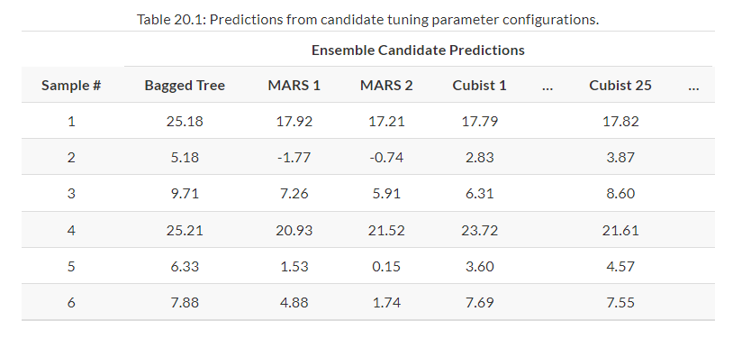
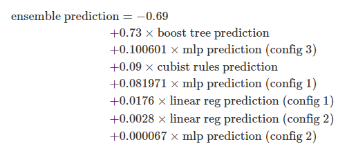

```{r setup, include = FALSE}
library(learnr)
library(tutorial.helpers)
library(knitr)

library(tidymodels)
library(stacks)
library(finetune)
library(modeldata)
library(rules)
library(baguette)


tidymodels_prefer()

knitr::opts_chunk$set(echo = FALSE)
options(tutorial.exercise.timelimit = 60, 
        tutorial.storage = "local") 


concrete1 <- 
   concrete |> 
   group_by(across(-compressive_strength)) |> 
   summarize(compressive_strength = mean(compressive_strength),
             .groups = "drop")

set.seed(1501)
concrete_split <- initial_split(concrete1, strata = compressive_strength)
concrete_train <- training(concrete_split)
concrete_test  <- testing(concrete_split)

set.seed(1502)
concrete_folds <- 
   vfold_cv(concrete_train, strata = compressive_strength, repeats = 5)

normalized_rec <- 
   recipe(compressive_strength ~ ., data = concrete_train) |> 
   step_normalize(all_predictors()) 

poly_recipe <- 
   normalized_rec |> 
   step_poly(all_predictors()) |> 
   step_interact(~ all_predictors():all_predictors())

linear_reg_spec <- 
   linear_reg(penalty = tune(), mixture = tune()) |> 
   set_engine("glmnet")

nnet_spec <- 
   mlp(hidden_units = tune(), penalty = tune(), epochs = tune()) |> 
   set_engine("nnet", MaxNWts = 2600) |> 
   set_mode("regression")

mars_spec <- 
   mars(prod_degree = tune()) |>
   set_engine("earth") |> 
   set_mode("regression")

svm_r_spec <- 
   svm_rbf(cost = tune(), rbf_sigma = tune()) |> 
   set_engine("kernlab") |> 
   set_mode("regression")

svm_p_spec <- 
   svm_poly(cost = tune(), degree = tune()) |> 
   set_engine("kernlab") |> 
   set_mode("regression")

knn_spec <- 
   nearest_neighbor(neighbors = tune(), dist_power = tune(), weight_func = tune()) |> 
   set_engine("kknn") |> 
   set_mode("regression")

cart_spec <- 
   decision_tree(cost_complexity = tune(), min_n = tune()) |> 
   set_engine("rpart") |> 
   set_mode("regression")

bag_cart_spec <- 
   bag_tree() |> 
   set_engine("rpart", times = 50L) |> 
   set_mode("regression")

rf_spec <- 
   rand_forest(mtry = tune(), min_n = tune(), trees = 1000) |> 
   set_engine("ranger") |> 
   set_mode("regression")

xgb_spec <- 
   boost_tree(tree_depth = tune(), learn_rate = tune(), loss_reduction = tune(), 
              min_n = tune(), sample_size = tune(), trees = tune()) |> 
   set_engine("xgboost") |> 
   set_mode("regression")

cubist_spec <- 
   cubist_rules(committees = tune(), neighbors = tune()) |> 
   set_engine("Cubist") 

nnet_param <- 
   nnet_spec |> 
   extract_parameter_set_dials() |> 
   update(hidden_units = hidden_units(c(1, 27)))

normalized <- 
   workflow_set(
      preproc = list(normalized = normalized_rec), 
      models = list(SVM_radial = svm_r_spec, SVM_poly = svm_p_spec, 
                    KNN = knn_spec, neural_network = nnet_spec)
   )

normalized1 <- 
   normalized |> 
   option_add(param_info = nnet_param, id = "normalized_neural_network")

model_vars <- 
   workflow_variables(outcomes = compressive_strength, 
                      predictors = everything())

no_pre_proc <- 
   workflow_set(
      preproc = list(simple = model_vars), 
      models = list(MARS = mars_spec, CART = cart_spec, CART_bagged = bag_cart_spec,
                    RF = rf_spec, boosting = xgb_spec, Cubist = cubist_spec)
   )

with_features <- 
   workflow_set(
      preproc = list(full_quad = poly_recipe), 
      models = list(linear_reg = linear_reg_spec, KNN = knn_spec)
   )

all_workflows <- 
   bind_rows(no_pre_proc, normalized1, with_features) |> 
   mutate(wflow_id = gsub("(simple_)|(normalized_)", "", wflow_id))

race_ctrl <-
   control_race(
      save_pred = TRUE,
      parallel_over = "everything",
      save_workflow = TRUE
   )

race_results <-
   all_workflows |>
   workflow_map(
      "tune_race_anova",
      seed = 1503,
      resamples = concrete_folds,
      grid = 25,
      control = race_ctrl
   )

concrete_stack <- 
  stacks() |> 
  add_candidates(race_results)

set.seed(2001)
ens <- blend_predictions(concrete_stack)

set.seed(2002)
ens1 <- blend_predictions(concrete_stack, penalty = 10^seq(-2, -0.5, length = 20))

ens2 <- fit_members(ens1)

reg_metrics <- metric_set(rmse, rsq)

ens_test_pred <- 
  predict(ens, concrete_test) |> 
  bind_cols(concrete_test)

```

```{r copy-code-chunk, child = system.file("child_documents/copy_button.Rmd", package = "tutorial.helpers")}
```

```{r info-section, child = system.file("child_documents/info_section.Rmd", package = "tutorial.helpers")}
```

## Introduction
### 

This tutorial covers [Chapter 20: Ensembles of Models](https://www.tmwr.org/ensembles) from [*Tidy Modeling with R*](https://www.tmwr.org/) by Max Kuhn and Julia Silge. In this tutorial, you will learn how to create a stacked ensemble, using the `stacks()` and `add_candidates()` functions from the [**stacks**](https://stacks.tidymodels.org/articles/basics.html) package. Additionally, you will learn how to blend the predictions from the stacked ensemble with the use of the `blend_predictions()` function. Finally, you will take these results and compare it with a test set.


## Creating The Training Set for Stacking 
### 

A model ensemble, where the predictions of multiple single learners are aggregated to make one prediction, can produce a high-performance final model. The most popular methods for creating ensemble models are bagging, random forest, and boosting. Each of these methods combines the predictions from multiple versions of the same type of model (e.g., classifications trees). However, one of the earliest methods for creating ensembles is *model stacking*.

### Exercise 1

Load the **tidymodels** package using `library()`.

```{r creating-the-trainin-1, exercise = TRUE}

```

```{r creating-the-trainin-1-hint-1, eval = FALSE}
library(...)
```

```{r include = FALSE}
library(tidymodels)
```

### 

The first step for building a stacked ensemble relies on the assessment set predictions from a resampling scheme with multiple splits. For each data point in the training set, stacking requires an out-of-sample prediction of some sort. For regression models, this is the predicted outcome. For classification models, the predicted classes or probabilities are available for use, although the latter contains more information than the hard class predictions. For a set of models, a data set is assembled where rows are the training set samples and columns are the out-of-sample predictions from the set of multiple models.

### Exercise 2

Type in `tidymodels_prefer()` to get rid of naming conflicts.

```{r creating-the-trainin-2, exercise = TRUE}

```

```{r creating-the-trainin-2-hint-1, eval = FALSE}
...()
```

```{r include = FALSE}
tidymodels_prefer()
```

### 

Model stacking combines the predictions for multiple models of any type. For example, a logistic regression, classification tree, and support vector machine can be included in a stacking ensemble.

### Exercise 3

Next, load the **finetune** and **modeldata** packages using `library()`.

```{r creating-the-trainin-3, exercise = TRUE}

```

```{r creating-the-trainin-3-hint-1, eval = FALSE}
library(...)
library(...)
```

```{r include = FALSE}
library(finetune)
library(modeldata)
```

### 

Back in the "Screening Many Models" tutorial, five repeats of 10-fold cross-validation were used to resample the data. This resampling scheme generates five assessment set predictions for each training set sample. Multiple out-of-sample predictions can occur in several other resampling techniques (e.g., bootstrapping). For the purpose of stacking, any replicate predictions for a data point in the training set are averaged so that there is a single prediction per training set sample per candidate member.

### Exercise 4

Next, load the **rules** and **baguette** libraries.

```{r creating-the-trainin-4, exercise = TRUE}

```

<button onclick = "transfer_code(this)">Copy previous code</button>

```{r creating-the-trainin-4-hint-1, eval = FALSE}
library(...)
library(...)
```

```{r include = FALSE}
library(rules)
library(baguette)
```

### 

Simple validation sets can also be used with stacking since tidymodels considers this to be a single resample.

### Exercise 5

Load the `concrete` data set by typing `concrete` in the code chunk below.

```{r creating-the-trainin-5, exercise = TRUE}

```

```{r creating-the-trainin-5-hint-1, eval = FALSE}
concrete
```

```{r include = FALSE}
concrete
```

### 

If you recall, this was the data set used in the "Screening Many Models" tutorial, which contains data about concrete.

### Exercise 6

Press "Run code".

```{r creating-the-trainin-6, exercise = TRUE}
concrete1 <- 
   concrete |> 
   group_by(across(-compressive_strength)) |> 
   summarize(compressive_strength = mean(compressive_strength),
             .groups = "drop")

set.seed(1501)
concrete_split <- initial_split(concrete1, strata = compressive_strength)
concrete_train <- training(concrete_split)
concrete_test  <- testing(concrete_split)

set.seed(1502)
concrete_folds <- 
   vfold_cv(concrete_train, strata = compressive_strength, repeats = 5)

normalized_rec <- 
   recipe(compressive_strength ~ ., data = concrete_train) |> 
   step_normalize(all_predictors()) 

poly_recipe <- 
   normalized_rec |> 
   step_poly(all_predictors()) |> 
   step_interact(~ all_predictors():all_predictors())

linear_reg_spec <- 
   linear_reg(penalty = tune(), mixture = tune()) |> 
   set_engine("glmnet")

nnet_spec <- 
   mlp(hidden_units = tune(), penalty = tune(), epochs = tune()) |> 
   set_engine("nnet", MaxNWts = 2600) |> 
   set_mode("regression")

mars_spec <- 
   mars(prod_degree = tune()) |>
   set_engine("earth") |> 
   set_mode("regression")

svm_r_spec <- 
   svm_rbf(cost = tune(), rbf_sigma = tune()) |> 
   set_engine("kernlab") |> 
   set_mode("regression")

svm_p_spec <- 
   svm_poly(cost = tune(), degree = tune()) |> 
   set_engine("kernlab") |> 
   set_mode("regression")

knn_spec <- 
   nearest_neighbor(neighbors = tune(), dist_power = tune(), weight_func = tune()) |> 
   set_engine("kknn") |> 
   set_mode("regression")

cart_spec <- 
   decision_tree(cost_complexity = tune(), min_n = tune()) |> 
   set_engine("rpart") |> 
   set_mode("regression")

bag_cart_spec <- 
   bag_tree() |> 
   set_engine("rpart", times = 50L) |> 
   set_mode("regression")

rf_spec <- 
   rand_forest(mtry = tune(), min_n = tune(), trees = 1000) |> 
   set_engine("ranger") |> 
   set_mode("regression")

xgb_spec <- 
   boost_tree(tree_depth = tune(), learn_rate = tune(), loss_reduction = tune(), 
              min_n = tune(), sample_size = tune(), trees = tune()) |> 
   set_engine("xgboost") |> 
   set_mode("regression")

cubist_spec <- 
   cubist_rules(committees = tune(), neighbors = tune()) |> 
   set_engine("Cubist") 

nnet_param <- 
   nnet_spec |> 
   extract_parameter_set_dials() |> 
   update(hidden_units = hidden_units(c(1, 27)))

normalized <- 
   workflow_set(
      preproc = list(normalized = normalized_rec), 
      models = list(SVM_radial = svm_r_spec, SVM_poly = svm_p_spec, 
                    KNN = knn_spec, neural_network = nnet_spec)
   )

normalized1 <- 
   normalized |> 
   option_add(param_info = nnet_param, id = "normalized_neural_network")

model_vars <- 
   workflow_variables(outcomes = compressive_strength, 
                      predictors = everything())

no_pre_proc <- 
   workflow_set(
      preproc = list(simple = model_vars), 
      models = list(MARS = mars_spec, CART = cart_spec, CART_bagged = bag_cart_spec,
                    RF = rf_spec, boosting = xgb_spec, Cubist = cubist_spec)
   )

with_features <- 
   workflow_set(
      preproc = list(full_quad = poly_recipe), 
      models = list(linear_reg = linear_reg_spec, KNN = knn_spec)
   )

all_workflows <- 
   bind_rows(no_pre_proc, normalized1, with_features) |> 
   mutate(wflow_id = gsub("(simple_)|(normalized_)", "", wflow_id))

race_ctrl <-
   control_race(
      save_pred = TRUE,
      parallel_over = "everything",
      save_workflow = TRUE
   )

race_results <-
   all_workflows |>
   workflow_map(
      "tune_race_anova",
      seed = 1503,
      resamples = concrete_folds,
      grid = 25,
      control = race_ctrl
   )
```

### 

These were the variables you created in the "Screening Many Models" tutorial which eventually led to the creation of `race_results`.

### Exercise 7

Type in `race_results` and press "Run code".

```{r creating-the-trainin-7, exercise = TRUE}

```

```{r creating-the-trainin-7-hint-1, eval = FALSE}
race_results
```

```{r include = FALSE}
race_results
```

### 

The process of building a stacked ensemble is:

- Assemble the training set of hold-out predictions (produced via resampling).
- Create a model to blend these predictions.
- For each member of the ensemble, fit the model on the original training set.

### Exercise 8

To create a stack, the `stacks()` function will be used. Type `?stacks()` in the Console and look at the *Description* section. CP/CR.

```{r creating-the-trainin-8}
question_text(NULL,
	answer(NULL, correct = TRUE),
	allow_retry = TRUE,
	try_again_button = "Edit Answer",
	incorrect = NULL,
	rows = 3)
```

### 

For the concrete example, the training set used for model stacking has columns for all of the candidate tuning parameter results. The table below presents the first six rows and selected columns:

```{r}

```

There is a single column for the bagged tree model since it has no tuning parameters. Also, recall that MARS was tuned over a single parameter (the product degree) with two possible configurations, so this model is represented by two columns. Most of the other models have 25 corresponding columns, as shown for Cubist in this example.

### Exercise 9

The `add_candidates()` will be needed. Type `?add_candidates()` in the Console and look at the *Description* section. CP/CR.

```{r creating-the-trainin-9}
question_text(NULL,
	answer(NULL, correct = TRUE),
	allow_retry = TRUE,
	try_again_button = "Edit Answer",
	incorrect = NULL,
	rows = 3)
```

### 

The term *candidate members* will be used to describe the possible model configurations (of all model types) that might be included in the stacking ensemble.

### Exercise 10

Now, let's start creating a stack. In the code chunk below, type in `stacks()` and pipe it to `add_candidates()`. Inside of `add_candidates()`, pass in `race_results`.

```{r creating-the-trainin-10, exercise = TRUE}

```

```{r creating-the-trainin-10-hint-1, eval = FALSE}
stacks() |> 
  add_candidates(...)
```

```{r include = FALSE}
stacks() |> 
  add_candidates(race_results)
```

### 

The code outputs each of the 12 model definitions in the stack and specifies how many candidate members it has. In total, there are 21 candidate members, with the `full_quad_linear_reg` model having the most individual candidate members (5).

### Exercise 11

Copy the previous code and assign it to a new variable named `concrete_stack`.

```{r creating-the-trainin-11, exercise = TRUE}

```

<button onclick = "transfer_code(this)">Copy previous code</button>

```{r creating-the-trainin-11-hint-1, eval = FALSE}
... <- 
  stacks() |> 
  add_candidates(race_results)
```

```{r include = FALSE}
concrete_stack <- 
  stacks() |> 
  add_candidates(race_results)
```

### 

Recall that racing methods are more efficient since they might not evaluate all configurations on all resamples. Stacking requires that all candidate members have the complete set of resamples. `add_candidates()` includes only the model configurations that have complete results.

## Blend the Predictions
### 

The training set predictions and the corresponding observed outcome data are used to create a *meta-learning model* where the assessment set predictions are the predictors of the observed outcome data. Meta-learning can be accomplished using any model. The most commonly used model is a regularized generalized linear model, which encompasses linear, logistic, and multinomial models. 

### Exercise 1

Type `set.seed()` and pass in `2001`.

```{r blend-the-prediction-1, exercise = TRUE}

```

```{r blend-the-prediction-1-hint-1, eval = FALSE}
set.seed(...)
```

```{r include = FALSE}
set.seed(2001)
```

### 

Specifically, regularization via the lasso penalty [Tibshirani (1996)](https://www.tmwr.org/ensembles#ref-lasso), which uses shrinkage to pull points toward a central value, has several advantages:

- Using the lasso penalty can remove candidates (and sometimes whole model types) from the ensemble.
- The correlation between ensemble candidates tends to be very high, and regularization helps alleviate this issue.

### Exercise 2

The `blend_predictions()` function will be needed in order to blend the predictions of `concrete_stack`. Type `?blend_predictions()` in the Console and look at the *Description* section. CP/CR.

```{r blend-the-prediction-2}
question_text(NULL,
	answer(NULL, correct = TRUE),
	allow_retry = TRUE,
	try_again_button = "Edit Answer",
	incorrect = NULL,
	rows = 3)
```

### 

[Breiman (1996b)](https://www.tmwr.org/ensembles#ref-breiman1996stacked) also suggested that, when a linear model is used to blend the predictions, it might be helpful to constrain the blending coefficients to be non-negative. The [*Tidy Modeling with R*](https://www.tmwr.org/index.html) textbook has generally found this to be good advice and it is the default for the stacks package (but it can be changed via an optional argument).

### Exercise 3

Since the desired outcome is numeric, linear regression is used for the metamodel. In the code chunk below, type in `blend_predictions()` and pass in `concrete_stack`.

```{r blend-the-prediction-3, exercise = TRUE}

```

```{r blend-the-prediction-3-hint-1, eval = FALSE}
blend_predictions(...)
```

```{r include = FALSE}
blend_predictions(concrete_stack)
```

### 

This evaluates the meta-learning model over a predefined grid of lasso penalty values and uses an internal resampling method to determine the best value.

### Exercise 4

Copy the previous code and assign it to a new variable named `ens`.

```{r blend-the-prediction-4, exercise = TRUE}

```

<button onclick = "transfer_code(this)">Copy previous code</button>

```{r blend-the-prediction-4-hint-1, eval = FALSE}
... <- blend_predictions(concrete_stack)
```

```{r include = FALSE}
ens <- blend_predictions(concrete_stack)
```

### 

Why use the racing results instead of the full set of candidate models contained in `grid_results`? Either can be used. The [*Tidy Modeling with R*](https://www.tmwr.org/index.html) textbook found better performance for these data using the racing results. This might be due to the racing method pre-selecting the best model(s) from the larger grid.

### Exercise 5

Now, let's understand if the default penalization method was sufficient. In the code chunk below, type in `autoplot()` and pass in `ens`. 

```{r blend-the-prediction-5, exercise = TRUE}

```

```{r blend-the-prediction-5-hint-1, eval = FALSE}
autoplot(...)
```

```{r include = FALSE}
autoplot(ens)
```

### 

The top panel of the graph shows the average number of candidate ensemble members retained by the meta-learning model. Also, you can see that the number of members is fairly constant and, as it increases, the RMSE also increases.

### Exercise 6

The default range may not have served us well here. To evaluate the meta-learning model with larger penalties, let’s pass an additional option. In the code chunk below, type in `set.seed(2002)`. Then, on a new line, create a new variable named `ens1` and assign it to `blend_predictions()`. Inside this function, type in `concrete_stack` as the first argument and set `penalty` to `10^seq(-2, -0.5, length = 20)` as the second argument.

```{r blend-the-prediction-6, exercise = TRUE}

```

<button onclick = "transfer_code(this)">Copy previous code</button>

```{r blend-the-prediction-6-hint-1, eval = FALSE}
set.seed(...)
... <- blend_predictions(..., penalty = 10^seq(-2, -0.5, length = 20))
```

```{r include = FALSE}
set.seed(2002)
ens1 <- blend_predictions(concrete_stack, penalty = 10^seq(-2, -0.5, length = 20))
```

### 

`seq()` is a function that generates regular sequences.

### Exercise 7

Now, lets graph this new variable. In the code chunk below, type in `autoplot()` and pass in `ens1`.

```{r blend-the-prediction-7, exercise = TRUE}

```

<button onclick = "transfer_code(this)">Copy previous code</button>

```{r blend-the-prediction-7-hint-1, eval = FALSE}
autoplot(...)
```

```{r include = FALSE}
autoplot(ens1)
```

### 

As you can see, there is a range where the ensemble model becomes worse than with the first blend (but not by much). The $R^2$ values increase with more members and larger penalties.

When blending predictions using a regression model, it is common to constrain the blending parameters to be nonnegative. For these data, this constraint has the effect of eliminating many of the potential ensemble members; even at fairly low penalties, the ensemble is limited to a fraction of the original eighteen.

### Exercise 8

Type in `ens1` and press "Run code".

```{r blend-the-prediction-8, exercise = TRUE}

```

```{r blend-the-prediction-8-hint-1, eval = FALSE}
ens1
```

```{r include = FALSE}
ens1
```

### 

As you can see from the output, the penalty value associated with the smallest RMSE was 0.051. Also, the output shows that it retained 7 candidate members out of the 21, as they had the highest weight out of all the members.

### Exercise 9

The regularized linear regression meta-learning model contained seven blending coefficients across four types of models. Let's create a graph to display the contributions. In the code chunk below, type in `autoplot()`, passing in `ens1` and `"weights"`. Then, add `geom_text()` using the `+` operator (Note: This will throw an error).

```{r blend-the-prediction-9, exercise = TRUE}

```

```{r blend-the-prediction-9-hint-1, eval = FALSE}
autoplot(ens, "...") +
  ...()
```

```{r include = FALSE}
#autoplot(ens, "weights") +
#  geom_text()
```

### 

This code throws an error because `geom_text()` requires a `label` argument, which hasn't been passed in yet.

### Exercise 10

Copy the previous code. Inside `geom_text()`, using the `aes()` function, set `x` to `weight + 0.01` and `label` to `model`. Then, outside of `aes()`, but within `geom_text()`, set `hjust` to `0`.

```{r blend-the-prediction-10, exercise = TRUE}

```

<button onclick = "transfer_code(this)">Copy previous code</button>

```{r blend-the-prediction-10-hint-1, eval = FALSE}
autoplot(ens, "weights") +
  geom_text(aes(x = ... + 0.01, label = ...), hjust = ...) 
```

```{r include = FALSE}
autoplot(ens, "weights") +
  geom_text(aes(x = weight + 0.01, label = model), hjust = 0) 
```

### 

`geom_text()` is a function that is used to display text on the graph. This can be very useful when labeling/highlighting certain information.

### Exercise 11

Copy the previous code and add `theme()` using the `+` operator. Inside this function, set `legend.position` to `"none"`.

```{r blend-the-prediction-11, exercise = TRUE}

```

<button onclick = "transfer_code(this)">Copy previous code</button>

```{r blend-the-prediction-11-hint-1, eval = FALSE}
autoplot(ens, "weights") +
  geom_text(aes(x = weight + 0.01, label = model), hjust = 0) +
  theme(legend.position = "...")
```

```{r include = FALSE}
autoplot(ens, "weights") +
  geom_text(aes(x = weight + 0.01, label = model), hjust = 0) +
  theme(legend.position = "none")
```

### 

`lims()` is a function that allows you to set the x and y axis limits.

### Exercise 12

Copy the previous code and add `lims()` using the `+` operator. Inside this function, set `x` to a vector containing `-0.01` as the first argument and `0.8` as the second argument.

```{r blend-the-prediction-12, exercise = TRUE}

```

<button onclick = "transfer_code(this)">Copy previous code</button>

```{r blend-the-prediction-12-hint-1, eval = FALSE}
autoplot(ens, "weights") +
  geom_text(aes(x = weight + 0.01, label = model), hjust = 0) +
  theme(legend.position = "none") +
  lims(.__C__.environment = c(-0.01, ...))
```

```{r include = FALSE}
autoplot(ens, "weights") +
  geom_text(aes(x = weight + 0.01, label = model), hjust = 0) +
  theme(legend.position = "none") +
  lims(x = c(-0.01, 0.8))
```

### 

The boosted tree and neural network models have the largest contributions to the ensemble. For this ensemble, the outcome is predicted with the equation:

```{r}

```

where the predictors in the equation are the predicted compressive strength values from those models.

### 

Congrats! You have learned how to blend predictions and visualize them with the `autoplot()` function.

## Test Set Results
### 

Since the blending process used resampling, it can be estimated that the ensemble with seven members had an estimated RMSE of 4.12. Recall from the "Screening Many Models" tutorial that the best boosted tree had a test set RMSE of 3.41. How will the ensemble model compare on the test set?

### Exercise 1

First, let's fit all of the member models together. In the code chunk below, type in `fit_members()` and pass in `ens1`.

```{r test-set-results-1, exercise = TRUE}

```

```{r test-set-results-1-hint-1, eval = FALSE}
fit_members(...)
```

```{r include = FALSE}
fit_members(ens1)
```

### 

`fit_members()` is a function that trains and returns models that are passed in.

### Exercise 2

Copy the previous code and assign it to a new variable named `ens2`.

```{r test-set-results-2, exercise = TRUE}

```

<button onclick = "transfer_code(this)">Copy previous code</button>

```{r test-set-results-2-hint-1, eval = FALSE}
... <- fit_members(ens1)
```

```{r include = FALSE}
ens2 <- fit_members(ens1)
```

### 

The seven models that were fitted are:

- boosting: number of trees = 1957, minimal node size = 8, tree depth = 7, learning rate = 0.0756, minimum loss reduction = 1.45e-07, and proportion of observations sampled = 0.679

- Cubist: number of committees = 98 and number of nearest neighbors = 2

- linear regression (quadratic features): amount of regularization = 6.28e-09 and proportion of lasso penalty = 0.636 (config 1)

- linear regression (quadratic features): amount of regularization = 2e-09 and proportion of lasso penalty = 0.668 (config 2)

- neural network: number of hidden units = 14, amount of regularization = 0.0345, and number of epochs = 979 (config 1)

- neural network: number of hidden units = 22, amount of regularization = 2.08e-10, and number of epochs = 92 (config 2)

- neural network: number of hidden units = 26, amount of regularization = 0.0149, and number of epochs = 203 (config 3)

### Exercise 3

Now, let's see how the ensemble model compares to the test set. In the code chunk below, type in `metric_set()` and pass in `rmse` and `rsq`. Then, assign this code to a new variable named `reg_metrics`. 

```{r test-set-results-3, exercise = TRUE}

```

```{r test-set-results-3-hint-1, eval = FALSE}
... <- metric_set(..., rsq)
```

```{r include = FALSE}
reg_metrics <- metric_set(rmse, rsq)
```

### 

By running `reg_metrics` on a new line, you can see that it produces a tibble, which contains the `rmse` and `rsq` metrics. 

### Exercise 4

In the code chunk below, type in `predict()`, passing in `ens2` and `concrete_test`. Then, pipe this code to `bind_cols()`, passing in `concrete_test`. Finally, assign this code to a new variable named `ens_test_pred`.

```{r test-set-results-4, exercise = TRUE}

```

```{r test-set-results-4-hint-1, eval = FALSE}
... <- 
  predict(ens, ...) |> 
  ..getNamespace(concrete_test)
```

```{r include = FALSE}
ens_test_pred <- 
  predict(ens, concrete_test) |> 
  bind_cols(concrete_test)
```

### 

This code creates an ensemble test prediction.

### Exercise 5

In the code chunk below, type in `ens_test_pred` and pipe it to `reg_metrics()`. Inside this function, type in `compressive_strength` as the first argument and `.pred` as the second argument. 

```{r test-set-results-5, exercise = TRUE}

```

```{r test-set-results-5-hint-1, eval = FALSE}
ens_test_pred |> 
  reg_metrics(compressive_strength, .pred)
```

```{r include = FALSE}
ens_test_pred |> 
  reg_metrics(compressive_strength, .pred)
```

### 

As you can see, this is moderately better than the best single model. It is fairly common for stacking to produce incremental benefits when compared to the best single model.

### 

Congrats! You have learned how to test the results with the testing data.

## Summary
### 

In this tutorial, you have learned:

- How to create a stacked ensemble with the `stacks()` and `add_candidates()` function
- How to blend the predictions with `blend_predictions()` and display them using `autoplot()`
- How to test the set results with `reg_metrics()`, `predict()`, and `metric_set()`

```{r download-answers, child = system.file("child_documents/download_answers.Rmd", package = "tutorial.helpers")}
```
